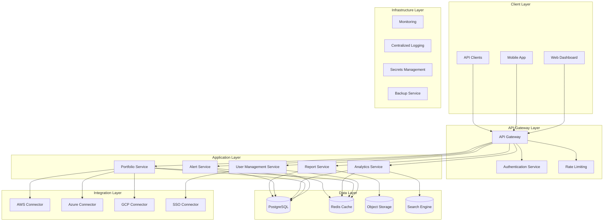
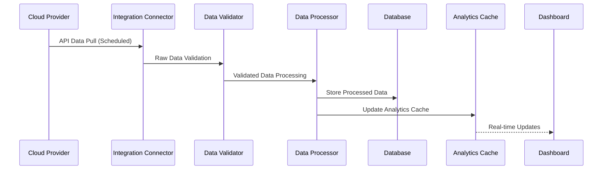
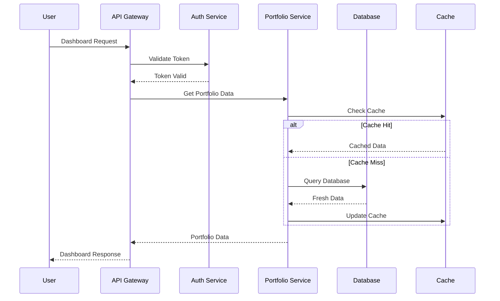

# AI Portfolio Management Dashboard - High-Level Design

## Validation Report

**Requirements Coverage Checklist:**
✅ User management and role-based access control
✅ Data aggregation from multiple sources (AWS, Azure, GCP)
✅ Real-time dashboard with visualization
✅ Alerting and notification system
✅ Reporting and export functionality
✅ Security and compliance requirements
✅ Performance and scalability requirements
✅ Accessibility standards compliance

**Compliance Analysis:**
✅ SOC2 Type II - Data encryption (AES-256), audit logging, access controls
✅ ISO27001 - Information security management, risk assessment
✅ PCI-DSS - Secure data transmission (TLS 1.3), access controls
✅ GDPR - Data retention policies, consent management, data lineage
✅ WCAG 2.1 AA - Accessibility compliance

**Error Handling Coverage:**
✅ Circuit breaker patterns for API integrations
✅ Retry mechanisms with exponential backoff
✅ Comprehensive audit logging
✅ Data freshness validation and alerts

## Domain Model

```mermaid
classDiagram
    class User {
        +String userId
        +String email
        +String firstName
        +String lastName
        +DateTime createdAt
        +DateTime lastLoginAt
        +Boolean isActive
        +authenticate()
        +updateProfile()
        +resetPassword()
    }
    
    class Role {
        +String roleId
        +String roleName
        +String description
        +List~Permission~ permissions
        +DateTime createdAt
        +assignPermissions()
        +revokePermissions()
    }
    
    class Permission {
        +String permissionId
        +String permissionName
        +String resource
        +String action
        +validateAccess()
    }
    
    class PortfolioCompany {
        +String companyId
        +String companyName
        +String industry
        +DateTime onboardedAt
        +Boolean isActive
        +String ssoProvider
        +Map~String~ metadata
        +enableIntegration()
        +disableIntegration()
    }
    
    class CloudProvider {
        +String providerId
        +String providerName
        +String apiEndpoint
        +String apiVersion
        +Map~String~ credentials
        +DateTime lastSyncAt
        +connectAPI()
        +syncData()
    }
    
    class AIService {
        +String serviceId
        +String serviceName
        +String serviceType
        +String cloudProviderId
        +Decimal costPerUnit
        +String pricingModel
        +calculateCost()
    }
    
    class UsageData {
        +String usageId
        +String companyId
        +String serviceId
        +DateTime timestamp
        +Decimal quantity
        +Decimal cost
        +String department
        +String project
        +Map~String~ metadata
        +aggregateByPeriod()
    }
    
    class Alert {
        +String alertId
        +String companyId
        +String alertType
        +String message
        +DateTime triggeredAt
        +Boolean isResolved
        +String severity
        +triggerAlert()
        +resolveAlert()
    }
    
    class Report {
        +String reportId
        +String reportType
        +String generatedBy
        +DateTime generatedAt
        +String format
        +Blob content
        +generateReport()
        +exportReport()
    }
    
    class Dashboard {
        +String dashboardId
        +String userId
        +String layout
        +Map~String~ widgets
        +DateTime lastModified
        +customizeLayout()
        +saveView()
    }
    
    class BudgetThreshold {
        +String thresholdId
        +String companyId
        +Decimal monthlyLimit
        +Decimal warningPercentage
        +Boolean isActive
        +checkThreshold()
    }
    
    User ||--o{ Role : "has"
    Role ||--o{ Permission : "contains"
    User ||--o{ PortfolioCompany : "accesses"
    PortfolioCompany ||--o{ CloudProvider : "integrates"
    CloudProvider ||--o{ AIService : "provides"
    PortfolioCompany ||--o{ UsageData : "generates"
    AIService ||--o{ UsageData : "tracks"
    PortfolioCompany ||--o{ Alert : "triggers"
    User ||--o{ Report : "generates"
    User ||--|| Dashboard : "customizes"
    PortfolioCompany ||--|| BudgetThreshold : "has"
```

## High-Level Design Document

### Architecture Overview

#### System Architecture



### Major Components

#### 1. API Gateway
- **Purpose**: Single entry point for all client requests
- **Features**: 
  - Request routing and load balancing
  - Rate limiting and throttling
  - API versioning and documentation
  - Request/response transformation
- **Security**: JWT token validation, CORS handling
- **Technology**: Kong/AWS API Gateway

#### 2. User Management Service
- **Purpose**: Handle authentication, authorization, and user lifecycle
- **Features**:
  - Multi-factor authentication (MFA)
  - Role-based access control (RBAC)
  - Attribute-based access control (ABAC)
  - SSO integration (SAML 2.0, OAuth 2.0, OpenID Connect)
- **Security**: Password hashing (bcrypt), session management
- **Technology**: Node.js/Express, Passport.js

#### 3. Portfolio Service
- **Purpose**: Manage portfolio companies and their integrations
- **Features**:
  - Company onboarding and configuration
  - Cloud provider API integration management
  - Data synchronization scheduling
  - Integration health monitoring
- **Security**: API key encryption, secure credential storage
- **Technology**: Node.js/Express, Bull Queue

#### 4. Analytics Service
- **Purpose**: Process and analyze AI usage data
- **Features**:
  - Real-time data aggregation
  - Trend analysis and forecasting
  - Benchmarking calculations
  - Cost optimization recommendations
- **Security**: Data anonymization, query sanitization
- **Technology**: Python/FastAPI, Pandas, NumPy

#### 5. Alert Service
- **Purpose**: Monitor thresholds and send notifications
- **Features**:
  - Configurable alerting rules
  - Multi-channel notifications (email, SMS, Slack)
  - Alert escalation and acknowledgment
  - Alert correlation and deduplication
- **Security**: Encrypted notification channels
- **Technology**: Node.js, Redis Pub/Sub

#### 6. Report Service
- **Purpose**: Generate and manage reports
- **Features**:
  - Scheduled report generation
  - Multiple export formats (PDF, Excel, CSV)
  - Report templates and customization
  - Report sharing and distribution
- **Security**: Access control for sensitive reports
- **Technology**: Node.js, Puppeteer, ExcelJS

### Integration Points

#### External Integrations
1. **AWS APIs**: Cost Explorer, CloudWatch, Service Catalog
2. **Azure APIs**: Cost Management, Monitor, Resource Manager
3. **GCP APIs**: Cloud Billing, Monitoring, Resource Manager
4. **SSO Providers**: Active Directory, Okta, Auth0
5. **Notification Services**: SendGrid, Twilio, Slack

#### Internal Integration Patterns
- **Event-Driven Architecture**: Apache Kafka for service communication
- **Circuit Breaker Pattern**: Hystrix for fault tolerance
- **Retry Mechanism**: Exponential backoff with jitter
- **Caching Strategy**: Redis for session and data caching
- **Database Patterns**: CQRS for read/write separation

### Security & Compliance Features

#### Data Security
- **Encryption at Rest**: AES-256 encryption for all stored data
- **Encryption in Transit**: TLS 1.3 for all communications
- **Key Management**: AWS KMS/Azure Key Vault for encryption keys
- **Data Classification**: Automatic PII detection and classification

#### Access Control
- **Authentication**: Multi-factor authentication mandatory
- **Authorization**: Fine-grained RBAC with principle of least privilege
- **Session Management**: Secure session tokens with rotation
- **API Security**: OAuth 2.0 with PKCE for API access

#### Compliance Framework
- **SOC 2 Type II**: 
  - Continuous security monitoring
  - Access reviews and audit trails
  - Incident response procedures
  - Vendor risk management

- **ISO 27001**:
  - Information security policy framework
  - Risk assessment and treatment
  - Security awareness training
  - Business continuity planning

- **PCI DSS**:
  - Secure network architecture
  - Regular security testing
  - Access control measures
  - Monitoring and logging

- **GDPR**:
  - Data subject rights management
  - Privacy by design implementation
  - Data breach notification procedures
  - Cross-border data transfer controls

#### Audit & Logging
- **Comprehensive Audit Trail**: All user actions and system events
- **Log Aggregation**: Centralized logging with ELK stack
- **Log Retention**: 7-year retention for compliance
- **Real-time Monitoring**: SIEM integration for threat detection

### Data Flow Architecture

#### Data Ingestion Flow


#### User Request Flow


### Error Handling & Resilience

#### Circuit Breaker Implementation
- **Failure Threshold**: 5 consecutive failures
- **Timeout**: 30 seconds for external API calls
- **Recovery**: Exponential backoff with 2-minute maximum
- **Fallback**: Cached data or degraded functionality

#### Retry Strategy
- **Transient Errors**: 3 retries with exponential backoff
- **Rate Limiting**: Adaptive retry with jitter
- **Dead Letter Queue**: Failed messages for manual review
- **Monitoring**: Real-time failure rate tracking

#### Data Consistency
- **Eventual Consistency**: For cross-service data synchronization
- **Compensation Patterns**: Saga pattern for distributed transactions
- **Conflict Resolution**: Last-write-wins with timestamp comparison
- **Data Validation**: Schema validation at service boundaries

### Performance Optimization

#### Caching Strategy
- **Application Cache**: Redis for session and frequently accessed data
- **Database Cache**: Query result caching with TTL
- **CDN**: Static asset delivery optimization
- **Browser Cache**: Appropriate cache headers for client-side caching

#### Database Optimization
- **Indexing Strategy**: Optimized indexes for query patterns
- **Partitioning**: Time-based partitioning for usage data
- **Read Replicas**: Separate read/write workloads
- **Connection Pooling**: Efficient database connection management

#### Monitoring & Alerting
- **Application Metrics**: Response times, error rates, throughput
- **Infrastructure Metrics**: CPU, memory, disk, network utilization
- **Business Metrics**: User engagement, data freshness, cost savings
- **SLA Monitoring**: 99.5% uptime target with automated alerting