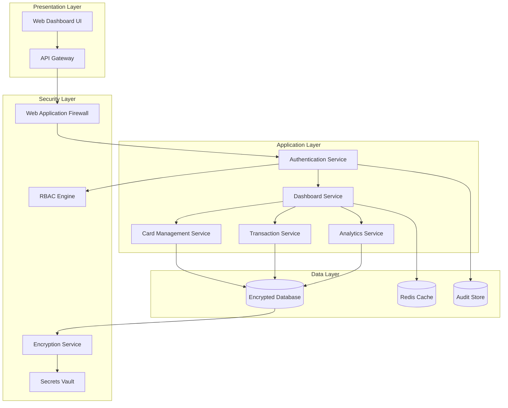

# Credit Card Analysis Dashboard - High-Level Design

## Domain Model

```mermaid
classDiagram
    class User {
        +String userId
        +String username
        +String email
        +String hashedPassword
        +DateTime createdAt
        +DateTime lastLoginAt
        +Boolean isActive
        +String role
        +validateCredentials()
        +updateProfile()
        +getCards()
    }

    class CreditCard {
        +String cardId
        +String cardNumber
        +String cardHolderName
        +String bankName
        +String cardType
        +Decimal creditLimit
        +Decimal availableCredit
        +Decimal outstandingAmount
        +DateTime expiryDate
        +Boolean isActive
        +String encryptedCardData
        +calculateAvailableCredit()
        +updateBalance()
    }

    class Transaction {
        +String transactionId
        +String cardId
        +Decimal amount
        +String description
        +String category
        +String merchantName
        +DateTime transactionDate
        +String transactionType
        +String status
        +String encryptedData
        +categorizeTransaction()
        +validateAmount()
    }

    class Category {
        +String categoryId
        +String categoryName
        +String description
        +String iconUrl
        +Boolean isActive
        +getTransactions()
    }

    class Dashboard {
        +String dashboardId
        +String userId
        +DateTime lastUpdated
        +generateKPIs()
        +getMonthlySpend()
        +getCategoryAnalysis()
        +getCardAnalysis()
    }

    class AuditLog {
        +String logId
        +String userId
        +String action
        +String entityType
        +String entityId
        +DateTime timestamp
        +String ipAddress
        +String userAgent
        +logActivity()
    }

    class SecurityToken {
        +String tokenId
        +String userId
        +String tokenHash
        +DateTime expiresAt
        +String tokenType
        +Boolean isRevoked
        +validateToken()
        +revokeToken()
    }

    User ||--o{ CreditCard : owns
    User ||--o{ Dashboard : has
    CreditCard ||--o{ Transaction : contains
    Transaction }o--|| Category : belongs_to
    User ||--o{ AuditLog : generates
    User ||--o{ SecurityToken : has
```

## Architecture Overview



## Component Descriptions

### Presentation Layer
- **Web Dashboard UI**: Responsive React/Angular frontend with Material-UI components
- **API Gateway**: Kong/AWS API Gateway with rate limiting, request/response transformation

### Application Services
- **Authentication Service**: JWT-based authentication with MFA support
- **Dashboard Service**: Aggregates data from multiple services for KPI generation
- **Card Management Service**: Handles credit card CRUD operations with PCI-DSS compliance
- **Transaction Service**: Processes and categorizes transactions with fraud detection
- **Analytics Service**: Generates spending insights and trend analysis

### Data Layer
- **Encrypted Database**: PostgreSQL with TDE (Transparent Data Encryption)
- **Redis Cache**: Session management and frequently accessed data caching
- **Audit Store**: Immutable audit trail storage (MongoDB/ElasticSearch)

## Integration Points

### External Integrations
- Identity Provider (OAuth 2.0/SAML)
- Monitoring & Alerting (Prometheus/Grafana)
- Log Aggregation (ELK Stack)

### Internal APIs
- RESTful APIs with OpenAPI 3.0 specification
- GraphQL for complex data queries
- Event-driven architecture with message queues

## Security & Compliance Features

### Data Protection
- AES-256 encryption at rest
- TLS 1.3 for data in transit
- Field-level encryption for PII/PCI data
- Data masking for non-production environments

### Access Control
- Role-Based Access Control (RBAC)
- Attribute-Based Access Control (ABAC)
- Multi-Factor Authentication (MFA)
- Session management with secure tokens

### Compliance
- PCI-DSS Level 1 compliance for card data
- SOC2 Type II controls implementation
- GDPR compliance with data subject rights
- Data retention policies (7 years for financial data)

### Security Monitoring
- Real-time threat detection
- Anomaly detection for transactions
- Security event correlation
- Automated incident response

## Data Flow

### User Authentication Flow
1. User credentials → API Gateway → WAF
2. Authentication Service validates → RBAC check
3. JWT token generation → Secure session establishment

### Dashboard Data Flow
1. Dashboard request → Authentication validation
2. Parallel service calls (Cards, Transactions, Analytics)
3. Data aggregation → Cache update
4. Encrypted response → UI rendering

### Transaction Processing Flow
1. Transaction data ingestion → Validation
2. Category classification → Fraud detection
3. Database persistence → Audit logging
4. Real-time dashboard updates

## Error Handling & Resilience

### Patterns Implemented
- Circuit Breaker pattern for service calls
- Retry mechanism with exponential backoff
- Bulkhead pattern for resource isolation
- Graceful degradation for non-critical features

### Monitoring
- Health checks for all services
- Performance metrics collection
- Error rate monitoring
- Alerting thresholds configuration

## Validation Report

### Requirements Coverage Checklist
✅ Dashboard KPIs (Monthly Spend, Credit Limit, Available Credit, Outstanding Amount)
✅ Multiple Credit Cards management
✅ Monthly Spend Trends visualization
✅ Card-wise Spend Analysis
✅ Category-wise Spending (9 categories defined)
✅ Responsive design implementation
✅ User authentication and authorization
✅ Data encryption and security

### Compliance Checklist
✅ PCI-DSS compliance for card data handling
✅ SOC2 controls implementation
✅ Data retention policies defined
✅ Audit logging implemented
✅ Consent management framework
✅ Data lineage tracking
✅ Compliance reporting capabilities

### Error Handling Checklist
✅ Circuit breaker pattern implementation
✅ Retry mechanisms with backoff
✅ Comprehensive logging strategy
✅ Graceful degradation scenarios
✅ Input validation at all layers
✅ Output sanitization and filtering
✅ Exception handling and recovery