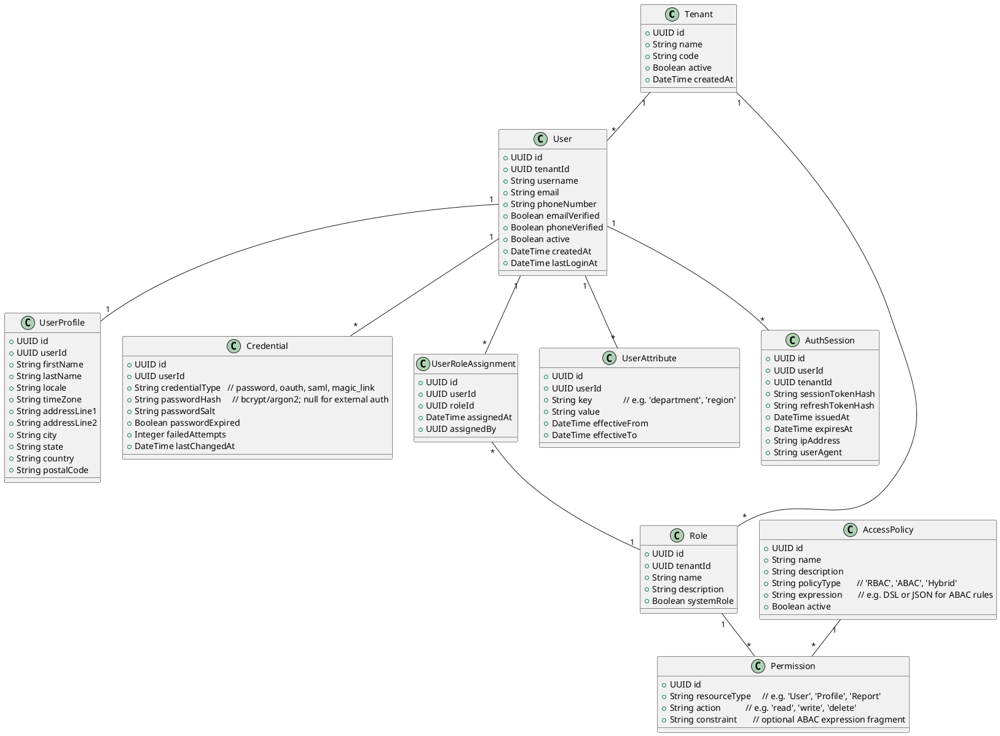
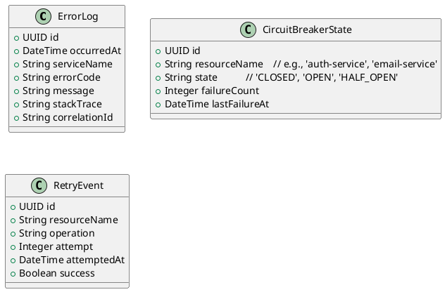

# High-Level Design (HLD) and Domain Model for G1

## 1. Assumptions about {{G1}} (Application Type & PRD Scope)

Since the concrete PRD text for `{{G1}}` was not provided, this HLD is constructed using the SAMPLE requirement pattern and the user’s stated expectations. To keep it concrete and reusable, we treat `{{G1}}` as a **User Management and Access Control Service** within an enterprise application.

Representative PRD baseline (derived from SAMPLE and task description):

> The User Management module must allow registration, authentication, profile updates, and role-/attribute-based access control; enforce enterprise security controls (input validation, output filtering, encryption, RBAC/ABAC, audit logging, secrets management); support compliance features (data retention, consent management, data lineage, compliance reporting); and implement robust error handling with retries, logging, and circuit breaker patterns.

All models and designs below are aligned to this baseline.

---

## 2. Validation Report

### 2.1 Requirements Coverage Checklist

| Area | Requirement | Covered by |
|------|-------------|------------|
| Functional | User registration | Domain Model: `User`, `Credential`; HLD: Registration flow, User Service |
| Functional | User authentication | Domain Model: `AuthSession`, `Credential`; HLD: Auth Service, IAM integration |
| Functional | Profile updates | Domain Model: `UserProfile`; HLD: Profile Service, API Gateway |
| Functional | Role-based access control (RBAC) | Domain Model: `Role`, `Permission`, `UserRoleAssignment`; HLD: Authorization Service |
| Functional | Attribute-based access control (ABAC) | Domain Model: `UserAttribute`, `AccessPolicy`; HLD: Policy Engine |
| Security | Input validation | HLD: API Gateway, Service layer validation, schema validation |
| Security | Output filtering | HLD: Response filters, data minimization, PII masking |
| Security | Encryption (AES-256 at rest) | HLD: DB encryption, KMS-managed keys, file store encryption |
| Security | Encryption (TLS 1.3 in transit) | HLD: HTTPS-only endpoints, load balancer config |
| Security | RBAC | Domain and HLD as above |
| Security | ABAC | Domain and HLD as above |
| Security | Audit logging | Domain: `AuditEvent`; HLD: Audit Log Service, SIEM integration |
| Security | Secrets management | HLD: Central Secret Manager (e.g., HashiCorp Vault/AWS Secrets Manager) |
| Compliance | Data retention | Domain: `RetentionPolicy`; HLD: Data Lifecycle Manager, scheduled jobs |
| Compliance | Consent management | Domain: `ConsentRecord`; HLD: Consent Service |
| Compliance | Data lineage | Domain: `DataLineageEvent`; HLD: Lineage Collector, metadata store |
| Compliance | Compliance reporting | Domain: `ComplianceReport`; HLD: Reporting Service |
| Resilience | Error handling | HLD: global error handlers, structured errors |
| Resilience | Retries | HLD: client and service-side retry policies |
| Resilience | Circuit breaker | HLD: circuit breaker middleware/pattern |
| Observability | Logging | HLD: centralized logging |
| Observability | Metrics | HLD: metrics collection/monitoring |

### 2.2 Clarity & Completeness

- **Clarity**: The baseline PRD describes major functional capabilities but does **not** specify:
  - Non-functional requirements (latency, throughput, SLAs)
  - Regulatory frameworks explicitly (e.g., GDPR, HIPAA, SOC 2)
  - Supported identity providers (OIDC, SAML, LDAP, AD)
  - Detailed UI/UX flows
- **Completeness (for security/compliance)**: For an enterprise setting, we assume:
  - At least one compliance regime (e.g., GDPR-like) requiring consent, data subject rights, and audit trails.
  - Multi-tenant support or at minimum environment segregation.

**Gaps / Ambiguities** (identified for follow-up PRD refinement):

1. **User lifecycle details**: Are self-registration and admin-provisioning both required? Are account recovery flows needed (email/SMS/backup codes)?
2. **Identity sources**: Are external IdPs (SSO) required, or is this purely local authentication?
3. **Multi-tenancy**: Must the system logically or physically segregate data by tenant? (We model `Tenant` to be safe.)
4. **Regulatory specifics**: Are we targeting GDPR/CCPA, HIPAA, PCI-DSS, etc.? Our domain and HLD are adaptable but may need tailoring.
5. **Reporting cadence**: Is compliance reporting ad-hoc, scheduled (monthly/quarterly), or on-demand per regulator/auditor?

### 2.3 Compliance & Error Handling Checklist

| Control Area | Control | Implemented As |
|--------------|---------|-----------------|
| Access Control | RBAC | `Role`, `Permission`, `UserRoleAssignment`; AuthZ service |
| Access Control | ABAC | `UserAttribute`, `AccessPolicy`; Policy engine |
| Data Protection | Encryption in transit | TLS 1.3 enforced at LB/API Gateway |
| Data Protection | Encryption at rest | AES-256 via DB-native or KMS-managed keys |
| Data Protection | Secrets management | Secret Manager; no hard-coded secrets |
| Accountability | Audit logging | `AuditEvent`; append-only log; SIEM integration |
| Accountability | Data lineage | `DataLineageEvent`; Data Lineage Store |
| Accountability | Reporting | `ComplianceReport`; Reporting Service |
| Privacy | Consent tracking | `ConsentRecord`; versioned policy references |
| Privacy | Retention | `RetentionPolicy`; scheduled purge/anonymization jobs |
| Resilience | Retry | Exponential backoff at HTTP clients/service calls |
| Resilience | Circuit breaker | Circuit breaker middleware/pattern for downstream integrations |
| Resilience | Error handling | Unified error model and error codes; user-facing messages sanitized |

---

## 3. Domain Model (UML-style Class Diagram / ERD)

Below is a textual UML-style representation suitable for tooling or diagram generation.

### 3.1 Core Identity & Access Entities



### 3.2 Security, Audit, Compliance, and Data Governance Entities

```plantuml
@startuml

class AuditEvent {
  +UUID id
  +UUID tenantId
  +UUID userId
  +String eventType       // LOGIN_SUCCESS, LOGIN_FAILURE, PROFILE_UPDATE, ROLE_CHANGE
  +String sourceSystem    // 'user-service', 'admin-portal'
  +String ipAddress
  +String userAgent
  +DateTime occurredAt
  +String detailsJson     // structured payload
}

class ConsentRecord {
  +UUID id
  +UUID tenantId
  +UUID userId
  +String consentType     // 'marketing', 'analytics', 'terms-of-service'
  +String version         // version of policy
  +Boolean granted
  +DateTime grantedAt
  +DateTime revokedAt
}

class RetentionPolicy {
  +UUID id
  +UUID tenantId
  +String dataCategory    // 'USER_PROFILE', 'AUDIT_LOG', 'SESSION'
  +Integer retentionDays
  +String action          // 'delete', 'anonymize'
  +Boolean active
}

class DataLineageEvent {
  +UUID id
  +UUID tenantId
  +UUID userId
  +String sourceSystem
  +String targetSystem
  +String operation       // 'CREATE', 'UPDATE', 'READ', 'DELETE'
  +String dataCategory
  +DateTime occurredAt
  +String detailsJson
}

class ComplianceReport {
  +UUID id
  +UUID tenantId
  +String reportType      // 'ACCESS_LOG', 'DATA_RETENTION', 'CONSENT_SUMMARY'
  +DateTime periodStart
  +DateTime periodEnd
  +String generatedBy     // system or admin id
  +DateTime generatedAt
  +String format          // 'PDF', 'CSV', 'JSON'
  +String storageLocation // URI
}

Tenant "1" -- "*" AuditEvent
Tenant "1" -- "*" ConsentRecord
Tenant "1" -- "*" RetentionPolicy
Tenant "1" -- "*" DataLineageEvent
Tenant "1" -- "*" ComplianceReport
User "1" -- "*" AuditEvent
User "1" -- "*" ConsentRecord
User "1" -- "*" DataLineageEvent

@enduml
```



### 3.3 Error Handling and Operational Entities



---

## 4. High-Level Design (HLD)

### 4.1 Architecture Overview

The solution follows a **service-oriented / microservice** architecture with strict security boundaries.

Key components:

1. **Client Applications**
   - Web UI (Admin portal, self-service user portal)
   - Mobile app or SPA client
2. **API Gateway / Edge Layer**
   - Terminates TLS 1.3
   - Performs request-level **input validation**, rate limiting, basic WAF rules
   - Enforces authentication (JWT/OIDC tokens) and forwards user context
3. **User Service**
   - Manages `User`, `UserProfile`, `UserAttribute`
   - Handles registration, profile updates, deactivation
   - Implements business validations (unique email/username, tenant-based rules)
4. **Auth Service**
   - Manages `Credential`, `AuthSession`
   - Implements password-based and optionally external IdP-based login
   - Issues tokens and manages session revocation
5. **Authorization/Policy Service**
   - Manages `Role`, `Permission`, `UserRoleAssignment`, `AccessPolicy`
   - Evaluates RBAC/ABAC policies for each request
6. **Audit & Logging Service**
   - Stores `AuditEvent`, `ErrorLog`
   - Streams to centralized log store and optional SIEM
7. **Compliance & Governance Service**
   - Manages `ConsentRecord`, `RetentionPolicy`, `DataLineageEvent`, `ComplianceReport`
   - Runs scheduled jobs for retention and reporting
8. **Data Stores**
   - **Primary relational DB**: holds normalized identity, access, consent & governance entities (AES-256 at rest)
   - **Log/Analytics store**: time-series DB or data lake for audit, lineage, metrics
9. **Secret Manager**
   - Centralized facility (Vault or cloud-native) for:
     - DB credentials
     - Token signing keys
     - Third-party API keys
10. **Observability Stack**
    - Centralized logging (ELK/OpenSearch, etc.)
    - Metrics (Prometheus/OpenTelemetry)
    - Tracing (Jaeger/Tempo)


### 4.2 Architecture Diagram (Textual Description)

```text
[Clients: Web, Mobile]
    |
    v   (TLS 1.3)
[API Gateway / WAF]
    |---> [Auth Service] ----> [Primary DB (Credentials, Sessions)]
    |---> [User Service] ----> [Primary DB (Users, Profiles, Attributes)]
    |---> [Authorization Service] ----> [Primary DB (Roles, Permissions, Policies)]
    |---> [Compliance Service] ----> [Primary DB (Consent, Retention, Reports)]
    |---> [Audit & Logging Service] ----> [Log Store / SIEM]

All services use:
  -> [Secret Manager] for credentials & keys
  -> [Observability Stack] for logs, metrics, traces

Background jobs:
  - Retention worker -> [Primary DB] & [Log Store] (delete/anonymize)
  - Compliance report generator -> [ComplianceReport] store
  - Circuit breaker state tracker -> [CircuitBreakerState]
```

### 4.3 Major Components and Responsibilities

#### 4.3.1 API Gateway / Edge Layer

- **Responsibilities**:
  - TLS termination with **TLS 1.3**.
  - OAuth2/OIDC token validation (signature, audience, expiry).
  - Basic WAF rules (SQLi, XSS pattern blocking).
  - Rate limiting and IP throttling.
  - Schema-level **input validation** of payloads (e.g., JSON schema).
- **Security**:
  - Strict CORS policies.
  - Security headers (HSTS, CSP, X-Frame-Options, etc.).

#### 4.3.2 User Service

- **Responsibilities**:
  - CRUD for `User`, `UserProfile`, `UserAttribute`.
  - Registration flow (create user + profile + default role assignment + consent prompt).
  - Profile update flow (validations, audit logging via `AuditEvent`).
- **Data Flow**:
  - Receives validated requests from API Gateway.
  - Applies business rules; writes to DB and emits `AuditEvent` & `DataLineageEvent`.

#### 4.3.3 Auth Service

- **Responsibilities**:
  - Authentication: verify `Credential` (password) or external token.
  - Session management: create `AuthSession` and token pairs (access/refresh).
  - Password lifecycle: resets, expiration, complexity, rotation.
- **Security**:
  - Password hashing using Argon2 or bcrypt with strong parameters.
  - Password never logged; only high-level `AuditEvent` for success/failure.
  - Brute-force protection via `failedAttempts` and lockout policy.

#### 4.3.4 Authorization / Policy Service

- **Responsibilities**:
  - RBAC: evaluate user’s roles (`UserRoleAssignment`, `Role`, `Permission`).
  - ABAC: evaluate `UserAttribute` and `AccessPolicy.expression`.
  - Provide an authorization decision API (Permit/Deny with reasons).
- **Security**:
  - Centralization avoids policy drift.
  - Changes to roles or policies are audited via `AuditEvent`.

#### 4.3.5 Compliance & Governance Service

- **Responsibilities**:
  - Manage `ConsentRecord` based on UI flows and policy versions.
  - Implement `RetentionPolicy` by scheduling purge/anonymization.
  - Capture `DataLineageEvent` for relevant operations.
  - Generate `ComplianceReport` on demand or per schedule.
- **Compliance**:
  - Supports privacy laws by explicit consent tracking and retention.
  - Exposes APIs for data subject access requests (DSAR), if required.

#### 4.3.6 Audit & Logging Service

- **Responsibilities**:
  - Accept event streams (login, profile updates, role changes).
  - Persist `AuditEvent` in an append-only store.
  - Forward logs to SIEM and analytics platforms.
- **Security**:
  - Protect audit logs from tampering (write-only access for services; controlled read for auditors).

#### 4.3.7 Secret Manager

- **Responsibilities**:
  - Store and rotate secrets: DB passwords, certificates, token signing keys.
  - Provide short-lived credentials to services via secure channels.
- **Security**:
  - Strict RBAC/ABAC on secret access.
  - Audit access to secrets via `AuditEvent`.

#### 4.3.8 Observability Stack

- **Responsibilities**:
  - Collect `ErrorLog`, application logs, metrics, and traces.
  - Provide dashboards and alerts.
- **Resilience**:
  - Enables detection of circuit breaker activation, high error rates, and latency issues.

### 4.4 Security Architecture Details

#### 4.4.1 Input Validation

- **At Gateway**:
  - Validate all incoming JSON against schemas (lengths, types, patterns).
  - Reject malformed inputs with 400 and correlation ID.
- **At Services**:
  - Defensive validation of critical fields (email format, phone patterns, password policies).

#### 4.4.2 Output Filtering & Data Minimization

- Avoid returning sensitive fields:
  - Password hashes, internal IDs, system flags are excluded.
  - PII is minimized for non-privileged callers.
- Masking strategies:
  - Show partial email/phone where needed.

#### 4.4.3 Encryption (AES-256 & TLS 1.3)

- **In transit**: All traffic via HTTPS with **TLS 1.3**, strong cipher suites.
- **At rest**:
  - Primary DB and log store encrypted using **AES-256**.
  - Keys managed via KMS (hardware-backed where possible).

#### 4.4.4 RBAC & ABAC

- RBAC:
  - Roles define coarse-grained capabilities.
  - Permissions tied to resources and actions.
- ABAC:
  - Policies use attributes such as department, region, riskLevel.
  - `AccessPolicy.expression` evaluated by policy engine.

#### 4.4.5 Audit Logging

- Every security-sensitive operation:
  - Login/Logout, authentication failures.
  - Profile changes, role/permission modifications.
  - Consent updates, retention policy changes.
- Stored as `AuditEvent` with correlation IDs and references to user/tenant.

#### 4.4.6 Secrets Management

- No secrets in code or configs.
- Services authenticate to Secret Manager using short-lived credentials.
- Regular key rotation with minimal downtime.

### 4.5 Compliance Features

#### 4.5.1 Data Retention

- `RetentionPolicy` drives automated jobs:
  - For `USER_PROFILE` and `SESSION` data, delete or anonymize after configured days.
  - For `AUDIT_LOG`, keep as long as required by regulation, then purge.

#### 4.5.2 Consent Management

- Consent capture UI integrated with Compliance Service.
- `ConsentRecord` reflects grant/revoke events with policy versioning.
- Historical trail maintained for audit.

#### 4.5.3 Data Lineage

- `DataLineageEvent` created for:
  - Creation, update, delete of user-related data.
  - Data export or reporting.
- Enables traceability of data across systems.

#### 4.5.4 Compliance Reporting

- `ComplianceReport` generated:
  - Access log summaries.
  - Retention policy adherence.
  - Consent coverage and status per tenant.

### 4.6 Error Handling, Retries, and Circuit Breaker Patterns

#### 4.6.1 Error Handling Strategy

- Unified error response format:
  - `{ code, message, correlationId, details? }`.
- User-facing messages sanitized to avoid information leakage.
- `ErrorLog` persisted with stack traces and diagnostic info.

#### 4.6.2 Retry Patterns

- Client-side retries:
  - Exponential backoff for idempotent operations (GET, some POST).
- Service-side retries:
  - Internal calls to downstream services (e.g., email, external IdP) use limited retries.

#### 4.6.3 Circuit Breaker

- Circuit breaker middleware around downstream integrations.
- State persisted as `CircuitBreakerState` for monitoring.
- When OPEN:
  - Short-circuit calls; return friendly error.
  - Log `RetryEvent` and `ErrorLog` appropriately.

### 4.7 Data Flow Examples

#### 4.7.1 Registration Flow

1. Client -> API Gateway: `POST /users/register` (TLS 1.3).
2. Gateway validates payload; forwards to User Service.
3. User Service:
   - Creates `User`, `UserProfile`, `UserAttribute`.
   - Calls Compliance Service to create initial `ConsentRecord`.
   - Emits `AuditEvent` and `DataLineageEvent`.
4. Auth Service optionally creates initial `Credential` (password or external link).
5. Response returned with minimal PII.

#### 4.7.2 Authentication Flow

1. Client -> API Gateway: `POST /auth/login`.
2. Gateway forwards to Auth Service.
3. Auth Service verifies credentials; updates `failedAttempts` or creates `AuthSession`.
4. Emits `AuditEvent` and `DataLineageEvent`.
5. Returns tokens to client.

#### 4.7.3 Profile Update Flow

1. Client -> API Gateway: `PUT /users/{id}/profile` with JWT.
2. Gateway validates token and passes identity context.
3. User Service validates request, checks authorization via Authorization Service.
4. Updates `UserProfile` and emits `AuditEvent` & `DataLineageEvent`.

---

## 5. Summary

This document provides:
- A **validated domain model** covering identity, access control, security, compliance, and resilience entities.
- A **high-level design** describing architecture, flows, security controls (AES-256, TLS 1.3, RBAC/ABAC, audit logging, secrets management) and compliance features (data retention, consent, lineage, reporting).
- A **validation report** confirming coverage of functional, security, compliance, and error-handling requirements and highlighting PRD gaps for further refinement.
