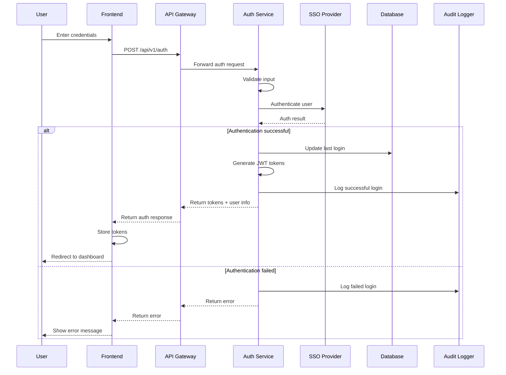
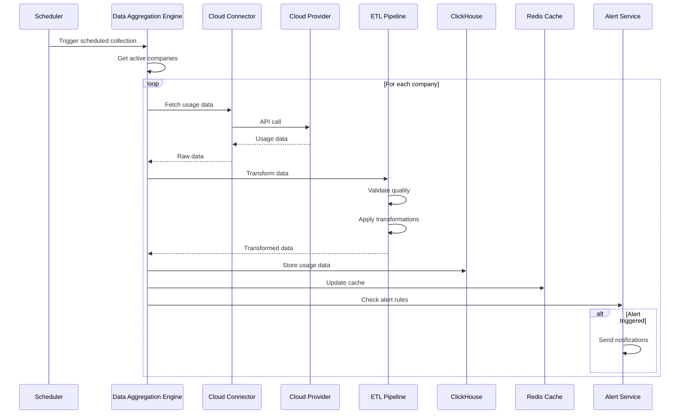
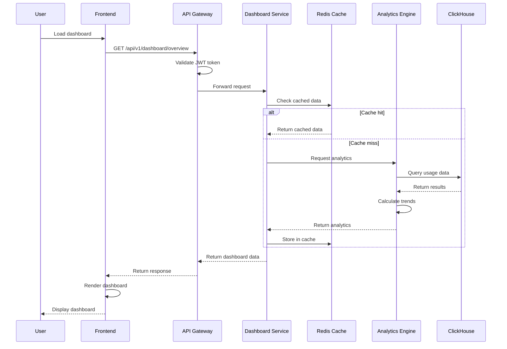
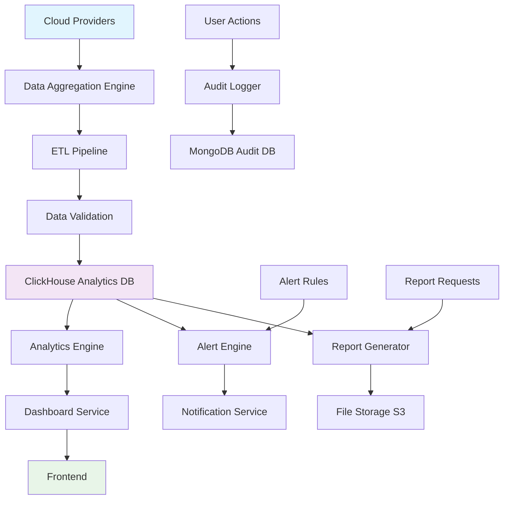
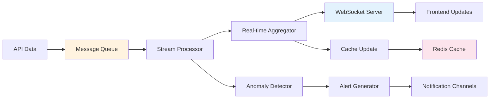

# AI Portfolio Management Dashboard - Low-Level Design

## Table of Contents
1. [Component Architecture](#component-architecture)
2. [Database Design](#database-design)
3. [API Specifications](#api-specifications)
4. [Sequence Diagrams](#sequence-diagrams)
5. [Data Flow Diagrams](#data-flow-diagrams)
6. [Security Implementation](#security-implementation)
7. [Performance Optimization](#performance-optimization)
8. [Error Handling](#error-handling)
9. [Deployment Architecture](#deployment-architecture)
10. [Testing Strategy](#testing-strategy)

## Component Architecture

### Microservices Breakdown

#### 1. Authentication Service
```typescript
interface AuthenticationService {
  authenticateUser(credentials: UserCredentials): Promise<AuthResult>
  validateToken(token: string): Promise<TokenValidation>
  refreshToken(refreshToken: string): Promise<TokenPair>
  logout(token: string): Promise<void>
  resetPassword(email: string): Promise<void>
}

class AuthenticationServiceImpl implements AuthenticationService {
  private jwtService: JWTService
  private ssoProvider: SSOProvider
  private userRepository: UserRepository
  private auditLogger: AuditLogger

  async authenticateUser(credentials: UserCredentials): Promise<AuthResult> {
    // Input validation
    this.validateCredentials(credentials)
    
    // SSO authentication
    const ssoResult = await this.ssoProvider.authenticate(credentials)
    if (!ssoResult.success) {
      await this.auditLogger.logFailedLogin(credentials.email)
      throw new AuthenticationError('Invalid credentials')
    }

    // Generate JWT tokens
    const tokenPair = await this.jwtService.generateTokens(ssoResult.user)
    
    // Update last login
    await this.userRepository.updateLastLogin(ssoResult.user.userId)
    
    // Log successful authentication
    await this.auditLogger.logSuccessfulLogin(ssoResult.user.userId)
    
    return {
      success: true,
      tokens: tokenPair,
      user: ssoResult.user
    }
  }
}
```

#### 2. Authorization Service
```typescript
interface AuthorizationService {
  checkPermission(userId: string, resource: string, action: string): Promise<boolean>
  getUserRoles(userId: string): Promise<UserRole[]>
  assignRole(userId: string, roleId: string): Promise<void>
  revokeRole(userId: string, roleId: string): Promise<void>
}

class AuthorizationServiceImpl implements AuthorizationService {
  private roleRepository: RoleRepository
  private permissionRepository: PermissionRepository
  private cacheService: CacheService

  async checkPermission(userId: string, resource: string, action: string): Promise<boolean> {
    // Check cache first
    const cacheKey = `permission:${userId}:${resource}:${action}`
    const cached = await this.cacheService.get(cacheKey)
    if (cached !== null) return cached

    // Get user roles
    const roles = await this.getUserRoles(userId)
    
    // Check permissions for each role
    for (const role of roles) {
      const permissions = await this.permissionRepository.getByRoleId(role.roleId)
      for (const permission of permissions) {
        if (this.matchesPermission(permission, resource, action)) {
          await this.cacheService.set(cacheKey, true, 300) // 5 min cache
          return true
        }
      }
    }

    await this.cacheService.set(cacheKey, false, 300)
    return false
  }

  private matchesPermission(permission: Permission, resource: string, action: string): boolean {
    return permission.resource === resource && 
           (permission.action === action || permission.action === '*')
  }
}
```

#### 3. Data Aggregation Engine
```typescript
interface DataAggregationEngine {
  scheduleDataCollection(): void
  collectCloudData(companyId: string, provider: CloudProvider): Promise<AIUsageData[]>
  validateDataQuality(data: AIUsageData[]): ValidationResult
  transformData(rawData: any[], provider: CloudProvider): AIUsageData[]
}

class DataAggregationEngineImpl implements DataAggregationEngine {
  private schedulerService: SchedulerService
  private cloudConnectors: Map<CloudProvider, CloudConnector>
  private dataValidator: DataValidator
  private etlPipeline: ETLPipeline

  constructor() {
    this.cloudConnectors = new Map([
      [CloudProvider.AWS, new AWSConnector()],
      [CloudProvider.AZURE, new AzureConnector()],
      [CloudProvider.GCP, new GCPConnector()]
    ])
  }

  scheduleDataCollection(): void {
    // Schedule hourly data collection
    this.schedulerService.schedule('0 * * * *', async () => {
      const companies = await this.getActiveCompanies()
      for (const company of companies) {
        for (const integration of company.cloudIntegrations) {
          try {
            await this.collectCloudData(company.companyId, integration.provider)
          } catch (error) {
            console.error(`Data collection failed for ${company.companyName}:`, error)
          }
        }
      }
    })
  }

  async collectCloudData(companyId: string, provider: CloudProvider): Promise<AIUsageData[]> {
    const connector = this.cloudConnectors.get(provider)
    if (!connector) {
      throw new Error(`Unsupported cloud provider: ${provider}`)
    }

    // Get raw data from cloud provider
    const rawData = await connector.fetchUsageData(companyId)
    
    // Transform data to standard format
    const transformedData = this.transformData(rawData, provider)
    
    // Validate data quality
    const validationResult = this.validateDataQuality(transformedData)
    if (!validationResult.isValid) {
      throw new DataQualityError(validationResult.errors)
    }

    // Store in database
    await this.storeUsageData(transformedData)
    
    return transformedData
  }
}
```

#### 4. Analytics Engine
```typescript
interface AnalyticsEngine {
  calculateCostTrends(companyId: string, period: TimePeriod): Promise<CostTrend[]>
  generateBenchmarks(companyId: string): Promise<BenchmarkData>
  predictCosts(companyId: string, scenario: CostScenario): Promise<CostPrediction>
  optimizeCosts(companyId: string): Promise<OptimizationRecommendation[]>
}

class AnalyticsEngineImpl implements AnalyticsEngine {
  private mlService: MLService
  private statisticsService: StatisticsService
  private benchmarkService: BenchmarkService

  async calculateCostTrends(companyId: string, period: TimePeriod): Promise<CostTrend[]> {
    const usageData = await this.getUsageData(companyId, period)
    
    return this.statisticsService.calculateTrends(usageData, {
      groupBy: ['serviceName', 'department'],
      aggregation: 'sum',
      timeGranularity: period.granularity
    })
  }

  async generateBenchmarks(companyId: string): Promise<BenchmarkData> {
    const companyData = await this.getCompanyMetrics(companyId)
    const industryData = await this.getIndustryMetrics(companyData.industry)
    
    return this.benchmarkService.compare(companyData, industryData)
  }

  async predictCosts(companyId: string, scenario: CostScenario): Promise<CostPrediction> {
    const historicalData = await this.getHistoricalData(companyId)
    const features = this.extractFeatures(historicalData, scenario)
    
    return this.mlService.predict('cost_prediction_model', features)
  }
}
```

## Database Design

### PostgreSQL Schema (Primary Database)

```sql
-- Users table
CREATE TABLE users (
    user_id UUID PRIMARY KEY DEFAULT gen_random_uuid(),
    email VARCHAR(255) UNIQUE NOT NULL,
    display_name VARCHAR(255) NOT NULL,
    is_active BOOLEAN DEFAULT true,
    last_login_date TIMESTAMPTZ,
    created_date TIMESTAMPTZ DEFAULT CURRENT_TIMESTAMP,
    updated_date TIMESTAMPTZ DEFAULT CURRENT_TIMESTAMP
);

-- Roles table
CREATE TABLE roles (
    role_id UUID PRIMARY KEY DEFAULT gen_random_uuid(),
    role_name VARCHAR(100) UNIQUE NOT NULL,
    description TEXT,
    created_date TIMESTAMPTZ DEFAULT CURRENT_TIMESTAMP
);

-- Permissions table
CREATE TABLE permissions (
    permission_id UUID PRIMARY KEY DEFAULT gen_random_uuid(),
    action VARCHAR(100) NOT NULL,
    resource VARCHAR(100) NOT NULL,
    scope VARCHAR(100) DEFAULT 'global',
    created_date TIMESTAMPTZ DEFAULT CURRENT_TIMESTAMP,
    UNIQUE(action, resource, scope)
);

-- User roles junction table
CREATE TABLE user_roles (
    user_id UUID REFERENCES users(user_id) ON DELETE CASCADE,
    role_id UUID REFERENCES roles(role_id) ON DELETE CASCADE,
    assigned_date TIMESTAMPTZ DEFAULT CURRENT_TIMESTAMP,
    assigned_by UUID REFERENCES users(user_id),
    PRIMARY KEY (user_id, role_id)
);

-- Role permissions junction table
CREATE TABLE role_permissions (
    role_id UUID REFERENCES roles(role_id) ON DELETE CASCADE,
    permission_id UUID REFERENCES permissions(permission_id) ON DELETE CASCADE,
    granted_date TIMESTAMPTZ DEFAULT CURRENT_TIMESTAMP,
    granted_by UUID REFERENCES users(user_id),
    PRIMARY KEY (role_id, permission_id)
);

-- Portfolio companies table
CREATE TABLE portfolio_companies (
    company_id UUID PRIMARY KEY DEFAULT gen_random_uuid(),
    company_name VARCHAR(255) NOT NULL,
    industry VARCHAR(100),
    investment_date DATE,
    is_active BOOLEAN DEFAULT true,
    data_source_configs JSONB,
    created_date TIMESTAMPTZ DEFAULT CURRENT_TIMESTAMP,
    updated_date TIMESTAMPTZ DEFAULT CURRENT_TIMESTAMP
);

-- Cloud integrations table
CREATE TABLE cloud_integrations (
    integration_id UUID PRIMARY KEY DEFAULT gen_random_uuid(),
    company_id UUID REFERENCES portfolio_companies(company_id) ON DELETE CASCADE,
    provider VARCHAR(50) NOT NULL,
    api_endpoint VARCHAR(500),
    credentials_encrypted TEXT NOT NULL,
    is_enabled BOOLEAN DEFAULT true,
    last_sync_time TIMESTAMPTZ,
    created_date TIMESTAMPTZ DEFAULT CURRENT_TIMESTAMP,
    updated_date TIMESTAMPTZ DEFAULT CURRENT_TIMESTAMP
);

-- Alert rules table
CREATE TABLE alert_rules (
    rule_id UUID PRIMARY KEY DEFAULT gen_random_uuid(),
    company_id UUID REFERENCES portfolio_companies(company_id) ON DELETE CASCADE,
    rule_name VARCHAR(255) NOT NULL,
    threshold_value DECIMAL(15,2),
    threshold_type VARCHAR(50), -- 'absolute', 'percentage', 'trend'
    condition_expression TEXT NOT NULL,
    recipients JSONB NOT NULL, -- Array of email addresses
    is_active BOOLEAN DEFAULT true,
    created_date TIMESTAMPTZ DEFAULT CURRENT_TIMESTAMP,
    updated_date TIMESTAMPTZ DEFAULT CURRENT_TIMESTAMP
);

-- Reports table
CREATE TABLE reports (
    report_id UUID PRIMARY KEY DEFAULT gen_random_uuid(),
    report_type VARCHAR(100) NOT NULL,
    generated_by UUID REFERENCES users(user_id),
    generated_date TIMESTAMPTZ DEFAULT CURRENT_TIMESTAMP,
    format VARCHAR(20) NOT NULL, -- 'pdf', 'excel', 'json'
    content_location VARCHAR(500), -- S3 path or similar
    parameters JSONB,
    file_size BIGINT,
    expires_date TIMESTAMPTZ
);

-- Indexes for performance
CREATE INDEX idx_users_email ON users(email);
CREATE INDEX idx_users_active ON users(is_active);
CREATE INDEX idx_companies_active ON portfolio_companies(is_active);
CREATE INDEX idx_integrations_company ON cloud_integrations(company_id);
CREATE INDEX idx_integrations_enabled ON cloud_integrations(is_enabled);
CREATE INDEX idx_alert_rules_company ON alert_rules(company_id);
CREATE INDEX idx_alert_rules_active ON alert_rules(is_active);
CREATE INDEX idx_reports_generated_by ON reports(generated_by);
CREATE INDEX idx_reports_type_date ON reports(report_type, generated_date);
```

### ClickHouse Schema (Analytics Database)

```sql
-- AI usage data table (optimized for analytics)
CREATE TABLE ai_usage_data (
    usage_id String,
    company_id String,
    cloud_provider LowCardinality(String),
    service_name LowCardinality(String),
    department LowCardinality(String),
    project String,
    usage_amount Decimal64(8),
    cost Decimal64(4),
    currency LowCardinality(String),
    timestamp DateTime64(3),
    data_freshness DateTime64(3),
    ingestion_time DateTime64(3) DEFAULT now(),
    date Date MATERIALIZED toDate(timestamp)
) ENGINE = MergeTree()
PARTITION BY toYYYYMM(date)
ORDER BY (company_id, cloud_provider, service_name, timestamp)
TTL date + INTERVAL 2 YEAR;

-- Aggregated daily metrics (materialized view)
CREATE MATERIALIZED VIEW daily_usage_summary
ENGINE = SummingMergeTree()
PARTITION BY toYYYYMM(date)
ORDER BY (company_id, cloud_provider, service_name, date)
AS SELECT
    company_id,
    cloud_provider,
    service_name,
    department,
    toDate(timestamp) as date,
    sum(usage_amount) as total_usage,
    sum(cost) as total_cost,
    count() as record_count
FROM ai_usage_data
GROUP BY company_id, cloud_provider, service_name, department, date;

-- Monthly aggregated metrics
CREATE MATERIALIZED VIEW monthly_usage_summary
ENGINE = SummingMergeTree()
PARTITION BY toYear(date)
ORDER BY (company_id, cloud_provider, service_name, date)
AS SELECT
    company_id,
    cloud_provider,
    service_name,
    toStartOfMonth(timestamp) as date,
    sum(usage_amount) as total_usage,
    sum(cost) as total_cost,
    count() as record_count
FROM ai_usage_data
GROUP BY company_id, cloud_provider, service_name, date;
```

### MongoDB Schema (Audit Logs)

```javascript
// Audit logs collection
db.audit_logs.createIndex({ "timestamp": -1 })
db.audit_logs.createIndex({ "userId": 1, "timestamp": -1 })
db.audit_logs.createIndex({ "action": 1, "timestamp": -1 })
db.audit_logs.createIndex({ "resource": 1, "timestamp": -1 })

// Sample audit log document
{
  "_id": ObjectId("..."),
  "logId": "uuid-string",
  "userId": "user-uuid",
  "action": "VIEW_DASHBOARD",
  "resource": "/api/v1/dashboard/company/123",
  "timestamp": ISODate("2024-01-15T10:30:00Z"),
  "ipAddress": "192.168.1.100",
  "userAgent": "Mozilla/5.0...",
  "result": "SUCCESS",
  "metadata": {
    "companyId": "company-uuid",
    "responseTime": 245,
    "dataSize": 1024
  }
}

// TTL index for automatic cleanup (2 years retention)
db.audit_logs.createIndex({ "timestamp": 1 }, { expireAfterSeconds: 63072000 })
```

## API Specifications

### REST API Endpoints

#### Authentication Endpoints
```yaml
/api/v1/auth:
  post:
    summary: Authenticate user
    requestBody:
      required: true
      content:
        application/json:
          schema:
            type: object
            properties:
              email:
                type: string
                format: email
              password:
                type: string
                minLength: 8
              mfaCode:
                type: string
                pattern: '^[0-9]{6}$'
    responses:
      200:
        description: Authentication successful
        content:
          application/json:
            schema:
              type: object
              properties:
                accessToken:
                  type: string
                refreshToken:
                  type: string
                expiresIn:
                  type: integer
                user:
                  $ref: '#/components/schemas/User'
      401:
        description: Authentication failed
        content:
          application/json:
            schema:
              $ref: '#/components/schemas/Error'

/api/v1/auth/refresh:
  post:
    summary: Refresh access token
    requestBody:
      required: true
      content:
        application/json:
          schema:
            type: object
            properties:
              refreshToken:
                type: string
    responses:
      200:
        description: Token refreshed successfully
        content:
          application/json:
            schema:
              type: object
              properties:
                accessToken:
                  type: string
                expiresIn:
                  type: integer
```

#### Dashboard Endpoints
```yaml
/api/v1/dashboard/overview:
  get:
    summary: Get dashboard overview data
    security:
      - BearerAuth: []
    parameters:
      - name: companyId
        in: query
        required: false
        schema:
          type: string
          format: uuid
      - name: timeRange
        in: query
        required: false
        schema:
          type: string
          enum: [7d, 30d, 90d, 1y]
          default: 30d
    responses:
      200:
        description: Dashboard data retrieved successfully
        content:
          application/json:
            schema:
              type: object
              properties:
                totalCost:
                  type: number
                  format: decimal
                costTrend:
                  type: array
                  items:
                    $ref: '#/components/schemas/CostTrendPoint'
                topServices:
                  type: array
                  items:
                    $ref: '#/components/schemas/ServiceUsage'
                alerts:
                  type: array
                  items:
                    $ref: '#/components/schemas/Alert'
                dataFreshness:
                  type: string
                  format: date-time

/api/v1/dashboard/drill-down:
  get:
    summary: Get detailed analytics for drill-down
    security:
      - BearerAuth: []
    parameters:
      - name: companyId
        in: query
        required: true
        schema:
          type: string
          format: uuid
      - name: dimension
        in: query
        required: true
        schema:
          type: string
          enum: [service, department, project, region]
      - name: timeRange
        in: query
        schema:
          type: string
          enum: [7d, 30d, 90d, 1y]
          default: 30d
    responses:
      200:
        description: Drill-down data retrieved successfully
        content:
          application/json:
            schema:
              type: object
              properties:
                breakdown:
                  type: array
                  items:
                    $ref: '#/components/schemas/CostBreakdown'
                trends:
                  type: array
                  items:
                    $ref: '#/components/schemas/TrendData'
```

#### Analytics Endpoints
```yaml
/api/v1/analytics/benchmarks:
  get:
    summary: Get benchmark data for a company
    security:
      - BearerAuth: []
    parameters:
      - name: companyId
        in: query
        required: true
        schema:
          type: string
          format: uuid
    responses:
      200:
        description: Benchmark data retrieved successfully
        content:
          application/json:
            schema:
              $ref: '#/components/schemas/BenchmarkData'

/api/v1/analytics/predictions:
  post:
    summary: Generate cost predictions
    security:
      - BearerAuth: []
    requestBody:
      required: true
      content:
        application/json:
          schema:
            type: object
            properties:
              companyId:
                type: string
                format: uuid
              scenario:
                $ref: '#/components/schemas/CostScenario'
              forecastPeriod:
                type: string
                enum: [30d, 90d, 1y]
    responses:
      200:
        description: Predictions generated successfully
        content:
          application/json:
            schema:
              $ref: '#/components/schemas/CostPrediction'
```

### GraphQL Schema

```graphql
type Query {
  # Dashboard queries
  dashboardOverview(companyId: ID, timeRange: TimeRange): DashboardOverview!
  drillDownAnalytics(companyId: ID!, dimension: Dimension!, timeRange: TimeRange): DrillDownData!
  
  # Company queries
  companies(filter: CompanyFilter): [Company!]!
  company(id: ID!): Company
  
  # Analytics queries
  benchmarks(companyId: ID!): BenchmarkData!
  costTrends(companyId: ID!, timeRange: TimeRange!): [CostTrend!]!
  
  # User queries
  currentUser: User!
  users(filter: UserFilter): [User!]!
}

type Mutation {
  # Authentication mutations
  login(email: String!, password: String!, mfaCode: String): AuthResult!
  logout: Boolean!
  
  # Company mutations
  createCompany(input: CreateCompanyInput!): Company!
  updateCompany(id: ID!, input: UpdateCompanyInput!): Company!
  
  # Integration mutations
  createCloudIntegration(input: CreateIntegrationInput!): CloudIntegration!
  updateCloudIntegration(id: ID!, input: UpdateIntegrationInput!): CloudIntegration!
  
  # Alert mutations
  createAlertRule(input: CreateAlertRuleInput!): AlertRule!
  updateAlertRule(id: ID!, input: UpdateAlertRuleInput!): AlertRule!
}

type Subscription {
  # Real-time updates
  dashboardUpdates(companyId: ID): DashboardUpdate!
  alertNotifications(userId: ID!): AlertNotification!
  dataIngestionStatus(companyId: ID): DataIngestionStatus!
}

# Types
type DashboardOverview {
  totalCost: Decimal!
  costTrend: [CostTrendPoint!]!
  topServices: [ServiceUsage!]!
  alerts: [Alert!]!
  dataFreshness: DateTime!
}

type CostTrendPoint {
  timestamp: DateTime!
  cost: Decimal!
  usage: Decimal!
}

type ServiceUsage {
  serviceName: String!
  cost: Decimal!
  usage: Decimal!
  trend: Float!
}

type Alert {
  id: ID!
  severity: AlertSeverity!
  message: String!
  timestamp: DateTime!
  acknowledged: Boolean!
}

enum AlertSeverity {
  LOW
  MEDIUM
  HIGH
  CRITICAL
}

enum TimeRange {
  SEVEN_DAYS
  THIRTY_DAYS
  NINETY_DAYS
  ONE_YEAR
}

enum Dimension {
  SERVICE
  DEPARTMENT
  PROJECT
  REGION
}
```

## Sequence Diagrams

### User Authentication Flow


### Data Collection Flow


### Dashboard Data Retrieval


## Data Flow Diagrams

### High-Level Data Flow


### Real-time Data Processing


## Security Implementation

### JWT Token Structure
```typescript
interface JWTPayload {
  sub: string // User ID
  email: string
  roles: string[]
  permissions: string[]
  iat: number // Issued at
  exp: number // Expiration
  aud: string // Audience
  iss: string // Issuer
  jti: string // JWT ID for revocation
}

class JWTService {
  private readonly secretKey: string
  private readonly algorithm = 'HS256'
  private readonly accessTokenExpiry = '15m'
  private readonly refreshTokenExpiry = '7d'

  async generateTokens(user: User): Promise<TokenPair> {
    const payload: JWTPayload = {
      sub: user.userId,
      email: user.email,
      roles: user.roles.map(r => r.roleName),
      permissions: this.flattenPermissions(user.roles),
      iat: Math.floor(Date.now() / 1000),
      exp: Math.floor(Date.now() / 1000) + (15 * 60), // 15 minutes
      aud: 'ai-portfolio-dashboard',
      iss: 'auth-service',
      jti: uuidv4()
    }

    const accessToken = jwt.sign(payload, this.secretKey, {
      algorithm: this.algorithm
    })

    const refreshToken = jwt.sign(
      { sub: user.userId, jti: uuidv4() },
      this.secretKey,
      { expiresIn: this.refreshTokenExpiry }
    )

    // Store refresh token in Redis with expiration
    await this.storeRefreshToken(user.userId, refreshToken)

    return { accessToken, refreshToken }
  }
}
```

### Encryption Service
```typescript
class EncryptionService {
  private readonly algorithm = 'aes-256-gcm'
  private readonly keyDerivationIterations = 100000

  async encryptSensitiveData(data: string, masterKey: string): Promise<EncryptedData> {
    // Generate random salt and IV
    const salt = crypto.randomBytes(32)
    const iv = crypto.randomBytes(16)
    
    // Derive key using PBKDF2
    const key = crypto.pbkdf2Sync(masterKey, salt, this.keyDerivationIterations, 32, 'sha256')
    
    // Encrypt data
    const cipher = crypto.createCipher(this.algorithm, key, iv)
    let encrypted = cipher.update(data, 'utf8', 'hex')
    encrypted += cipher.final('hex')
    
    // Get authentication tag
    const authTag = cipher.getAuthTag()
    
    return {
      encrypted,
      salt: salt.toString('hex'),
      iv: iv.toString('hex'),
      authTag: authTag.toString('hex')
    }
  }

  async decryptSensitiveData(encryptedData: EncryptedData, masterKey: string): Promise<string> {
    const salt = Buffer.from(encryptedData.salt, 'hex')
    const iv = Buffer.from(encryptedData.iv, 'hex')
    const authTag = Buffer.from(encryptedData.authTag, 'hex')
    
    // Derive key
    const key = crypto.pbkdf2Sync(masterKey, salt, this.keyDerivationIterations, 32, 'sha256')
    
    // Decrypt data
    const decipher = crypto.createDecipher(this.algorithm, key, iv)
    decipher.setAuthTag(authTag)
    
    let decrypted = decipher.update(encryptedData.encrypted, 'hex', 'utf8')
    decrypted += decipher.final('utf8')
    
    return decrypted
  }
}
```

### Input Validation Middleware
```typescript
class ValidationMiddleware {
  static validateDashboardRequest = [
    query('companyId').optional().isUUID().withMessage('Invalid company ID format'),
    query('timeRange').optional().isIn(['7d', '30d', '90d', '1y']).withMessage('Invalid time range'),
    query('limit').optional().isInt({ min: 1, max: 1000 }).withMessage('Limit must be between 1 and 1000'),
    
    (req: Request, res: Response, next: NextFunction) => {
      const errors = validationResult(req)
      if (!errors.isEmpty()) {
        return res.status(400).json({
          error: 'Validation failed',
          details: errors.array()
        })
      }
      next()
    }
  ]

  static validateCreateCompany = [
    body('companyName').isLength({ min: 1, max: 255 }).withMessage('Company name is required and must be less than 255 characters'),
    body('industry').optional().isLength({ max: 100 }).withMessage('Industry must be less than 100 characters'),
    body('investmentDate').optional().isISO8601().withMessage('Invalid investment date format'),
    
    // Sanitize inputs
    body('companyName').trim().escape(),
    body('industry').trim().escape(),
    
    (req: Request, res: Response, next: NextFunction) => {
      const errors = validationResult(req)
      if (!errors.isEmpty()) {
        return res.status(400).json({
          error: 'Validation failed',
          details: errors.array()
        })
      }
      next()
    }
  ]
}
```

## Performance Optimization

### Caching Strategy
```typescript
class CacheService {
  private redisClient: Redis
  private readonly defaultTTL = 300 // 5 minutes

  constructor() {
    this.redisClient = new Redis({
      host: process.env.REDIS_HOST,
      port: parseInt(process.env.REDIS_PORT || '6379'),
      retryDelayOnFailover: 100,
      maxRetriesPerRequest: 3
    })
  }

  async get<T>(key: string): Promise<T | null> {
    try {
      const cached = await this.redisClient.get(key)
      return cached ? JSON.parse(cached) : null
    } catch (error) {
      console.error('Cache get error:', error)
      return null
    }
  }

  async set(key: string, value: any, ttl: number = this.defaultTTL): Promise<void> {
    try {
      await this.redisClient.setex(key, ttl, JSON.stringify(value))
    } catch (error) {
      console.error('Cache set error:', error)
    }
  }

  async invalidatePattern(pattern: string): Promise<void> {
    try {
      const keys = await this.redisClient.keys(pattern)
      if (keys.length > 0) {
        await this.redisClient.del(...keys)
      }
    } catch (error) {
      console.error('Cache invalidation error:', error)
    }
  }

  // Cache warming for frequently accessed data
  async warmCache(): Promise<void> {
    const companies = await this.getActiveCompanies()
    
    for (const company of companies) {
      // Pre-load dashboard data
      const dashboardKey = `dashboard:${company.companyId}:30d`
      const dashboardData = await this.generateDashboardData(company.companyId, '30d')
      await this.set(dashboardKey, dashboardData, 600) // 10 minutes
      
      // Pre-load analytics data
      const analyticsKey = `analytics:${company.companyId}:trends`
      const analyticsData = await this.generateAnalyticsData(company.companyId)
      await this.set(analyticsKey, analyticsData, 900) // 15 minutes
    }
  }
}
```

### Database Optimization
```sql
-- Partitioning strategy for ClickHouse
CREATE TABLE ai_usage_data_distributed (
    usage_id String,
    company_id String,
    cloud_provider LowCardinality(String),
    service_name LowCardinality(String),
    department LowCardinality(String),
    project String,
    usage_amount Decimal64(8),
    cost Decimal64(4),
    currency LowCardinality(String),
    timestamp DateTime64(3),
    data_freshness DateTime64(3),
    date Date MATERIALIZED toDate(timestamp)
) ENGINE = Distributed(cluster, default, ai_usage_data_local, rand());

-- Optimized queries with proper indexing
-- Query for dashboard overview
SELECT 
    cloud_provider,
    service_name,
    sum(cost) as total_cost,
    sum(usage_amount) as total_usage,
    count() as record_count
FROM ai_usage_data
WHERE company_id = {company_id:String}
  AND date >= today() - INTERVAL 30 DAY
  AND date < today()
GROUP BY cloud_provider, service_name
ORDER BY total_cost DESC
LIMIT 10;

-- Query for trend analysis
SELECT 
    toStartOfDay(timestamp) as day,
    sum(cost) as daily_cost
FROM ai_usage_data
WHERE company_id = {company_id:String}
  AND date >= today() - INTERVAL 90 DAY
  AND date < today()
GROUP BY day
ORDER BY day;
```

### Connection Pooling
```typescript
class DatabaseConnectionManager {
  private pgPool: Pool
  private clickhouseClient: ClickHouseClient
  private mongoClient: MongoClient

  constructor() {
    // PostgreSQL connection pool
    this.pgPool = new Pool({
      host: process.env.PG_HOST,
      port: parseInt(process.env.PG_PORT || '5432'),
      database: process.env.PG_DATABASE,
      user: process.env.PG_USER,
      password: process.env.PG_PASSWORD,
      max: 20, // Maximum number of connections
      min: 5,  // Minimum number of connections
      idleTimeoutMillis: 30000,
      connectionTimeoutMillis: 2000,
    })

    // ClickHouse client with connection pooling
    this.clickhouseClient = createClient({
      host: process.env.CH_HOST,
      port: parseInt(process.env.CH_PORT || '8123'),
      username: process.env.CH_USER,
      password: process.env.CH_PASSWORD,
      database: process.env.CH_DATABASE,
      max_open_connections: 10,
      request_timeout: 30000,
    })

    // MongoDB connection with pooling
    this.mongoClient = new MongoClient(process.env.MONGO_URI!, {
      maxPoolSize: 10,
      minPoolSize: 2,
      maxIdleTimeMS: 30000,
      serverSelectionTimeoutMS: 5000,
    })
  }

  async executeQuery<T>(query: string, params?: any[]): Promise<T[]> {
    const client = await this.pgPool.connect()
    try {
      const result = await client.query(query, params)
      return result.rows
    } finally {
      client.release()
    }
  }

  async executeAnalyticsQuery<T>(query: string): Promise<T[]> {
    const result = await this.clickhouseClient.query({
      query,
      format: 'JSONEachRow'
    })
    return result.json<T>()
  }
}
```

## Error Handling

### Global Error Handler
```typescript
class GlobalErrorHandler {
  static handle(error: Error, req: Request, res: Response, next: NextFunction): void {
    // Log error details
    logger.error('Unhandled error:', {
      error: error.message,
      stack: error.stack,
      url: req.url,
      method: req.method,
      userId: req.user?.userId,
      timestamp: new Date().toISOString()
    })

    // Determine error type and response
    if (error instanceof ValidationError) {
      res.status(400).json({
        error: 'Validation Error',
        message: error.message,
        details: error.details
      })
    } else if (error instanceof AuthenticationError) {
      res.status(401).json({
        error: 'Authentication Error',
        message: 'Invalid credentials'
      })
    } else if (error instanceof AuthorizationError) {
      res.status(403).json({
        error: 'Authorization Error',
        message: 'Insufficient permissions'
      })
    } else if (error instanceof NotFoundError) {
      res.status(404).json({
        error: 'Not Found',
        message: error.message
      })
    } else if (error instanceof RateLimitError) {
      res.status(429).json({
        error: 'Rate Limit Exceeded',
        message: 'Too many requests, please try again later'
      })
    } else {
      // Generic server error
      res.status(500).json({
        error: 'Internal Server Error',
        message: 'An unexpected error occurred'
      })
    }
  }
}

// Custom error classes
class ValidationError extends Error {
  constructor(message: string, public details?: any) {
    super(message)
    this.name = 'ValidationError'
  }
}

class AuthenticationError extends Error {
  constructor(message: string = 'Authentication failed') {
    super(message)
    this.name = 'AuthenticationError'
  }
}

class AuthorizationError extends Error {
  constructor(message: string = 'Insufficient permissions') {
    super(message)
    this.name = 'AuthorizationError'
  }
}

class DataQualityError extends Error {
  constructor(message: string, public validationErrors: string[]) {
    super(message)
    this.name = 'DataQualityError'
  }
}
```

### Circuit Breaker Implementation
```typescript
class CircuitBreaker {
  private failureCount = 0
  private lastFailureTime: number | null = null
  private state: 'CLOSED' | 'OPEN' | 'HALF_OPEN' = 'CLOSED'

  constructor(
    private readonly failureThreshold: number = 5,
    private readonly recoveryTimeout: number = 60000, // 1 minute
    private readonly monitoringPeriod: number = 120000 // 2 minutes
  ) {}

  async execute<T>(operation: () => Promise<T>): Promise<T> {
    if (this.state === 'OPEN') {
      if (this.shouldAttemptReset()) {
        this.state = 'HALF_OPEN'
      } else {
        throw new Error('Circuit breaker is OPEN')
      }
    }

    try {
      const result = await operation()
      this.onSuccess()
      return result
    } catch (error) {
      this.onFailure()
      throw error
    }
  }

  private onSuccess(): void {
    this.failureCount = 0
    this.state = 'CLOSED'
  }

  private onFailure(): void {
    this.failureCount++
    this.lastFailureTime = Date.now()

    if (this.failureCount >= this.failureThreshold) {
      this.state = 'OPEN'
    }
  }

  private shouldAttemptReset(): boolean {
    return this.lastFailureTime !== null && 
           (Date.now() - this.lastFailureTime) >= this.recoveryTimeout
  }
}

// Usage example
class CloudProviderService {
  private awsCircuitBreaker = new CircuitBreaker(5, 60000)
  private azureCircuitBreaker = new CircuitBreaker(5, 60000)
  private gcpCircuitBreaker = new CircuitBreaker(5, 60000)

  async fetchAWSData(companyId: string): Promise<any> {
    return this.awsCircuitBreaker.execute(async () => {
      // AWS API call logic
      return await this.awsConnector.fetchData(companyId)
    })
  }
}
```

## Deployment Architecture

### Kubernetes Deployment
```yaml
# API Gateway Deployment
apiVersion: apps/v1
kind: Deployment
metadata:
  name: api-gateway
  namespace: ai-portfolio
spec:
  replicas: 3
  selector:
    matchLabels:
      app: api-gateway
  template:
    metadata:
      labels:
        app: api-gateway
    spec:
      containers:
      - name: api-gateway
        image: ai-portfolio/api-gateway:latest
        ports:
        - containerPort: 3000
        env:
        - name: NODE_ENV
          value: "production"
        - name: REDIS_HOST
          value: "redis-service"
        - name: JWT_SECRET
          valueFrom:
            secretKeyRef:
              name: jwt-secret
              key: secret
        resources:
          requests:
            memory: "256Mi"
            cpu: "250m"
          limits:
            memory: "512Mi"
            cpu: "500m"
        livenessProbe:
          httpGet:
            path: /health
            port: 3000
          initialDelaySeconds: 30
          periodSeconds: 10
        readinessProbe:
          httpGet:
            path: /ready
            port: 3000
          initialDelaySeconds: 5
          periodSeconds: 5

---
# Authentication Service Deployment
apiVersion: apps/v1
kind: Deployment
metadata:
  name: auth-service
  namespace: ai-portfolio
spec:
  replicas: 2
  selector:
    matchLabels:
      app: auth-service
  template:
    metadata:
      labels:
        app: auth-service
    spec:
      containers:
      - name: auth-service
        image: ai-portfolio/auth-service:latest
        ports:
        - containerPort: 3001
        env:
        - name: DATABASE_URL
          valueFrom:
            secretKeyRef:
              name: database-secret
              key: url
        - name: SSO_CLIENT_ID
          valueFrom:
            secretKeyRef:
              name: sso-secret
              key: client-id
        resources:
          requests:
            memory: "256Mi"
            cpu: "250m"
          limits:
            memory: "512Mi"
            cpu: "500m"

---
# Dashboard Service Deployment
apiVersion: apps/v1
kind: Deployment
metadata:
  name: dashboard-service
  namespace: ai-portfolio
spec:
  replicas: 3
  selector:
    matchLabels:
      app: dashboard-service
  template:
    metadata:
      labels:
        app: dashboard-service
    spec:
      containers:
      - name: dashboard-service
        image: ai-portfolio/dashboard-service:latest
        ports:
        - containerPort: 3002
        env:
        - name: CLICKHOUSE_HOST
          value: "clickhouse-service"
        - name: REDIS_HOST
          value: "redis-service"
        resources:
          requests:
            memory: "512Mi"
            cpu: "500m"
          limits:
            memory: "1Gi"
            cpu: "1000m"

---
# Data Aggregation Engine Deployment
apiVersion: apps/v1
kind: Deployment
metadata:
  name: data-aggregation-engine
  namespace: ai-portfolio
spec:
  replicas: 2
  selector:
    matchLabels:
      app: data-aggregation-engine
  template:
    metadata:
      labels:
        app: data-aggregation-engine
    spec:
      containers:
      - name: data-aggregation-engine
        image: ai-portfolio/data-aggregation-engine:latest
        env:
        - name: AWS_ACCESS_KEY_ID
          valueFrom:
            secretKeyRef:
              name: cloud-credentials
              key: aws-access-key
        - name: AWS_SECRET_ACCESS_KEY
          valueFrom:
            secretKeyRef:
              name: cloud-credentials
              key: aws-secret-key
        - name: AZURE_CLIENT_ID
          valueFrom:
            secretKeyRef:
              name: cloud-credentials
              key: azure-client-id
        resources:
          requests:
            memory: "1Gi"
            cpu: "500m"
          limits:
            memory: "2Gi"
            cpu: "1000m"
```

### Service Configuration
```yaml
# Load Balancer Service
apiVersion: v1
kind: Service
metadata:
  name: api-gateway-service
  namespace: ai-portfolio
spec:
  selector:
    app: api-gateway
  ports:
  - protocol: TCP
    port: 80
    targetPort: 3000
  type: LoadBalancer

---
# Internal Services
apiVersion: v1
kind: Service
metadata:
  name: auth-service
  namespace: ai-portfolio
spec:
  selector:
    app: auth-service
  ports:
  - protocol: TCP
    port: 3001
    targetPort: 3001
  type: ClusterIP

---
apiVersion: v1
kind: Service
metadata:
  name: dashboard-service
  namespace: ai-portfolio
spec:
  selector:
    app: dashboard-service
  ports:
  - protocol: TCP
    port: 3002
    targetPort: 3002
  type: ClusterIP
```

### Database StatefulSets
```yaml
# PostgreSQL StatefulSet
apiVersion: apps/v1
kind: StatefulSet
metadata:
  name: postgresql
  namespace: ai-portfolio
spec:
  serviceName: postgresql-service
  replicas: 1
  selector:
    matchLabels:
      app: postgresql
  template:
    metadata:
      labels:
        app: postgresql
    spec:
      containers:
      - name: postgresql
        image: postgres:15
        env:
        - name: POSTGRES_DB
          value: "ai_portfolio"
        - name: POSTGRES_USER
          valueFrom:
            secretKeyRef:
              name: database-secret
              key: username
        - name: POSTGRES_PASSWORD
          valueFrom:
            secretKeyRef:
              name: database-secret
              key: password
        ports:
        - containerPort: 5432
        volumeMounts:
        - name: postgresql-storage
          mountPath: /var/lib/postgresql/data
        resources:
          requests:
            memory: "1Gi"
            cpu: "500m"
          limits:
            memory: "2Gi"
            cpu: "1000m"
  volumeClaimTemplates:
  - metadata:
      name: postgresql-storage
    spec:
      accessModes: ["ReadWriteOnce"]
      resources:
        requests:
          storage: 100Gi

---
# ClickHouse StatefulSet
apiVersion: apps/v1
kind: StatefulSet
metadata:
  name: clickhouse
  namespace: ai-portfolio
spec:
  serviceName: clickhouse-service
  replicas: 3
  selector:
    matchLabels:
      app: clickhouse
  template:
    metadata:
      labels:
        app: clickhouse
    spec:
      containers:
      - name: clickhouse
        image: clickhouse/clickhouse-server:latest
        ports:
        - containerPort: 8123
        - containerPort: 9000
        volumeMounts:
        - name: clickhouse-storage
          mountPath: /var/lib/clickhouse
        resources:
          requests:
            memory: "2Gi"
            cpu: "1000m"
          limits:
            memory: "4Gi"
            cpu: "2000m"
  volumeClaimTemplates:
  - metadata:
      name: clickhouse-storage
    spec:
      accessModes: ["ReadWriteOnce"]
      resources:
        requests:
          storage: 500Gi
```

## Testing Strategy

### Unit Testing
```typescript
// Authentication Service Tests
describe('AuthenticationService', () => {
  let authService: AuthenticationService
  let mockSSOProvider: jest.Mocked<SSOProvider>
  let mockUserRepository: jest.Mocked<UserRepository>
  let mockAuditLogger: jest.Mocked<AuditLogger>

  beforeEach(() => {
    mockSSOProvider = createMockSSOProvider()
    mockUserRepository = createMockUserRepository()
    mockAuditLogger = createMockAuditLogger()
    
    authService = new AuthenticationServiceImpl(
      new JWTService(),
      mockSSOProvider,
      mockUserRepository,
      mockAuditLogger
    )
  })

  describe('authenticateUser', () => {
    it('should authenticate valid user credentials', async () => {
      // Arrange
      const credentials = {
        email: 'test@example.com',
        password: 'validPassword123'
      }
      const mockUser = {
        userId: 'user-123',
        email: 'test@example.com',
        roles: [{ roleId: 'role-1', roleName: 'user' }]
      }
      
      mockSSOProvider.authenticate.mockResolvedValue({
        success: true,
        user: mockUser
      })
      mockUserRepository.updateLastLogin.mockResolvedValue()
      mockAuditLogger.logSuccessfulLogin.mockResolvedValue()

      // Act
      const result = await authService.authenticateUser(credentials)

      // Assert
      expect(result.success).toBe(true)
      expect(result.user).toEqual(mockUser)
      expect(result.tokens.accessToken).toBeDefined()
      expect(result.tokens.refreshToken).toBeDefined()
      expect(mockUserRepository.updateLastLogin).toHaveBeenCalledWith('user-123')
      expect(mockAuditLogger.logSuccessfulLogin).toHaveBeenCalledWith('user-123')
    })

    it('should reject invalid credentials', async () => {
      // Arrange
      const credentials = {
        email: 'test@example.com',
        password: 'invalidPassword'
      }
      
      mockSSOProvider.authenticate.mockResolvedValue({
        success: false,
        error: 'Invalid credentials'
      })
      mockAuditLogger.logFailedLogin.mockResolvedValue()

      // Act & Assert
      await expect(authService.authenticateUser(credentials))
        .rejects.toThrow('Invalid credentials')
      expect(mockAuditLogger.logFailedLogin).toHaveBeenCalledWith('test@example.com')
    })
  })
})

// Analytics Engine Tests
describe('AnalyticsEngine', () => {
  let analyticsEngine: AnalyticsEngine
  let mockMLService: jest.Mocked<MLService>
  let mockStatisticsService: jest.Mocked<StatisticsService>

  beforeEach(() => {
    mockMLService = createMockMLService()
    mockStatisticsService = createMockStatisticsService()
    
    analyticsEngine = new AnalyticsEngineImpl(
      mockMLService,
      mockStatisticsService,
      new BenchmarkService()
    )
  })

  describe('calculateCostTrends', () => {
    it('should calculate cost trends for given period', async () => {
      // Arrange
      const companyId = 'company-123'
      const period = { start: '2024-01-01', end: '2024-01-31', granularity: 'daily' }
      const mockUsageData = [
        { serviceName: 'OpenAI GPT-4', cost: 100.50, timestamp: '2024-01-01' },
        { serviceName: 'OpenAI GPT-4', cost: 120.75, timestamp: '2024-01-02' }
      ]
      const expectedTrends = [
        { service: 'OpenAI GPT-4', trend: 0.202, direction: 'increasing' }
      ]

      jest.spyOn(analyticsEngine as any, 'getUsageData').mockResolvedValue(mockUsageData)
      mockStatisticsService.calculateTrends.mockResolvedValue(expectedTrends)

      // Act
      const result = await analyticsEngine.calculateCostTrends(companyId, period)

      // Assert
      expect(result).toEqual(expectedTrends)
      expect(mockStatisticsService.calculateTrends).toHaveBeenCalledWith(
        mockUsageData,
        {
          groupBy: ['serviceName', 'department'],
          aggregation: 'sum',
          timeGranularity: 'daily'
        }
      )
    })
  })
})
```

### Integration Testing
```typescript
// API Integration Tests
describe('Dashboard API Integration', () => {
  let app: Application
  let testDb: TestDatabase
  let authToken: string

  beforeAll(async () => {
    // Setup test database
    testDb = await setupTestDatabase()
    app = createTestApp(testDb)
    
    // Create test user and get auth token
    const testUser = await testDb.createUser({
      email: 'test@example.com',
      roles: ['dashboard_user']
    })
    authToken = generateTestToken(testUser)
  })

  afterAll(async () => {
    await testDb.cleanup()
  })

  describe('GET /api/v1/dashboard/overview', () => {
    it('should return dashboard data for authenticated user', async () => {
      // Arrange
      const companyId = await testDb.createCompany({
        name: 'Test Company',
        industry: 'Technology'
      })
      
      await testDb.createUsageData([
        {
          companyId,
          serviceName: 'OpenAI GPT-4',
          cost: 150.00,
          timestamp: '2024-01-15T10:00:00Z'
        }
      ])

      // Act
      const response = await request(app)
        .get('/api/v1/dashboard/overview')
        .query({ companyId })
        .set('Authorization', `Bearer ${authToken}`)
        .expect(200)

      // Assert
      expect(response.body).toMatchObject({
        totalCost: expect.any(Number),
        costTrend: expect.any(Array),
        topServices: expect.any(Array),
        alerts: expect.any(Array),
        dataFreshness: expect.any(String)
      })
      expect(response.body.totalCost).toBeGreaterThan(0)
    })

    it('should return 401 for unauthenticated requests', async () => {
      await request(app)
        .get('/api/v1/dashboard/overview')
        .expect(401)
    })
  })
})
```

### End-to-End Testing
```typescript
// E2E Tests using Playwright
import { test, expect } from '@playwright/test'

test.describe('Dashboard E2E Tests', () => {
  test.beforeEach(async ({ page }) => {
    // Login
    await page.goto('/login')
    await page.fill('[data-testid="email"]', 'test@example.com')
    await page.fill('[data-testid="password"]', 'testPassword123')
    await page.click('[data-testid="login-button"]')
    
    // Wait for dashboard to load
    await page.waitForURL('/dashboard')
  })

  test('should display dashboard overview', async ({ page }) => {
    // Check main dashboard elements
    await expect(page.locator('[data-testid="total-cost"]')).toBeVisible()
    await expect(page.locator('[data-testid="cost-trend-chart"]')).toBeVisible()
    await expect(page.locator('[data-testid="top-services-table"]')).toBeVisible()
    
    // Verify data is loaded
    const totalCost = await page.locator('[data-testid="total-cost"]').textContent()
    expect(totalCost).toMatch(/\$[\d,]+\.\d{2}/)
  })

  test('should filter by company', async ({ page }) => {
    // Select company filter
    await page.click('[data-testid="company-filter"]')
    await page.click('[data-testid="company-option-1"]')
    
    // Wait for data to update
    await page.waitForResponse(response => 
      response.url().includes('/api/v1/dashboard/overview') && 
      response.status() === 200
    )
    
    // Verify filtered data is displayed
    await expect(page.locator('[data-testid="selected-company"]')).toContainText('Test Company')
  })

  test('should drill down into service details', async ({ page }) => {
    // Click on a service in the top services table
    await page.click('[data-testid="service-row-0"] [data-testid="drill-down-button"]')
    
    // Verify drill-down modal opens
    await expect(page.locator('[data-testid="drill-down-modal"]')).toBeVisible()
    
    // Check drill-down content
    await expect(page.locator('[data-testid="service-breakdown-chart"]')).toBeVisible()
    await expect(page.locator('[data-testid="department-breakdown"]')).toBeVisible()
  })

  test('should export report', async ({ page }) => {
    // Click export button
    await page.click('[data-testid="export-button"]')
    
    // Select PDF format
    await page.click('[data-testid="export-pdf"]')
    
    // Wait for download to start
    const downloadPromise = page.waitForEvent('download')
    await page.click('[data-testid="confirm-export"]')
    
    const download = await downloadPromise
    expect(download.suggestedFilename()).toMatch(/dashboard-report-.*\.pdf/)
  })
})
```

### Performance Testing
```typescript
// Load Testing with Artillery
// artillery-config.yml
config:
  target: 'https://api.ai-portfolio-dashboard.com'
  phases:
    - duration: 60
      arrivalRate: 10
      name: "Warm up"
    - duration: 300
      arrivalRate: 50
      name: "Sustained load"
    - duration: 120
      arrivalRate: 100
      name: "Peak load"
  variables:
    authToken: "{{ $processEnvironment.AUTH_TOKEN }}"

scenarios:
  - name: "Dashboard Load Test"
    weight: 70
    flow:
      - get:
          url: "/api/v1/auth/validate"
          headers:
            Authorization: "Bearer {{ authToken }}"
      - get:
          url: "/api/v1/dashboard/overview"
          headers:
            Authorization: "Bearer {{ authToken }}"
          capture:
            - json: "$.totalCost"
              as: "totalCost"
      - get:
          url: "/api/v1/dashboard/drill-down"
          qs:
            dimension: "service"
          headers:
            Authorization: "Bearer {{ authToken }}"

  - name: "Analytics Load Test"
    weight: 30
    flow:
      - get:
          url: "/api/v1/analytics/benchmarks"
          qs:
            companyId: "{{ $randomUUID }}"
          headers:
            Authorization: "Bearer {{ authToken }}"
      - post:
          url: "/api/v1/analytics/predictions"
          headers:
            Authorization: "Bearer {{ authToken }}"
          json:
            companyId: "{{ $randomUUID }}"
            scenario:
              growthRate: 0.15
              newServices: ["claude-3"]
            forecastPeriod: "90d"
```

This comprehensive Low-Level Design document provides detailed implementation specifications for the AI Portfolio Management Dashboard, covering all aspects from component architecture to testing strategies. The design ensures scalability, security, and maintainability while meeting all functional and non-functional requirements.