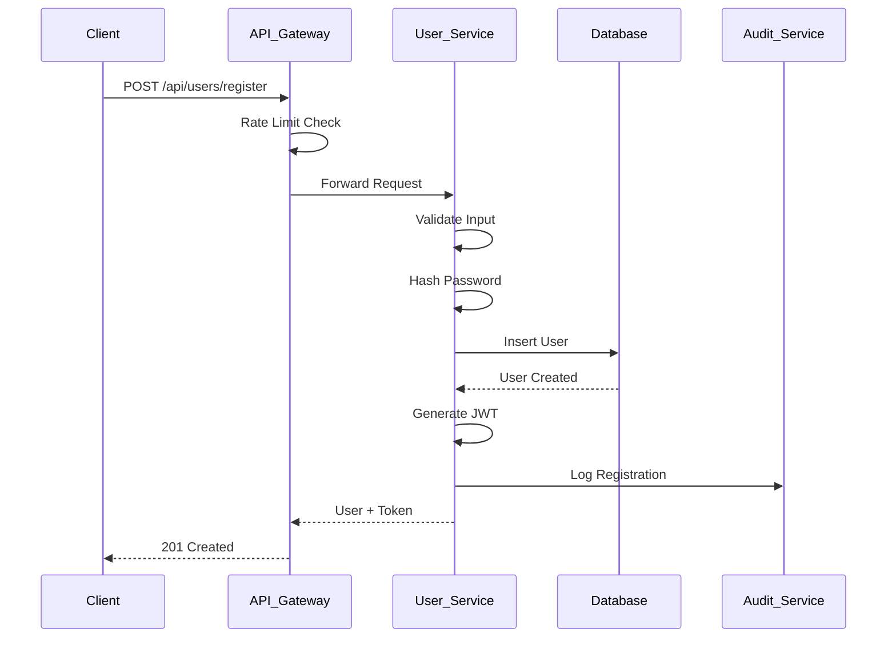
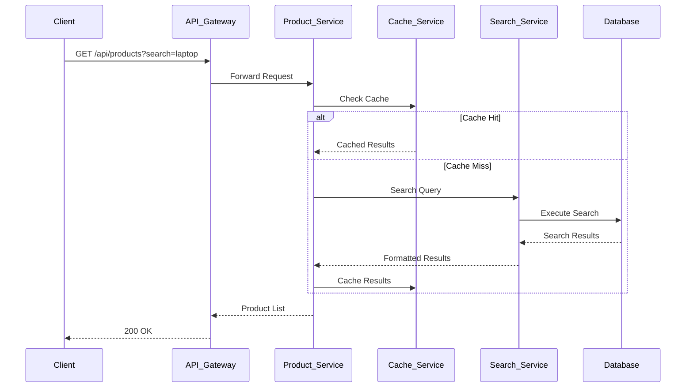
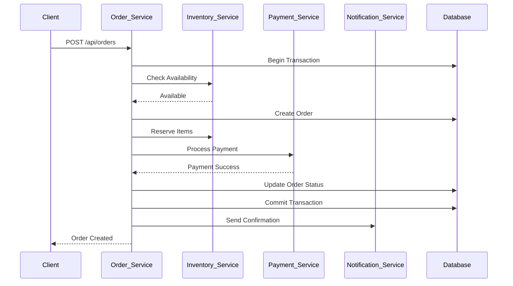
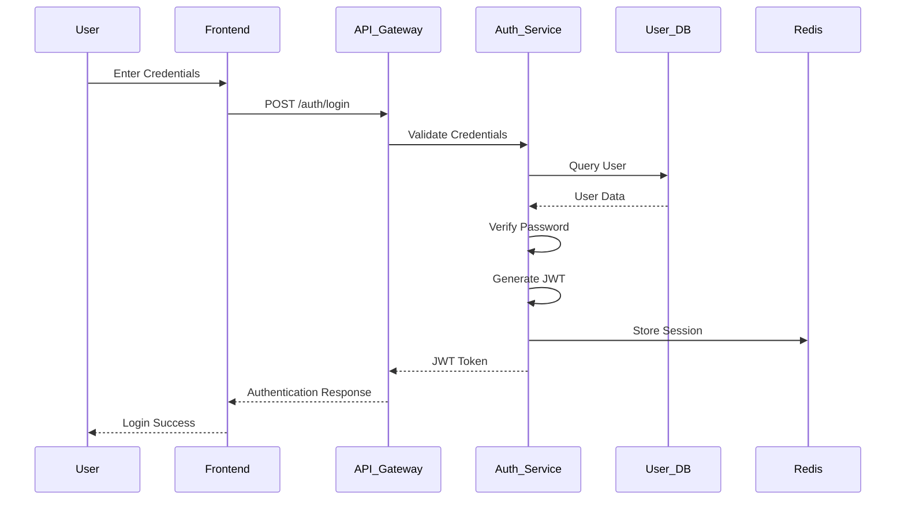
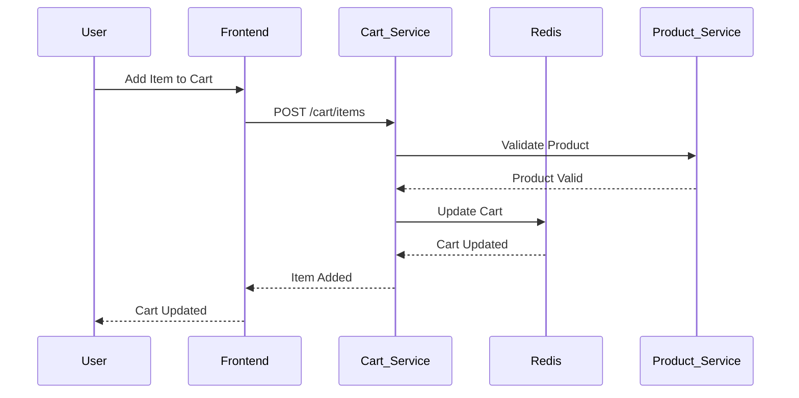

# Low-Level Design Document (LLD)
## E-Commerce Platform - DavTest07

### 1. Component Specifications

#### 1.1 User Service Component

**Class: UserController**
```typescript
class UserController {
  private userService: UserService;
  private authService: AuthService;
  private validator: UserValidator;

  async register(req: Request, res: Response): Promise<void> {
    try {
      const userData = await this.validator.validateRegistration(req.body);
      const hashedPassword = await bcrypt.hash(userData.password, 12);
      const user = await this.userService.createUser({
        ...userData,
        password: hashedPassword,
        role: UserRole.CONSUMER,
        isActive: true
      });
      const token = this.authService.generateJWT(user.userId, user.role);
      res.status(201).json({ user: this.sanitizeUser(user), token });
    } catch (error) {
      this.handleError(error, res);
    }
  }

  async login(req: Request, res: Response): Promise<void> {
    try {
      const { email, password } = await this.validator.validateLogin(req.body);
      const user = await this.userService.findByEmail(email);
      if (!user || !await bcrypt.compare(password, user.password)) {
        throw new AuthenticationError('Invalid credentials');
      }
      const token = this.authService.generateJWT(user.userId, user.role);
      await this.auditService.log({
        userId: user.userId,
        action: 'LOGIN',
        ipAddress: req.ip,
        userAgent: req.get('User-Agent')
      });
      res.json({ user: this.sanitizeUser(user), token });
    } catch (error) {
      this.handleError(error, res);
    }
  }
}
```

**Database Schema: User Table**
```sql
CREATE TABLE users (
  user_id UUID PRIMARY KEY DEFAULT gen_random_uuid(),
  email VARCHAR(255) UNIQUE NOT NULL,
  password_hash VARCHAR(255) NOT NULL,
  first_name VARCHAR(100) NOT NULL,
  last_name VARCHAR(100) NOT NULL,
  phone VARCHAR(20),
  address TEXT,
  role user_role_enum NOT NULL DEFAULT 'consumer',
  is_active BOOLEAN DEFAULT true,
  created_at TIMESTAMP DEFAULT CURRENT_TIMESTAMP,
  updated_at TIMESTAMP DEFAULT CURRENT_TIMESTAMP,
  CONSTRAINT valid_email CHECK (email ~* '^[A-Za-z0-9._%+-]+@[A-Za-z0-9.-]+\.[A-Za-z]{2,}$')
);

CREATE TYPE user_role_enum AS ENUM ('consumer', 'seller', 'admin', 'support');
CREATE INDEX idx_users_email ON users(email);
CREATE INDEX idx_users_role ON users(role);
```

#### 1.2 Product Service Component

**Class: ProductController**
```typescript
class ProductController {
  private productService: ProductService;
  private cacheService: CacheService;
  private searchService: SearchService;

  async createProduct(req: Request, res: Response): Promise<void> {
    try {
      const productData = await this.validator.validateProduct(req.body);
      const product = await this.productService.create({
        ...productData,
        sellerId: req.user.userId,
        isActive: true
      });
      await this.searchService.indexProduct(product);
      await this.cacheService.invalidatePattern('products:*');
      res.status(201).json(product);
    } catch (error) {
      this.handleError(error, res);
    }
  }

  async getProducts(req: Request, res: Response): Promise<void> {
    try {
      const filters = this.parseFilters(req.query);
      const cacheKey = `products:${JSON.stringify(filters)}`;
      
      let products = await this.cacheService.get(cacheKey);
      if (!products) {
        products = await this.productService.findWithFilters(filters);
        await this.cacheService.set(cacheKey, products, 300); // 5 minutes
      }
      
      res.json({
        products,
        pagination: this.buildPagination(filters, products.length)
      });
    } catch (error) {
      this.handleError(error, res);
    }
  }
}
```

**Database Schema: Product Tables**
```sql
CREATE TABLE categories (
  category_id UUID PRIMARY KEY DEFAULT gen_random_uuid(),
  name VARCHAR(100) NOT NULL,
  description TEXT,
  parent_id UUID REFERENCES categories(category_id),
  is_active BOOLEAN DEFAULT true,
  created_at TIMESTAMP DEFAULT CURRENT_TIMESTAMP
);

CREATE TABLE products (
  product_id UUID PRIMARY KEY DEFAULT gen_random_uuid(),
  name VARCHAR(255) NOT NULL,
  description TEXT,
  price DECIMAL(10,2) NOT NULL CHECK (price >= 0),
  category_id UUID NOT NULL REFERENCES categories(category_id),
  seller_id UUID NOT NULL REFERENCES users(user_id),
  stock INTEGER NOT NULL DEFAULT 0 CHECK (stock >= 0),
  is_active BOOLEAN DEFAULT true,
  created_at TIMESTAMP DEFAULT CURRENT_TIMESTAMP,
  updated_at TIMESTAMP DEFAULT CURRENT_TIMESTAMP
);

CREATE INDEX idx_products_category ON products(category_id);
CREATE INDEX idx_products_seller ON products(seller_id);
CREATE INDEX idx_products_price ON products(price);
CREATE INDEX idx_products_name_gin ON products USING gin(to_tsvector('english', name));
```

#### 1.3 Order Service Component

**Class: OrderController**
```typescript
class OrderController {
  private orderService: OrderService;
  private paymentService: PaymentService;
  private inventoryService: InventoryService;
  private notificationService: NotificationService;

  async createOrder(req: Request, res: Response): Promise<void> {
    const transaction = await this.db.beginTransaction();
    try {
      const orderData = await this.validator.validateOrder(req.body);
      
      // Check inventory availability
      const inventoryCheck = await this.inventoryService.checkAvailability(
        orderData.items
      );
      if (!inventoryCheck.available) {
        throw new InsufficientInventoryError(inventoryCheck.unavailableItems);
      }

      // Create order
      const order = await this.orderService.create({
        userId: req.user.userId,
        items: orderData.items,
        shippingAddress: orderData.shippingAddress,
        paymentMethod: orderData.paymentMethod,
        status: OrderStatus.PENDING
      }, transaction);

      // Reserve inventory
      await this.inventoryService.reserveItems(orderData.items, transaction);

      // Process payment
      const paymentResult = await this.paymentService.processPayment({
        orderId: order.orderId,
        amount: order.totalAmount,
        method: orderData.paymentMethod,
        customerData: req.user
      });

      if (paymentResult.status === 'success') {
        await this.orderService.updateStatus(
          order.orderId, 
          OrderStatus.CONFIRMED, 
          transaction
        );
        await this.inventoryService.commitReservation(
          orderData.items, 
          transaction
        );
        await transaction.commit();
        
        // Send confirmation notification
        await this.notificationService.sendOrderConfirmation(order);
        
        res.status(201).json(order);
      } else {
        await transaction.rollback();
        throw new PaymentError('Payment processing failed');
      }
    } catch (error) {
      await transaction.rollback();
      this.handleError(error, res);
    }
  }
}
```

**Database Schema: Order Tables**
```sql
CREATE TYPE order_status_enum AS ENUM (
  'pending', 'confirmed', 'processing', 'shipped', 'delivered', 'cancelled'
);

CREATE TABLE orders (
  order_id UUID PRIMARY KEY DEFAULT gen_random_uuid(),
  user_id UUID NOT NULL REFERENCES users(user_id),
  total_amount DECIMAL(10,2) NOT NULL CHECK (total_amount >= 0),
  status order_status_enum NOT NULL DEFAULT 'pending',
  shipping_address TEXT NOT NULL,
  payment_method VARCHAR(50) NOT NULL,
  tracking_number VARCHAR(100),
  created_at TIMESTAMP DEFAULT CURRENT_TIMESTAMP,
  updated_at TIMESTAMP DEFAULT CURRENT_TIMESTAMP
);

CREATE TABLE order_items (
  order_item_id UUID PRIMARY KEY DEFAULT gen_random_uuid(),
  order_id UUID NOT NULL REFERENCES orders(order_id) ON DELETE CASCADE,
  product_id UUID NOT NULL REFERENCES products(product_id),
  quantity INTEGER NOT NULL CHECK (quantity > 0),
  unit_price DECIMAL(10,2) NOT NULL CHECK (unit_price >= 0),
  total_price DECIMAL(10,2) NOT NULL CHECK (total_price >= 0)
);

CREATE INDEX idx_orders_user ON orders(user_id);
CREATE INDEX idx_orders_status ON orders(status);
CREATE INDEX idx_order_items_order ON order_items(order_id);
```

#### 1.4 Payment Service Component

**Class: PaymentProcessor**
```typescript
class PaymentProcessor {
  private stripeClient: Stripe;
  private paypalClient: PayPalClient;
  private fraudDetector: FraudDetector;
  private encryptionService: EncryptionService;

  async processPayment(paymentData: PaymentRequest): Promise<PaymentResult> {
    try {
      // Fraud detection
      const fraudScore = await this.fraudDetector.analyze(paymentData);
      if (fraudScore > 0.8) {
        throw new FraudDetectedError('High fraud risk detected');
      }

      // Encrypt sensitive data
      const encryptedData = await this.encryptionService.encrypt(
        paymentData.cardData
      );

      let result: PaymentResult;
      switch (paymentData.method) {
        case 'stripe':
          result = await this.processStripePayment(paymentData);
          break;
        case 'paypal':
          result = await this.processPayPalPayment(paymentData);
          break;
        default:
          throw new UnsupportedPaymentMethodError(paymentData.method);
      }

      // Store payment record
      await this.storePaymentRecord({
        orderId: paymentData.orderId,
        amount: paymentData.amount,
        method: paymentData.method,
        status: result.status,
        transactionId: result.transactionId,
        encryptedCardData: encryptedData
      });

      return result;
    } catch (error) {
      await this.logPaymentError(error, paymentData);
      throw error;
    }
  }

  private async processStripePayment(data: PaymentRequest): Promise<PaymentResult> {
    const paymentIntent = await this.stripeClient.paymentIntents.create({
      amount: Math.round(data.amount * 100), // Convert to cents
      currency: 'usd',
      payment_method: data.paymentMethodId,
      confirmation_method: 'manual',
      confirm: true,
      metadata: {
        orderId: data.orderId
      }
    });

    return {
      status: paymentIntent.status === 'succeeded' ? 'success' : 'failed',
      transactionId: paymentIntent.id,
      amount: data.amount
    };
  }
}
```

### 2. Data Flow Diagrams

#### 2.1 User Registration Flow


#### 2.2 Product Search Flow


#### 2.3 Order Processing Flow


### 3. Sequence Diagrams

#### 3.1 Authentication Sequence


#### 3.2 Shopping Cart Management


### 4. Implementation Details

#### 4.1 Security Implementation

**JWT Token Structure**
```typescript
interface JWTPayload {
  userId: string;
  email: string;
  role: UserRole;
  permissions: string[];
  iat: number;
  exp: number;
  iss: string;
  aud: string;
}

class AuthService {
  generateJWT(userId: string, role: UserRole): string {
    const payload: JWTPayload = {
      userId,
      email: user.email,
      role,
      permissions: this.getPermissions(role),
      iat: Math.floor(Date.now() / 1000),
      exp: Math.floor(Date.now() / 1000) + (24 * 60 * 60), // 24 hours
      iss: 'ecommerce-platform',
      aud: 'ecommerce-users'
    };
    
    return jwt.sign(payload, process.env.JWT_PRIVATE_KEY, {
      algorithm: 'RS256'
    });
  }
}
```

**Input Validation Schema**
```typescript
const userRegistrationSchema = Joi.object({
  email: Joi.string().email().required(),
  password: Joi.string().min(8).pattern(
    /^(?=.*[a-z])(?=.*[A-Z])(?=.*\d)(?=.*[@$!%*?&])[A-Za-z\d@$!%*?&]/
  ).required(),
  firstName: Joi.string().min(2).max(50).required(),
  lastName: Joi.string().min(2).max(50).required(),
  phone: Joi.string().pattern(/^\+?[1-9]\d{1,14}$/),
  address: Joi.string().max(500)
});

const productSchema = Joi.object({
  name: Joi.string().min(3).max(255).required(),
  description: Joi.string().max(2000),
  price: Joi.number().positive().precision(2).required(),
  categoryId: Joi.string().uuid().required(),
  stock: Joi.number().integer().min(0).required()
});
```

#### 4.2 Error Handling Implementation

**Custom Error Classes**
```typescript
class BaseError extends Error {
  public readonly statusCode: number;
  public readonly isOperational: boolean;

  constructor(message: string, statusCode: number, isOperational = true) {
    super(message);
    this.statusCode = statusCode;
    this.isOperational = isOperational;
    Error.captureStackTrace(this, this.constructor);
  }
}

class ValidationError extends BaseError {
  constructor(message: string, field?: string) {
    super(message, 400);
    this.name = 'ValidationError';
  }
}

class AuthenticationError extends BaseError {
  constructor(message: string = 'Authentication failed') {
    super(message, 401);
    this.name = 'AuthenticationError';
  }
}

class AuthorizationError extends BaseError {
  constructor(message: string = 'Insufficient permissions') {
    super(message, 403);
    this.name = 'AuthorizationError';
  }
}
```

**Global Error Handler**
```typescript
class ErrorHandler {
  static handle(error: Error, req: Request, res: Response, next: NextFunction) {
    let statusCode = 500;
    let message = 'Internal Server Error';
    let details: any = {};

    if (error instanceof BaseError) {
      statusCode = error.statusCode;
      message = error.message;
    } else if (error instanceof ValidationError) {
      statusCode = 400;
      message = 'Validation Error';
      details = error.details;
    }

    // Log error
    logger.error({
      error: error.message,
      stack: error.stack,
      url: req.url,
      method: req.method,
      userId: req.user?.userId,
      timestamp: new Date().toISOString()
    });

    // Send error response
    res.status(statusCode).json({
      success: false,
      error: {
        message,
        code: error.name || 'INTERNAL_ERROR',
        details,
        timestamp: new Date().toISOString(),
        requestId: req.id
      }
    });
  }
}
```

#### 4.3 Caching Strategy

**Redis Cache Implementation**
```typescript
class CacheService {
  private redis: Redis;

  constructor() {
    this.redis = new Redis({
      host: process.env.REDIS_HOST,
      port: parseInt(process.env.REDIS_PORT || '6379'),
      password: process.env.REDIS_PASSWORD,
      retryDelayOnFailover: 100,
      maxRetriesPerRequest: 3
    });
  }

  async get<T>(key: string): Promise<T | null> {
    try {
      const value = await this.redis.get(key);
      return value ? JSON.parse(value) : null;
    } catch (error) {
      logger.error('Cache get error:', error);
      return null;
    }
  }

  async set(key: string, value: any, ttl: number = 3600): Promise<void> {
    try {
      await this.redis.setex(key, ttl, JSON.stringify(value));
    } catch (error) {
      logger.error('Cache set error:', error);
    }
  }

  async invalidatePattern(pattern: string): Promise<void> {
    try {
      const keys = await this.redis.keys(pattern);
      if (keys.length > 0) {
        await this.redis.del(...keys);
      }
    } catch (error) {
      logger.error('Cache invalidation error:', error);
    }
  }
}
```

#### 4.4 Database Connection and Transactions

**Database Service**
```typescript
class DatabaseService {
  private pool: Pool;

  constructor() {
    this.pool = new Pool({
      host: process.env.DB_HOST,
      port: parseInt(process.env.DB_PORT || '5432'),
      database: process.env.DB_NAME,
      user: process.env.DB_USER,
      password: process.env.DB_PASSWORD,
      max: 20,
      idleTimeoutMillis: 30000,
      connectionTimeoutMillis: 2000,
      ssl: process.env.NODE_ENV === 'production'
    });
  }

  async query<T>(text: string, params?: any[]): Promise<QueryResult<T>> {
    const client = await this.pool.connect();
    try {
      const result = await client.query(text, params);
      return result;
    } finally {
      client.release();
    }
  }

  async transaction<T>(callback: (client: PoolClient) => Promise<T>): Promise<T> {
    const client = await this.pool.connect();
    try {
      await client.query('BEGIN');
      const result = await callback(client);
      await client.query('COMMIT');
      return result;
    } catch (error) {
      await client.query('ROLLBACK');
      throw error;
    } finally {
      client.release();
    }
  }
}
```

### 5. API Specifications

#### 5.1 User Management APIs

**POST /api/users/register**
```yaml
summary: Register new user
requestBody:
  required: true
  content:
    application/json:
      schema:
        type: object
        required: [email, password, firstName, lastName]
        properties:
          email:
            type: string
            format: email
          password:
            type: string
            minLength: 8
          firstName:
            type: string
            minLength: 2
          lastName:
            type: string
            minLength: 2
responses:
  201:
    description: User created successfully
    content:
      application/json:
        schema:
          type: object
          properties:
            user:
              $ref: '#/components/schemas/User'
            token:
              type: string
```

**POST /api/users/login**
```yaml
summary: User login
requestBody:
  required: true
  content:
    application/json:
      schema:
        type: object
        required: [email, password]
        properties:
          email:
            type: string
            format: email
          password:
            type: string
responses:
  200:
    description: Login successful
    content:
      application/json:
        schema:
          type: object
          properties:
            user:
              $ref: '#/components/schemas/User'
            token:
              type: string
  401:
    description: Invalid credentials
```

#### 5.2 Product Management APIs

**GET /api/products**
```yaml
summary: Get products with filtering
parameters:
  - name: search
    in: query
    schema:
      type: string
  - name: category
    in: query
    schema:
      type: string
      format: uuid
  - name: minPrice
    in: query
    schema:
      type: number
  - name: maxPrice
    in: query
    schema:
      type: number
  - name: page
    in: query
    schema:
      type: integer
      default: 1
  - name: limit
    in: query
    schema:
      type: integer
      default: 20
responses:
  200:
    description: Products retrieved successfully
    content:
      application/json:
        schema:
          type: object
          properties:
            products:
              type: array
              items:
                $ref: '#/components/schemas/Product'
            pagination:
              $ref: '#/components/schemas/Pagination'
```

### 6. Testing Strategy

#### 6.1 Unit Tests
```typescript
describe('UserService', () => {
  let userService: UserService;
  let mockDatabase: jest.Mocked<DatabaseService>;

  beforeEach(() => {
    mockDatabase = createMockDatabase();
    userService = new UserService(mockDatabase);
  });

  describe('createUser', () => {
    it('should create user with hashed password', async () => {
      const userData = {
        email: 'test@example.com',
        password: 'hashedPassword',
        firstName: 'John',
        lastName: 'Doe'
      };

      mockDatabase.query.mockResolvedValueOnce({
        rows: [{ user_id: 'uuid-123', ...userData }]
      });

      const result = await userService.createUser(userData);

      expect(result.userId).toBe('uuid-123');
      expect(result.email).toBe(userData.email);
      expect(mockDatabase.query).toHaveBeenCalledWith(
        expect.stringContaining('INSERT INTO users'),
        expect.arrayContaining([userData.email, userData.password])
      );
    });
  });
});
```

#### 6.2 Integration Tests
```typescript
describe('Order API Integration', () => {
  let app: Application;
  let testUser: User;
  let authToken: string;

  beforeAll(async () => {
    app = await createTestApp();
    testUser = await createTestUser();
    authToken = generateTestToken(testUser);
  });

  describe('POST /api/orders', () => {
    it('should create order successfully', async () => {
      const orderData = {
        items: [
          { productId: 'product-1', quantity: 2 }
        ],
        shippingAddress: '123 Test St',
        paymentMethod: 'stripe'
      };

      const response = await request(app)
        .post('/api/orders')
        .set('Authorization', `Bearer ${authToken}`)
        .send(orderData)
        .expect(201);

      expect(response.body.orderId).toBeDefined();
      expect(response.body.status).toBe('pending');
      expect(response.body.totalAmount).toBeGreaterThan(0);
    });
  });
});
```

### 7. Performance Optimizations

#### 7.1 Database Indexing Strategy
```sql
-- User table indexes
CREATE INDEX CONCURRENTLY idx_users_email_active ON users(email) WHERE is_active = true;
CREATE INDEX CONCURRENTLY idx_users_role_created ON users(role, created_at);

-- Product table indexes
CREATE INDEX CONCURRENTLY idx_products_category_active ON products(category_id) WHERE is_active = true;
CREATE INDEX CONCURRENTLY idx_products_price_range ON products(price) WHERE is_active = true;
CREATE INDEX CONCURRENTLY idx_products_search ON products USING gin(to_tsvector('english', name || ' ' || description));

-- Order table indexes
CREATE INDEX CONCURRENTLY idx_orders_user_status ON orders(user_id, status);
CREATE INDEX CONCURRENTLY idx_orders_created_status ON orders(created_at, status);

-- Composite indexes for common queries
CREATE INDEX CONCURRENTLY idx_products_category_price ON products(category_id, price) WHERE is_active = true;
```

#### 7.2 Query Optimization
```typescript
class ProductRepository {
  async findWithFilters(filters: ProductFilters): Promise<Product[]> {
    let query = `
      SELECT p.*, c.name as category_name
      FROM products p
      INNER JOIN categories c ON p.category_id = c.category_id
      WHERE p.is_active = true
    `;
    
    const params: any[] = [];
    let paramIndex = 1;

    if (filters.categoryId) {
      query += ` AND p.category_id = $${paramIndex++}`;
      params.push(filters.categoryId);
    }

    if (filters.minPrice !== undefined) {
      query += ` AND p.price >= $${paramIndex++}`;
      params.push(filters.minPrice);
    }

    if (filters.maxPrice !== undefined) {
      query += ` AND p.price <= $${paramIndex++}`;
      params.push(filters.maxPrice);
    }

    if (filters.search) {
      query += ` AND to_tsvector('english', p.name || ' ' || p.description) @@ plainto_tsquery('english', $${paramIndex++})`;
      params.push(filters.search);
    }

    query += ` ORDER BY p.created_at DESC LIMIT $${paramIndex++} OFFSET $${paramIndex++}`;
    params.push(filters.limit || 20, (filters.page - 1) * (filters.limit || 20));

    const result = await this.db.query(query, params);
    return result.rows.map(row => this.mapToProduct(row));
  }
}
```

### 8. Monitoring and Logging

#### 8.1 Application Metrics
```typescript
class MetricsService {
  private prometheus = require('prom-client');
  private httpRequestDuration: any;
  private httpRequestTotal: any;
  private databaseQueryDuration: any;

  constructor() {
    this.httpRequestDuration = new this.prometheus.Histogram({
      name: 'http_request_duration_seconds',
      help: 'Duration of HTTP requests in seconds',
      labelNames: ['method', 'route', 'status']
    });

    this.httpRequestTotal = new this.prometheus.Counter({
      name: 'http_requests_total',
      help: 'Total number of HTTP requests',
      labelNames: ['method', 'route', 'status']
    });

    this.databaseQueryDuration = new this.prometheus.Histogram({
      name: 'database_query_duration_seconds',
      help: 'Duration of database queries in seconds',
      labelNames: ['operation']
    });
  }

  recordHttpRequest(method: string, route: string, status: number, duration: number) {
    this.httpRequestDuration.labels(method, route, status.toString()).observe(duration);
    this.httpRequestTotal.labels(method, route, status.toString()).inc();
  }

  recordDatabaseQuery(operation: string, duration: number) {
    this.databaseQueryDuration.labels(operation).observe(duration);
  }
}
```

#### 8.2 Structured Logging
```typescript
class Logger {
  private winston = require('winston');
  private logger: any;

  constructor() {
    this.logger = this.winston.createLogger({
      level: process.env.LOG_LEVEL || 'info',
      format: this.winston.format.combine(
        this.winston.format.timestamp(),
        this.winston.format.errors({ stack: true }),
        this.winston.format.json()
      ),
      transports: [
        new this.winston.transports.File({ filename: 'error.log', level: 'error' }),
        new this.winston.transports.File({ filename: 'combined.log' }),
        new this.winston.transports.Console({
          format: this.winston.format.simple()
        })
      ]
    });
  }

  info(message: string, meta?: any) {
    this.logger.info(message, { ...meta, service: 'ecommerce-api' });
  }

  error(message: string, error?: Error, meta?: any) {
    this.logger.error(message, {
      error: error?.message,
      stack: error?.stack,
      ...meta,
      service: 'ecommerce-api'
    });
  }

  warn(message: string, meta?: any) {
    this.logger.warn(message, { ...meta, service: 'ecommerce-api' });
  }
}
```

### 9. Deployment Configuration

#### 9.1 Docker Configuration
```dockerfile
# Dockerfile
FROM node:18-alpine AS builder

WORKDIR /app
COPY package*.json ./
RUN npm ci --only=production

FROM node:18-alpine AS runtime

RUN addgroup -g 1001 -S nodejs
RUN adduser -S nodejs -u 1001

WORKDIR /app
COPY --from=builder /app/node_modules ./node_modules
COPY --chown=nodejs:nodejs . .

USER nodejs

EXPOSE 3000

HEALTHCHECK --interval=30s --timeout=3s --start-period=5s --retries=3 \
  CMD curl -f http://localhost:3000/health || exit 1

CMD ["npm", "start"]
```

#### 9.2 Kubernetes Deployment
```yaml
apiVersion: apps/v1
kind: Deployment
metadata:
  name: ecommerce-api
  labels:
    app: ecommerce-api
spec:
  replicas: 3
  selector:
    matchLabels:
      app: ecommerce-api
  template:
    metadata:
      labels:
        app: ecommerce-api
    spec:
      containers:
      - name: api
        image: ecommerce-api:latest
        ports:
        - containerPort: 3000
        env:
        - name: NODE_ENV
          value: "production"
        - name: DB_HOST
          valueFrom:
            secretKeyRef:
              name: db-secret
              key: host
        resources:
          requests:
            memory: "256Mi"
            cpu: "250m"
          limits:
            memory: "512Mi"
            cpu: "500m"
        livenessProbe:
          httpGet:
            path: /health
            port: 3000
          initialDelaySeconds: 30
          periodSeconds: 10
        readinessProbe:
          httpGet:
            path: /ready
            port: 3000
          initialDelaySeconds: 5
          periodSeconds: 5
```

### 10. Security Implementation Details

#### 10.1 Rate Limiting
```typescript
class RateLimiter {
  private redis: Redis;

  constructor(redis: Redis) {
    this.redis = redis;
  }

  async checkLimit(key: string, limit: number, windowMs: number): Promise<boolean> {
    const multi = this.redis.multi();
    const now = Date.now();
    const window = Math.floor(now / windowMs);
    const redisKey = `rate_limit:${key}:${window}`;

    multi.incr(redisKey);
    multi.expire(redisKey, Math.ceil(windowMs / 1000));
    
    const results = await multi.exec();
    const count = results?.[0]?.[1] as number;

    return count <= limit;
  }

  middleware(limit: number, windowMs: number = 60000) {
    return async (req: Request, res: Response, next: NextFunction) => {
      const key = `${req.ip}:${req.path}`;
      const allowed = await this.checkLimit(key, limit, windowMs);

      if (!allowed) {
        return res.status(429).json({
          error: 'Too many requests',
          retryAfter: Math.ceil(windowMs / 1000)
        });
      }

      next();
    };
  }
}
```

#### 10.2 Input Sanitization
```typescript
class InputSanitizer {
  static sanitizeHtml(input: string): string {
    return DOMPurify.sanitize(input, {
      ALLOWED_TAGS: ['b', 'i', 'em', 'strong', 'p', 'br'],
      ALLOWED_ATTR: []
    });
  }

  static sanitizeString(input: string): string {
    return input
      .trim()
      .replace(/[<>"'&]/g, (char) => {
        const entities: { [key: string]: string } = {
          '<': '&lt;',
          '>': '&gt;',
          '"': '&quot;',
          "'": '&#x27;',
          '&': '&amp;'
        };
        return entities[char] || char;
      });
  }

  static middleware() {
    return (req: Request, res: Response, next: NextFunction) => {
      if (req.body) {
        req.body = this.sanitizeObject(req.body);
      }
      if (req.query) {
        req.query = this.sanitizeObject(req.query);
      }
      next();
    };
  }

  private static sanitizeObject(obj: any): any {
    if (typeof obj === 'string') {
      return this.sanitizeString(obj);
    }
    if (Array.isArray(obj)) {
      return obj.map(item => this.sanitizeObject(item));
    }
    if (obj && typeof obj === 'object') {
      const sanitized: any = {};
      for (const [key, value] of Object.entries(obj)) {
        sanitized[key] = this.sanitizeObject(value);
      }
      return sanitized;
    }
    return obj;
  }
}
```

This comprehensive Low-Level Design document provides detailed implementation specifications for the e-commerce platform, including component architectures, data flows, security implementations, and deployment configurations. The design ensures scalability, security, and maintainability while meeting all the requirements specified in the High-Level Design document.