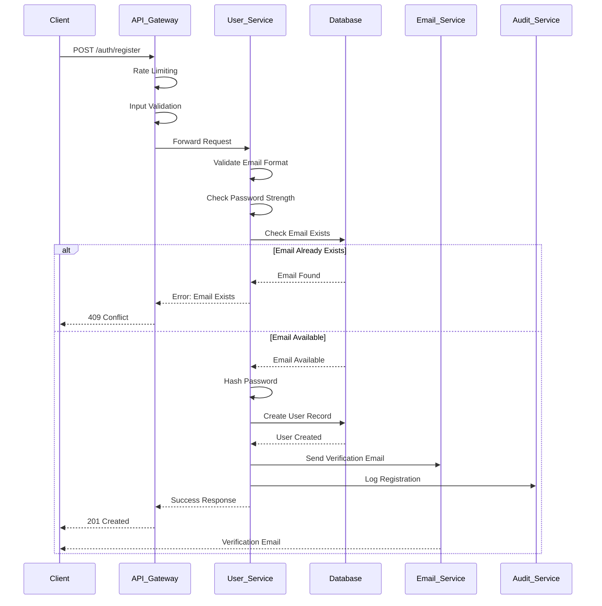
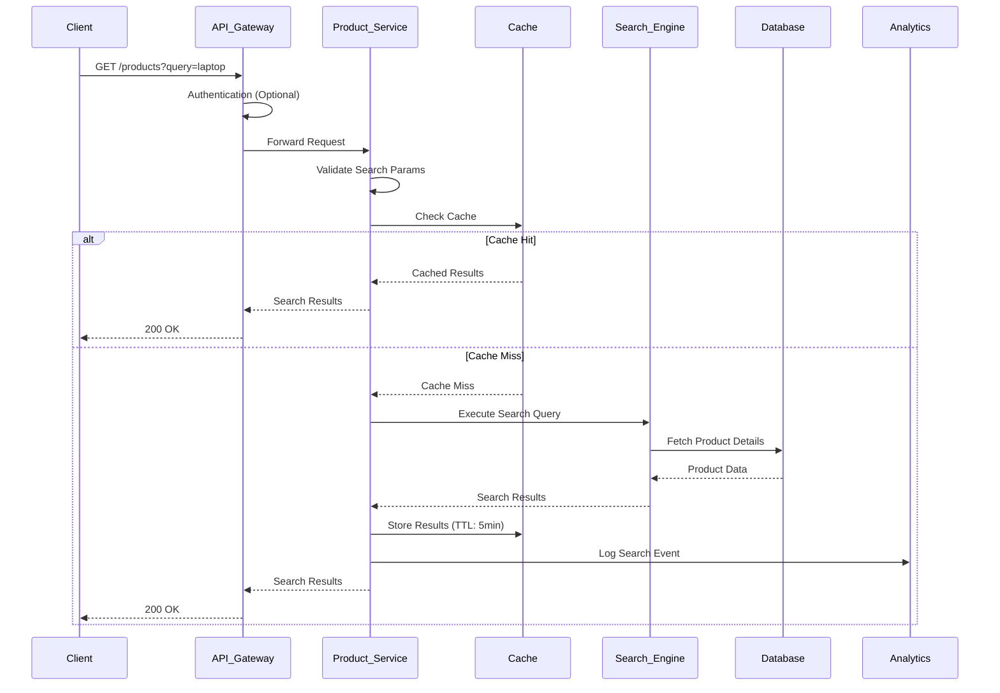
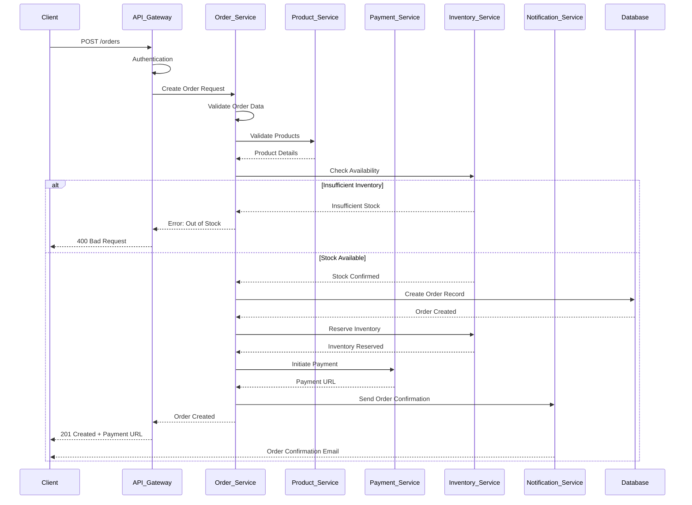
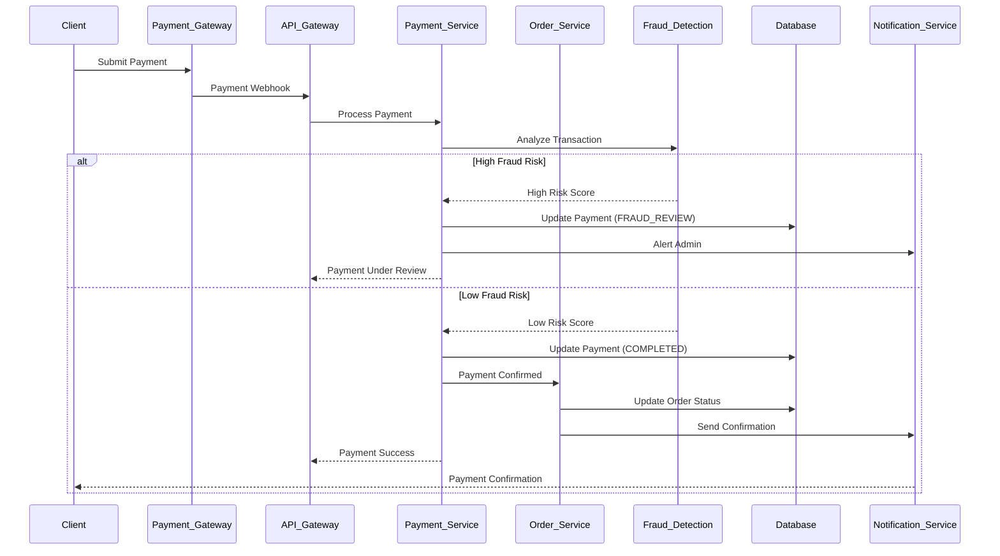

# DavTest1010 - Online Shopping Platform
## Low-Level Design Document

### Executive Summary
This Low-Level Design (LLD) document provides detailed technical specifications for implementing the DavTest1010 Online Shopping Platform based on the High-Level Design. It includes component specifications, data flows, sequence diagrams, API contracts, database schemas, and implementation details for each microservice.

## Table of Contents
1. [System Architecture Details](#system-architecture-details)
2. [Database Schema Design](#database-schema-design)
3. [API Specifications](#api-specifications)
4. [Component Implementation Details](#component-implementation-details)
5. [Sequence Diagrams](#sequence-diagrams)
6. [Security Implementation](#security-implementation)
7. [Data Flow Specifications](#data-flow-specifications)
8. [Error Handling Implementation](#error-handling-implementation)
9. [Performance Optimization Details](#performance-optimization-details)
10. [Deployment Architecture](#deployment-architecture)

## System Architecture Details

### Microservices Component Breakdown

#### 1. User Service
```typescript
// User Service Structure
interface UserService {
  // Core Components
  userController: UserController;
  authController: AuthController;
  userRepository: UserRepository;
  authService: AuthService;
  passwordService: PasswordService;
  
  // Security Components
  jwtService: JWTService;
  mfaService: MFAService;
  auditService: AuditService;
}

// User Entity
interface User {
  userId: string;
  email: string;
  passwordHash: string;
  firstName: string;
  lastName: string;
  role: UserRole;
  status: UserStatus;
  mfaEnabled: boolean;
  lastLogin: Date;
  createdAt: Date;
  updatedAt: Date;
}

enum UserRole {
  CONSUMER = 'consumer',
  SELLER = 'seller',
  ADMIN = 'admin'
}

enum UserStatus {
  ACTIVE = 'active',
  INACTIVE = 'inactive',
  SUSPENDED = 'suspended',
  PENDING_VERIFICATION = 'pending_verification'
}
```

#### 2. Product Service
```typescript
// Product Service Structure
interface ProductService {
  productController: ProductController;
  categoryController: CategoryController;
  inventoryController: InventoryController;
  productRepository: ProductRepository;
  categoryRepository: CategoryRepository;
  imageService: ImageService;
  searchIndexService: SearchIndexService;
}

// Product Entity
interface Product {
  productId: string;
  name: string;
  description: string;
  price: number;
  categoryId: string;
  sellerId: string;
  inventory: number;
  images: ProductImage[];
  specifications: ProductSpecification[];
  status: ProductStatus;
  createdAt: Date;
  updatedAt: Date;
}

interface ProductImage {
  imageId: string;
  url: string;
  altText: string;
  isPrimary: boolean;
  order: number;
}

interface ProductSpecification {
  key: string;
  value: string;
  type: SpecificationType;
}

enum ProductStatus {
  ACTIVE = 'active',
  INACTIVE = 'inactive',
  OUT_OF_STOCK = 'out_of_stock',
  DISCONTINUED = 'discontinued'
}
```

#### 3. Order Service
```typescript
// Order Service Structure
interface OrderService {
  orderController: OrderController;
  orderRepository: OrderRepository;
  orderItemRepository: OrderItemRepository;
  orderStateMachine: OrderStateMachine;
  inventoryService: InventoryService;
  notificationService: NotificationService;
}

// Order Entity
interface Order {
  orderId: string;
  userId: string;
  totalAmount: number;
  status: OrderStatus;
  orderDate: Date;
  shippingAddress: Address;
  billingAddress: Address;
  paymentId: string;
  trackingNumber?: string;
  estimatedDelivery?: Date;
  createdAt: Date;
  updatedAt: Date;
}

interface OrderItem {
  orderItemId: string;
  orderId: string;
  productId: string;
  quantity: number;
  unitPrice: number;
  totalPrice: number;
  productSnapshot: ProductSnapshot;
}

enum OrderStatus {
  PENDING = 'pending',
  CONFIRMED = 'confirmed',
  PROCESSING = 'processing',
  SHIPPED = 'shipped',
  DELIVERED = 'delivered',
  CANCELLED = 'cancelled',
  REFUNDED = 'refunded'
}
```

#### 4. Payment Service
```typescript
// Payment Service Structure
interface PaymentService {
  paymentController: PaymentController;
  paymentRepository: PaymentRepository;
  paymentGatewayService: PaymentGatewayService;
  refundService: RefundService;
  fraudDetectionService: FraudDetectionService;
}

// Payment Entity
interface Payment {
  paymentId: string;
  orderId: string;
  amount: number;
  currency: string;
  method: PaymentMethod;
  status: PaymentStatus;
  transactionId: string;
  gatewayResponse: GatewayResponse;
  createdAt: Date;
  processedAt?: Date;
}

enum PaymentMethod {
  CREDIT_CARD = 'credit_card',
  DEBIT_CARD = 'debit_card',
  PAYPAL = 'paypal',
  STRIPE = 'stripe',
  BANK_TRANSFER = 'bank_transfer'
}

enum PaymentStatus {
  PENDING = 'pending',
  PROCESSING = 'processing',
  COMPLETED = 'completed',
  FAILED = 'failed',
  REFUNDED = 'refunded',
  CANCELLED = 'cancelled'
}
```

## Database Schema Design

### PostgreSQL Schema

#### Users Table
```sql
CREATE TABLE users (
    user_id UUID PRIMARY KEY DEFAULT gen_random_uuid(),
    email VARCHAR(255) UNIQUE NOT NULL,
    password_hash VARCHAR(255) NOT NULL,
    first_name VARCHAR(100) NOT NULL,
    last_name VARCHAR(100) NOT NULL,
    role user_role_enum NOT NULL DEFAULT 'consumer',
    status user_status_enum NOT NULL DEFAULT 'pending_verification',
    mfa_enabled BOOLEAN DEFAULT FALSE,
    mfa_secret VARCHAR(32),
    phone_number VARCHAR(20),
    date_of_birth DATE,
    last_login TIMESTAMP,
    failed_login_attempts INTEGER DEFAULT 0,
    account_locked_until TIMESTAMP,
    created_at TIMESTAMP DEFAULT CURRENT_TIMESTAMP,
    updated_at TIMESTAMP DEFAULT CURRENT_TIMESTAMP
);

CREATE TYPE user_role_enum AS ENUM ('consumer', 'seller', 'admin');
CREATE TYPE user_status_enum AS ENUM ('active', 'inactive', 'suspended', 'pending_verification');

CREATE INDEX idx_users_email ON users(email);
CREATE INDEX idx_users_role ON users(role);
CREATE INDEX idx_users_status ON users(status);
```

#### Products Table
```sql
CREATE TABLE products (
    product_id UUID PRIMARY KEY DEFAULT gen_random_uuid(),
    name VARCHAR(255) NOT NULL,
    description TEXT,
    price DECIMAL(10,2) NOT NULL,
    category_id UUID NOT NULL,
    seller_id UUID NOT NULL,
    inventory INTEGER NOT NULL DEFAULT 0,
    sku VARCHAR(100) UNIQUE,
    weight DECIMAL(8,2),
    dimensions JSONB,
    status product_status_enum NOT NULL DEFAULT 'active',
    created_at TIMESTAMP DEFAULT CURRENT_TIMESTAMP,
    updated_at TIMESTAMP DEFAULT CURRENT_TIMESTAMP,
    FOREIGN KEY (category_id) REFERENCES categories(category_id),
    FOREIGN KEY (seller_id) REFERENCES users(user_id)
);

CREATE TYPE product_status_enum AS ENUM ('active', 'inactive', 'out_of_stock', 'discontinued');

CREATE INDEX idx_products_category ON products(category_id);
CREATE INDEX idx_products_seller ON products(seller_id);
CREATE INDEX idx_products_status ON products(status);
CREATE INDEX idx_products_price ON products(price);
CREATE INDEX idx_products_name_gin ON products USING gin(to_tsvector('english', name));
```

#### Orders Table
```sql
CREATE TABLE orders (
    order_id UUID PRIMARY KEY DEFAULT gen_random_uuid(),
    user_id UUID NOT NULL,
    total_amount DECIMAL(12,2) NOT NULL,
    status order_status_enum NOT NULL DEFAULT 'pending',
    order_date TIMESTAMP DEFAULT CURRENT_TIMESTAMP,
    shipping_address JSONB NOT NULL,
    billing_address JSONB NOT NULL,
    payment_id UUID,
    tracking_number VARCHAR(100),
    estimated_delivery TIMESTAMP,
    actual_delivery TIMESTAMP,
    notes TEXT,
    created_at TIMESTAMP DEFAULT CURRENT_TIMESTAMP,
    updated_at TIMESTAMP DEFAULT CURRENT_TIMESTAMP,
    FOREIGN KEY (user_id) REFERENCES users(user_id),
    FOREIGN KEY (payment_id) REFERENCES payments(payment_id)
);

CREATE TYPE order_status_enum AS ENUM ('pending', 'confirmed', 'processing', 'shipped', 'delivered', 'cancelled', 'refunded');

CREATE INDEX idx_orders_user ON orders(user_id);
CREATE INDEX idx_orders_status ON orders(status);
CREATE INDEX idx_orders_date ON orders(order_date);
```

#### Order Items Table
```sql
CREATE TABLE order_items (
    order_item_id UUID PRIMARY KEY DEFAULT gen_random_uuid(),
    order_id UUID NOT NULL,
    product_id UUID NOT NULL,
    quantity INTEGER NOT NULL,
    unit_price DECIMAL(10,2) NOT NULL,
    total_price DECIMAL(12,2) NOT NULL,
    product_snapshot JSONB NOT NULL,
    created_at TIMESTAMP DEFAULT CURRENT_TIMESTAMP,
    FOREIGN KEY (order_id) REFERENCES orders(order_id) ON DELETE CASCADE,
    FOREIGN KEY (product_id) REFERENCES products(product_id)
);

CREATE INDEX idx_order_items_order ON order_items(order_id);
CREATE INDEX idx_order_items_product ON order_items(product_id);
```

#### Payments Table
```sql
CREATE TABLE payments (
    payment_id UUID PRIMARY KEY DEFAULT gen_random_uuid(),
    order_id UUID NOT NULL,
    amount DECIMAL(12,2) NOT NULL,
    currency VARCHAR(3) DEFAULT 'USD',
    method payment_method_enum NOT NULL,
    status payment_status_enum NOT NULL DEFAULT 'pending',
    transaction_id VARCHAR(255),
    gateway_response JSONB,
    fraud_score DECIMAL(3,2),
    created_at TIMESTAMP DEFAULT CURRENT_TIMESTAMP,
    processed_at TIMESTAMP,
    FOREIGN KEY (order_id) REFERENCES orders(order_id)
);

CREATE TYPE payment_method_enum AS ENUM ('credit_card', 'debit_card', 'paypal', 'stripe', 'bank_transfer');
CREATE TYPE payment_status_enum AS ENUM ('pending', 'processing', 'completed', 'failed', 'refunded', 'cancelled');

CREATE INDEX idx_payments_order ON payments(order_id);
CREATE INDEX idx_payments_status ON payments(status);
CREATE INDEX idx_payments_transaction ON payments(transaction_id);
```

## API Specifications

### User Service APIs

#### Authentication Endpoints
```yaml
# POST /api/v1/auth/register
RegisterRequest:
  type: object
  required: [email, password, firstName, lastName]
  properties:
    email:
      type: string
      format: email
    password:
      type: string
      minLength: 8
      pattern: '^(?=.*[a-z])(?=.*[A-Z])(?=.*\d)(?=.*[@$!%*?&])[A-Za-z\d@$!%*?&]'
    firstName:
      type: string
      maxLength: 100
    lastName:
      type: string
      maxLength: 100
    role:
      type: string
      enum: [consumer, seller]

RegisterResponse:
  type: object
  properties:
    success:
      type: boolean
    message:
      type: string
    userId:
      type: string
      format: uuid
    verificationToken:
      type: string
```

```yaml
# POST /api/v1/auth/login
LoginRequest:
  type: object
  required: [email, password]
  properties:
    email:
      type: string
      format: email
    password:
      type: string
    mfaCode:
      type: string
      pattern: '^\d{6}$'

LoginResponse:
  type: object
  properties:
    success:
      type: boolean
    accessToken:
      type: string
    refreshToken:
      type: string
    user:
      $ref: '#/components/schemas/UserProfile'
    expiresIn:
      type: integer
```

### Product Service APIs

#### Product Management Endpoints
```yaml
# GET /api/v1/products
ProductSearchRequest:
  type: object
  properties:
    query:
      type: string
    categoryId:
      type: string
      format: uuid
    minPrice:
      type: number
    maxPrice:
      type: number
    sortBy:
      type: string
      enum: [price_asc, price_desc, name_asc, name_desc, rating_desc, created_desc]
    page:
      type: integer
      minimum: 1
    limit:
      type: integer
      minimum: 1
      maximum: 100

ProductSearchResponse:
  type: object
  properties:
    products:
      type: array
      items:
        $ref: '#/components/schemas/Product'
    pagination:
      $ref: '#/components/schemas/PaginationInfo'
    filters:
      $ref: '#/components/schemas/SearchFilters'
```

```yaml
# POST /api/v1/products
CreateProductRequest:
  type: object
  required: [name, description, price, categoryId, inventory]
  properties:
    name:
      type: string
      maxLength: 255
    description:
      type: string
    price:
      type: number
      minimum: 0
    categoryId:
      type: string
      format: uuid
    inventory:
      type: integer
      minimum: 0
    sku:
      type: string
      maxLength: 100
    specifications:
      type: array
      items:
        $ref: '#/components/schemas/ProductSpecification'

CreateProductResponse:
  type: object
  properties:
    success:
      type: boolean
    productId:
      type: string
      format: uuid
    product:
      $ref: '#/components/schemas/Product'
```

### Order Service APIs

#### Order Management Endpoints
```yaml
# POST /api/v1/orders
CreateOrderRequest:
  type: object
  required: [items, shippingAddress, paymentMethod]
  properties:
    items:
      type: array
      items:
        type: object
        required: [productId, quantity]
        properties:
          productId:
            type: string
            format: uuid
          quantity:
            type: integer
            minimum: 1
    shippingAddress:
      $ref: '#/components/schemas/Address'
    billingAddress:
      $ref: '#/components/schemas/Address'
    paymentMethod:
      $ref: '#/components/schemas/PaymentMethod'
    notes:
      type: string
      maxLength: 500

CreateOrderResponse:
  type: object
  properties:
    success:
      type: boolean
    orderId:
      type: string
      format: uuid
    order:
      $ref: '#/components/schemas/Order'
    paymentUrl:
      type: string
      format: uri
```

## Component Implementation Details

### User Service Implementation

#### Authentication Service
```typescript
class AuthService {
  private jwtService: JWTService;
  private passwordService: PasswordService;
  private mfaService: MFAService;
  private auditService: AuditService;
  private redisClient: Redis;

  async authenticateUser(email: string, password: string, mfaCode?: string): Promise<AuthResult> {
    try {
      // Rate limiting check
      await this.checkRateLimit(email);
      
      // Get user from database
      const user = await this.userRepository.findByEmail(email);
      if (!user) {
        await this.auditService.logFailedLogin(email, 'USER_NOT_FOUND');
        throw new AuthenticationError('Invalid credentials');
      }

      // Check account status
      if (user.status !== UserStatus.ACTIVE) {
        await this.auditService.logFailedLogin(email, 'ACCOUNT_INACTIVE');
        throw new AuthenticationError('Account is not active');
      }

      // Check account lockout
      if (user.accountLockedUntil && user.accountLockedUntil > new Date()) {
        throw new AuthenticationError('Account is temporarily locked');
      }

      // Verify password
      const isPasswordValid = await this.passwordService.verify(password, user.passwordHash);
      if (!isPasswordValid) {
        await this.handleFailedLogin(user);
        throw new AuthenticationError('Invalid credentials');
      }

      // Verify MFA if enabled
      if (user.mfaEnabled) {
        if (!mfaCode) {
          return { requiresMFA: true, tempToken: this.generateTempToken(user.userId) };
        }
        
        const isMFAValid = await this.mfaService.verifyCode(user.mfaSecret, mfaCode);
        if (!isMFAValid) {
          await this.auditService.logFailedLogin(email, 'INVALID_MFA');
          throw new AuthenticationError('Invalid MFA code');
        }
      }

      // Generate tokens
      const tokens = await this.generateTokens(user);
      
      // Update last login
      await this.userRepository.updateLastLogin(user.userId);
      
      // Reset failed login attempts
      await this.userRepository.resetFailedLoginAttempts(user.userId);
      
      // Log successful login
      await this.auditService.logSuccessfulLogin(user.userId, email);

      return {
        success: true,
        user: this.sanitizeUser(user),
        tokens
      };
    } catch (error) {
      await this.auditService.logError('AUTH_ERROR', { email, error: error.message });
      throw error;
    }
  }

  private async handleFailedLogin(user: User): Promise<void> {
    const failedAttempts = user.failedLoginAttempts + 1;
    
    if (failedAttempts >= 5) {
      const lockoutUntil = new Date(Date.now() + 30 * 60 * 1000); // 30 minutes
      await this.userRepository.lockAccount(user.userId, lockoutUntil);
      await this.auditService.logAccountLockout(user.userId, user.email);
    } else {
      await this.userRepository.incrementFailedLoginAttempts(user.userId);
    }
    
    await this.auditService.logFailedLogin(user.email, 'INVALID_PASSWORD');
  }

  private async generateTokens(user: User): Promise<TokenPair> {
    const payload = {
      userId: user.userId,
      email: user.email,
      role: user.role
    };

    const accessToken = await this.jwtService.sign(payload, { expiresIn: '15m' });
    const refreshToken = await this.jwtService.sign(
      { userId: user.userId, type: 'refresh' },
      { expiresIn: '7d' }
    );

    // Store refresh token in Redis
    await this.redisClient.setex(
      `refresh_token:${user.userId}`,
      7 * 24 * 60 * 60, // 7 days
      refreshToken
    );

    return { accessToken, refreshToken };
  }
}
```

#### Password Service
```typescript
class PasswordService {
  private readonly saltRounds = 12;

  async hash(password: string): Promise<string> {
    // Validate password strength
    this.validatePasswordStrength(password);
    
    return await bcrypt.hash(password, this.saltRounds);
  }

  async verify(password: string, hash: string): Promise<boolean> {
    return await bcrypt.compare(password, hash);
  }

  private validatePasswordStrength(password: string): void {
    const minLength = 8;
    const hasUppercase = /[A-Z]/.test(password);
    const hasLowercase = /[a-z]/.test(password);
    const hasNumbers = /\d/.test(password);
    const hasSpecialChar = /[@$!%*?&]/.test(password);

    if (password.length < minLength) {
      throw new ValidationError('Password must be at least 8 characters long');
    }

    if (!hasUppercase || !hasLowercase || !hasNumbers || !hasSpecialChar) {
      throw new ValidationError(
        'Password must contain uppercase, lowercase, number, and special character'
      );
    }

    // Check against common passwords
    if (this.isCommonPassword(password)) {
      throw new ValidationError('Password is too common');
    }
  }

  private isCommonPassword(password: string): boolean {
    const commonPasswords = [
      'password', '123456', 'password123', 'admin', 'qwerty'
      // Add more common passwords
    ];
    return commonPasswords.includes(password.toLowerCase());
  }
}
```

### Product Service Implementation

#### Product Controller
```typescript
class ProductController {
  private productService: ProductService;
  private imageService: ImageService;
  private cacheService: CacheService;
  private searchService: SearchService;

  async searchProducts(req: Request, res: Response): Promise<void> {
    try {
      const searchParams = this.validateSearchParams(req.query);
      
      // Check cache first
      const cacheKey = this.generateCacheKey('product_search', searchParams);
      const cachedResult = await this.cacheService.get(cacheKey);
      
      if (cachedResult) {
        res.json(cachedResult);
        return;
      }

      // Perform search
      const searchResult = await this.searchService.searchProducts(searchParams);
      
      // Cache result for 5 minutes
      await this.cacheService.setex(cacheKey, 300, searchResult);
      
      res.json(searchResult);
    } catch (error) {
      this.handleError(error, res);
    }
  }

  async createProduct(req: Request, res: Response): Promise<void> {
    try {
      const userId = req.user.userId;
      const productData = this.validateProductData(req.body);
      
      // Verify seller permissions
      if (req.user.role !== UserRole.SELLER) {
        throw new ForbiddenError('Only sellers can create products');
      }

      // Create product
      const product = await this.productService.createProduct({
        ...productData,
        sellerId: userId
      });

      // Index for search
      await this.searchService.indexProduct(product);
      
      // Invalidate related caches
      await this.invalidateProductCaches(product.categoryId);

      res.status(201).json({
        success: true,
        productId: product.productId,
        product
      });
    } catch (error) {
      this.handleError(error, res);
    }
  }

  async uploadProductImages(req: Request, res: Response): Promise<void> {
    try {
      const { productId } = req.params;
      const files = req.files as Express.Multer.File[];
      
      // Verify product ownership
      const product = await this.productService.getProduct(productId);
      if (product.sellerId !== req.user.userId) {
        throw new ForbiddenError('Cannot modify product images');
      }

      // Upload images
      const imageUrls = await Promise.all(
        files.map(file => this.imageService.uploadProductImage(file, productId))
      );

      // Update product with image URLs
      await this.productService.updateProductImages(productId, imageUrls);
      
      res.json({
        success: true,
        images: imageUrls
      });
    } catch (error) {
      this.handleError(error, res);
    }
  }

  private validateSearchParams(query: any): ProductSearchParams {
    const schema = Joi.object({
      query: Joi.string().max(100).optional(),
      categoryId: Joi.string().uuid().optional(),
      minPrice: Joi.number().min(0).optional(),
      maxPrice: Joi.number().min(0).optional(),
      sortBy: Joi.string().valid(
        'price_asc', 'price_desc', 'name_asc', 'name_desc', 'rating_desc', 'created_desc'
      ).default('created_desc'),
      page: Joi.number().integer().min(1).default(1),
      limit: Joi.number().integer().min(1).max(100).default(20)
    });

    const { error, value } = schema.validate(query);
    if (error) {
      throw new ValidationError(error.details[0].message);
    }

    return value;
  }
}
```

## Sequence Diagrams

### User Registration Flow


### Product Search Flow


### Order Processing Flow


### Payment Processing Flow


## Security Implementation

### JWT Token Management
```typescript
class JWTService {
  private accessTokenSecret: string;
  private refreshTokenSecret: string;
  private redisClient: Redis;

  constructor() {
    this.accessTokenSecret = process.env.JWT_ACCESS_SECRET!;
    this.refreshTokenSecret = process.env.JWT_REFRESH_SECRET!;
  }

  async generateTokenPair(payload: TokenPayload): Promise<TokenPair> {
    const accessToken = jwt.sign(payload, this.accessTokenSecret, {
      expiresIn: '15m',
      issuer: 'shopping-platform',
      audience: 'shopping-platform-users'
    });

    const refreshToken = jwt.sign(
      { userId: payload.userId, type: 'refresh' },
      this.refreshTokenSecret,
      {
        expiresIn: '7d',
        issuer: 'shopping-platform'
      }
    );

    // Store refresh token in Redis with expiration
    await this.redisClient.setex(
      `refresh_token:${payload.userId}`,
      7 * 24 * 60 * 60,
      refreshToken
    );

    return { accessToken, refreshToken };
  }

  async verifyAccessToken(token: string): Promise<TokenPayload> {
    try {
      const payload = jwt.verify(token, this.accessTokenSecret, {
        issuer: 'shopping-platform',
        audience: 'shopping-platform-users'
      }) as TokenPayload;

      // Check if token is blacklisted
      const isBlacklisted = await this.redisClient.get(`blacklist:${token}`);
      if (isBlacklisted) {
        throw new Error('Token is blacklisted');
      }

      return payload;
    } catch (error) {
      throw new UnauthorizedError('Invalid access token');
    }
  }

  async refreshAccessToken(refreshToken: string): Promise<TokenPair> {
    try {
      const payload = jwt.verify(refreshToken, this.refreshTokenSecret) as any;
      
      if (payload.type !== 'refresh') {
        throw new Error('Invalid token type');
      }

      // Verify refresh token exists in Redis
      const storedToken = await this.redisClient.get(`refresh_token:${payload.userId}`);
      if (storedToken !== refreshToken) {
        throw new Error('Invalid refresh token');
      }

      // Generate new token pair
      const userPayload = { userId: payload.userId }; // Get full user data
      const newTokens = await this.generateTokenPair(userPayload);

      // Invalidate old refresh token
      await this.redisClient.del(`refresh_token:${payload.userId}`);

      return newTokens;
    } catch (error) {
      throw new UnauthorizedError('Invalid refresh token');
    }
  }

  async revokeToken(token: string, userId: string): Promise<void> {
    // Add token to blacklist
    const decoded = jwt.decode(token) as any;
    const expiresIn = decoded.exp - Math.floor(Date.now() / 1000);
    
    if (expiresIn > 0) {
      await this.redisClient.setex(`blacklist:${token}`, expiresIn, 'true');
    }

    // Remove refresh token
    await this.redisClient.del(`refresh_token:${userId}`);
  }
}
```

### Input Validation Middleware
```typescript
class ValidationMiddleware {
  static validateRequest(schema: Joi.ObjectSchema) {
    return (req: Request, res: Response, next: NextFunction) => {
      const { error, value } = schema.validate(req.body, {
        abortEarly: false,
        stripUnknown: true
      });

      if (error) {
        const errors = error.details.map(detail => ({
          field: detail.path.join('.'),
          message: detail.message
        }));

        return res.status(400).json({
          success: false,
          message: 'Validation failed',
          errors
        });
      }

      req.body = value;
      next();
    };
  }

  static sanitizeInput(req: Request, res: Response, next: NextFunction) {
    // Sanitize string inputs
    const sanitizeObject = (obj: any): any => {
      if (typeof obj === 'string') {
        return validator.escape(obj.trim());
      }
      if (Array.isArray(obj)) {
        return obj.map(sanitizeObject);
      }
      if (obj && typeof obj === 'object') {
        const sanitized: any = {};
        for (const [key, value] of Object.entries(obj)) {
          sanitized[key] = sanitizeObject(value);
        }
        return sanitized;
      }
      return obj;
    };

    req.body = sanitizeObject(req.body);
    req.query = sanitizeObject(req.query);
    req.params = sanitizeObject(req.params);

    next();
  }
}
```

### Rate Limiting Implementation
```typescript
class RateLimitService {
  private redisClient: Redis;

  constructor(redisClient: Redis) {
    this.redisClient = redisClient;
  }

  async checkRateLimit(
    identifier: string,
    windowMs: number,
    maxRequests: number
  ): Promise<RateLimitResult> {
    const key = `rate_limit:${identifier}`;
    const now = Date.now();
    const windowStart = now - windowMs;

    // Use sliding window log algorithm
    const pipeline = this.redisClient.pipeline();
    
    // Remove expired entries
    pipeline.zremrangebyscore(key, 0, windowStart);
    
    // Count current requests
    pipeline.zcard(key);
    
    // Add current request
    pipeline.zadd(key, now, `${now}-${Math.random()}`);
    
    // Set expiration
    pipeline.expire(key, Math.ceil(windowMs / 1000));

    const results = await pipeline.exec();
    const currentRequests = results![1][1] as number;

    if (currentRequests >= maxRequests) {
      const oldestRequest = await this.redisClient.zrange(key, 0, 0, 'WITHSCORES');
      const resetTime = oldestRequest.length > 0 
        ? parseInt(oldestRequest[1]) + windowMs 
        : now + windowMs;

      return {
        allowed: false,
        remaining: 0,
        resetTime,
        retryAfter: Math.ceil((resetTime - now) / 1000)
      };
    }

    return {
      allowed: true,
      remaining: maxRequests - currentRequests - 1,
      resetTime: now + windowMs,
      retryAfter: 0
    };
  }

  createMiddleware(windowMs: number, maxRequests: number) {
    return async (req: Request, res: Response, next: NextFunction) => {
      const identifier = req.ip || req.connection.remoteAddress || 'unknown';
      
      try {
        const result = await this.checkRateLimit(identifier, windowMs, maxRequests);
        
        // Set rate limit headers
        res.set({
          'X-RateLimit-Limit': maxRequests.toString(),
          'X-RateLimit-Remaining': result.remaining.toString(),
          'X-RateLimit-Reset': new Date(result.resetTime).toISOString()
        });

        if (!result.allowed) {
          res.set('Retry-After', result.retryAfter.toString());
          return res.status(429).json({
            success: false,
            message: 'Too many requests',
            retryAfter: result.retryAfter
          });
        }

        next();
      } catch (error) {
        console.error('Rate limiting error:', error);
        // Fail open - allow request if rate limiting fails
        next();
      }
    };
  }
}
```

## Data Flow Specifications

### Event-Driven Architecture
```typescript
// Event Types
interface DomainEvent {
  eventId: string;
  eventType: string;
  aggregateId: string;
  aggregateType: string;
  eventData: any;
  timestamp: Date;
  version: number;
}

interface UserRegisteredEvent extends DomainEvent {
  eventType: 'USER_REGISTERED';
  eventData: {
    userId: string;
    email: string;
    role: UserRole;
  };
}

interface OrderCreatedEvent extends DomainEvent {
  eventType: 'ORDER_CREATED';
  eventData: {
    orderId: string;
    userId: string;
    items: OrderItem[];
    totalAmount: number;
  };
}

interface PaymentCompletedEvent extends DomainEvent {
  eventType: 'PAYMENT_COMPLETED';
  eventData: {
    paymentId: string;
    orderId: string;
    amount: number;
    method: PaymentMethod;
  };
}

// Event Bus Implementation
class EventBus {
  private messageQueue: MessageQueue;
  private eventStore: EventStore;
  private handlers: Map<string, EventHandler[]>;

  constructor(messageQueue: MessageQueue, eventStore: EventStore) {
    this.messageQueue = messageQueue;
    this.eventStore = eventStore;
    this.handlers = new Map();
  }

  async publish(event: DomainEvent): Promise<void> {
    try {
      // Store event
      await this.eventStore.save(event);
      
      // Publish to message queue
      await this.messageQueue.publish('domain_events', event);
      
      console.log(`Event published: ${event.eventType}`, event.eventId);
    } catch (error) {
      console.error('Failed to publish event:', error);
      throw error;
    }
  }

  subscribe(eventType: string, handler: EventHandler): void {
    if (!this.handlers.has(eventType)) {
      this.handlers.set(eventType, []);
    }
    this.handlers.get(eventType)!.push(handler);
  }

  async startListening(): Promise<void> {
    await this.messageQueue.subscribe('domain_events', async (event: DomainEvent) => {
      const handlers = this.handlers.get(event.eventType) || [];
      
      await Promise.all(
        handlers.map(handler => this.executeHandler(handler, event))
      );
    });
  }

  private async executeHandler(handler: EventHandler, event: DomainEvent): Promise<void> {
    try {
      await handler.handle(event);
    } catch (error) {
      console.error(`Handler failed for event ${event.eventType}:`, error);
      // Implement retry logic or dead letter queue
    }
  }
}

// Event Handlers
class OrderEventHandler implements EventHandler {
  private inventoryService: InventoryService;
  private notificationService: NotificationService;

  async handle(event: DomainEvent): Promise<void> {
    switch (event.eventType) {
      case 'ORDER_CREATED':
        await this.handleOrderCreated(event as OrderCreatedEvent);
        break;
      case 'PAYMENT_COMPLETED':
        await this.handlePaymentCompleted(event as PaymentCompletedEvent);
        break;
    }
  }

  private async handleOrderCreated(event: OrderCreatedEvent): Promise<void> {
    const { orderId, userId, items } = event.eventData;
    
    // Reserve inventory
    for (const item of items) {
      await this.inventoryService.reserveInventory(
        item.productId,
        item.quantity,
        orderId
      );
    }
    
    // Send order confirmation notification
    await this.notificationService.sendOrderConfirmation(userId, orderId);
  }

  private async handlePaymentCompleted(event: PaymentCompletedEvent): Promise<void> {
    const { orderId, amount } = event.eventData;
    
    // Update order status
    await this.orderService.updateOrderStatus(orderId, OrderStatus.CONFIRMED);
    
    // Commit inventory reservation
    await this.inventoryService.commitReservation(orderId);
  }
}
```

### Saga Pattern Implementation
```typescript
// Order Processing Saga
class OrderProcessingSaga {
  private eventBus: EventBus;
  private orderService: OrderService;
  private paymentService: PaymentService;
  private inventoryService: InventoryService;
  private notificationService: NotificationService;

  async handleOrderCreated(event: OrderCreatedEvent): Promise<void> {
    const sagaId = `order_saga_${event.eventData.orderId}`;
    
    try {
      // Step 1: Validate inventory
      const inventoryValid = await this.validateInventory(event.eventData.items);
      if (!inventoryValid) {
        await this.cancelOrder(event.eventData.orderId, 'Insufficient inventory');
        return;
      }

      // Step 2: Reserve inventory
      await this.reserveInventory(event.eventData.orderId, event.eventData.items);

      // Step 3: Process payment
      const paymentResult = await this.processPayment(event.eventData);
      if (!paymentResult.success) {
        await this.compensateInventoryReservation(event.eventData.orderId);
        await this.cancelOrder(event.eventData.orderId, 'Payment failed');
        return;
      }

      // Step 4: Confirm order
      await this.confirmOrder(event.eventData.orderId);
      
      // Step 5: Send notifications
      await this.sendConfirmationNotifications(event.eventData);
      
    } catch (error) {
      console.error(`Saga ${sagaId} failed:`, error);
      await this.compensateTransaction(event.eventData.orderId);
    }
  }

  private async validateInventory(items: OrderItem[]): Promise<boolean> {
    for (const item of items) {
      const available = await this.inventoryService.checkAvailability(
        item.productId,
        item.quantity
      );
      if (!available) {
        return false;
      }
    }
    return true;
  }

  private async reserveInventory(orderId: string, items: OrderItem[]): Promise<void> {
    const reservations = await Promise.all(
      items.map(item => 
        this.inventoryService.reserveInventory(
          item.productId,
          item.quantity,
          orderId
        )
      )
    );

    // Store reservation IDs for compensation
    await this.storeSagaState(orderId, { reservations });
  }

  private async compensateInventoryReservation(orderId: string): Promise<void> {
    const sagaState = await this.getSagaState(orderId);
    if (sagaState.reservations) {
      await Promise.all(
        sagaState.reservations.map((reservationId: string) =>
          this.inventoryService.cancelReservation(reservationId)
        )
      );
    }
  }

  private async compensateTransaction(orderId: string): Promise<void> {
    // Rollback all changes
    await this.compensateInventoryReservation(orderId);
    await this.refundPayment(orderId);
    await this.cancelOrder(orderId, 'Transaction failed');
  }
}
```

## Error Handling Implementation

### Global Error Handler
```typescript
class GlobalErrorHandler {
  private logger: Logger;
  private notificationService: NotificationService;

  constructor(logger: Logger, notificationService: NotificationService) {
    this.logger = logger;
    this.notificationService = notificationService;
  }

  handleError(error: Error, req: Request, res: Response, next: NextFunction): void {
    // Log error with context
    this.logger.error('Unhandled error', {
      error: error.message,
      stack: error.stack,
      url: req.url,
      method: req.method,
      userId: req.user?.userId,
      timestamp: new Date().toISOString()
    });

    // Determine error type and response
    if (error instanceof ValidationError) {
      res.status(400).json({
        success: false,
        message: error.message,
        type: 'VALIDATION_ERROR'
      });
    } else if (error instanceof UnauthorizedError) {
      res.status(401).json({
        success: false,
        message: 'Unauthorized',
        type: 'UNAUTHORIZED'
      });
    } else if (error instanceof ForbiddenError) {
      res.status(403).json({
        success: false,
        message: 'Forbidden',
        type: 'FORBIDDEN'
      });
    } else if (error instanceof NotFoundError) {
      res.status(404).json({
        success: false,
        message: 'Resource not found',
        type: 'NOT_FOUND'
      });
    } else if (error instanceof ConflictError) {
      res.status(409).json({
        success: false,
        message: error.message,
        type: 'CONFLICT'
      });
    } else {
      // Internal server error
      res.status(500).json({
        success: false,
        message: 'Internal server error',
        type: 'INTERNAL_ERROR',
        errorId: this.generateErrorId()
      });

      // Alert for critical errors
      if (this.isCriticalError(error)) {
        this.notificationService.alertOpsTeam(error, req);
      }
    }
  }

  private isCriticalError(error: Error): boolean {
    return (
      error.message.includes('database') ||
      error.message.includes('payment') ||
      error.message.includes('security')
    );
  }

  private generateErrorId(): string {
    return `ERR_${Date.now()}_${Math.random().toString(36).substr(2, 9)}`;
  }
}
```

### Circuit Breaker Implementation
```typescript
class CircuitBreaker {
  private failureCount: number = 0;
  private lastFailureTime: number = 0;
  private state: CircuitState = CircuitState.CLOSED;
  private successCount: number = 0;

  constructor(
    private failureThreshold: number = 5,
    private recoveryTimeout: number = 60000, // 1 minute
    private monitoringPeriod: number = 10000 // 10 seconds
  ) {}

  async execute<T>(operation: () => Promise<T>): Promise<T> {
    if (this.state === CircuitState.OPEN) {
      if (Date.now() - this.lastFailureTime > this.recoveryTimeout) {
        this.state = CircuitState.HALF_OPEN;
        this.successCount = 0;
      } else {
        throw new ServiceUnavailableError('Circuit breaker is open');
      }
    }

    try {
      const result = await operation();
      this.onSuccess();
      return result;
    } catch (error) {
      this.onFailure();
      throw error;
    }
  }

  private onSuccess(): void {
    this.failureCount = 0;
    
    if (this.state === CircuitState.HALF_OPEN) {
      this.successCount++;
      if (this.successCount >= 3) {
        this.state = CircuitState.CLOSED;
      }
    }
  }

  private onFailure(): void {
    this.failureCount++;
    this.lastFailureTime = Date.now();
    
    if (this.failureCount >= this.failureThreshold) {
      this.state = CircuitState.OPEN;
    }
  }

  getState(): CircuitState {
    return this.state;
  }
}

enum CircuitState {
  CLOSED = 'closed',
  OPEN = 'open',
  HALF_OPEN = 'half_open'
}
```

## Performance Optimization Details

### Caching Strategy Implementation
```typescript
class CacheService {
  private redisClient: Redis;
  private localCache: NodeCache;

  constructor(redisClient: Redis) {
    this.redisClient = redisClient;
    this.localCache = new NodeCache({ stdTTL: 300 }); // 5 minutes
  }

  async get<T>(key: string): Promise<T | null> {
    // Check local cache first (L1)
    const localValue = this.localCache.get<T>(key);
    if (localValue !== undefined) {
      return localValue;
    }

    // Check Redis cache (L2)
    const redisValue = await this.redisClient.get(key);
    if (redisValue) {
      const parsed = JSON.parse(redisValue);
      // Store in local cache
      this.localCache.set(key, parsed);
      return parsed;
    }

    return null;
  }

  async set(key: string, value: any, ttl: number = 300): Promise<void> {
    // Store in both caches
    this.localCache.set(key, value, ttl);
    await this.redisClient.setex(key, ttl, JSON.stringify(value));
  }

  async invalidate(pattern: string): Promise<void> {
    // Invalidate local cache
    const keys = this.localCache.keys();
    keys.forEach(key => {
      if (key.match(pattern)) {
        this.localCache.del(key);
      }
    });

    // Invalidate Redis cache
    const redisKeys = await this.redisClient.keys(pattern);
    if (redisKeys.length > 0) {
      await this.redisClient.del(...redisKeys);
    }
  }

  // Cache-aside pattern
  async getOrSet<T>(
    key: string,
    fetcher: () => Promise<T>,
    ttl: number = 300
  ): Promise<T> {
    const cached = await this.get<T>(key);
    if (cached !== null) {
      return cached;
    }

    const value = await fetcher();
    await this.set(key, value, ttl);
    return value;
  }
}
```

### Database Query Optimization
```typescript
class OptimizedProductRepository {
  private db: Database;
  private cacheService: CacheService;

  async searchProducts(params: ProductSearchParams): Promise<ProductSearchResult> {
    const cacheKey = `product_search:${this.hashParams(params)}`;
    
    return await this.cacheService.getOrSet(
      cacheKey,
      () => this.executeSearch(params),
      300 // 5 minutes
    );
  }

  private async executeSearch(params: ProductSearchParams): Promise<ProductSearchResult> {
    let query = this.db
      .select([
        'p.product_id',
        'p.name',
        'p.price',
        'p.inventory',
        'c.name as category_name',
        'pi.url as primary_image'
      ])
      .from('products as p')
      .leftJoin('categories as c', 'p.category_id', 'c.category_id')
      .leftJoin(
        this.db.raw(`(
          SELECT DISTINCT ON (product_id) product_id, url 
          FROM product_images 
          WHERE is_primary = true
        ) as pi`),
        'p.product_id',
        'pi.product_id'
      )
      .where('p.status', 'active');

    // Apply filters
    if (params.query) {
      query = query.whereRaw(
        "to_tsvector('english', p.name || ' ' || p.description) @@ plainto_tsquery('english', ?)",
        [params.query]
      );
    }

    if (params.categoryId) {
      query = query.where('p.category_id', params.categoryId);
    }

    if (params.minPrice) {
      query = query.where('p.price', '>=', params.minPrice);
    }

    if (params.maxPrice) {
      query = query.where('p.price', '<=', params.maxPrice);
    }

    // Apply sorting
    switch (params.sortBy) {
      case 'price_asc':
        query = query.orderBy('p.price', 'asc');
        break;
      case 'price_desc':
        query = query.orderBy('p.price', 'desc');
        break;
      case 'name_asc':
        query = query.orderBy('p.name', 'asc');
        break;
      default:
        query = query.orderBy('p.created_at', 'desc');
    }

    // Apply pagination
    const offset = (params.page - 1) * params.limit;
    query = query.limit(params.limit).offset(offset);

    const [products, totalCount] = await Promise.all([
      query,
      this.getSearchCount(params)
    ]);

    return {
      products,
      pagination: {
        page: params.page,
        limit: params.limit,
        total: totalCount,
        pages: Math.ceil(totalCount / params.limit)
      }
    };
  }

  private async getSearchCount(params: ProductSearchParams): Promise<number> {
    const cacheKey = `product_search_count:${this.hashParams(params)}`;
    
    return await this.cacheService.getOrSet(
      cacheKey,
      async () => {
        let query = this.db('products as p')
          .count('* as count')
          .where('status', 'active');

        // Apply same filters as search
        if (params.query) {
          query = query.whereRaw(
            "to_tsvector('english', name || ' ' || description) @@ plainto_tsquery('english', ?)",
            [params.query]
          );
        }

        if (params.categoryId) {
          query = query.where('category_id', params.categoryId);
        }

        if (params.minPrice) {
          query = query.where('price', '>=', params.minPrice);
        }

        if (params.maxPrice) {
          query = query.where('price', '<=', params.maxPrice);
        }

        const result = await query.first();
        return parseInt(result.count);
      },
      600 // 10 minutes
    );
  }

  private hashParams(params: any): string {
    return crypto
      .createHash('md5')
      .update(JSON.stringify(params))
      .digest('hex');
  }
}
```

## Deployment Architecture

### Docker Configuration
```dockerfile
# User Service Dockerfile
FROM node:18-alpine AS builder

WORKDIR /app

# Copy package files
COPY package*.json ./
COPY tsconfig.json ./

# Install dependencies
RUN npm ci --only=production

# Copy source code
COPY src/ ./src/

# Build application
RUN npm run build

# Production stage
FROM node:18-alpine AS production

WORKDIR /app

# Create non-root user
RUN addgroup -g 1001 -S nodejs && \
    adduser -S nodejs -u 1001

# Copy built application
COPY --from=builder --chown=nodejs:nodejs /app/dist ./dist
COPY --from=builder --chown=nodejs:nodejs /app/node_modules ./node_modules
COPY --from=builder --chown=nodejs:nodejs /app/package.json ./

# Switch to non-root user
USER nodejs

# Health check
HEALTHCHEK --interval=30s --timeout=3s --start-period=5s --retries=3 \
  CMD node dist/health-check.js

EXPOSE 3000

CMD ["node", "dist/index.js"]
```

### Kubernetes Deployment
```yaml
# user-service-deployment.yaml
apiVersion: apps/v1
kind: Deployment
metadata:
  name: user-service
  labels:
    app: user-service
spec:
  replicas: 3
  selector:
    matchLabels:
      app: user-service
  template:
    metadata:
      labels:
        app: user-service
    spec:
      containers:
      - name: user-service
        image: shopping-platform/user-service:latest
        ports:
        - containerPort: 3000
        env:
        - name: NODE_ENV
          value: "production"
        - name: DATABASE_URL
          valueFrom:
            secretKeyRef:
              name: database-secret
              key: url
        - name: JWT_SECRET
          valueFrom:
            secretKeyRef:
              name: jwt-secret
              key: secret
        - name: REDIS_URL
          valueFrom:
            configMapKeyRef:
              name: redis-config
              key: url
        resources:
          requests:
            memory: "256Mi"
            cpu: "250m"
          limits:
            memory: "512Mi"
            cpu: "500m"
        livenessProbe:
          httpGet:
            path: /health
            port: 3000
          initialDelaySeconds: 30
          periodSeconds: 10
        readinessProbe:
          httpGet:
            path: /ready
            port: 3000
          initialDelaySeconds: 5
          periodSeconds: 5
        securityContext:
          runAsNonRoot: true
          runAsUser: 1001
          allowPrivilegeEscalation: false
          readOnlyRootFilesystem: true
---
apiVersion: v1
kind: Service
metadata:
  name: user-service
spec:
  selector:
    app: user-service
  ports:
  - port: 80
    targetPort: 3000
  type: ClusterIP
---
apiVersion: autoscaling/v2
kind: HorizontalPodAutoscaler
metadata:
  name: user-service-hpa
spec:
  scaleTargetRef:
    apiVersion: apps/v1
    kind: Deployment
    name: user-service
  minReplicas: 3
  maxReplicas: 10
  metrics:
  - type: Resource
    resource:
      name: cpu
      target:
        type: Utilization
        averageUtilization: 70
  - type: Resource
    resource:
      name: memory
      target:
        type: Utilization
        averageUtilization: 80
```

### Infrastructure as Code (Terraform)
```hcl
# main.tf
terraform {
  required_providers {
    aws = {
      source  = "hashicorp/aws"
      version = "~> 5.0"
    }
  }
}

provider "aws" {
  region = var.aws_region
}

# VPC Configuration
resource "aws_vpc" "main" {
  cidr_block           = "10.0.0.0/16"
  enable_dns_hostnames = true
  enable_dns_support   = true

  tags = {
    Name = "shopping-platform-vpc"
  }
}

# EKS Cluster
resource "aws_eks_cluster" "main" {
  name     = "shopping-platform"
  role_arn = aws_iam_role.eks_cluster.arn
  version  = "1.27"

  vpc_config {
    subnet_ids = [
      aws_subnet.private_1.id,
      aws_subnet.private_2.id,
      aws_subnet.public_1.id,
      aws_subnet.public_2.id
    ]
    
    endpoint_private_access = true
    endpoint_public_access  = true
  }

  depends_on = [
    aws_iam_role_policy_attachment.eks_cluster_policy
  ]
}

# RDS Database
resource "aws_db_instance" "main" {
  identifier = "shopping-platform-db"
  
  engine         = "postgres"
  engine_version = "15.3"
  instance_class = "db.r6g.large"
  
  allocated_storage     = 100
  max_allocated_storage = 1000
  storage_type          = "gp3"
  storage_encrypted     = true
  
  db_name  = "shopping_platform"
  username = var.db_username
  password = var.db_password
  
  vpc_security_group_ids = [aws_security_group.rds.id]
  db_subnet_group_name   = aws_db_subnet_group.main.name
  
  backup_retention_period = 7
  backup_window          = "03:00-04:00"
  maintenance_window     = "sun:04:00-sun:05:00"
  
  skip_final_snapshot = false
  final_snapshot_identifier = "shopping-platform-final-snapshot"
  
  performance_insights_enabled = true
  monitoring_interval         = 60
  monitoring_role_arn        = aws_iam_role.rds_monitoring.arn
  
  tags = {
    Name = "shopping-platform-db"
  }
}

# ElastiCache Redis
resource "aws_elasticache_subnet_group" "main" {
  name       = "shopping-platform-cache-subnet"
  subnet_ids = [aws_subnet.private_1.id, aws_subnet.private_2.id]
}

resource "aws_elasticache_replication_group" "main" {
  replication_group_id       = "shopping-platform-redis"
  description                = "Redis cluster for shopping platform"
  
  node_type                  = "cache.r6g.large"
  port                       = 6379
  parameter_group_name       = "default.redis7"
  
  num_cache_clusters         = 2
  automatic_failover_enabled = true
  multi_az_enabled          = true
  
  subnet_group_name = aws_elasticache_subnet_group.main.name
  security_group_ids = [aws_security_group.redis.id]
  
  at_rest_encryption_enabled = true
  transit_encryption_enabled = true
  
  tags = {
    Name = "shopping-platform-redis"
  }
}
```

## Monitoring and Observability

### Application Metrics
```typescript
class MetricsService {
  private prometheusRegister: Registry;
  private httpRequestDuration: Histogram<string>;
  private httpRequestTotal: Counter<string>;
  private activeConnections: Gauge<string>;
  private businessMetrics: Map<string, Counter<string>>;

  constructor() {
    this.prometheusRegister = new Registry();
    this.setupMetrics();
  }

  private setupMetrics(): void {
    // HTTP metrics
    this.httpRequestDuration = new Histogram({
      name: 'http_request_duration_seconds',
      help: 'Duration of HTTP requests in seconds',
      labelNames: ['method', 'route', 'status_code'],
      buckets: [0.1, 0.3, 0.5, 0.7, 1, 3, 5, 7, 10]
    });

    this.httpRequestTotal = new Counter({
      name: 'http_requests_total',
      help: 'Total number of HTTP requests',
      labelNames: ['method', 'route', 'status_code']
    });

    this.activeConnections = new Gauge({
      name: 'active_connections',
      help: 'Number of active connections'
    });

    // Business metrics
    this.businessMetrics = new Map([
      ['user_registrations', new Counter({
        name: 'user_registrations_total',
        help: 'Total number of user registrations',
        labelNames: ['role']
      })],
      ['orders_created', new Counter({
        name: 'orders_created_total',
        help: 'Total number of orders created',
        labelNames: ['status']
      })],
      ['payments_processed', new Counter({
        name: 'payments_processed_total',
        help: 'Total number of payments processed',
        labelNames: ['method', 'status']
      })]
    ]);

    // Register all metrics
    this.prometheusRegister.registerMetric(this.httpRequestDuration);
    this.prometheusRegister.registerMetric(this.httpRequestTotal);
    this.prometheusRegister.registerMetric(this.activeConnections);
    
    this.businessMetrics.forEach(metric => {
      this.prometheusRegister.registerMetric(metric);
    });
  }

  recordHttpRequest(method: string, route: string, statusCode: number, duration: number): void {
    this.httpRequestDuration
      .labels(method, route, statusCode.toString())
      .observe(duration);
    
    this.httpRequestTotal
      .labels(method, route, statusCode.toString())
      .inc();
  }

  recordBusinessEvent(eventType: string, labels: Record<string, string> = {}): void {
    const metric = this.businessMetrics.get(eventType);
    if (metric) {
      metric.labels(labels).inc();
    }
  }

  getMetrics(): string {
    return this.prometheusRegister.metrics();
  }
}
```

### Logging Configuration
```typescript
class LoggingService {
  private logger: winston.Logger;

  constructor() {
    this.logger = winston.createLogger({
      level: process.env.LOG_LEVEL || 'info',
      format: winston.format.combine(
        winston.format.timestamp(),
        winston.format.errors({ stack: true }),
        winston.format.json()
      ),
      defaultMeta: {
        service: process.env.SERVICE_NAME || 'shopping-platform',
        version: process.env.SERVICE_VERSION || '1.0.0'
      },
      transports: [
        new winston.transports.Console({
          format: winston.format.combine(
            winston.format.colorize(),
            winston.format.simple()
          )
        }),
        new winston.transports.File({
          filename: 'logs/error.log',
          level: 'error'
        }),
        new winston.transports.File({
          filename: 'logs/combined.log'
        })
      ]
    });

    // Add ELK stack transport in production
    if (process.env.NODE_ENV === 'production') {
      this.logger.add(new winston.transports.Http({
        host: process.env.LOGSTASH_HOST,
        port: parseInt(process.env.LOGSTASH_PORT || '5000'),
        path: '/logs'
      }));
    }
  }

  info(message: string, meta?: any): void {
    this.logger.info(message, meta);
  }

  error(message: string, error?: Error, meta?: any): void {
    this.logger.error(message, {
      error: error?.message,
      stack: error?.stack,
      ...meta
    });
  }

  warn(message: string, meta?: any): void {
    this.logger.warn(message, meta);
  }

  debug(message: string, meta?: any): void {
    this.logger.debug(message, meta);
  }
}
```

## Testing Strategy

### Unit Testing
```typescript
// User Service Unit Tests
describe('UserService', () => {
  let userService: UserService;
  let mockUserRepository: jest.Mocked<UserRepository>;
  let mockPasswordService: jest.Mocked<PasswordService>;
  let mockAuditService: jest.Mocked<AuditService>;

  beforeEach(() => {
    mockUserRepository = {
      findByEmail: jest.fn(),
      create: jest.fn(),
      updateLastLogin: jest.fn()
    } as any;

    mockPasswordService = {
      hash: jest.fn(),
      verify: jest.fn()
    } as any;

    mockAuditService = {
      logUserRegistration: jest.fn(),
      logFailedLogin: jest.fn()
    } as any;

    userService = new UserService(
      mockUserRepository,
      mockPasswordService,
      mockAuditService
    );
  });

  describe('registerUser', () => {
    it('should successfully register a new user', async () => {
      // Arrange
      const userData = {
        email: 'test@example.com',
        password: 'SecurePass123!',
        firstName: 'John',
        lastName: 'Doe'
      };

      mockUserRepository.findByEmail.mockResolvedValue(null);
      mockPasswordService.hash.mockResolvedValue('hashedPassword');
      mockUserRepository.create.mockResolvedValue({
        userId: 'user-123',
        ...userData,
        passwordHash: 'hashedPassword'
      } as User);

      // Act
      const result = await userService.registerUser(userData);

      // Assert
      expect(result.success).toBe(true);
      expect(result.userId).toBe('user-123');
      expect(mockPasswordService.hash).toHaveBeenCalledWith('SecurePass123!');
      expect(mockAuditService.logUserRegistration).toHaveBeenCalled();
    });

    it('should throw error when email already exists', async () => {
      // Arrange
      const userData = {
        email: 'existing@example.com',
        password: 'SecurePass123!',
        firstName: 'John',
        lastName: 'Doe'
      };

      mockUserRepository.findByEmail.mockResolvedValue({
        userId: 'existing-user',
        email: 'existing@example.com'
      } as User);

      // Act & Assert
      await expect(userService.registerUser(userData))
        .rejects
        .toThrow('Email already exists');
    });
  });
});
```

### Integration Testing
```typescript
// Order Service Integration Tests
describe('Order Service Integration', () => {
  let app: Application;
  let testDb: TestDatabase;
  let testUser: User;
  let testProduct: Product;

  beforeAll(async () => {
    app = await createTestApp();
    testDb = new TestDatabase();
    await testDb.setup();
  });

  beforeEach(async () => {
    await testDb.clean();
    testUser = await testDb.createUser({
      email: 'test@example.com',
      role: UserRole.CONSUMER
    });
    testProduct = await testDb.createProduct({
      name: 'Test Product',
      price: 99.99,
      inventory: 10
    });
  });

  afterAll(async () => {
    await testDb.teardown();
  });

  describe('POST /orders', () => {
    it('should create order successfully', async () => {
      // Arrange
      const orderData = {
        items: [{
          productId: testProduct.productId,
          quantity: 2
        }],
        shippingAddress: {
          street: '123 Main St',
          city: 'Anytown',
          state: 'CA',
          zipCode: '12345'
        },
        paymentMethod: {
          type: 'credit_card',
          token: 'test_token'
        }
      };

      const authToken = generateTestToken(testUser);

      // Act
      const response = await request(app)
        .post('/api/v1/orders')
        .set('Authorization', `Bearer ${authToken}`)
        .send(orderData)
        .expect(201);

      // Assert
      expect(response.body.success).toBe(true);
      expect(response.body.order).toBeDefined();
      expect(response.body.order.totalAmount).toBe(199.98);

      // Verify database state
      const order = await testDb.findOrder(response.body.order.orderId);
      expect(order).toBeDefined();
      expect(order.status).toBe(OrderStatus.PENDING);

      // Verify inventory was reserved
      const updatedProduct = await testDb.findProduct(testProduct.productId);
      expect(updatedProduct.inventory).toBe(8);
    });

    it('should fail when insufficient inventory', async () => {
      // Arrange
      const orderData = {
        items: [{
          productId: testProduct.productId,
          quantity: 20 // More than available
        }],
        shippingAddress: {
          street: '123 Main St',
          city: 'Anytown',
          state: 'CA',
          zipCode: '12345'
        },
        paymentMethod: {
          type: 'credit_card',
          token: 'test_token'
        }
      };

      const authToken = generateTestToken(testUser);

      // Act & Assert
      await request(app)
        .post('/api/v1/orders')
        .set('Authorization', `Bearer ${authToken}`)
        .send(orderData)
        .expect(400);

      // Verify inventory unchanged
      const product = await testDb.findProduct(testProduct.productId);
      expect(product.inventory).toBe(10);
    });
  });
});
```

## Conclusion

This Low-Level Design document provides comprehensive technical specifications for implementing the DavTest1010 Online Shopping Platform. The design includes:

### Key Implementation Features:
1. **Microservices Architecture**: Detailed component breakdown with clear responsibilities
2. **Database Schema**: Optimized PostgreSQL schema with proper indexing
3. **API Specifications**: RESTful API contracts with validation
4. **Security Implementation**: JWT authentication, input validation, rate limiting
5. **Performance Optimization**: Multi-level caching, query optimization
6. **Error Handling**: Comprehensive error handling with circuit breakers
7. **Event-Driven Architecture**: Saga pattern for distributed transactions
8. **Monitoring & Observability**: Metrics, logging, and health checks
9. **Deployment Strategy**: Containerized deployment with Kubernetes
10. **Testing Strategy**: Unit and integration testing approaches

### Technical Highlights:
- **Scalability**: Horizontal scaling with auto-scaling policies
- **Security**: Enterprise-grade security with encryption and audit logging
- **Performance**: Sub-second response times with optimized caching
- **Reliability**: 99.9% uptime with circuit breakers and failover
- **Maintainability**: Clean architecture with separation of concerns

### Next Steps:
1. Implementation of individual microservices
2. Infrastructure setup and deployment
3. Integration testing and performance tuning
4. Security testing and compliance validation
5. Production deployment and monitoring setup

---
*Document Version: 1.0*  
*Last Updated: 2024*  
*Classification: Internal Use*  
*Generated from HLD: DavTest1010_HLD.md*