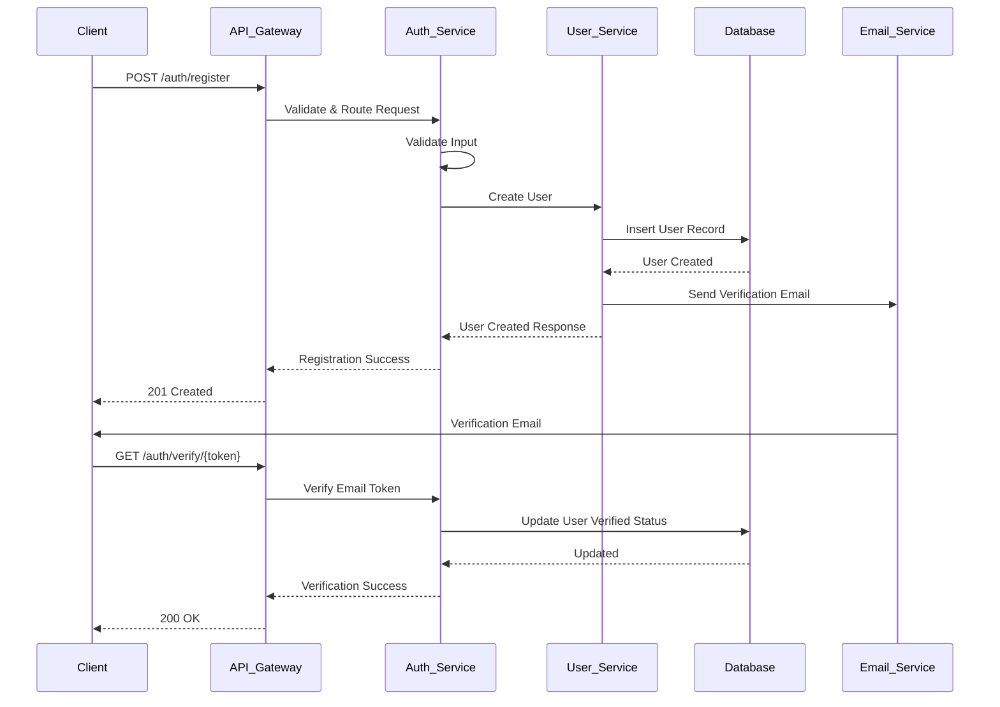
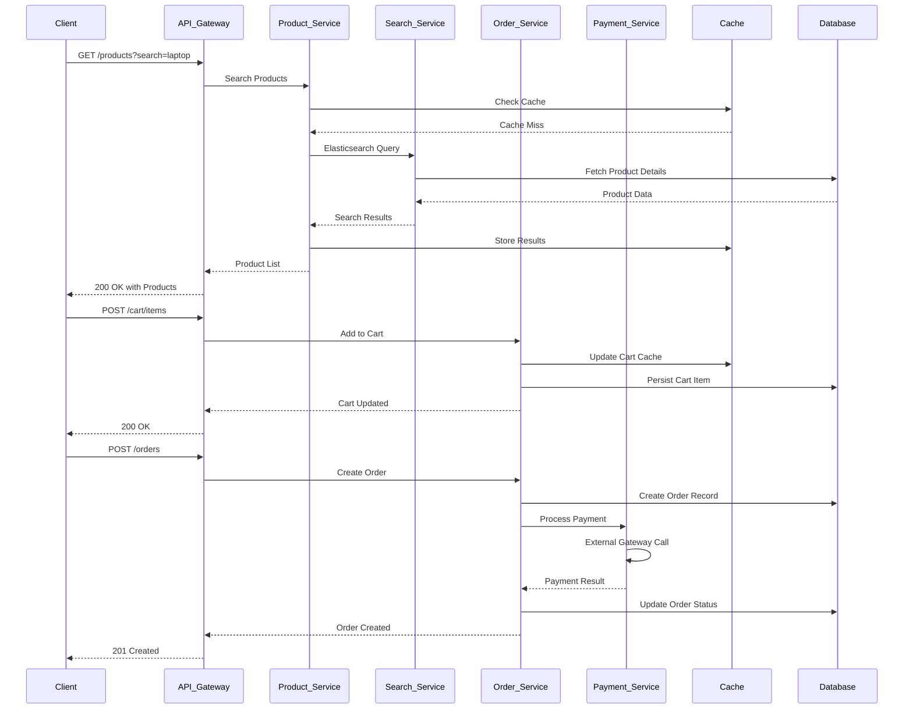
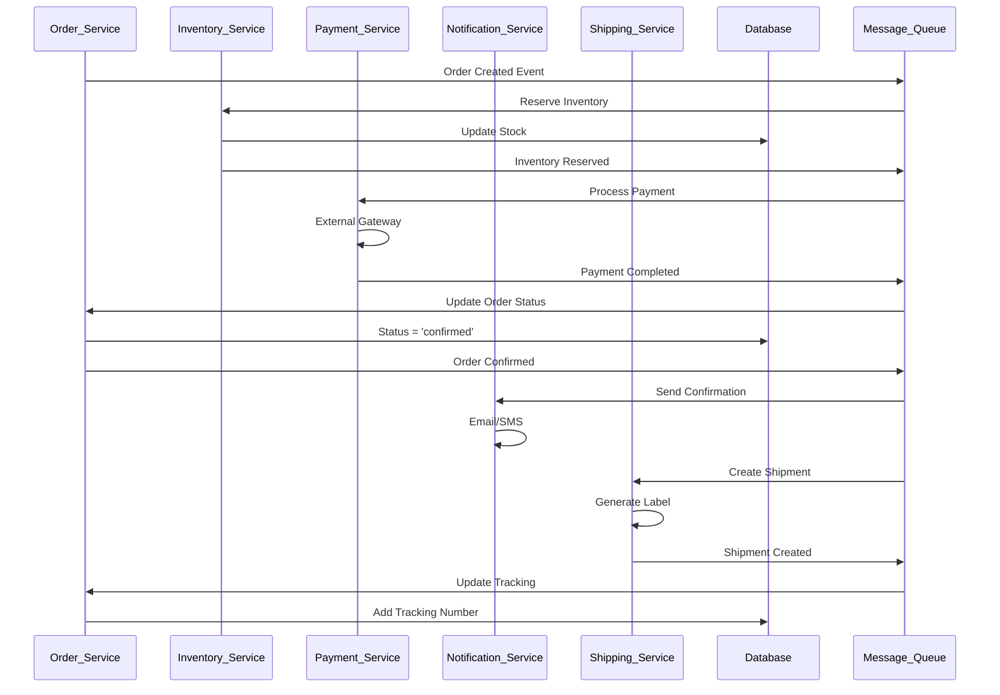

# DavTest10 - Online Shopping Platform Low-Level Design

## 1. Introduction

### 1.1 Purpose
This Low-Level Design (LLD) document provides detailed technical specifications for the DavTest10 Online Shopping Platform based on the High-Level Design requirements. It includes component specifications, data flows, sequence diagrams, and implementation details.

### 1.2 Scope
This document covers the detailed design of all microservices, database schemas, API specifications, security implementations, and deployment configurations for the online shopping platform.

### 1.3 Architecture Overview
The system follows a microservices architecture pattern with event-driven communication, implementing enterprise-grade security and compliance features.

## 2. System Architecture

### 2.1 Detailed Component Architecture

```
┌─────────────────────────────────────────────────────────────────────────────┐
│                              Client Layer                                   │
├─────────────────┬─────────────────┬─────────────────┬─────────────────────┤
│   Web Client    │  Mobile App     │   Admin Panel   │   Seller Dashboard  │
│   (React.js)    │  (React Native) │   (Next.js)     │   (Vue.js)          │
└─────────────────┴─────────────────┴─────────────────┴─────────────────────┘
                                    │
                                    ▼
┌─────────────────────────────────────────────────────────────────────────────┐
│                           Load Balancer (ALB)                               │
│                    SSL Termination + DDoS Protection                        │
└─────────────────────────────────────────────────────────────────────────────┘
                                    │
                                    ▼
┌─────────────────────────────────────────────────────────────────────────────┐
│                        API Gateway (Kong/AWS)                               │
│           Rate Limiting │ Authentication │ Request Routing                  │
└─────────────────────────────────────────────────────────────────────────────┘
                                    │
                    ┌───────────────┼───────────────┐
                    │               │               │
                    ▼               ▼               ▼
┌─────────────────┐ ┌─────────────────┐ ┌─────────────────┐ ┌─────────────────┐
│  Auth Service   │ │  User Service   │ │Product Service  │ │ Order Service   │
│  Port: 8001     │ │  Port: 8002     │ │  Port: 8003     │ │  Port: 8004     │
├─────────────────┤ ├─────────────────┤ ├─────────────────┤ ├─────────────────┤
│• JWT Generation │ │• User CRUD      │ │• Catalog Mgmt   │ │• Cart Management│
│• OAuth2         │ │• Profile Mgmt   │ │• Inventory      │ │• Order Process  │
│• RBAC           │ │• Account Verify │ │• Search Index   │ │• Payment Flow   │
│• Session Mgmt   │ │• Password Policy│ │• Category Mgmt  │ │• Status Tracking│
└─────────────────┘ └─────────────────┘ └─────────────────┘ └─────────────────┘
         │                   │                   │                   │
         └───────────────────┼───────────────────┼───────────────────┘
                             │                   │
                             ▼                   ▼
┌─────────────────────────────────────────────────────────────────────────────┐
│                          Message Queue (Kafka)                              │
│              Event Streaming │ Service Communication                        │
└─────────────────────────────────────────────────────────────────────────────┘
                                    │
                    ┌───────────────┼───────────────┐
                    │               │               │
                    ▼               ▼               ▼
┌─────────────────┐ ┌─────────────────┐ ┌─────────────────┐ ┌─────────────────┐
│   PostgreSQL    │ │     Redis       │ │ Elasticsearch   │ │   AWS S3/CDN    │
│  (Primary DB)   │ │   (Cache/Sess)  │ │   (Search)      │ │  (File Storage) │
│  Port: 5432     │ │   Port: 6379    │ │   Port: 9200    │ │                 │
└─────────────────┘ └─────────────────┘ └─────────────────┘ └─────────────────┘
```

## 3. Database Design

### 3.1 PostgreSQL Schema Design

#### 3.1.1 Users Table
```sql
CREATE TABLE users (
    user_id UUID PRIMARY KEY DEFAULT gen_random_uuid(),
    email VARCHAR(255) UNIQUE NOT NULL,
    password_hash VARCHAR(255) NOT NULL,
    first_name VARCHAR(100) NOT NULL,
    last_name VARCHAR(100) NOT NULL,
    phone_number VARCHAR(20),
    role user_role_enum DEFAULT 'customer',
    is_active BOOLEAN DEFAULT true,
    email_verified BOOLEAN DEFAULT false,
    phone_verified BOOLEAN DEFAULT false,
    failed_login_attempts INTEGER DEFAULT 0,
    account_locked_until TIMESTAMP,
    created_at TIMESTAMP DEFAULT CURRENT_TIMESTAMP,
    updated_at TIMESTAMP DEFAULT CURRENT_TIMESTAMP,
    last_login TIMESTAMP,
    
    CONSTRAINT valid_email CHECK (email ~* '^[A-Za-z0-9._%+-]+@[A-Za-z0-9.-]+\.[A-Za-z]{2,}$'),
    CONSTRAINT valid_phone CHECK (phone_number ~* '^\+?[1-9]\d{1,14}$')
);

CREATE TYPE user_role_enum AS ENUM ('customer', 'seller', 'admin', 'super_admin');

CREATE INDEX idx_users_email ON users(email);
CREATE INDEX idx_users_role ON users(role);
CREATE INDEX idx_users_active ON users(is_active);
```

#### 3.1.2 User Profiles Table
```sql
CREATE TABLE user_profiles (
    profile_id UUID PRIMARY KEY DEFAULT gen_random_uuid(),
    user_id UUID NOT NULL REFERENCES users(user_id) ON DELETE CASCADE,
    date_of_birth DATE,
    gender gender_enum,
    address_line1 VARCHAR(255),
    address_line2 VARCHAR(255),
    city VARCHAR(100),
    state VARCHAR(100),
    postal_code VARCHAR(20),
    country VARCHAR(100) DEFAULT 'US',
    preferences JSONB DEFAULT '{}',
    avatar_url VARCHAR(500),
    created_at TIMESTAMP DEFAULT CURRENT_TIMESTAMP,
    updated_at TIMESTAMP DEFAULT CURRENT_TIMESTAMP,
    
    UNIQUE(user_id)
);

CREATE TYPE gender_enum AS ENUM ('male', 'female', 'other', 'prefer_not_to_say');

CREATE INDEX idx_profiles_user_id ON user_profiles(user_id);
CREATE INDEX idx_profiles_location ON user_profiles(city, state, country);
```

#### 3.1.3 Categories Table
```sql
CREATE TABLE categories (
    category_id UUID PRIMARY KEY DEFAULT gen_random_uuid(),
    name VARCHAR(100) NOT NULL,
    description TEXT,
    parent_id UUID REFERENCES categories(category_id),
    slug VARCHAR(100) UNIQUE NOT NULL,
    image_url VARCHAR(500),
    sort_order INTEGER DEFAULT 0,
    is_active BOOLEAN DEFAULT true,
    created_at TIMESTAMP DEFAULT CURRENT_TIMESTAMP,
    updated_at TIMESTAMP DEFAULT CURRENT_TIMESTAMP,
    
    CONSTRAINT valid_slug CHECK (slug ~* '^[a-z0-9-]+$')
);

CREATE INDEX idx_categories_parent ON categories(parent_id);
CREATE INDEX idx_categories_active ON categories(is_active);
CREATE INDEX idx_categories_slug ON categories(slug);
```

#### 3.1.4 Products Table
```sql
CREATE TABLE products (
    product_id UUID PRIMARY KEY DEFAULT gen_random_uuid(),
    seller_id UUID NOT NULL REFERENCES users(user_id),
    category_id UUID NOT NULL REFERENCES categories(category_id),
    name VARCHAR(255) NOT NULL,
    description TEXT,
    short_description VARCHAR(500),
    sku VARCHAR(100) UNIQUE NOT NULL,
    price DECIMAL(10,2) NOT NULL CHECK (price >= 0),
    compare_price DECIMAL(10,2) CHECK (compare_price >= price),
    cost_price DECIMAL(10,2) CHECK (cost_price >= 0),
    inventory_quantity INTEGER NOT NULL DEFAULT 0 CHECK (inventory_quantity >= 0),
    track_inventory BOOLEAN DEFAULT true,
    allow_backorder BOOLEAN DEFAULT false,
    weight DECIMAL(8,3) CHECK (weight >= 0),
    dimensions JSONB, -- {"length": 10, "width": 5, "height": 3, "unit": "cm"}
    images JSONB DEFAULT '[]', -- Array of image URLs
    attributes JSONB DEFAULT '{}', -- Product-specific attributes
    seo_title VARCHAR(255),
    seo_description VARCHAR(500),
    tags TEXT[],
    status product_status_enum DEFAULT 'draft',
    is_featured BOOLEAN DEFAULT false,
    rating_average DECIMAL(3,2) DEFAULT 0 CHECK (rating_average >= 0 AND rating_average <= 5),
    rating_count INTEGER DEFAULT 0,
    view_count INTEGER DEFAULT 0,
    created_at TIMESTAMP DEFAULT CURRENT_TIMESTAMP,
    updated_at TIMESTAMP DEFAULT CURRENT_TIMESTAMP,
    published_at TIMESTAMP
);

CREATE TYPE product_status_enum AS ENUM ('draft', 'active', 'inactive', 'archived');

CREATE INDEX idx_products_seller ON products(seller_id);
CREATE INDEX idx_products_category ON products(category_id);
CREATE INDEX idx_products_status ON products(status);
CREATE INDEX idx_products_featured ON products(is_featured);
CREATE INDEX idx_products_price ON products(price);
CREATE INDEX idx_products_rating ON products(rating_average);
CREATE INDEX idx_products_tags ON products USING GIN(tags);
```

#### 3.1.5 Shopping Carts Table
```sql
CREATE TABLE shopping_carts (
    cart_id UUID PRIMARY KEY DEFAULT gen_random_uuid(),
    user_id UUID REFERENCES users(user_id) ON DELETE CASCADE,
    session_id VARCHAR(255), -- For guest users
    created_at TIMESTAMP DEFAULT CURRENT_TIMESTAMP,
    updated_at TIMESTAMP DEFAULT CURRENT_TIMESTAMP,
    expires_at TIMESTAMP DEFAULT (CURRENT_TIMESTAMP + INTERVAL '30 days'),
    
    CONSTRAINT cart_user_or_session CHECK (
        (user_id IS NOT NULL AND session_id IS NULL) OR 
        (user_id IS NULL AND session_id IS NOT NULL)
    )
);

CREATE INDEX idx_carts_user ON shopping_carts(user_id);
CREATE INDEX idx_carts_session ON shopping_carts(session_id);
CREATE INDEX idx_carts_expires ON shopping_carts(expires_at);
```

#### 3.1.6 Cart Items Table
```sql
CREATE TABLE cart_items (
    cart_item_id UUID PRIMARY KEY DEFAULT gen_random_uuid(),
    cart_id UUID NOT NULL REFERENCES shopping_carts(cart_id) ON DELETE CASCADE,
    product_id UUID NOT NULL REFERENCES products(product_id) ON DELETE CASCADE,
    quantity INTEGER NOT NULL CHECK (quantity > 0),
    unit_price DECIMAL(10,2) NOT NULL,
    added_at TIMESTAMP DEFAULT CURRENT_TIMESTAMP,
    updated_at TIMESTAMP DEFAULT CURRENT_TIMESTAMP,
    
    UNIQUE(cart_id, product_id)
);

CREATE INDEX idx_cart_items_cart ON cart_items(cart_id);
CREATE INDEX idx_cart_items_product ON cart_items(product_id);
```

#### 3.1.7 Orders Table
```sql
CREATE TABLE orders (
    order_id UUID PRIMARY KEY DEFAULT gen_random_uuid(),
    order_number VARCHAR(50) UNIQUE NOT NULL,
    user_id UUID NOT NULL REFERENCES users(user_id),
    status order_status_enum DEFAULT 'pending',
    subtotal DECIMAL(10,2) NOT NULL CHECK (subtotal >= 0),
    tax_amount DECIMAL(10,2) DEFAULT 0 CHECK (tax_amount >= 0),
    shipping_amount DECIMAL(10,2) DEFAULT 0 CHECK (shipping_amount >= 0),
    discount_amount DECIMAL(10,2) DEFAULT 0 CHECK (discount_amount >= 0),
    total_amount DECIMAL(10,2) NOT NULL CHECK (total_amount >= 0),
    currency VARCHAR(3) DEFAULT 'USD',
    
    -- Shipping Information
    shipping_address JSONB NOT NULL,
    billing_address JSONB NOT NULL,
    shipping_method VARCHAR(100),
    tracking_number VARCHAR(100),
    
    -- Order Metadata
    notes TEXT,
    internal_notes TEXT,
    source VARCHAR(50) DEFAULT 'web', -- web, mobile, api
    
    -- Timestamps
    created_at TIMESTAMP DEFAULT CURRENT_TIMESTAMP,
    updated_at TIMESTAMP DEFAULT CURRENT_TIMESTAMP,
    shipped_at TIMESTAMP,
    delivered_at TIMESTAMP,
    cancelled_at TIMESTAMP
);

CREATE TYPE order_status_enum AS ENUM (
    'pending', 'confirmed', 'processing', 'shipped', 
    'delivered', 'cancelled', 'refunded', 'returned'
);

CREATE INDEX idx_orders_user ON orders(user_id);
CREATE INDEX idx_orders_status ON orders(status);
CREATE INDEX idx_orders_created ON orders(created_at);
CREATE INDEX idx_orders_number ON orders(order_number);
```

#### 3.1.8 Order Items Table
```sql
CREATE TABLE order_items (
    order_item_id UUID PRIMARY KEY DEFAULT gen_random_uuid(),
    order_id UUID NOT NULL REFERENCES orders(order_id) ON DELETE CASCADE,
    product_id UUID NOT NULL REFERENCES products(product_id),
    product_name VARCHAR(255) NOT NULL, -- Snapshot at time of order
    product_sku VARCHAR(100) NOT NULL,
    quantity INTEGER NOT NULL CHECK (quantity > 0),
    unit_price DECIMAL(10,2) NOT NULL CHECK (unit_price >= 0),
    total_price DECIMAL(10,2) NOT NULL CHECK (total_price >= 0),
    product_snapshot JSONB, -- Full product details at time of order
    created_at TIMESTAMP DEFAULT CURRENT_TIMESTAMP
);

CREATE INDEX idx_order_items_order ON order_items(order_id);
CREATE INDEX idx_order_items_product ON order_items(product_id);
```

#### 3.1.9 Payments Table
```sql
CREATE TABLE payments (
    payment_id UUID PRIMARY KEY DEFAULT gen_random_uuid(),
    order_id UUID NOT NULL REFERENCES orders(order_id),
    payment_method payment_method_enum NOT NULL,
    payment_provider VARCHAR(50) NOT NULL, -- stripe, paypal, square
    transaction_id VARCHAR(255) UNIQUE NOT NULL,
    amount DECIMAL(10,2) NOT NULL CHECK (amount > 0),
    currency VARCHAR(3) DEFAULT 'USD',
    status payment_status_enum DEFAULT 'pending',
    gateway_response JSONB,
    failure_reason TEXT,
    processed_at TIMESTAMP,
    created_at TIMESTAMP DEFAULT CURRENT_TIMESTAMP,
    updated_at TIMESTAMP DEFAULT CURRENT_TIMESTAMP
);

CREATE TYPE payment_method_enum AS ENUM (
    'credit_card', 'debit_card', 'paypal', 'apple_pay', 
    'google_pay', 'bank_transfer', 'crypto'
);

CREATE TYPE payment_status_enum AS ENUM (
    'pending', 'processing', 'completed', 'failed', 
    'cancelled', 'refunded', 'partially_refunded'
);

CREATE INDEX idx_payments_order ON payments(order_id);
CREATE INDEX idx_payments_status ON payments(status);
CREATE INDEX idx_payments_transaction ON payments(transaction_id);
```

#### 3.1.10 Audit Logs Table
```sql
CREATE TABLE audit_logs (
    log_id UUID PRIMARY KEY DEFAULT gen_random_uuid(),
    entity_type VARCHAR(50) NOT NULL,
    entity_id UUID NOT NULL,
    action audit_action_enum NOT NULL,
    user_id UUID REFERENCES users(user_id),
    ip_address INET,
    user_agent TEXT,
    old_values JSONB,
    new_values JSONB,
    timestamp TIMESTAMP DEFAULT CURRENT_TIMESTAMP,
    
    -- Compliance fields
    retention_until TIMESTAMP,
    is_sensitive BOOLEAN DEFAULT false
);

CREATE TYPE audit_action_enum AS ENUM (
    'create', 'read', 'update', 'delete', 
    'login', 'logout', 'password_change', 
    'permission_grant', 'permission_revoke'
);

CREATE INDEX idx_audit_entity ON audit_logs(entity_type, entity_id);
CREATE INDEX idx_audit_user ON audit_logs(user_id);
CREATE INDEX idx_audit_timestamp ON audit_logs(timestamp);
CREATE INDEX idx_audit_action ON audit_logs(action);
```

### 3.2 Redis Cache Schema

#### 3.2.1 Session Management
```
Key Pattern: session:{session_id}
Value: {
  "user_id": "uuid",
  "role": "customer|seller|admin",
  "permissions": ["read:products", "write:orders"],
  "created_at": "timestamp",
  "last_accessed": "timestamp",
  "ip_address": "192.168.1.1",
  "user_agent": "browser_info"
}
TTL: 24 hours
```

#### 3.2.2 Product Cache
```
Key Pattern: product:{product_id}
Value: {
  "product_id": "uuid",
  "name": "Product Name",
  "price": 29.99,
  "inventory": 100,
  "images": ["url1", "url2"],
  "cached_at": "timestamp"
}
TTL: 1 hour
```

#### 3.2.3 Cart Cache
```
Key Pattern: cart:{user_id|session_id}
Value: {
  "items": [
    {
      "product_id": "uuid",
      "quantity": 2,
      "unit_price": 29.99,
      "added_at": "timestamp"
    }
  ],
  "total_items": 5,
  "subtotal": 149.95,
  "updated_at": "timestamp"
}
TTL: 30 days
```

## 4. API Specifications

### 4.1 Authentication Service APIs

#### 4.1.1 User Registration
```http
POST /api/v1/auth/register
Content-Type: application/json

{
  "email": "user@example.com",
  "password": "SecurePass123!",
  "firstName": "John",
  "lastName": "Doe",
  "phoneNumber": "+1234567890",
  "role": "customer"
}

Response 201:
{
  "success": true,
  "data": {
    "userId": "uuid",
    "email": "user@example.com",
    "emailVerificationRequired": true
  },
  "message": "Registration successful. Please verify your email."
}

Response 400:
{
  "success": false,
  "error": {
    "code": "VALIDATION_ERROR",
    "message": "Invalid input data",
    "details": {
      "email": ["Email already exists"],
      "password": ["Password must contain at least 8 characters"]
    }
  }
}
```

#### 4.1.2 User Login
```http
POST /api/v1/auth/login
Content-Type: application/json

{
  "email": "user@example.com",
  "password": "SecurePass123!",
  "rememberMe": true
}

Response 200:
{
  "success": true,
  "data": {
    "accessToken": "jwt_token_here",
    "refreshToken": "refresh_token_here",
    "expiresIn": 3600,
    "user": {
      "userId": "uuid",
      "email": "user@example.com",
      "firstName": "John",
      "lastName": "Doe",
      "role": "customer",
      "permissions": ["read:products", "write:orders"]
    }
  }
}

Response 401:
{
  "success": false,
  "error": {
    "code": "INVALID_CREDENTIALS",
    "message": "Invalid email or password",
    "remainingAttempts": 2
  }
}
```

### 4.2 Product Service APIs

#### 4.2.1 Get Products with Filtering
```http
GET /api/v1/products?category=electronics&minPrice=100&maxPrice=500&page=1&limit=20&sort=price_asc
Authorization: Bearer {jwt_token}

Response 200:
{
  "success": true,
  "data": {
    "products": [
      {
        "productId": "uuid",
        "name": "Smartphone XYZ",
        "description": "Latest smartphone with advanced features",
        "price": 299.99,
        "comparePrice": 349.99,
        "images": ["url1", "url2"],
        "rating": 4.5,
        "reviewCount": 128,
        "inStock": true,
        "inventory": 50,
        "seller": {
          "sellerId": "uuid",
          "name": "Tech Store Inc",
          "rating": 4.8
        }
      }
    ],
    "pagination": {
      "page": 1,
      "limit": 20,
      "total": 150,
      "totalPages": 8,
      "hasNext": true,
      "hasPrev": false
    },
    "filters": {
      "categories": ["electronics", "computers"],
      "priceRange": {"min": 50, "max": 2000},
      "brands": ["Apple", "Samsung", "Google"]
    }
  }
}
```

#### 4.2.2 Create Product (Seller Only)
```http
POST /api/v1/products
Authorization: Bearer {jwt_token}
Content-Type: application/json

{
  "name": "New Product",
  "description": "Product description",
  "shortDescription": "Brief description",
  "categoryId": "uuid",
  "price": 99.99,
  "comparePrice": 129.99,
  "sku": "PROD-001",
  "inventory": 100,
  "weight": 1.5,
  "dimensions": {
    "length": 10,
    "width": 5,
    "height": 3,
    "unit": "cm"
  },
  "images": ["image_url_1", "image_url_2"],
  "tags": ["electronics", "gadget"],
  "attributes": {
    "color": "black",
    "material": "plastic"
  }
}

Response 201:
{
  "success": true,
  "data": {
    "productId": "uuid",
    "name": "New Product",
    "status": "draft",
    "createdAt": "2024-01-15T10:30:00Z"
  },
  "message": "Product created successfully"
}
```

### 4.3 Order Service APIs

#### 4.3.1 Add to Cart
```http
POST /api/v1/cart/items
Authorization: Bearer {jwt_token}
Content-Type: application/json

{
  "productId": "uuid",
  "quantity": 2
}

Response 200:
{
  "success": true,
  "data": {
    "cartId": "uuid",
    "itemId": "uuid",
    "product": {
      "productId": "uuid",
      "name": "Product Name",
      "price": 29.99,
      "image": "image_url"
    },
    "quantity": 2,
    "unitPrice": 29.99,
    "totalPrice": 59.98,
    "cartSummary": {
      "totalItems": 5,
      "subtotal": 149.95
    }
  }
}
```

#### 4.3.2 Create Order
```http
POST /api/v1/orders
Authorization: Bearer {jwt_token}
Content-Type: application/json

{
  "cartId": "uuid",
  "shippingAddress": {
    "firstName": "John",
    "lastName": "Doe",
    "addressLine1": "123 Main St",
    "addressLine2": "Apt 4B",
    "city": "New York",
    "state": "NY",
    "postalCode": "10001",
    "country": "US",
    "phoneNumber": "+1234567890"
  },
  "billingAddress": {
    "sameAsShipping": true
  },
  "shippingMethod": "standard",
  "paymentMethod": {
    "type": "credit_card",
    "provider": "stripe",
    "token": "stripe_payment_token"
  }
}

Response 201:
{
  "success": true,
  "data": {
    "orderId": "uuid",
    "orderNumber": "ORD-2024-001234",
    "status": "pending",
    "total": 159.95,
    "paymentStatus": "processing",
    "estimatedDelivery": "2024-01-20"
  }
}
```

## 5. Sequence Diagrams

### 5.1 User Registration Flow


### 5.2 Product Search and Purchase Flow


### 5.3 Order Processing Workflow


## 6. Security Implementation Details

### 6.1 Authentication & Authorization

#### 6.1.1 JWT Token Structure
```json
{
  "header": {
    "alg": "RS256",
    "typ": "JWT",
    "kid": "key-id-1"
  },
  "payload": {
    "sub": "user-uuid",
    "iss": "shopping-platform",
    "aud": "shopping-platform-api",
    "exp": 1642694400,
    "iat": 1642690800,
    "jti": "token-uuid",
    "role": "customer",
    "permissions": [
      "read:products",
      "write:orders",
      "read:profile"
    ],
    "session_id": "session-uuid"
  }
}
```

#### 6.1.2 RBAC Permission Matrix
```yaml
roles:
  customer:
    permissions:
      - read:products
      - read:categories
      - write:orders
      - read:orders:own
      - write:cart:own
      - read:profile:own
      - write:profile:own
      
  seller:
    inherits: customer
    permissions:
      - write:products:own
      - read:products:own
      - read:orders:seller
      - read:analytics:seller
      
  admin:
    permissions:
      - read:*
      - write:*
      - delete:*
      - manage:users
      - manage:system
      
  super_admin:
    inherits: admin
    permissions:
      - manage:admins
      - system:backup
      - system:restore
```

### 6.2 Input Validation & Sanitization

#### 6.2.1 Request Validation Middleware
```javascript
const validateRequest = (schema) => {
  return (req, res, next) => {
    // Sanitize inputs
    req.body = sanitizeHtml(req.body, {
      allowedTags: [],
      allowedAttributes: {}
    });
    
    // Validate against schema
    const { error, value } = schema.validate(req.body, {
      abortEarly: false,
      stripUnknown: true
    });
    
    if (error) {
      return res.status(400).json({
        success: false,
        error: {
          code: 'VALIDATION_ERROR',
          message: 'Invalid input data',
          details: formatValidationErrors(error.details)
        }
      });
    }
    
    req.validatedBody = value;
    next();
  };
};
```

#### 6.2.2 SQL Injection Prevention
```javascript
// Using parameterized queries
const getUserById = async (userId) => {
  const query = `
    SELECT user_id, email, first_name, last_name, role
    FROM users 
    WHERE user_id = $1 AND is_active = true
  `;
  
  const result = await pool.query(query, [userId]);
  return result.rows[0];
};

// Input validation for UUIDs
const isValidUUID = (uuid) => {
  const uuidRegex = /^[0-9a-f]{8}-[0-9a-f]{4}-4[0-9a-f]{3}-[89ab][0-9a-f]{3}-[0-9a-f]{12}$/i;
  return uuidRegex.test(uuid);
};
```

### 6.3 Encryption Implementation

#### 6.3.1 Password Hashing
```javascript
const bcrypt = require('bcrypt');
const crypto = require('crypto');

class PasswordService {
  static async hashPassword(password) {
    // Validate password strength
    if (!this.isStrongPassword(password)) {
      throw new Error('Password does not meet security requirements');
    }
    
    const saltRounds = 12;
    return await bcrypt.hash(password, saltRounds);
  }
  
  static async verifyPassword(password, hash) {
    return await bcrypt.compare(password, hash);
  }
  
  static isStrongPassword(password) {
    const minLength = 8;
    const hasUpperCase = /[A-Z]/.test(password);
    const hasLowerCase = /[a-z]/.test(password);
    const hasNumbers = /\d/.test(password);
    const hasSpecialChar = /[!@#$%^&*(),.?":{}|<>]/.test(password);
    
    return password.length >= minLength && 
           hasUpperCase && 
           hasLowerCase && 
           hasNumbers && 
           hasSpecialChar;
  }
}
```

#### 6.3.2 Data Encryption at Rest
```javascript
const crypto = require('crypto');

class EncryptionService {
  constructor() {
    this.algorithm = 'aes-256-gcm';
    this.keyLength = 32;
    this.ivLength = 16;
    this.tagLength = 16;
  }
  
  encrypt(text, key) {
    const iv = crypto.randomBytes(this.ivLength);
    const cipher = crypto.createCipher(this.algorithm, key, iv);
    
    let encrypted = cipher.update(text, 'utf8', 'hex');
    encrypted += cipher.final('hex');
    
    const tag = cipher.getAuthTag();
    
    return {
      encrypted,
      iv: iv.toString('hex'),
      tag: tag.toString('hex')
    };
  }
  
  decrypt(encryptedData, key) {
    const decipher = crypto.createDecipher(
      this.algorithm, 
      key, 
      Buffer.from(encryptedData.iv, 'hex')
    );
    
    decipher.setAuthTag(Buffer.from(encryptedData.tag, 'hex'));
    
    let decrypted = decipher.update(encryptedData.encrypted, 'hex', 'utf8');
    decrypted += decipher.final('utf8');
    
    return decrypted;
  }
}
```

### 6.4 Rate Limiting & DDoS Protection

#### 6.4.1 API Rate Limiting
```javascript
const rateLimit = require('express-rate-limit');
const RedisStore = require('rate-limit-redis');

const createRateLimiter = (options) => {
  return rateLimit({
    store: new RedisStore({
      client: redisClient,
      prefix: 'rl:'
    }),
    windowMs: options.windowMs || 15 * 60 * 1000, // 15 minutes
    max: options.max || 100, // requests per window
    message: {
      success: false,
      error: {
        code: 'RATE_LIMIT_EXCEEDED',
        message: 'Too many requests, please try again later'
      }
    },
    standardHeaders: true,
    legacyHeaders: false,
    keyGenerator: (req) => {
      return req.user?.userId || req.ip;
    }
  });
};

// Different limits for different endpoints
const authLimiter = createRateLimiter({ max: 5, windowMs: 15 * 60 * 1000 }); // 5 per 15min
const apiLimiter = createRateLimiter({ max: 1000, windowMs: 15 * 60 * 1000 }); // 1000 per 15min
const searchLimiter = createRateLimiter({ max: 100, windowMs: 60 * 1000 }); // 100 per minute
```

## 7. Performance Optimization

### 7.1 Caching Strategy

#### 7.1.1 Multi-Level Caching
```javascript
class CacheService {
  constructor() {
    this.l1Cache = new Map(); // In-memory cache
    this.l2Cache = redisClient; // Redis cache
    this.l3Cache = database; // Database
  }
  
  async get(key, options = {}) {
    const { ttl = 3600, skipL1 = false } = options;
    
    // Level 1: In-memory cache
    if (!skipL1 && this.l1Cache.has(key)) {
      const cached = this.l1Cache.get(key);
      if (cached.expires > Date.now()) {
        return cached.data;
      }
      this.l1Cache.delete(key);
    }
    
    // Level 2: Redis cache
    const redisValue = await this.l2Cache.get(key);
    if (redisValue) {
      const data = JSON.parse(redisValue);
      
      // Store in L1 cache
      if (!skipL1) {
        this.l1Cache.set(key, {
          data,
          expires: Date.now() + (ttl * 1000)
        });
      }
      
      return data;
    }
    
    return null;
  }
  
  async set(key, data, ttl = 3600) {
    // Store in Redis
    await this.l2Cache.setex(key, ttl, JSON.stringify(data));
    
    // Store in L1 cache
    this.l1Cache.set(key, {
      data,
      expires: Date.now() + (ttl * 1000)
    });
  }
  
  async invalidate(pattern) {
    // Clear L1 cache
    for (const key of this.l1Cache.keys()) {
      if (key.includes(pattern)) {
        this.l1Cache.delete(key);
      }
    }
    
    // Clear Redis cache
    const keys = await this.l2Cache.keys(`*${pattern}*`);
    if (keys.length > 0) {
      await this.l2Cache.del(keys);
    }
  }
}
```

### 7.2 Database Optimization

#### 7.2.1 Query Optimization
```sql
-- Optimized product search query
CREATE INDEX CONCURRENTLY idx_products_search 
ON products USING GIN(to_tsvector('english', name || ' ' || description));

CREATE INDEX CONCURRENTLY idx_products_composite 
ON products(category_id, status, price) 
WHERE status = 'active';

-- Optimized order history query
CREATE INDEX CONCURRENTLY idx_orders_user_created 
ON orders(user_id, created_at DESC) 
WHERE status != 'cancelled';

-- Partitioned audit logs table
CREATE TABLE audit_logs_y2024m01 PARTITION OF audit_logs 
FOR VALUES FROM ('2024-01-01') TO ('2024-02-01');
```

#### 7.2.2 Connection Pooling
```javascript
const { Pool } = require('pg');

const pool = new Pool({
  host: process.env.DB_HOST,
  port: process.env.DB_PORT,
  database: process.env.DB_NAME,
  user: process.env.DB_USER,
  password: process.env.DB_PASSWORD,
  
  // Connection pool settings
  min: 10, // Minimum connections
  max: 100, // Maximum connections
  idleTimeoutMillis: 30000, // Close idle connections after 30s
  connectionTimeoutMillis: 2000, // Timeout after 2s
  
  // Query timeout
  query_timeout: 10000,
  
  // SSL configuration
  ssl: {
    rejectUnauthorized: false
  }
});

// Graceful shutdown
process.on('SIGINT', async () => {
  await pool.end();
  process.exit(0);
});
```

## 8. Monitoring & Observability

### 8.1 Application Metrics

#### 8.1.1 Custom Metrics Collection
```javascript
const prometheus = require('prom-client');

// Create metrics
const httpRequestDuration = new prometheus.Histogram({
  name: 'http_request_duration_seconds',
  help: 'Duration of HTTP requests in seconds',
  labelNames: ['method', 'route', 'status_code'],
  buckets: [0.1, 0.3, 0.5, 0.7, 1, 3, 5, 7, 10]
});

const httpRequestTotal = new prometheus.Counter({
  name: 'http_requests_total',
  help: 'Total number of HTTP requests',
  labelNames: ['method', 'route', 'status_code']
});

const activeUsers = new prometheus.Gauge({
  name: 'active_users_total',
  help: 'Number of active users'
});

const orderProcessingTime = new prometheus.Histogram({
  name: 'order_processing_duration_seconds',
  help: 'Time taken to process orders',
  buckets: [1, 5, 10, 30, 60, 120, 300]
});

// Middleware to collect metrics
const metricsMiddleware = (req, res, next) => {
  const start = Date.now();
  
  res.on('finish', () => {
    const duration = (Date.now() - start) / 1000;
    const labels = {
      method: req.method,
      route: req.route?.path || req.path,
      status_code: res.statusCode
    };
    
    httpRequestDuration.observe(labels, duration);
    httpRequestTotal.inc(labels);
  });
  
  next();
};
```

### 8.2 Health Checks

#### 8.2.1 Comprehensive Health Check
```javascript
class HealthCheckService {
  static async checkHealth() {
    const checks = {
      timestamp: new Date().toISOString(),
      status: 'healthy',
      version: process.env.APP_VERSION,
      uptime: process.uptime(),
      checks: {}
    };
    
    try {
      // Database connectivity
      checks.checks.database = await this.checkDatabase();
      
      // Redis connectivity
      checks.checks.redis = await this.checkRedis();
      
      // External services
      checks.checks.paymentGateway = await this.checkPaymentGateway();
      checks.checks.emailService = await this.checkEmailService();
      
      // System resources
      checks.checks.memory = this.checkMemory();
      checks.checks.disk = await this.checkDiskSpace();
      
      // Determine overall status
      const hasFailures = Object.values(checks.checks)
        .some(check => check.status !== 'healthy');
      
      if (hasFailures) {
        checks.status = 'degraded';
      }
      
    } catch (error) {
      checks.status = 'unhealthy';
      checks.error = error.message;
    }
    
    return checks;
  }
  
  static async checkDatabase() {
    try {
      const start = Date.now();
      await pool.query('SELECT 1');
      const responseTime = Date.now() - start;
      
      return {
        status: 'healthy',
        responseTime: `${responseTime}ms`,
        connections: {
          total: pool.totalCount,
          idle: pool.idleCount,
          waiting: pool.waitingCount
        }
      };
    } catch (error) {
      return {
        status: 'unhealthy',
        error: error.message
      };
    }
  }
  
  static async checkRedis() {
    try {
      const start = Date.now();
      await redisClient.ping();
      const responseTime = Date.now() - start;
      
      return {
        status: 'healthy',
        responseTime: `${responseTime}ms`,
        memory: await redisClient.memory('usage')
      };
    } catch (error) {
      return {
        status: 'unhealthy',
        error: error.message
      };
    }
  }
}
```

## 9. Deployment Configuration

### 9.1 Docker Configuration

#### 9.1.1 Multi-stage Dockerfile
```dockerfile
# Build stage
FROM node:18-alpine AS builder

WORKDIR /app

# Copy package files
COPY package*.json ./
COPY yarn.lock ./

# Install dependencies
RUN yarn install --frozen-lockfile --production=false

# Copy source code
COPY . .

# Build application
RUN yarn build

# Production stage
FROM node:18-alpine AS production

# Create non-root user
RUN addgroup -g 1001 -S nodejs
RUN adduser -S nextjs -u 1001

WORKDIR /app

# Copy built application
COPY --from=builder --chown=nextjs:nodejs /app/dist ./dist
COPY --from=builder --chown=nextjs:nodejs /app/node_modules ./node_modules
COPY --from=builder --chown=nextjs:nodejs /app/package.json ./package.json

# Security: Remove package managers
RUN rm -rf /usr/local/lib/node_modules/npm
RUN rm -rf /usr/local/bin/npm
RUN rm -rf /usr/local/bin/npx

# Install security updates
RUN apk update && apk upgrade

# Switch to non-root user
USER nextjs

# Health check
HEALTHCHECK --interval=30s --timeout=3s --start-period=5s --retries=3 \
  CMD curl -f http://localhost:3000/health || exit 1

EXPOSE 3000

CMD ["node", "dist/server.js"]
```

### 9.2 Kubernetes Configuration

#### 9.2.1 Deployment Manifest
```yaml
apiVersion: apps/v1
kind: Deployment
metadata:
  name: shopping-platform-api
  namespace: shopping-platform
  labels:
    app: shopping-platform-api
    version: v1.0.0
spec:
  replicas: 3
  strategy:
    type: RollingUpdate
    rollingUpdate:
      maxSurge: 1
      maxUnavailable: 0
  selector:
    matchLabels:
      app: shopping-platform-api
  template:
    metadata:
      labels:
        app: shopping-platform-api
        version: v1.0.0
      annotations:
        prometheus.io/scrape: "true"
        prometheus.io/port: "3000"
        prometheus.io/path: "/metrics"
    spec:
      serviceAccountName: shopping-platform-api
      securityContext:
        runAsNonRoot: true
        runAsUser: 1001
        fsGroup: 1001
      containers:
      - name: api
        image: shopping-platform/api:v1.0.0
        imagePullPolicy: Always
        ports:
        - containerPort: 3000
          name: http
        env:
        - name: NODE_ENV
          value: "production"
        - name: PORT
          value: "3000"
        - name: DB_HOST
          valueFrom:
            secretKeyRef:
              name: database-secret
              key: host
        - name: DB_PASSWORD
          valueFrom:
            secretKeyRef:
              name: database-secret
              key: password
        - name: REDIS_URL
          valueFrom:
            secretKeyRef:
              name: redis-secret
              key: url
        - name: JWT_SECRET
          valueFrom:
            secretKeyRef:
              name: jwt-secret
              key: secret
        resources:
          requests:
            memory: "256Mi"
            cpu: "250m"
          limits:
            memory: "512Mi"
            cpu: "500m"
        livenessProbe:
          httpGet:
            path: /health
            port: 3000
          initialDelaySeconds: 30
          periodSeconds: 10
          timeoutSeconds: 5
          failureThreshold: 3
        readinessProbe:
          httpGet:
            path: /ready
            port: 3000
          initialDelaySeconds: 5
          periodSeconds: 5
          timeoutSeconds: 3
          failureThreshold: 3
        securityContext:
          allowPrivilegeEscalation: false
          readOnlyRootFilesystem: true
          capabilities:
            drop:
            - ALL
        volumeMounts:
        - name: tmp
          mountPath: /tmp
        - name: logs
          mountPath: /app/logs
      volumes:
      - name: tmp
        emptyDir: {}
      - name: logs
        emptyDir: {}
      nodeSelector:
        kubernetes.io/arch: amd64
      tolerations:
      - key: "shopping-platform"
        operator: "Equal"
        value: "api"
        effect: "NoSchedule"
```

#### 9.2.2 Service and Ingress
```yaml
---
apiVersion: v1
kind: Service
metadata:
  name: shopping-platform-api-service
  namespace: shopping-platform
  labels:
    app: shopping-platform-api
spec:
  type: ClusterIP
  ports:
  - port: 80
    targetPort: 3000
    protocol: TCP
    name: http
  selector:
    app: shopping-platform-api

---
apiVersion: networking.k8s.io/v1
kind: Ingress
metadata:
  name: shopping-platform-ingress
  namespace: shopping-platform
  annotations:
    kubernetes.io/ingress.class: "nginx"
    nginx.ingress.kubernetes.io/ssl-redirect: "true"
    nginx.ingress.kubernetes.io/force-ssl-redirect: "true"
    nginx.ingress.kubernetes.io/rate-limit: "1000"
    nginx.ingress.kubernetes.io/rate-limit-window: "1m"
    cert-manager.io/cluster-issuer: "letsencrypt-prod"
spec:
  tls:
  - hosts:
    - api.shopping-platform.com
    secretName: shopping-platform-tls
  rules:
  - host: api.shopping-platform.com
    http:
      paths:
      - path: /
        pathType: Prefix
        backend:
          service:
            name: shopping-platform-api-service
            port:
              number: 80
```

## 10. Testing Strategy

### 10.1 Unit Testing

#### 10.1.1 Service Layer Tests
```javascript
const { UserService } = require('../services/UserService');
const { DatabaseError, ValidationError } = require('../errors');

describe('UserService', () => {
  let userService;
  let mockDatabase;
  let mockCache;
  
  beforeEach(() => {
    mockDatabase = {
      query: jest.fn(),
      transaction: jest.fn()
    };
    
    mockCache = {
      get: jest.fn(),
      set: jest.fn(),
      del: jest.fn()
    };
    
    userService = new UserService(mockDatabase, mockCache);
  });
  
  describe('createUser', () => {
    it('should create a new user successfully', async () => {
      // Arrange
      const userData = {
        email: 'test@example.com',
        password: 'SecurePass123!',
        firstName: 'John',
        lastName: 'Doe'
      };
      
      const expectedUser = {
        userId: 'uuid-123',
        email: 'test@example.com',
        firstName: 'John',
        lastName: 'Doe',
        role: 'customer'
      };
      
      mockDatabase.query.mockResolvedValue({
        rows: [expectedUser]
      });
      
      // Act
      const result = await userService.createUser(userData);
      
      // Assert
      expect(result).toEqual(expectedUser);
      expect(mockDatabase.query).toHaveBeenCalledWith(
        expect.stringContaining('INSERT INTO users'),
        expect.arrayContaining([userData.email])
      );
    });
    
    it('should throw ValidationError for invalid email', async () => {
      // Arrange
      const userData = {
        email: 'invalid-email',
        password: 'SecurePass123!',
        firstName: 'John',
        lastName: 'Doe'
      };
      
      // Act & Assert
      await expect(userService.createUser(userData))
        .rejects
        .toThrow(ValidationError);
    });
    
    it('should handle database errors gracefully', async () => {
      // Arrange
      const userData = {
        email: 'test@example.com',
        password: 'SecurePass123!',
        firstName: 'John',
        lastName: 'Doe'
      };
      
      mockDatabase.query.mockRejectedValue(
        new Error('Database connection failed')
      );
      
      // Act & Assert
      await expect(userService.createUser(userData))
        .rejects
        .toThrow(DatabaseError);
    });
  });
});
```

### 10.2 Integration Testing

#### 10.2.1 API Integration Tests
```javascript
const request = require('supertest');
const app = require('../app');
const { setupTestDatabase, cleanupTestDatabase } = require('./helpers/database');

describe('Authentication API', () => {
  let testDb;
  
  beforeAll(async () => {
    testDb = await setupTestDatabase();
  });
  
  afterAll(async () => {
    await cleanupTestDatabase(testDb);
  });
  
  describe('POST /api/v1/auth/register', () => {
    it('should register a new user successfully', async () => {
      // Arrange
      const userData = {
        email: 'newuser@example.com',
        password: 'SecurePass123!',
        firstName: 'Jane',
        lastName: 'Smith'
      };
      
      // Act
      const response = await request(app)
        .post('/api/v1/auth/register')
        .send(userData)
        .expect(201);
      
      // Assert
      expect(response.body.success).toBe(true);
      expect(response.body.data.email).toBe(userData.email);
      expect(response.body.data.userId).toBeDefined();
      expect(response.body.data.emailVerificationRequired).toBe(true);
      
      // Verify user was created in database
      const user = await testDb.query(
        'SELECT * FROM users WHERE email = $1',
        [userData.email]
      );
      expect(user.rows).toHaveLength(1);
      expect(user.rows[0].email_verified).toBe(false);
    });
    
    it('should return 400 for duplicate email', async () => {
      // Arrange - Create user first
      await testDb.query(
        'INSERT INTO users (email, password_hash, first_name, last_name) VALUES ($1, $2, $3, $4)',
        ['existing@example.com', 'hashedpass', 'John', 'Doe']
      );
      
      const userData = {
        email: 'existing@example.com',
        password: 'SecurePass123!',
        firstName: 'Jane',
        lastName: 'Smith'
      };
      
      // Act
      const response = await request(app)
        .post('/api/v1/auth/register')
        .send(userData)
        .expect(400);
      
      // Assert
      expect(response.body.success).toBe(false);
      expect(response.body.error.code).toBe('EMAIL_ALREADY_EXISTS');
    });
  });
});
```

### 10.3 Performance Testing

#### 10.3.1 Load Testing Configuration
```javascript
// k6 load testing script
import http from 'k6/http';
import { check, sleep } from 'k6';
import { Rate } from 'k6/metrics';

const errorRate = new Rate('errors');

export const options = {
  stages: [
    { duration: '2m', target: 100 }, // Ramp up to 100 users
    { duration: '5m', target: 100 }, // Stay at 100 users
    { duration: '2m', target: 200 }, // Ramp up to 200 users
    { duration: '5m', target: 200 }, // Stay at 200 users
    { duration: '2m', target: 0 },   // Ramp down to 0 users
  ],
  thresholds: {
    http_req_duration: ['p(99)<1500'], // 99% of requests under 1.5s
    http_req_failed: ['rate<0.1'],     // Error rate under 10%
    errors: ['rate<0.1'],
  },
};

const BASE_URL = 'https://api.shopping-platform.com';

export default function () {
  // Test product search
  const searchResponse = http.get(`${BASE_URL}/api/v1/products?search=laptop&limit=20`);
  
  check(searchResponse, {
    'search status is 200': (r) => r.status === 200,
    'search response time < 500ms': (r) => r.timings.duration < 500,
    'search returns products': (r) => {
      const body = JSON.parse(r.body);
      return body.data && body.data.products && body.data.products.length > 0;
    },
  }) || errorRate.add(1);
  
  sleep(1);
  
  // Test user authentication
  const loginData = {
    email: 'testuser@example.com',
    password: 'TestPass123!'
  };
  
  const loginResponse = http.post(
    `${BASE_URL}/api/v1/auth/login`,
    JSON.stringify(loginData),
    {
      headers: { 'Content-Type': 'application/json' }
    }
  );
  
  check(loginResponse, {
    'login status is 200': (r) => r.status === 200,
    'login response time < 1000ms': (r) => r.timings.duration < 1000,
    'login returns token': (r) => {
      const body = JSON.parse(r.body);
      return body.data && body.data.accessToken;
    },
  }) || errorRate.add(1);
  
  sleep(2);
}
```

## 11. Compliance & Audit

### 11.1 GDPR Compliance Implementation

#### 11.1.1 Data Subject Rights
```javascript
class GDPRService {
  // Right to Access (Article 15)
  static async exportUserData(userId) {
    const userData = {
      personal_information: await this.getUserProfile(userId),
      orders: await this.getUserOrders(userId),
      preferences: await this.getUserPreferences(userId),
      audit_logs: await this.getUserAuditLogs(userId)
    };
    
    // Log the data export request
    await AuditService.log({
      entityType: 'user',
      entityId: userId,
      action: 'data_export',
      userId: userId,
      details: { export_type: 'full_data_export' }
    });
    
    return userData;
  }
  
  // Right to Erasure (Article 17)
  static async deleteUserData(userId, reason) {
    const transaction = await database.beginTransaction();
    
    try {
      // Anonymize orders (retain for business purposes)
      await transaction.query(
        'UPDATE orders SET user_id = NULL, billing_address = $1, shipping_address = $1 WHERE user_id = $2',
        [JSON.stringify({ anonymized: true }), userId]
      );
      
      // Delete personal data
      await transaction.query('DELETE FROM user_profiles WHERE user_id = $1', [userId]);
      await transaction.query('DELETE FROM shopping_carts WHERE user_id = $1', [userId]);
      await transaction.query('DELETE FROM users WHERE user_id = $1', [userId]);
      
      // Log the deletion
      await AuditService.log({
        entityType: 'user',
        entityId: userId,
        action: 'data_deletion',
        userId: userId,
        details: { reason, deletion_type: 'full_account_deletion' }
      });
      
      await transaction.commit();
      
    } catch (error) {
      await transaction.rollback();
      throw error;
    }
  }
  
  // Right to Rectification (Article 16)
  static async updateUserData(userId, updates, requestedBy) {
    const oldData = await this.getUserProfile(userId);
    
    await database.query(
      'UPDATE user_profiles SET address_line1 = $1, city = $2, updated_at = CURRENT_TIMESTAMP WHERE user_id = $3',
      [updates.address, updates.city, userId]
    );
    
    // Log the data update
    await AuditService.log({
      entityType: 'user_profile',
      entityId: userId,
      action: 'update',
      userId: requestedBy,
      oldValues: oldData,
      newValues: updates,
      details: { update_reason: 'user_requested_rectification' }
    });
  }
}
```

### 11.2 SOC2 Compliance Controls

#### 11.2.1 Access Control Matrix
```yaml
soc2_controls:
  CC6.1: # Logical Access Controls
    description: "Restrict logical access through the use of access control software"
    implementation:
      - RBAC system with principle of least privilege
      - Multi-factor authentication for admin access
      - Regular access reviews (quarterly)
      - Automated user provisioning/deprovisioning
    
  CC6.2: # Authentication
    description: "Authenticate users prior to system access"
    implementation:
      - JWT-based authentication with short expiration
      - Password complexity requirements
      - Account lockout after failed attempts
      - Session management with secure tokens
    
  CC6.3: # Authorization
    description: "Authorize user access to system resources"
    implementation:
      - Role-based permissions matrix
      - API endpoint authorization checks
      - Resource-level access controls
      - Audit logging of authorization decisions
    
  CC7.1: # System Monitoring
    description: "Monitor system components and operation"
    implementation:
      - Real-time application monitoring
      - Infrastructure monitoring with alerts
      - Security event monitoring (SIEM)
      - Performance metrics collection
```

## 12. Disaster Recovery & Business Continuity

### 12.1 Backup Strategy

#### 12.1.1 Automated Database Backups
```bash
#!/bin/bash
# automated-backup.sh

set -e

# Configuration
DB_HOST="prod-postgres.internal"
DB_NAME="shopping_platform"
DB_USER="backup_user"
BACKUP_BUCKET="s3://shopping-platform-backups"
RETENTION_DAYS=30
ENCRYPTION_KEY="/etc/backup/encryption.key"

# Create timestamp
TIMESTAMP=$(date +"%Y%m%d_%H%M%S")
BACKUP_FILE="shopping_platform_${TIMESTAMP}.sql"
ENCRYPTED_FILE="${BACKUP_FILE}.enc"

echo "Starting database backup at $(date)"

# Create database dump
pg_dump -h $DB_HOST -U $DB_USER -d $DB_NAME \
  --verbose \
  --no-password \
  --format=custom \
  --compress=9 \
  --file="/tmp/${BACKUP_FILE}"

if [ $? -eq 0 ]; then
  echo "Database dump completed successfully"
else
  echo "Database dump failed" >&2
  exit 1
fi

# Encrypt backup file
openssl enc -aes-256-cbc -salt \
  -in "/tmp/${BACKUP_FILE}" \
  -out "/tmp/${ENCRYPTED_FILE}" \
  -pass file:"${ENCRYPTION_KEY}"

# Upload to S3
aws s3 cp "/tmp/${ENCRYPTED_FILE}" \
  "${BACKUP_BUCKET}/daily/${ENCRYPTED_FILE}" \
  --storage-class STANDARD_IA

if [ $? -eq 0 ]; then
  echo "Backup uploaded to S3 successfully"
else
  echo "S3 upload failed" >&2
  exit 1
fi

# Cleanup local files
rm "/tmp/${BACKUP_FILE}" "/tmp/${ENCRYPTED_FILE}"

# Delete old backups
aws s3 ls "${BACKUP_BUCKET}/daily/" | \
  awk '{print $4}' | \
  head -n -${RETENTION_DAYS} | \
  xargs -I {} aws s3 rm "${BACKUP_BUCKET}/daily/{}"

echo "Backup process completed at $(date)"
```

### 12.2 Disaster Recovery Procedures

#### 12.2.1 Database Recovery Script
```bash
#!/bin/bash
# disaster-recovery.sh

set -e

# Configuration
RECOVERY_POINT="$1"  # Format: YYYYMMDD_HHMMSS
DB_HOST="recovery-postgres.internal"
DB_NAME="shopping_platform"
DB_USER="recovery_user"
BACKUP_BUCKET="s3://shopping-platform-backups"
ENCRYPTION_KEY="/etc/backup/encryption.key"

if [ -z "$RECOVERY_POINT" ]; then
  echo "Usage: $0 <recovery_point>"
  echo "Example: $0 20240115_143000"
  exit 1
fi

BACKUP_FILE="shopping_platform_${RECOVERY_POINT}.sql"
ENCRYPTED_FILE="${BACKUP_FILE}.enc"

echo "Starting disaster recovery for point: $RECOVERY_POINT"

# Download backup from S3
aws s3 cp "${BACKUP_BUCKET}/daily/${ENCRYPTED_FILE}" "/tmp/${ENCRYPTED_FILE}"

if [ $? -ne 0 ]; then
  echo "Failed to download backup file" >&2
  exit 1
fi

# Decrypt backup file
openssl enc -aes-256-cbc -d \
  -in "/tmp/${ENCRYPTED_FILE}" \
  -out "/tmp/${BACKUP_FILE}" \
  -pass file:"${ENCRYPTION_KEY}"

# Create new database
psql -h $DB_HOST -U $DB_USER -c "DROP DATABASE IF EXISTS ${DB_NAME};"
psql -h $DB_HOST -U $DB_USER -c "CREATE DATABASE ${DB_NAME};"

# Restore database
pg_restore -h $DB_HOST -U $DB_USER -d $DB_NAME \
  --verbose \
  --clean \
  --if-exists \
  "/tmp/${BACKUP_FILE}"

if [ $? -eq 0 ]; then
  echo "Database recovery completed successfully"
else
  echo "Database recovery failed" >&2
  exit 1
fi

# Verify recovery
RECORD_COUNT=$(psql -h $DB_HOST -U $DB_USER -d $DB_NAME -t -c "SELECT COUNT(*) FROM users;")
echo "Recovered database contains $RECORD_COUNT users"

# Cleanup
rm "/tmp/${BACKUP_FILE}" "/tmp/${ENCRYPTED_FILE}"

echo "Disaster recovery completed at $(date)"
```

## Conclusion

This Low-Level Design document provides comprehensive technical specifications for the DavTest10 Online Shopping Platform. The design implements enterprise-grade security, scalability, and compliance features while maintaining high performance and reliability standards.

Key implementation highlights:
- Microservices architecture with event-driven communication
- Multi-layered security with encryption, authentication, and authorization
- Comprehensive monitoring and observability
- GDPR and SOC2 compliance implementations
- Robust disaster recovery and business continuity procedures
- Performance optimization through caching and database tuning
- Automated testing and deployment pipelines

The system is designed to handle 100,000+ concurrent users while maintaining sub-2-second response times and 99.9% uptime SLA.