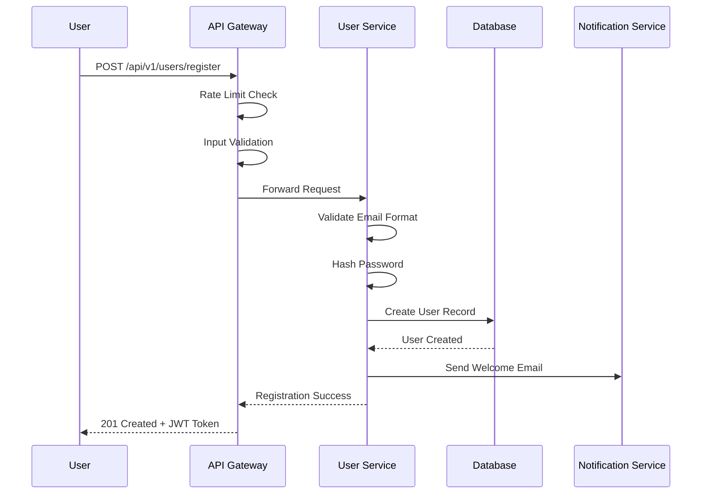
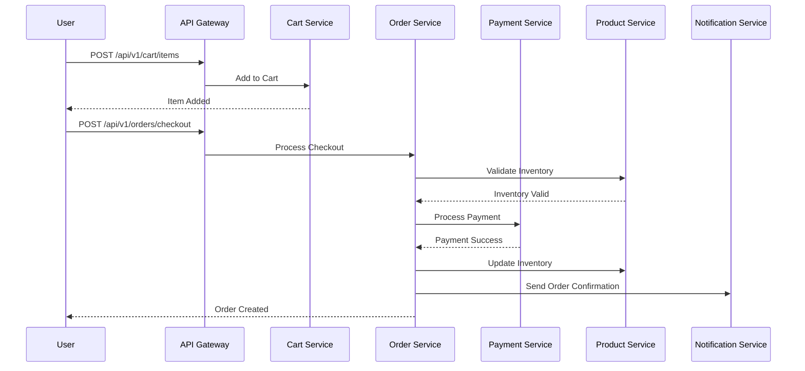
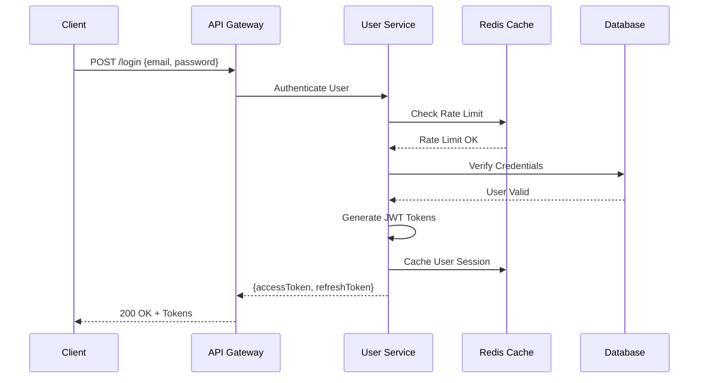
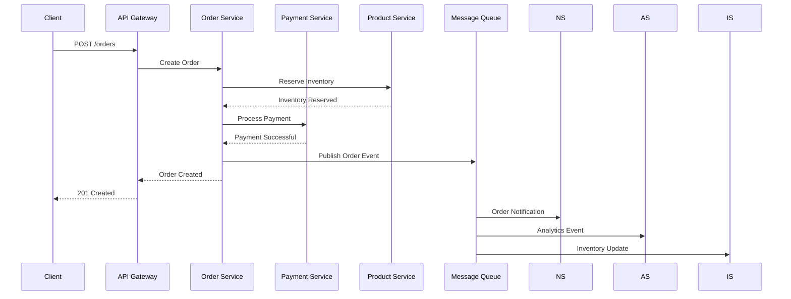

# Low-Level Design Document

## E-Commerce Platform - Detailed Implementation Specifications

### 1. Component Specifications

#### 1.1 API Gateway Component

**Technology Stack:**
- Kong Gateway / AWS API Gateway
- Redis for rate limiting
- JWT for authentication

**Implementation Details:**
```yaml
api_gateway:
  routes:
    - path: /api/v1/users/*
      service: user-service
      plugins:
        - rate-limiting: 1000/hour
        - jwt-auth
        - cors
    - path: /api/v1/products/*
      service: product-service
      plugins:
        - rate-limiting: 2000/hour
        - cors
    - path: /api/v1/orders/*
      service: order-service
      plugins:
        - rate-limiting: 500/hour
        - jwt-auth
        - request-validator
```

**Circuit Breaker Configuration:**
```javascript
const circuitBreakerOptions = {
  timeout: 3000,
  errorThresholdPercentage: 50,
  resetTimeout: 30000,
  requestVolumeThreshold: 10,
  sleepWindow: 5000,
  rollingCountTimeout: 10000
};
```

#### 1.2 User Service Component

**Database Schema:**
```sql
CREATE TABLE users (
    user_id UUID PRIMARY KEY DEFAULT gen_random_uuid(),
    email VARCHAR(255) UNIQUE NOT NULL,
    password_hash VARCHAR(255) NOT NULL,
    first_name VARCHAR(100) NOT NULL,
    last_name VARCHAR(100) NOT NULL,
    phone_number VARCHAR(20),
    date_created TIMESTAMP DEFAULT CURRENT_TIMESTAMP,
    last_login TIMESTAMP,
    is_active BOOLEAN DEFAULT TRUE,
    user_type VARCHAR(20) CHECK (user_type IN ('Consumer', 'Seller', 'Admin')),
    created_at TIMESTAMP DEFAULT CURRENT_TIMESTAMP,
    updated_at TIMESTAMP DEFAULT CURRENT_TIMESTAMP
);

CREATE TABLE profiles (
    profile_id UUID PRIMARY KEY DEFAULT gen_random_uuid(),
    user_id UUID REFERENCES users(user_id) ON DELETE CASCADE,
    address TEXT,
    city VARCHAR(100),
    state VARCHAR(100),
    zip_code VARCHAR(20),
    country VARCHAR(100),
    preferences JSONB,
    avatar_url VARCHAR(500),
    created_at TIMESTAMP DEFAULT CURRENT_TIMESTAMP,
    updated_at TIMESTAMP DEFAULT CURRENT_TIMESTAMP
);

CREATE TABLE roles (
    role_id UUID PRIMARY KEY DEFAULT gen_random_uuid(),
    role_name VARCHAR(50) UNIQUE NOT NULL,
    permissions JSONB NOT NULL,
    description TEXT,
    created_at TIMESTAMP DEFAULT CURRENT_TIMESTAMP
);

CREATE TABLE user_roles (
    user_id UUID REFERENCES users(user_id) ON DELETE CASCADE,
    role_id UUID REFERENCES roles(role_id) ON DELETE CASCADE,
    assigned_at TIMESTAMP DEFAULT CURRENT_TIMESTAMP,
    PRIMARY KEY (user_id, role_id)
);
```

**API Endpoints:**
```javascript
// User Registration
POST /api/v1/users/register
Content-Type: application/json
{
  "email": "user@example.com",
  "password": "SecurePass123!",
  "firstName": "John",
  "lastName": "Doe",
  "phoneNumber": "+1234567890",
  "userType": "Consumer"
}

// User Authentication
POST /api/v1/users/login
Content-Type: application/json
{
  "email": "user@example.com",
  "password": "SecurePass123!"
}

// Profile Management
PUT /api/v1/users/{userId}/profile
Authorization: Bearer {jwt_token}
Content-Type: application/json
{
  "address": "123 Main St",
  "city": "New York",
  "state": "NY",
  "zipCode": "10001",
  "country": "USA",
  "preferences": {
    "notifications": true,
    "theme": "dark"
  }
}
```

**Security Implementation:**
```javascript
const bcrypt = require('bcrypt');
const jwt = require('jsonwebtoken');
const rateLimit = require('express-rate-limit');

// Password hashing
const hashPassword = async (password) => {
  const saltRounds = 12;
  return await bcrypt.hash(password, saltRounds);
};

// JWT token generation
const generateTokens = (user) => {
  const accessToken = jwt.sign(
    { userId: user.user_id, email: user.email, userType: user.user_type },
    process.env.JWT_SECRET,
    { expiresIn: '15m' }
  );
  
  const refreshToken = jwt.sign(
    { userId: user.user_id },
    process.env.JWT_REFRESH_SECRET,
    { expiresIn: '7d' }
  );
  
  return { accessToken, refreshToken };
};

// Rate limiting
const loginLimiter = rateLimit({
  windowMs: 15 * 60 * 1000, // 15 minutes
  max: 5, // limit each IP to 5 requests per windowMs
  message: 'Too many login attempts, please try again later.'
});
```

#### 1.3 Product Service Component

**Database Schema:**
```sql
CREATE TABLE categories (
    category_id UUID PRIMARY KEY DEFAULT gen_random_uuid(),
    name VARCHAR(100) NOT NULL,
    description TEXT,
    parent_category_id UUID REFERENCES categories(category_id),
    created_at TIMESTAMP DEFAULT CURRENT_TIMESTAMP,
    updated_at TIMESTAMP DEFAULT CURRENT_TIMESTAMP
);

CREATE TABLE products (
    product_id UUID PRIMARY KEY DEFAULT gen_random_uuid(),
    seller_id UUID REFERENCES users(user_id) ON DELETE CASCADE,
    name VARCHAR(255) NOT NULL,
    description TEXT,
    price DECIMAL(10,2) NOT NULL CHECK (price >= 0),
    stock_quantity INTEGER NOT NULL CHECK (stock_quantity >= 0),
    category_id UUID REFERENCES categories(category_id),
    image_urls JSONB,
    is_active BOOLEAN DEFAULT TRUE,
    date_created TIMESTAMP DEFAULT CURRENT_TIMESTAMP,
    last_modified TIMESTAMP DEFAULT CURRENT_TIMESTAMP,
    search_vector tsvector
);

-- Full-text search index
CREATE INDEX idx_products_search ON products USING GIN(search_vector);
CREATE INDEX idx_products_category ON products(category_id);
CREATE INDEX idx_products_seller ON products(seller_id);
CREATE INDEX idx_products_price ON products(price);
```

**Search Implementation:**
```javascript
const searchProducts = async (query, filters = {}) => {
  let sqlQuery = `
    SELECT p.*, c.name as category_name,
           ts_rank(p.search_vector, plainto_tsquery($1)) as rank
    FROM products p
    LEFT JOIN categories c ON p.category_id = c.category_id
    WHERE p.is_active = true
  `;
  
  const params = [query];
  let paramIndex = 2;
  
  if (query) {
    sqlQuery += ` AND p.search_vector @@ plainto_tsquery($1)`;
  }
  
  if (filters.categoryId) {
    sqlQuery += ` AND p.category_id = $${paramIndex}`;
    params.push(filters.categoryId);
    paramIndex++;
  }
  
  if (filters.minPrice) {
    sqlQuery += ` AND p.price >= $${paramIndex}`;
    params.push(filters.minPrice);
    paramIndex++;
  }
  
  if (filters.maxPrice) {
    sqlQuery += ` AND p.price <= $${paramIndex}`;
    params.push(filters.maxPrice);
    paramIndex++;
  }
  
  sqlQuery += ` ORDER BY rank DESC, p.date_created DESC`;
  sqlQuery += ` LIMIT ${filters.limit || 20} OFFSET ${filters.offset || 0}`;
  
  return await db.query(sqlQuery, params);
};
```

#### 1.4 Cart Service Component

**Database Schema:**
```sql
CREATE TABLE carts (
    cart_id UUID PRIMARY KEY DEFAULT gen_random_uuid(),
    user_id UUID REFERENCES users(user_id) ON DELETE CASCADE,
    date_created TIMESTAMP DEFAULT CURRENT_TIMESTAMP,
    last_modified TIMESTAMP DEFAULT CURRENT_TIMESTAMP
);

CREATE TABLE cart_items (
    cart_item_id UUID PRIMARY KEY DEFAULT gen_random_uuid(),
    cart_id UUID REFERENCES carts(cart_id) ON DELETE CASCADE,
    product_id UUID REFERENCES products(product_id) ON DELETE CASCADE,
    quantity INTEGER NOT NULL CHECK (quantity > 0),
    price_at_add DECIMAL(10,2) NOT NULL,
    added_at TIMESTAMP DEFAULT CURRENT_TIMESTAMP,
    UNIQUE(cart_id, product_id)
);
```

**Redis Cache Implementation:**
```javascript
const redis = require('redis');
const client = redis.createClient();

class CartService {
  async addToCart(userId, productId, quantity) {
    const cacheKey = `cart:${userId}`;
    
    // Get current cart from cache
    let cart = await client.get(cacheKey);
    cart = cart ? JSON.parse(cart) : { items: [] };
    
    // Update cart
    const existingItem = cart.items.find(item => item.productId === productId);
    if (existingItem) {
      existingItem.quantity += quantity;
    } else {
      const product = await this.getProduct(productId);
      cart.items.push({
        productId,
        quantity,
        price: product.price,
        name: product.name
      });
    }
    
    // Update cache and database
    await client.setex(cacheKey, 3600, JSON.stringify(cart));
    await this.persistCartToDatabase(userId, cart);
    
    return cart;
  }
  
  async getCart(userId) {
    const cacheKey = `cart:${userId}`;
    let cart = await client.get(cacheKey);
    
    if (!cart) {
      cart = await this.getCartFromDatabase(userId);
      await client.setex(cacheKey, 3600, JSON.stringify(cart));
    } else {
      cart = JSON.parse(cart);
    }
    
    return cart;
  }
}
```

#### 1.5 Order Service Component

**Database Schema:**
```sql
CREATE TABLE orders (
    order_id UUID PRIMARY KEY DEFAULT gen_random_uuid(),
    user_id UUID REFERENCES users(user_id) ON DELETE CASCADE,
    order_status VARCHAR(20) CHECK (order_status IN ('Pending', 'Processing', 'Shipped', 'Delivered', 'Cancelled')) DEFAULT 'Pending',
    total_amount DECIMAL(10,2) NOT NULL,
    shipping_address JSONB NOT NULL,
    billing_address JSONB NOT NULL,
    payment_method_id UUID REFERENCES payment_methods(payment_method_id),
    date_created TIMESTAMP DEFAULT CURRENT_TIMESTAMP,
    estimated_delivery DATE,
    tracking_number VARCHAR(100),
    updated_at TIMESTAMP DEFAULT CURRENT_TIMESTAMP
);

CREATE TABLE order_items (
    order_item_id UUID PRIMARY KEY DEFAULT gen_random_uuid(),
    order_id UUID REFERENCES orders(order_id) ON DELETE CASCADE,
    product_id UUID REFERENCES products(product_id),
    quantity INTEGER NOT NULL CHECK (quantity > 0),
    price_at_order DECIMAL(10,2) NOT NULL,
    seller_id UUID REFERENCES users(user_id),
    created_at TIMESTAMP DEFAULT CURRENT_TIMESTAMP
);
```

**Order Processing Workflow:**
```javascript
const { EventEmitter } = require('events');

class OrderService extends EventEmitter {
  async processOrder(orderData) {
    const transaction = await db.beginTransaction();
    
    try {
      // 1. Create order
      const order = await this.createOrder(orderData, transaction);
      
      // 2. Validate inventory
      await this.validateInventory(order.items, transaction);
      
      // 3. Reserve inventory
      await this.reserveInventory(order.items, transaction);
      
      // 4. Process payment
      const paymentResult = await this.processPayment(order, transaction);
      
      if (paymentResult.status === 'success') {
        // 5. Update order status
        await this.updateOrderStatus(order.order_id, 'Processing', transaction);
        
        // 6. Clear cart
        await this.clearCart(order.user_id, transaction);
        
        await transaction.commit();
        
        // 7. Emit events
        this.emit('orderCreated', order);
        this.emit('inventoryUpdated', order.items);
        this.emit('paymentProcessed', paymentResult);
        
        return order;
      } else {
        await transaction.rollback();
        throw new Error('Payment processing failed');
      }
    } catch (error) {
      await transaction.rollback();
      throw error;
    }
  }
}
```

#### 1.6 Payment Service Component

**Database Schema:**
```sql
CREATE TABLE payment_methods (
    payment_method_id UUID PRIMARY KEY DEFAULT gen_random_uuid(),
    user_id UUID REFERENCES users(user_id) ON DELETE CASCADE,
    type VARCHAR(20) CHECK (type IN ('Credit', 'Debit', 'Digital Wallet')) NOT NULL,
    masked_details VARCHAR(100) NOT NULL,
    is_default BOOLEAN DEFAULT FALSE,
    expiry_date DATE,
    created_at TIMESTAMP DEFAULT CURRENT_TIMESTAMP,
    updated_at TIMESTAMP DEFAULT CURRENT_TIMESTAMP
);

CREATE TABLE payments (
    payment_id UUID PRIMARY KEY DEFAULT gen_random_uuid(),
    order_id UUID REFERENCES orders(order_id) ON DELETE CASCADE,
    payment_method_id UUID REFERENCES payment_methods(payment_method_id),
    amount DECIMAL(10,2) NOT NULL,
    payment_status VARCHAR(20) CHECK (payment_status IN ('Pending', 'Processing', 'Success', 'Failed', 'Refunded')) DEFAULT 'Pending',
    transaction_id VARCHAR(100),
    date_processed TIMESTAMP DEFAULT CURRENT_TIMESTAMP,
    gateway_response JSONB,
    created_at TIMESTAMP DEFAULT CURRENT_TIMESTAMP
);
```

**Stripe Integration:**
```javascript
const stripe = require('stripe')(process.env.STRIPE_SECRET_KEY);

class PaymentService {
  async processPayment(orderData, paymentMethodId) {
    try {
      // Create payment intent
      const paymentIntent = await stripe.paymentIntents.create({
        amount: Math.round(orderData.total_amount * 100), // Convert to cents
        currency: 'usd',
        payment_method: paymentMethodId,
        confirmation_method: 'manual',
        confirm: true,
        metadata: {
          orderId: orderData.order_id,
          userId: orderData.user_id
        }
      });
      
      // Log payment attempt
      await this.logPayment({
        order_id: orderData.order_id,
        payment_method_id: paymentMethodId,
        amount: orderData.total_amount,
        transaction_id: paymentIntent.id,
        payment_status: paymentIntent.status === 'succeeded' ? 'Success' : 'Failed',
        gateway_response: paymentIntent
      });
      
      return {
        status: paymentIntent.status === 'succeeded' ? 'success' : 'failed',
        transactionId: paymentIntent.id,
        gatewayResponse: paymentIntent
      };
    } catch (error) {
      await this.logPayment({
        order_id: orderData.order_id,
        payment_method_id: paymentMethodId,
        amount: orderData.total_amount,
        payment_status: 'Failed',
        gateway_response: { error: error.message }
      });
      
      throw error;
    }
  }
}
```

### 2. Data Flow Diagrams

#### 2.1 User Registration Flow


#### 2.2 Product Purchase Flow


### 3. Sequence Diagrams

#### 3.1 Authentication Sequence


#### 3.2 Order Processing Sequence


### 4. Implementation Details

#### 4.1 Database Indexing Strategy
```sql
-- User service indexes
CREATE INDEX idx_users_email ON users(email);
CREATE INDEX idx_users_type ON users(user_type);
CREATE INDEX idx_users_active ON users(is_active);

-- Product service indexes
CREATE INDEX idx_products_category_price ON products(category_id, price);
CREATE INDEX idx_products_seller_active ON products(seller_id, is_active);
CREATE INDEX idx_products_created ON products(date_created DESC);

-- Order service indexes
CREATE INDEX idx_orders_user_status ON orders(user_id, order_status);
CREATE INDEX idx_orders_date ON orders(date_created DESC);
CREATE INDEX idx_order_items_product ON order_items(product_id);
```

#### 4.2 Caching Strategy
```javascript
const cacheConfig = {
  // User sessions
  userSessions: {
    ttl: 900, // 15 minutes
    prefix: 'session:'
  },
  
  // Product catalog
  products: {
    ttl: 3600, // 1 hour
    prefix: 'product:'
  },
  
  // Shopping carts
  carts: {
    ttl: 3600, // 1 hour
    prefix: 'cart:'
  },
  
  // Search results
  searchResults: {
    ttl: 1800, // 30 minutes
    prefix: 'search:'
  }
};
```

#### 4.3 Error Handling Implementation
```javascript
class APIError extends Error {
  constructor(message, statusCode, errorCode) {
    super(message);
    this.statusCode = statusCode;
    this.errorCode = errorCode;
    this.timestamp = new Date().toISOString();
  }
}

const errorHandler = (err, req, res, next) => {
  // Log error
  logger.error({
    error: err.message,
    stack: err.stack,
    url: req.url,
    method: req.method,
    ip: req.ip,
    userAgent: req.get('User-Agent'),
    correlationId: req.correlationId
  });
  
  if (err instanceof APIError) {
    return res.status(err.statusCode).json({
      error: {
        message: err.message,
        code: err.errorCode,
        timestamp: err.timestamp,
        correlationId: req.correlationId
      }
    });
  }
  
  // Default error response
  res.status(500).json({
    error: {
      message: 'Internal server error',
      code: 'INTERNAL_ERROR',
      timestamp: new Date().toISOString(),
      correlationId: req.correlationId
    }
  });
};
```

#### 4.4 Monitoring and Logging
```javascript
const winston = require('winston');
const prometheus = require('prom-client');

// Metrics
const httpRequestDuration = new prometheus.Histogram({
  name: 'http_request_duration_seconds',
  help: 'Duration of HTTP requests in seconds',
  labelNames: ['method', 'route', 'status_code']
});

const httpRequestTotal = new prometheus.Counter({
  name: 'http_requests_total',
  help: 'Total number of HTTP requests',
  labelNames: ['method', 'route', 'status_code']
});

// Logger configuration
const logger = winston.createLogger({
  level: 'info',
  format: winston.format.combine(
    winston.format.timestamp(),
    winston.format.errors({ stack: true }),
    winston.format.json()
  ),
  defaultMeta: { service: 'ecommerce-api' },
  transports: [
    new winston.transports.File({ filename: 'error.log', level: 'error' }),
    new winston.transports.File({ filename: 'combined.log' })
  ]
});
```

### 5. Security Implementation

#### 5.1 Input Validation
```javascript
const Joi = require('joi');

const userRegistrationSchema = Joi.object({
  email: Joi.string().email().required(),
  password: Joi.string().min(8).pattern(/^(?=.*[a-z])(?=.*[A-Z])(?=.*\d)(?=.*[@$!%*?&])[A-Za-z\d@$!%*?&]/).required(),
  firstName: Joi.string().min(2).max(50).required(),
  lastName: Joi.string().min(2).max(50).required(),
  phoneNumber: Joi.string().pattern(/^\+?[1-9]\d{1,14}$/),
  userType: Joi.string().valid('Consumer', 'Seller', 'Admin').default('Consumer')
});

const validateInput = (schema) => {
  return (req, res, next) => {
    const { error, value } = schema.validate(req.body);
    if (error) {
      return res.status(400).json({
        error: {
          message: 'Validation error',
          details: error.details.map(d => d.message)
        }
      });
    }
    req.body = value;
    next();
  };
};
```

#### 5.2 SQL Injection Prevention
```javascript
const { Pool } = require('pg');

class DatabaseService {
  constructor() {
    this.pool = new Pool({
      connectionString: process.env.DATABASE_URL,
      ssl: process.env.NODE_ENV === 'production'
    });
  }
  
  async query(text, params) {
    const start = Date.now();
    try {
      const result = await this.pool.query(text, params);
      const duration = Date.now() - start;
      logger.info('Executed query', { text, duration, rows: result.rowCount });
      return result;
    } catch (error) {
      logger.error('Query error', { text, error: error.message });
      throw error;
    }
  }
  
  // Safe user lookup
  async getUserByEmail(email) {
    const query = 'SELECT * FROM users WHERE email = $1 AND is_active = true';
    const result = await this.query(query, [email]);
    return result.rows[0];
  }
}
```

#### 5.3 Encryption Implementation
```javascript
const crypto = require('crypto');

class EncryptionService {
  constructor() {
    this.algorithm = 'aes-256-gcm';
    this.secretKey = crypto.scryptSync(process.env.ENCRYPTION_KEY, 'salt', 32);
  }
  
  encrypt(text) {
    const iv = crypto.randomBytes(16);
    const cipher = crypto.createCipher(this.algorithm, this.secretKey);
    cipher.setAAD(Buffer.from('ecommerce-platform', 'utf8'));
    
    let encrypted = cipher.update(text, 'utf8', 'hex');
    encrypted += cipher.final('hex');
    
    const authTag = cipher.getAuthTag();
    
    return {
      encrypted,
      iv: iv.toString('hex'),
      authTag: authTag.toString('hex')
    };
  }
  
  decrypt(encryptedData) {
    const decipher = crypto.createDecipher(this.algorithm, this.secretKey);
    decipher.setAAD(Buffer.from('ecommerce-platform', 'utf8'));
    decipher.setAuthTag(Buffer.from(encryptedData.authTag, 'hex'));
    
    let decrypted = decipher.update(encryptedData.encrypted, 'hex', 'utf8');
    decrypted += decipher.final('utf8');
    
    return decrypted;
  }
}
```

### 6. Performance Optimization

#### 6.1 Connection Pooling
```javascript
const connectionPoolConfig = {
  host: process.env.DB_HOST,
  port: process.env.DB_PORT,
  database: process.env.DB_NAME,
  user: process.env.DB_USER,
  password: process.env.DB_PASSWORD,
  min: 5,
  max: 20,
  acquireTimeoutMillis: 30000,
  createTimeoutMillis: 30000,
  destroyTimeoutMillis: 5000,
  idleTimeoutMillis: 30000,
  reapIntervalMillis: 1000,
  createRetryIntervalMillis: 100
};
```

#### 6.2 Query Optimization
```sql
-- Optimized product search query
EXPLAIN ANALYZE
SELECT p.product_id, p.name, p.price, p.image_urls,
       c.name as category_name,
       AVG(r.rating) as avg_rating,
       COUNT(r.review_id) as review_count
FROM products p
LEFT JOIN categories c ON p.category_id = c.category_id
LEFT JOIN reviews r ON p.product_id = r.product_id
WHERE p.is_active = true
  AND p.search_vector @@ plainto_tsquery('laptop')
  AND p.price BETWEEN 500 AND 2000
GROUP BY p.product_id, p.name, p.price, p.image_urls, c.name
ORDER BY ts_rank(p.search_vector, plainto_tsquery('laptop')) DESC,
         avg_rating DESC NULLS LAST
LIMIT 20;
```

### 7. Testing Strategy

#### 7.1 Unit Tests
```javascript
const request = require('supertest');
const app = require('../app');
const { setupTestDB, cleanupTestDB } = require('../test/helpers');

describe('User Service', () => {
  beforeEach(async () => {
    await setupTestDB();
  });
  
  afterEach(async () => {
    await cleanupTestDB();
  });
  
  describe('POST /api/v1/users/register', () => {
    it('should register a new user successfully', async () => {
      const userData = {
        email: 'test@example.com',
        password: 'SecurePass123!',
        firstName: 'John',
        lastName: 'Doe',
        userType: 'Consumer'
      };
      
      const response = await request(app)
        .post('/api/v1/users/register')
        .send(userData)
        .expect(201);
      
      expect(response.body).toHaveProperty('accessToken');
      expect(response.body).toHaveProperty('refreshToken');
      expect(response.body.user.email).toBe(userData.email);
    });
    
    it('should reject registration with invalid email', async () => {
      const userData = {
        email: 'invalid-email',
        password: 'SecurePass123!',
        firstName: 'John',
        lastName: 'Doe'
      };
      
      await request(app)
        .post('/api/v1/users/register')
        .send(userData)
        .expect(400);
    });
  });
});
```

#### 7.2 Integration Tests
```javascript
describe('Order Processing Integration', () => {
  it('should process complete order flow', async () => {
    // 1. Register user
    const user = await createTestUser();
    const authToken = await getAuthToken(user);
    
    // 2. Create product
    const product = await createTestProduct();
    
    // 3. Add to cart
    await request(app)
      .post('/api/v1/cart/items')
      .set('Authorization', `Bearer ${authToken}`)
      .send({ productId: product.id, quantity: 2 })
      .expect(200);
    
    // 4. Process checkout
    const orderData = {
      shippingAddress: testAddress,
      billingAddress: testAddress,
      paymentMethodId: 'test_payment_method'
    };
    
    const response = await request(app)
      .post('/api/v1/orders/checkout')
      .set('Authorization', `Bearer ${authToken}`)
      .send(orderData)
      .expect(201);
    
    // 5. Verify order creation
    expect(response.body.order).toHaveProperty('orderId');
    expect(response.body.order.status).toBe('Processing');
    
    // 6. Verify inventory update
    const updatedProduct = await getProduct(product.id);
    expect(updatedProduct.stockQuantity).toBe(product.stockQuantity - 2);
  });
});
```

### 8. Deployment Configuration

#### 8.1 Docker Configuration
```dockerfile
# Multi-stage build for Node.js service
FROM node:18-alpine AS builder
WORKDIR /app
COPY package*.json ./
RUN npm ci --only=production

FROM node:18-alpine AS runtime
RUN addgroup -g 1001 -S nodejs
RUN adduser -S nextjs -u 1001

WORKDIR /app
COPY --from=builder --chown=nextjs:nodejs /app/node_modules ./node_modules
COPY --chown=nextjs:nodejs . .

USER nextjs
EXPOSE 3000
CMD ["npm", "start"]
```

#### 8.2 Kubernetes Deployment
```yaml
apiVersion: apps/v1
kind: Deployment
metadata:
  name: user-service
spec:
  replicas: 3
  selector:
    matchLabels:
      app: user-service
  template:
    metadata:
      labels:
        app: user-service
    spec:
      containers:
      - name: user-service
        image: ecommerce/user-service:latest
        ports:
        - containerPort: 3000
        env:
        - name: DATABASE_URL
          valueFrom:
            secretKeyRef:
              name: db-secret
              key: url
        - name: JWT_SECRET
          valueFrom:
            secretKeyRef:
              name: jwt-secret
              key: secret
        resources:
          requests:
            memory: "256Mi"
            cpu: "250m"
          limits:
            memory: "512Mi"
            cpu: "500m"
        livenessProbe:
          httpGet:
            path: /health
            port: 3000
          initialDelaySeconds: 30
          periodSeconds: 10
        readinessProbe:
          httpGet:
            path: /ready
            port: 3000
          initialDelaySeconds: 5
          periodSeconds: 5
```

### 9. Compliance and Audit

#### 9.1 Audit Logging
```javascript
class AuditLogger {
  static async logUserAction(userId, action, resource, details = {}) {
    const auditEntry = {
      user_id: userId,
      action,
      resource,
      details: JSON.stringify(details),
      ip_address: details.ipAddress,
      user_agent: details.userAgent,
      timestamp: new Date(),
      correlation_id: details.correlationId
    };
    
    await db.query(
      'INSERT INTO audit_logs (user_id, action, resource, details, ip_address, user_agent, timestamp, correlation_id) VALUES ($1, $2, $3, $4, $5, $6, $7, $8)',
      Object.values(auditEntry)
    );
  }
  
  static async logSecurityEvent(eventType, severity, details) {
    const securityEvent = {
      event_type: eventType,
      severity,
      details: JSON.stringify(details),
      timestamp: new Date(),
      source_ip: details.sourceIp,
      resolved: false
    };
    
    await db.query(
      'INSERT INTO security_events (event_type, severity, details, timestamp, source_ip, resolved) VALUES ($1, $2, $3, $4, $5, $6)',
      Object.values(securityEvent)
    );
    
    // Alert security team for high severity events
    if (severity === 'HIGH' || severity === 'CRITICAL') {
      await this.alertSecurityTeam(securityEvent);
    }
  }
}
```

#### 9.2 Data Retention Policy
```javascript
class DataRetentionService {
  async enforceRetentionPolicies() {
    const policies = [
      {
        table: 'audit_logs',
        retentionDays: 2555, // 7 years
        dateColumn: 'timestamp'
      },
      {
        table: 'user_sessions',
        retentionDays: 30,
        dateColumn: 'created_at'
      },
      {
        table: 'cart_items',
        retentionDays: 90,
        dateColumn: 'added_at',
        condition: 'cart_id NOT IN (SELECT cart_id FROM active_carts)'
      }
    ];
    
    for (const policy of policies) {
      await this.cleanupOldData(policy);
    }
  }
  
  async cleanupOldData(policy) {
    const cutoffDate = new Date();
    cutoffDate.setDate(cutoffDate.getDate() - policy.retentionDays);
    
    let query = `DELETE FROM ${policy.table} WHERE ${policy.dateColumn} < $1`;
    const params = [cutoffDate];
    
    if (policy.condition) {
      query += ` AND ${policy.condition}`;
    }
    
    const result = await db.query(query, params);
    
    logger.info(`Data retention cleanup completed`, {
      table: policy.table,
      deletedRows: result.rowCount,
      cutoffDate
    });
  }
}
```

This comprehensive Low-Level Design document provides detailed implementation specifications for all components of the e-commerce platform, including database schemas, API implementations, security measures, performance optimizations, and compliance features. The design ensures scalability, security, and maintainability while meeting all enterprise requirements.