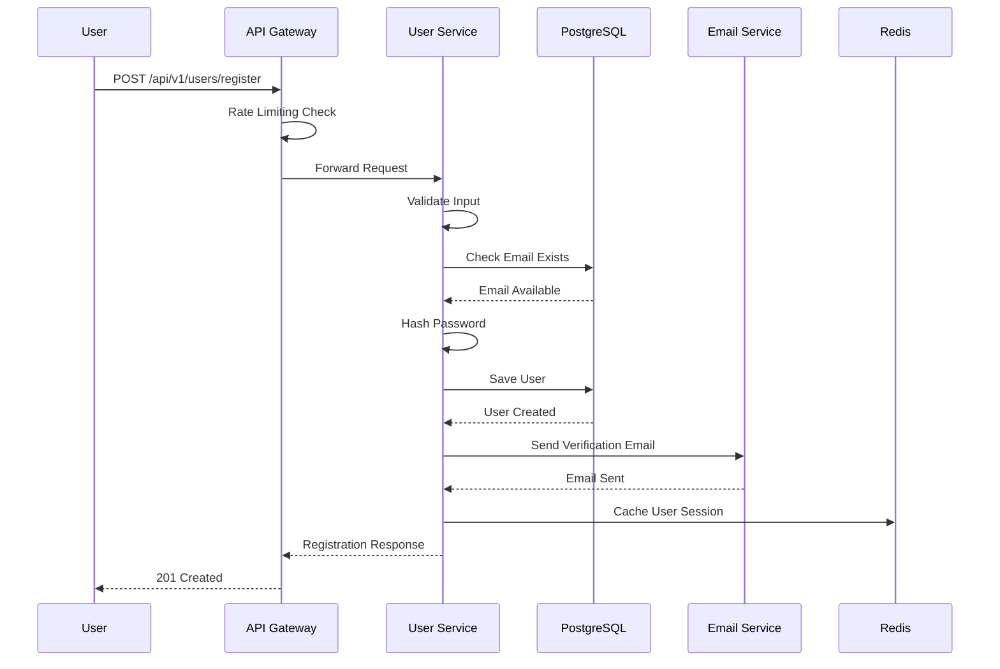
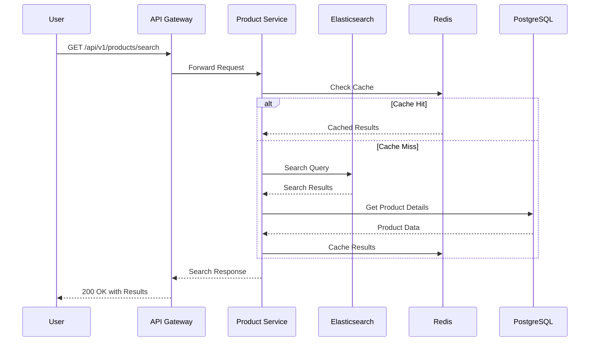
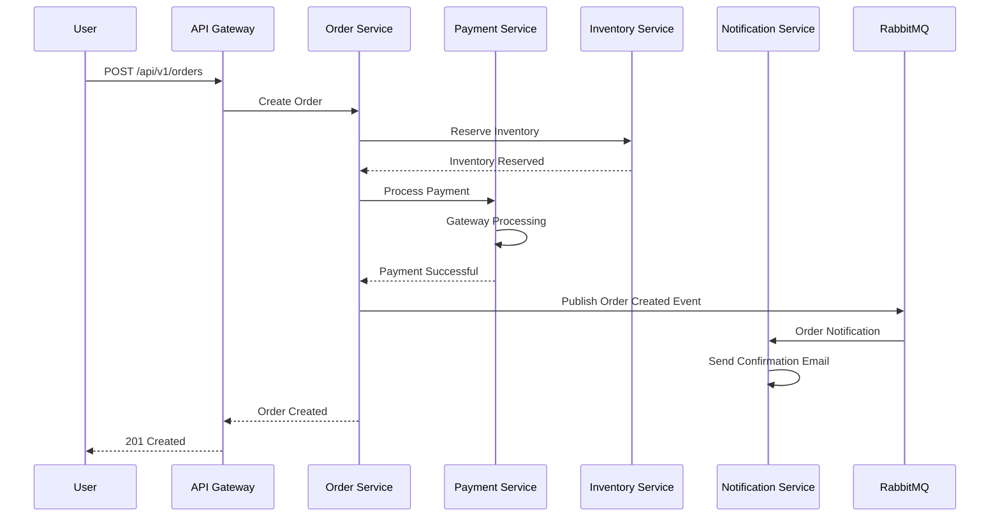

# DavTest12 Online Shopping Platform - Low-Level Design Document

## 1. Introduction

### 1.1 Purpose
This Low-Level Design (LLD) document provides detailed technical specifications for the DavTest12 Online Shopping Platform based on the High-Level Design. It includes component specifications, data flows, sequence diagrams, API definitions, and implementation details.

### 1.2 Scope
This document covers the detailed design of all microservices, database schemas, API specifications, security implementations, and deployment configurations for the online shopping platform.

### 1.3 Architecture Overview
The system follows a microservices architecture pattern with the following key components:
- API Gateway (Kong)
- 6 Core Microservices
- PostgreSQL and Redis databases
- Message Queue (RabbitMQ)
- External integrations

## 2. Component Specifications

### 2.1 API Gateway Component

#### 2.1.1 Technology Stack
- **Framework:** Kong API Gateway
- **Load Balancer:** Nginx
- **SSL Termination:** Let's Encrypt
- **Rate Limiting:** Kong Rate Limiting Plugin

#### 2.1.2 Configuration
```yaml
services:
- name: user-service
  url: http://user-service:8080
  plugins:
  - name: rate-limiting
    config:
      minute: 1000
      policy: redis
  - name: jwt
    config:
      secret_is_base64: false

- name: product-service
  url: http://product-service:8080
  plugins:
  - name: rate-limiting
    config:
      minute: 2000
      policy: redis
```

#### 2.1.3 Routing Rules
```javascript
const routes = {
  '/api/v1/users/**': 'user-service',
  '/api/v1/products/**': 'product-service',
  '/api/v1/orders/**': 'order-service',
  '/api/v1/payments/**': 'payment-service',
  '/api/v1/cart/**': 'cart-service',
  '/api/v1/notifications/**': 'notification-service'
};
```

### 2.2 User Service Component

#### 2.2.1 Technology Stack
- **Framework:** Spring Boot 3.1.0
- **Database:** PostgreSQL 15
- **Cache:** Redis 7.0
- **Security:** Spring Security 6.0
- **Authentication:** JWT with RS256

#### 2.2.2 Database Schema
```sql
CREATE TABLE users (
    user_id UUID PRIMARY KEY DEFAULT gen_random_uuid(),
    email VARCHAR(255) UNIQUE NOT NULL,
    password_hash VARCHAR(255) NOT NULL,
    first_name VARCHAR(100) NOT NULL,
    last_name VARCHAR(100) NOT NULL,
    phone VARCHAR(20),
    role VARCHAR(20) DEFAULT 'CONSUMER' CHECK (role IN ('CONSUMER', 'SELLER', 'ADMIN')),
    is_active BOOLEAN DEFAULT true,
    email_verified BOOLEAN DEFAULT false,
    created_at TIMESTAMP DEFAULT CURRENT_TIMESTAMP,
    updated_at TIMESTAMP DEFAULT CURRENT_TIMESTAMP,
    last_login TIMESTAMP,
    failed_login_attempts INTEGER DEFAULT 0,
    account_locked_until TIMESTAMP
);

CREATE TABLE user_addresses (
    address_id UUID PRIMARY KEY DEFAULT gen_random_uuid(),
    user_id UUID REFERENCES users(user_id) ON DELETE CASCADE,
    address_type VARCHAR(20) CHECK (address_type IN ('SHIPPING', 'BILLING')),
    street_address VARCHAR(255) NOT NULL,
    city VARCHAR(100) NOT NULL,
    state VARCHAR(100) NOT NULL,
    postal_code VARCHAR(20) NOT NULL,
    country VARCHAR(100) NOT NULL,
    is_default BOOLEAN DEFAULT false,
    created_at TIMESTAMP DEFAULT CURRENT_TIMESTAMP
);

CREATE TABLE user_sessions (
    session_id UUID PRIMARY KEY DEFAULT gen_random_uuid(),
    user_id UUID REFERENCES users(user_id) ON DELETE CASCADE,
    refresh_token VARCHAR(512) NOT NULL,
    expires_at TIMESTAMP NOT NULL,
    created_at TIMESTAMP DEFAULT CURRENT_TIMESTAMP,
    last_accessed TIMESTAMP DEFAULT CURRENT_TIMESTAMP,
    ip_address INET,
    user_agent TEXT
);
```

#### 2.2.3 API Specifications
```yaml
openapi: 3.0.0
info:
  title: User Service API
  version: 1.0.0
paths:
  /api/v1/users/register:
    post:
      summary: Register new user
      requestBody:
        required: true
        content:
          application/json:
            schema:
              type: object
              required: [email, password, firstName, lastName]
              properties:
                email:
                  type: string
                  format: email
                password:
                  type: string
                  minLength: 8
                  pattern: '^(?=.*[a-z])(?=.*[A-Z])(?=.*\d)(?=.*[@$!%*?&])[A-Za-z\d@$!%*?&]'
                firstName:
                  type: string
                  maxLength: 100
                lastName:
                  type: string
                  maxLength: 100
                phone:
                  type: string
                  pattern: '^\+?[1-9]\d{1,14}$'
      responses:
        '201':
          description: User created successfully
          content:
            application/json:
              schema:
                type: object
                properties:
                  userId:
                    type: string
                    format: uuid
                  message:
                    type: string
        '400':
          description: Invalid input
        '409':
          description: Email already exists

  /api/v1/users/login:
    post:
      summary: User login
      requestBody:
        required: true
        content:
          application/json:
            schema:
              type: object
              required: [email, password]
              properties:
                email:
                  type: string
                  format: email
                password:
                  type: string
      responses:
        '200':
          description: Login successful
          content:
            application/json:
              schema:
                type: object
                properties:
                  accessToken:
                    type: string
                  refreshToken:
                    type: string
                  expiresIn:
                    type: integer
                  user:
                    $ref: '#/components/schemas/User'
        '401':
          description: Invalid credentials
        '423':
          description: Account locked
```

#### 2.2.4 Service Implementation
```java
@Service
@Transactional
public class UserService {
    
    @Autowired
    private UserRepository userRepository;
    
    @Autowired
    private PasswordEncoder passwordEncoder;
    
    @Autowired
    private JwtTokenProvider jwtTokenProvider;
    
    @Autowired
    private RedisTemplate<String, Object> redisTemplate;
    
    public UserRegistrationResponse registerUser(UserRegistrationRequest request) {
        // Validate input
        validateRegistrationRequest(request);
        
        // Check if email exists
        if (userRepository.existsByEmail(request.getEmail())) {
            throw new EmailAlreadyExistsException("Email already registered");
        }
        
        // Create user entity
        User user = User.builder()
            .email(request.getEmail())
            .passwordHash(passwordEncoder.encode(request.getPassword()))
            .firstName(request.getFirstName())
            .lastName(request.getLastName())
            .phone(request.getPhone())
            .role(UserRole.CONSUMER)
            .isActive(true)
            .emailVerified(false)
            .build();
        
        // Save user
        User savedUser = userRepository.save(user);
        
        // Send verification email
        emailService.sendVerificationEmail(savedUser);
        
        return UserRegistrationResponse.builder()
            .userId(savedUser.getUserId())
            .message("User registered successfully. Please verify your email.")
            .build();
    }
    
    public LoginResponse authenticateUser(LoginRequest request) {
        // Check account lock
        User user = userRepository.findByEmail(request.getEmail())
            .orElseThrow(() -> new InvalidCredentialsException("Invalid credentials"));
        
        if (user.getAccountLockedUntil() != null && 
            user.getAccountLockedUntil().isAfter(LocalDateTime.now())) {
            throw new AccountLockedException("Account is locked");
        }
        
        // Validate password
        if (!passwordEncoder.matches(request.getPassword(), user.getPasswordHash())) {
            handleFailedLogin(user);
            throw new InvalidCredentialsException("Invalid credentials");
        }
        
        // Reset failed attempts
        user.setFailedLoginAttempts(0);
        user.setAccountLockedUntil(null);
        user.setLastLogin(LocalDateTime.now());
        userRepository.save(user);
        
        // Generate tokens
        String accessToken = jwtTokenProvider.generateAccessToken(user);
        String refreshToken = jwtTokenProvider.generateRefreshToken(user);
        
        // Store session
        UserSession session = createUserSession(user, refreshToken);
        
        return LoginResponse.builder()
            .accessToken(accessToken)
            .refreshToken(refreshToken)
            .expiresIn(900) // 15 minutes
            .user(UserDto.fromEntity(user))
            .build();
    }
    
    private void handleFailedLogin(User user) {
        int attempts = user.getFailedLoginAttempts() + 1;
        user.setFailedLoginAttempts(attempts);
        
        if (attempts >= 5) {
            user.setAccountLockedUntil(LocalDateTime.now().plusMinutes(30));
        }
        
        userRepository.save(user);
    }
}
```

### 2.3 Product Service Component

#### 2.3.1 Database Schema
```sql
CREATE TABLE categories (
    category_id UUID PRIMARY KEY DEFAULT gen_random_uuid(),
    name VARCHAR(100) NOT NULL,
    description TEXT,
    parent_id UUID REFERENCES categories(category_id),
    is_active BOOLEAN DEFAULT true,
    sort_order INTEGER DEFAULT 0,
    created_at TIMESTAMP DEFAULT CURRENT_TIMESTAMP,
    updated_at TIMESTAMP DEFAULT CURRENT_TIMESTAMP
);

CREATE TABLE products (
    product_id UUID PRIMARY KEY DEFAULT gen_random_uuid(),
    name VARCHAR(255) NOT NULL,
    description TEXT,
    price DECIMAL(10,2) NOT NULL CHECK (price >= 0),
    seller_id UUID NOT NULL,
    category_id UUID REFERENCES categories(category_id),
    inventory INTEGER DEFAULT 0 CHECK (inventory >= 0),
    sku VARCHAR(100) UNIQUE,
    weight DECIMAL(8,2),
    dimensions JSONB,
    is_active BOOLEAN DEFAULT true,
    featured BOOLEAN DEFAULT false,
    created_at TIMESTAMP DEFAULT CURRENT_TIMESTAMP,
    updated_at TIMESTAMP DEFAULT CURRENT_TIMESTAMP,
    
    CONSTRAINT fk_seller FOREIGN KEY (seller_id) REFERENCES users(user_id)
);

CREATE TABLE product_images (
    image_id UUID PRIMARY KEY DEFAULT gen_random_uuid(),
    product_id UUID REFERENCES products(product_id) ON DELETE CASCADE,
    image_url VARCHAR(512) NOT NULL,
    alt_text VARCHAR(255),
    sort_order INTEGER DEFAULT 0,
    is_primary BOOLEAN DEFAULT false,
    created_at TIMESTAMP DEFAULT CURRENT_TIMESTAMP
);

CREATE TABLE product_attributes (
    attribute_id UUID PRIMARY KEY DEFAULT gen_random_uuid(),
    product_id UUID REFERENCES products(product_id) ON DELETE CASCADE,
    attribute_name VARCHAR(100) NOT NULL,
    attribute_value VARCHAR(255) NOT NULL,
    created_at TIMESTAMP DEFAULT CURRENT_TIMESTAMP
);

-- Indexes for performance
CREATE INDEX idx_products_category ON products(category_id);
CREATE INDEX idx_products_seller ON products(seller_id);
CREATE INDEX idx_products_active ON products(is_active);
CREATE INDEX idx_products_featured ON products(featured);
CREATE INDEX idx_products_name_gin ON products USING gin(to_tsvector('english', name));
CREATE INDEX idx_products_description_gin ON products USING gin(to_tsvector('english', description));
```

#### 2.3.2 Search Implementation
```java
@Service
public class ProductSearchService {
    
    @Autowired
    private ElasticsearchRestTemplate elasticsearchTemplate;
    
    @Autowired
    private ProductRepository productRepository;
    
    public ProductSearchResponse searchProducts(ProductSearchRequest request) {
        BoolQueryBuilder boolQuery = QueryBuilders.boolQuery();
        
        // Text search
        if (StringUtils.hasText(request.getQuery())) {
            MultiMatchQueryBuilder multiMatchQuery = QueryBuilders
                .multiMatchQuery(request.getQuery())
                .field("name", 2.0f)
                .field("description", 1.0f)
                .field("attributes.value", 0.5f)
                .type(MultiMatchQueryBuilder.Type.BEST_FIELDS)
                .fuzziness(Fuzziness.AUTO);
            
            boolQuery.must(multiMatchQuery);
        }
        
        // Category filter
        if (request.getCategoryId() != null) {
            boolQuery.filter(QueryBuilders.termQuery("categoryId", request.getCategoryId()));
        }
        
        // Price range filter
        if (request.getMinPrice() != null || request.getMaxPrice() != null) {
            RangeQueryBuilder priceRange = QueryBuilders.rangeQuery("price");
            if (request.getMinPrice() != null) {
                priceRange.gte(request.getMinPrice());
            }
            if (request.getMaxPrice() != null) {
                priceRange.lte(request.getMaxPrice());
            }
            boolQuery.filter(priceRange);
        }
        
        // Active products only
        boolQuery.filter(QueryBuilders.termQuery("isActive", true));
        
        // Build search query
        NativeSearchQueryBuilder searchQueryBuilder = new NativeSearchQueryBuilder()
            .withQuery(boolQuery)
            .withPageable(PageRequest.of(request.getPage(), request.getSize()))
            .withSorts(buildSortOptions(request.getSortBy(), request.getSortDirection()));
        
        // Add aggregations for faceted search
        searchQueryBuilder.addAggregation(
            AggregationBuilders.terms("categories")
                .field("categoryId")
                .size(10)
        );
        
        searchQueryBuilder.addAggregation(
            AggregationBuilders.range("priceRanges")
                .field("price")
                .addRange("0-25", 0, 25)
                .addRange("25-50", 25, 50)
                .addRange("50-100", 50, 100)
                .addRange("100+", 100, Double.MAX_VALUE)
        );
        
        // Execute search
        SearchHits<ProductDocument> searchHits = elasticsearchTemplate
            .search(searchQueryBuilder.build(), ProductDocument.class);
        
        // Process results
        List<ProductDto> products = searchHits.getSearchHits().stream()
            .map(hit -> ProductDto.fromDocument(hit.getContent()))
            .collect(Collectors.toList());
        
        return ProductSearchResponse.builder()
            .products(products)
            .totalElements(searchHits.getTotalHits())
            .totalPages((int) Math.ceil((double) searchHits.getTotalHits() / request.getSize()))
            .currentPage(request.getPage())
            .facets(extractFacets(searchHits.getAggregations()))
            .build();
    }
}
```

### 2.4 Order Service Component

#### 2.4.1 Database Schema
```sql
CREATE TABLE orders (
    order_id UUID PRIMARY KEY DEFAULT gen_random_uuid(),
    user_id UUID NOT NULL,
    order_number VARCHAR(20) UNIQUE NOT NULL,
    status VARCHAR(20) DEFAULT 'PENDING' CHECK (status IN ('PENDING', 'CONFIRMED', 'SHIPPED', 'DELIVERED', 'CANCELLED')),
    subtotal DECIMAL(10,2) NOT NULL CHECK (subtotal >= 0),
    tax_amount DECIMAL(10,2) DEFAULT 0 CHECK (tax_amount >= 0),
    shipping_amount DECIMAL(10,2) DEFAULT 0 CHECK (shipping_amount >= 0),
    discount_amount DECIMAL(10,2) DEFAULT 0 CHECK (discount_amount >= 0),
    total_amount DECIMAL(10,2) NOT NULL CHECK (total_amount >= 0),
    currency VARCHAR(3) DEFAULT 'USD',
    shipping_address JSONB NOT NULL,
    billing_address JSONB NOT NULL,
    payment_method VARCHAR(50),
    notes TEXT,
    created_at TIMESTAMP DEFAULT CURRENT_TIMESTAMP,
    updated_at TIMESTAMP DEFAULT CURRENT_TIMESTAMP,
    confirmed_at TIMESTAMP,
    shipped_at TIMESTAMP,
    delivered_at TIMESTAMP,
    
    CONSTRAINT fk_order_user FOREIGN KEY (user_id) REFERENCES users(user_id)
);

CREATE TABLE order_items (
    order_item_id UUID PRIMARY KEY DEFAULT gen_random_uuid(),
    order_id UUID REFERENCES orders(order_id) ON DELETE CASCADE,
    product_id UUID NOT NULL,
    product_name VARCHAR(255) NOT NULL,
    product_sku VARCHAR(100),
    quantity INTEGER NOT NULL CHECK (quantity > 0),
    unit_price DECIMAL(10,2) NOT NULL CHECK (unit_price >= 0),
    total_price DECIMAL(10,2) NOT NULL CHECK (total_price >= 0),
    created_at TIMESTAMP DEFAULT CURRENT_TIMESTAMP
);

CREATE TABLE order_status_history (
    history_id UUID PRIMARY KEY DEFAULT gen_random_uuid(),
    order_id UUID REFERENCES orders(order_id) ON DELETE CASCADE,
    from_status VARCHAR(20),
    to_status VARCHAR(20) NOT NULL,
    changed_by UUID,
    reason TEXT,
    created_at TIMESTAMP DEFAULT CURRENT_TIMESTAMP
);

CREATE TABLE shipments (
    shipment_id UUID PRIMARY KEY DEFAULT gen_random_uuid(),
    order_id UUID REFERENCES orders(order_id),
    tracking_number VARCHAR(100),
    carrier VARCHAR(100),
    shipped_at TIMESTAMP,
    estimated_delivery TIMESTAMP,
    delivered_at TIMESTAMP,
    created_at TIMESTAMP DEFAULT CURRENT_TIMESTAMP
);
```

#### 2.4.2 Order State Machine
```java
@Component
public class OrderStateMachine {
    
    private static final Map<OrderStatus, Set<OrderStatus>> VALID_TRANSITIONS = Map.of(
        OrderStatus.PENDING, Set.of(OrderStatus.CONFIRMED, OrderStatus.CANCELLED),
        OrderStatus.CONFIRMED, Set.of(OrderStatus.SHIPPED, OrderStatus.CANCELLED),
        OrderStatus.SHIPPED, Set.of(OrderStatus.DELIVERED),
        OrderStatus.DELIVERED, Set.of(),
        OrderStatus.CANCELLED, Set.of()
    );
    
    public boolean isValidTransition(OrderStatus from, OrderStatus to) {
        return VALID_TRANSITIONS.get(from).contains(to);
    }
    
    @EventListener
    public void handleOrderStatusChange(OrderStatusChangedEvent event) {
        Order order = event.getOrder();
        OrderStatus newStatus = event.getNewStatus();
        
        switch (newStatus) {
            case CONFIRMED:
                handleOrderConfirmation(order);
                break;
            case SHIPPED:
                handleOrderShipment(order);
                break;
            case DELIVERED:
                handleOrderDelivery(order);
                break;
            case CANCELLED:
                handleOrderCancellation(order);
                break;
        }
    }
    
    private void handleOrderConfirmation(Order order) {
        // Reserve inventory
        inventoryService.reserveItems(order.getOrderItems());
        
        // Send confirmation email
        notificationService.sendOrderConfirmation(order);
        
        // Update analytics
        analyticsService.trackOrderConfirmation(order);
    }
    
    private void handleOrderShipment(Order order) {
        // Create shipment record
        Shipment shipment = shipmentService.createShipment(order);
        
        // Send tracking information
        notificationService.sendShippingNotification(order, shipment);
        
        // Update inventory
        inventoryService.commitReservation(order.getOrderItems());
    }
}
```

### 2.5 Payment Service Component

#### 2.5.1 Database Schema
```sql
CREATE TABLE payments (
    payment_id UUID PRIMARY KEY DEFAULT gen_random_uuid(),
    order_id UUID NOT NULL,
    amount DECIMAL(10,2) NOT NULL CHECK (amount > 0),
    currency VARCHAR(3) DEFAULT 'USD',
    method VARCHAR(20) CHECK (method IN ('CREDIT_CARD', 'DEBIT_CARD', 'PAYPAL', 'BANK_TRANSFER')),
    status VARCHAR(20) DEFAULT 'PENDING' CHECK (status IN ('PENDING', 'PROCESSING', 'COMPLETED', 'FAILED', 'REFUNDED')),
    gateway_provider VARCHAR(50),
    gateway_transaction_id VARCHAR(255),
    gateway_response JSONB,
    failure_reason TEXT,
    processed_at TIMESTAMP,
    created_at TIMESTAMP DEFAULT CURRENT_TIMESTAMP,
    updated_at TIMESTAMP DEFAULT CURRENT_TIMESTAMP
);

CREATE TABLE payment_methods (
    payment_method_id UUID PRIMARY KEY DEFAULT gen_random_uuid(),
    user_id UUID NOT NULL,
    type VARCHAR(20) NOT NULL,
    card_last_four VARCHAR(4),
    card_brand VARCHAR(20),
    card_expiry_month INTEGER,
    card_expiry_year INTEGER,
    paypal_email VARCHAR(255),
    is_default BOOLEAN DEFAULT false,
    is_active BOOLEAN DEFAULT true,
    gateway_token VARCHAR(255),
    created_at TIMESTAMP DEFAULT CURRENT_TIMESTAMP,
    
    CONSTRAINT fk_payment_method_user FOREIGN KEY (user_id) REFERENCES users(user_id)
);

CREATE TABLE refunds (
    refund_id UUID PRIMARY KEY DEFAULT gen_random_uuid(),
    payment_id UUID REFERENCES payments(payment_id),
    amount DECIMAL(10,2) NOT NULL CHECK (amount > 0),
    reason TEXT,
    status VARCHAR(20) DEFAULT 'PENDING' CHECK (status IN ('PENDING', 'PROCESSING', 'COMPLETED', 'FAILED')),
    gateway_refund_id VARCHAR(255),
    processed_at TIMESTAMP,
    created_at TIMESTAMP DEFAULT CURRENT_TIMESTAMP
);
```

#### 2.5.2 Payment Processing Implementation
```java
@Service
@Transactional
public class PaymentService {
    
    @Autowired
    private PaymentRepository paymentRepository;
    
    @Autowired
    private StripePaymentGateway stripeGateway;
    
    @Autowired
    private PayPalPaymentGateway paypalGateway;
    
    public PaymentResponse processPayment(PaymentRequest request) {
        // Create payment record
        Payment payment = Payment.builder()
            .orderId(request.getOrderId())
            .amount(request.getAmount())
            .currency(request.getCurrency())
            .method(request.getPaymentMethod())
            .status(PaymentStatus.PENDING)
            .build();
        
        payment = paymentRepository.save(payment);
        
        try {
            // Select payment gateway
            PaymentGateway gateway = selectPaymentGateway(request.getPaymentMethod());
            
            // Process payment
            PaymentGatewayResponse gatewayResponse = gateway.processPayment(
                PaymentGatewayRequest.builder()
                    .amount(request.getAmount())
                    .currency(request.getCurrency())
                    .paymentMethodToken(request.getPaymentMethodToken())
                    .orderId(request.getOrderId())
                    .build()
            );
            
            // Update payment record
            payment.setGatewayProvider(gateway.getProviderName());
            payment.setGatewayTransactionId(gatewayResponse.getTransactionId());
            payment.setGatewayResponse(gatewayResponse.getRawResponse());
            
            if (gatewayResponse.isSuccessful()) {
                payment.setStatus(PaymentStatus.COMPLETED);
                payment.setProcessedAt(LocalDateTime.now());
                
                // Publish payment completed event
                eventPublisher.publishEvent(new PaymentCompletedEvent(payment));
            } else {
                payment.setStatus(PaymentStatus.FAILED);
                payment.setFailureReason(gatewayResponse.getErrorMessage());
            }
            
            payment = paymentRepository.save(payment);
            
            return PaymentResponse.builder()
                .paymentId(payment.getPaymentId())
                .status(payment.getStatus())
                .transactionId(payment.getGatewayTransactionId())
                .message(gatewayResponse.getMessage())
                .build();
                
        } catch (Exception e) {
            payment.setStatus(PaymentStatus.FAILED);
            payment.setFailureReason(e.getMessage());
            paymentRepository.save(payment);
            
            throw new PaymentProcessingException("Payment processing failed", e);
        }
    }
    
    private PaymentGateway selectPaymentGateway(PaymentMethod method) {
        switch (method) {
            case CREDIT_CARD:
            case DEBIT_CARD:
                return stripeGateway;
            case PAYPAL:
                return paypalGateway;
            default:
                throw new UnsupportedPaymentMethodException("Unsupported payment method: " + method);
        }
    }
}
```

### 2.6 Cart Service Component

#### 2.6.1 Redis Schema Design
```java
@RedisHash("shopping_cart")
public class ShoppingCart {
    @Id
    private String cartId;
    
    @Indexed
    private String userId;
    
    private List<CartItem> items = new ArrayList<>();
    
    private BigDecimal totalAmount = BigDecimal.ZERO;
    
    @TimeToLive
    private Long ttl = 86400L; // 24 hours
    
    private LocalDateTime createdAt;
    private LocalDateTime updatedAt;
}

@Data
public class CartItem {
    private String productId;
    private String productName;
    private String productSku;
    private BigDecimal unitPrice;
    private Integer quantity;
    private BigDecimal totalPrice;
    private LocalDateTime addedAt;
}
```

#### 2.6.2 Cart Service Implementation
```java
@Service
public class CartService {
    
    @Autowired
    private CartRepository cartRepository;
    
    @Autowired
    private ProductService productService;
    
    @Autowired
    private RedisTemplate<String, Object> redisTemplate;
    
    public CartResponse addToCart(String userId, AddToCartRequest request) {
        // Get or create cart
        ShoppingCart cart = cartRepository.findByUserId(userId)
            .orElse(createNewCart(userId));
        
        // Validate product
        ProductDto product = productService.getProduct(request.getProductId());
        if (!product.isActive()) {
            throw new ProductNotAvailableException("Product is not available");
        }
        
        if (product.getInventory() < request.getQuantity()) {
            throw new InsufficientInventoryException("Not enough inventory available");
        }
        
        // Check if item already exists in cart
        Optional<CartItem> existingItem = cart.getItems().stream()
            .filter(item -> item.getProductId().equals(request.getProductId()))
            .findFirst();
        
        if (existingItem.isPresent()) {
            // Update quantity
            CartItem item = existingItem.get();
            int newQuantity = item.getQuantity() + request.getQuantity();
            
            if (product.getInventory() < newQuantity) {
                throw new InsufficientInventoryException("Not enough inventory available");
            }
            
            item.setQuantity(newQuantity);
            item.setTotalPrice(product.getPrice().multiply(BigDecimal.valueOf(newQuantity)));
        } else {
            // Add new item
            CartItem newItem = CartItem.builder()
                .productId(request.getProductId())
                .productName(product.getName())
                .productSku(product.getSku())
                .unitPrice(product.getPrice())
                .quantity(request.getQuantity())
                .totalPrice(product.getPrice().multiply(BigDecimal.valueOf(request.getQuantity())))
                .addedAt(LocalDateTime.now())
                .build();
            
            cart.getItems().add(newItem);
        }
        
        // Recalculate total
        cart.setTotalAmount(calculateCartTotal(cart));
        cart.setUpdatedAt(LocalDateTime.now());
        
        // Save cart
        cart = cartRepository.save(cart);
        
        return CartResponse.fromEntity(cart);
    }
    
    private BigDecimal calculateCartTotal(ShoppingCart cart) {
        return cart.getItems().stream()
            .map(CartItem::getTotalPrice)
            .reduce(BigDecimal.ZERO, BigDecimal::add);
    }
    
    @Scheduled(fixedRate = 300000) // Every 5 minutes
    public void validateCartInventory() {
        // Get all active carts
        Iterable<ShoppingCart> carts = cartRepository.findAll();
        
        for (ShoppingCart cart : carts) {
            boolean cartModified = false;
            Iterator<CartItem> itemIterator = cart.getItems().iterator();
            
            while (itemIterator.hasNext()) {
                CartItem item = itemIterator.next();
                
                try {
                    ProductDto product = productService.getProduct(item.getProductId());
                    
                    if (!product.isActive()) {
                        // Remove inactive products
                        itemIterator.remove();
                        cartModified = true;
                    } else if (product.getInventory() < item.getQuantity()) {
                        // Adjust quantity to available inventory
                        item.setQuantity(product.getInventory());
                        item.setTotalPrice(item.getUnitPrice().multiply(BigDecimal.valueOf(item.getQuantity())));
                        cartModified = true;
                    }
                } catch (ProductNotFoundException e) {
                    // Remove non-existent products
                    itemIterator.remove();
                    cartModified = true;
                }
            }
            
            if (cartModified) {
                cart.setTotalAmount(calculateCartTotal(cart));
                cart.setUpdatedAt(LocalDateTime.now());
                cartRepository.save(cart);
                
                // Notify user of cart changes
                notificationService.sendCartUpdateNotification(cart.getUserId(), cart);
            }
        }
    }
}
```

## 3. Data Flow Diagrams

### 3.1 User Registration Flow


### 3.2 Product Search Flow


### 3.3 Order Processing Flow


## 4. Security Implementation Details

### 4.1 JWT Token Implementation
```java
@Component
public class JwtTokenProvider {
    
    @Value("${jwt.secret}")
    private String jwtSecret;
    
    @Value("${jwt.access-token-expiration}")
    private int accessTokenExpiration;
    
    @Value("${jwt.refresh-token-expiration}")
    private int refreshTokenExpiration;
    
    private final RSAPrivateKey privateKey;
    private final RSAPublicKey publicKey;
    
    public String generateAccessToken(User user) {
        Date expiryDate = new Date(System.currentTimeMillis() + accessTokenExpiration * 1000L);
        
        return Jwts.builder()
            .setSubject(user.getUserId().toString())
            .setIssuedAt(new Date())
            .setExpiration(expiryDate)
            .claim("email", user.getEmail())
            .claim("role", user.getRole().name())
            .claim("type", "access")
            .signWith(privateKey, SignatureAlgorithm.RS256)
            .compact();
    }
    
    public String generateRefreshToken(User user) {
        Date expiryDate = new Date(System.currentTimeMillis() + refreshTokenExpiration * 1000L);
        
        return Jwts.builder()
            .setSubject(user.getUserId().toString())
            .setIssuedAt(new Date())
            .setExpiration(expiryDate)
            .claim("type", "refresh")
            .signWith(privateKey, SignatureAlgorithm.RS256)
            .compact();
    }
    
    public boolean validateToken(String token) {
        try {
            Jwts.parserBuilder()
                .setSigningKey(publicKey)
                .build()
                .parseClaimsJws(token);
            return true;
        } catch (JwtException | IllegalArgumentException e) {
            return false;
        }
    }
}
```

### 4.2 Input Validation
```java
@Component
public class InputValidator {
    
    private static final Pattern EMAIL_PATTERN = Pattern.compile(
        "^[a-zA-Z0-9._%+-]+@[a-zA-Z0-9.-]+\\.[a-zA-Z]{2,}$"
    );
    
    private static final Pattern PASSWORD_PATTERN = Pattern.compile(
        "^(?=.*[a-z])(?=.*[A-Z])(?=.*\\d)(?=.*[@$!%*?&])[A-Za-z\\d@$!%*?&]{8,}$"
    );
    
    public void validateUserRegistration(UserRegistrationRequest request) {
        List<String> errors = new ArrayList<>();
        
        // Email validation
        if (!EMAIL_PATTERN.matcher(request.getEmail()).matches()) {
            errors.add("Invalid email format");
        }
        
        // Password validation
        if (!PASSWORD_PATTERN.matcher(request.getPassword()).matches()) {
            errors.add("Password must contain at least 8 characters with uppercase, lowercase, digit and special character");
        }
        
        // Name validation
        if (request.getFirstName().length() > 100) {
            errors.add("First name cannot exceed 100 characters");
        }
        
        if (containsHtmlTags(request.getFirstName()) || containsHtmlTags(request.getLastName())) {
            errors.add("Names cannot contain HTML tags");
        }
        
        if (!errors.isEmpty()) {
            throw new ValidationException(errors);
        }
    }
    
    private boolean containsHtmlTags(String input) {
        return input != null && input.matches(".*<[^>]+>.*");
    }
}
```

### 4.3 Data Encryption
```java
@Component
public class EncryptionService {
    
    @Value("${encryption.key}")
    private String encryptionKey;
    
    private final AESUtil aesUtil;
    
    public String encryptSensitiveData(String data) {
        try {
            return aesUtil.encrypt(data, encryptionKey);
        } catch (Exception e) {
            throw new EncryptionException("Failed to encrypt data", e);
        }
    }
    
    public String decryptSensitiveData(String encryptedData) {
        try {
            return aesUtil.decrypt(encryptedData, encryptionKey);
        } catch (Exception e) {
            throw new EncryptionException("Failed to decrypt data", e);
        }
    }
}

@Component
public class AESUtil {
    
    private static final String ALGORITHM = "AES/GCM/NoPadding";
    private static final int GCM_IV_LENGTH = 12;
    private static final int GCM_TAG_LENGTH = 16;
    
    public String encrypt(String plainText, String key) throws Exception {
        SecretKeySpec secretKey = new SecretKeySpec(key.getBytes(), "AES");
        
        byte[] iv = new byte[GCM_IV_LENGTH];
        SecureRandom.getInstanceStrong().nextBytes(iv);
        
        Cipher cipher = Cipher.getInstance(ALGORITHM);
        GCMParameterSpec parameterSpec = new GCMParameterSpec(GCM_TAG_LENGTH * 8, iv);
        cipher.init(Cipher.ENCRYPT_MODE, secretKey, parameterSpec);
        
        byte[] encryptedText = cipher.doFinal(plainText.getBytes());
        
        ByteBuffer byteBuffer = ByteBuffer.allocate(4 + iv.length + encryptedText.length);
        byteBuffer.putInt(iv.length);
        byteBuffer.put(iv);
        byteBuffer.put(encryptedText);
        
        return Base64.getEncoder().encodeToString(byteBuffer.array());
    }
    
    public String decrypt(String encryptedText, String key) throws Exception {
        SecretKeySpec secretKey = new SecretKeySpec(key.getBytes(), "AES");
        
        ByteBuffer byteBuffer = ByteBuffer.wrap(Base64.getDecoder().decode(encryptedText));
        
        int ivLength = byteBuffer.getInt();
        byte[] iv = new byte[ivLength];
        byteBuffer.get(iv);
        
        byte[] cipherText = new byte[byteBuffer.remaining()];
        byteBuffer.get(cipherText);
        
        Cipher cipher = Cipher.getInstance(ALGORITHM);
        GCMParameterSpec parameterSpec = new GCMParameterSpec(GCM_TAG_LENGTH * 8, iv);
        cipher.init(Cipher.DECRYPT_MODE, secretKey, parameterSpec);
        
        byte[] plainText = cipher.doFinal(cipherText);
        
        return new String(plainText);
    }
}
```

## 5. Deployment Configuration

### 5.1 Docker Configuration
```dockerfile
# User Service Dockerfile
FROM openjdk:17-jre-slim

WORKDIR /app

COPY target/user-service-1.0.0.jar app.jar

EXPOSE 8080

ENV JAVA_OPTS="-Xmx512m -Xms256m"
ENV SPRING_PROFILES_ACTIVE=production

HEALTHCHECK --interval=30s --timeout=3s --start-period=5s --retries=3 \
  CMD curl -f http://localhost:8080/actuator/health || exit 1

CMD ["sh", "-c", "java $JAVA_OPTS -jar app.jar"]
```

### 5.2 Kubernetes Deployment
```yaml
apiVersion: apps/v1
kind: Deployment
metadata:
  name: user-service
  labels:
    app: user-service
spec:
  replicas: 3
  selector:
    matchLabels:
      app: user-service
  template:
    metadata:
      labels:
        app: user-service
    spec:
      containers:
      - name: user-service
        image: davtest12/user-service:1.0.0
        ports:
        - containerPort: 8080
        env:
        - name: SPRING_PROFILES_ACTIVE
          value: "kubernetes"
        - name: DATABASE_URL
          valueFrom:
            secretKeyRef:
              name: database-secret
              key: url
        - name: DATABASE_USERNAME
          valueFrom:
            secretKeyRef:
              name: database-secret
              key: username
        - name: DATABASE_PASSWORD
          valueFrom:
            secretKeyRef:
              name: database-secret
              key: password
        - name: JWT_SECRET
          valueFrom:
            secretKeyRef:
              name: jwt-secret
              key: private-key
        resources:
          requests:
            memory: "256Mi"
            cpu: "250m"
          limits:
            memory: "512Mi"
            cpu: "500m"
        livenessProbe:
          httpGet:
            path: /actuator/health/liveness
            port: 8080
          initialDelaySeconds: 30
          periodSeconds: 10
        readinessProbe:
          httpGet:
            path: /actuator/health/readiness
            port: 8080
          initialDelaySeconds: 5
          periodSeconds: 5
---
apiVersion: v1
kind: Service
metadata:
  name: user-service
spec:
  selector:
    app: user-service
  ports:
    - protocol: TCP
      port: 80
      targetPort: 8080
  type: ClusterIP
```

### 5.3 Database Migration Scripts
```sql
-- V1__Initial_Schema.sql
CREATE EXTENSION IF NOT EXISTS "uuid-ossp";
CREATE EXTENSION IF NOT EXISTS "pg_trgm";

-- Users table
CREATE TABLE users (
    user_id UUID PRIMARY KEY DEFAULT gen_random_uuid(),
    email VARCHAR(255) UNIQUE NOT NULL,
    password_hash VARCHAR(255) NOT NULL,
    first_name VARCHAR(100) NOT NULL,
    last_name VARCHAR(100) NOT NULL,
    phone VARCHAR(20),
    role VARCHAR(20) DEFAULT 'CONSUMER' CHECK (role IN ('CONSUMER', 'SELLER', 'ADMIN')),
    is_active BOOLEAN DEFAULT true,
    email_verified BOOLEAN DEFAULT false,
    created_at TIMESTAMP DEFAULT CURRENT_TIMESTAMP,
    updated_at TIMESTAMP DEFAULT CURRENT_TIMESTAMP,
    last_login TIMESTAMP,
    failed_login_attempts INTEGER DEFAULT 0,
    account_locked_until TIMESTAMP
);

-- Indexes
CREATE INDEX idx_users_email ON users(email);
CREATE INDEX idx_users_role ON users(role);
CREATE INDEX idx_users_active ON users(is_active);

-- Trigger for updated_at
CREATE OR REPLACE FUNCTION update_updated_at_column()
RETURNS TRIGGER AS $$
BEGIN
    NEW.updated_at = CURRENT_TIMESTAMP;
    RETURN NEW;
END;
$$ language 'plpgsql';

CREATE TRIGGER update_users_updated_at BEFORE UPDATE ON users
    FOR EACH ROW EXECUTE FUNCTION update_updated_at_column();
```

## 6. Monitoring and Observability

### 6.1 Application Metrics
```java
@Component
public class MetricsConfiguration {
    
    @Bean
    public TimedAspect timedAspect(MeterRegistry registry) {
        return new TimedAspect(registry);
    }
    
    @Bean
    public CountedAspect countedAspect(MeterRegistry registry) {
        return new CountedAspect(registry);
    }
    
    @EventListener
    public void handleUserRegistration(UserRegisteredEvent event) {
        Metrics.counter("user.registration", "role", event.getUser().getRole().name())
               .increment();
    }
    
    @EventListener
    public void handleOrderCreated(OrderCreatedEvent event) {
        Metrics.counter("order.created")
               .increment();
        
        Metrics.gauge("order.value", event.getOrder().getTotalAmount().doubleValue());
    }
}
```

### 6.2 Logging Configuration
```xml
<!-- logback-spring.xml -->
<configuration>
    <springProfile name="!local">
        <appender name="STDOUT" class="ch.qos.logback.core.ConsoleAppender">
            <encoder class="net.logstash.logback.encoder.LoggingEventCompositeJsonEncoder">
                <providers>
                    <timestamp/>
                    <logLevel/>
                    <loggerName/>
                    <mdc/>
                    <arguments/>
                    <message/>
                    <stackTrace/>
                </providers>
            </encoder>
        </appender>
    </springProfile>
    
    <springProfile name="local">
        <appender name="STDOUT" class="ch.qos.logback.core.ConsoleAppender">
            <encoder>
                <pattern>%d{HH:mm:ss.SSS} [%thread] %-5level %logger{36} - %msg%n</pattern>
            </encoder>
        </appender>
    </springProfile>
    
    <logger name="com.davtest12" level="INFO"/>
    <logger name="org.springframework.security" level="DEBUG"/>
    <logger name="org.springframework.web" level="DEBUG"/>
    
    <root level="INFO">
        <appender-ref ref="STDOUT"/>
    </root>
</configuration>
```

## 7. Testing Strategy

### 7.1 Unit Test Example
```java
@ExtendWith(MockitoExtension.class)
class UserServiceTest {
    
    @Mock
    private UserRepository userRepository;
    
    @Mock
    private PasswordEncoder passwordEncoder;
    
    @Mock
    private JwtTokenProvider jwtTokenProvider;
    
    @InjectMocks
    private UserService userService;
    
    @Test
    void shouldRegisterUserSuccessfully() {
        // Given
        UserRegistrationRequest request = UserRegistrationRequest.builder()
            .email("test@example.com")
            .password("Password123!")
            .firstName("John")
            .lastName("Doe")
            .build();
        
        when(userRepository.existsByEmail(request.getEmail())).thenReturn(false);
        when(passwordEncoder.encode(request.getPassword())).thenReturn("hashedPassword");
        when(userRepository.save(any(User.class))).thenReturn(createMockUser());
        
        // When
        UserRegistrationResponse response = userService.registerUser(request);
        
        // Then
        assertThat(response.getUserId()).isNotNull();
        assertThat(response.getMessage()).contains("registered successfully");
        
        verify(userRepository).existsByEmail(request.getEmail());
        verify(passwordEncoder).encode(request.getPassword());
        verify(userRepository).save(any(User.class));
    }
    
    @Test
    void shouldThrowExceptionWhenEmailAlreadyExists() {
        // Given
        UserRegistrationRequest request = UserRegistrationRequest.builder()
            .email("existing@example.com")
            .password("Password123!")
            .firstName("John")
            .lastName("Doe")
            .build();
        
        when(userRepository.existsByEmail(request.getEmail())).thenReturn(true);
        
        // When & Then
        assertThatThrownBy(() -> userService.registerUser(request))
            .isInstanceOf(EmailAlreadyExistsException.class)
            .hasMessage("Email already registered");
    }
}
```

### 7.2 Integration Test Example
```java
@SpringBootTest(webEnvironment = SpringBootTest.WebEnvironment.RANDOM_PORT)
@TestPropertySource(properties = {
    "spring.datasource.url=jdbc:h2:mem:testdb",
    "spring.jpa.hibernate.ddl-auto=create-drop"
})
class UserControllerIntegrationTest {
    
    @Autowired
    private TestRestTemplate restTemplate;
    
    @Autowired
    private UserRepository userRepository;
    
    @Test
    void shouldRegisterUserSuccessfully() {
        // Given
        UserRegistrationRequest request = UserRegistrationRequest.builder()
            .email("integration@test.com")
            .password("Password123!")
            .firstName("Integration")
            .lastName("Test")
            .build();
        
        // When
        ResponseEntity<UserRegistrationResponse> response = restTemplate.postForEntity(
            "/api/v1/users/register",
            request,
            UserRegistrationResponse.class
        );
        
        // Then
        assertThat(response.getStatusCode()).isEqualTo(HttpStatus.CREATED);
        assertThat(response.getBody().getUserId()).isNotNull();
        
        // Verify database
        Optional<User> savedUser = userRepository.findByEmail(request.getEmail());
        assertThat(savedUser).isPresent();
        assertThat(savedUser.get().getFirstName()).isEqualTo("Integration");
    }
}
```

## 8. Performance Optimization

### 8.1 Database Optimization
```sql
-- Performance indexes
CREATE INDEX CONCURRENTLY idx_products_search 
ON products USING gin(to_tsvector('english', name || ' ' || description));

CREATE INDEX CONCURRENTLY idx_orders_user_status 
ON orders(user_id, status) 
WHERE status IN ('PENDING', 'CONFIRMED');

CREATE INDEX CONCURRENTLY idx_products_category_active 
ON products(category_id, is_active) 
WHERE is_active = true;

-- Partitioning for large tables
CREATE TABLE order_items_2024 PARTITION OF order_items 
FOR VALUES FROM ('2024-01-01') TO ('2025-01-01');
```

### 8.2 Caching Strategy
```java
@Service
public class ProductCacheService {
    
    @Cacheable(value = "products", key = "#productId")
    public ProductDto getProduct(String productId) {
        return productRepository.findById(UUID.fromString(productId))
            .map(ProductDto::fromEntity)
            .orElseThrow(() -> new ProductNotFoundException("Product not found"));
    }
    
    @Cacheable(value = "productSearch", key = "#request.hashCode()")
    public ProductSearchResponse searchProducts(ProductSearchRequest request) {
        return elasticsearchService.searchProducts(request);
    }
    
    @CacheEvict(value = "products", key = "#productId")
    public void evictProductCache(String productId) {
        // Cache eviction handled by annotation
    }
    
    @CacheEvict(value = "productSearch", allEntries = true)
    public void evictSearchCache() {
        // Evict all search cache entries
    }
}
```

## 9. Error Handling and Resilience

### 9.1 Global Exception Handler
```java
@ControllerAdvice
public class GlobalExceptionHandler {
    
    private static final Logger logger = LoggerFactory.getLogger(GlobalExceptionHandler.class);
    
    @ExceptionHandler(ValidationException.class)
    public ResponseEntity<ErrorResponse> handleValidationException(ValidationException e) {
        logger.warn("Validation error: {}", e.getErrors());
        
        ErrorResponse errorResponse = ErrorResponse.builder()
            .code("VALIDATION_ERROR")
            .message("Input validation failed")
            .details(e.getErrors())
            .timestamp(LocalDateTime.now())
            .build();
        
        return ResponseEntity.badRequest().body(errorResponse);
    }
    
    @ExceptionHandler(ResourceNotFoundException.class)
    public ResponseEntity<ErrorResponse> handleResourceNotFound(ResourceNotFoundException e) {
        logger.warn("Resource not found: {}", e.getMessage());
        
        ErrorResponse errorResponse = ErrorResponse.builder()
            .code("RESOURCE_NOT_FOUND")
            .message(e.getMessage())
            .timestamp(LocalDateTime.now())
            .build();
        
        return ResponseEntity.notFound().build();
    }
    
    @ExceptionHandler(Exception.class)
    public ResponseEntity<ErrorResponse> handleGenericException(Exception e) {
        logger.error("Unexpected error occurred", e);
        
        ErrorResponse errorResponse = ErrorResponse.builder()
            .code("INTERNAL_SERVER_ERROR")
            .message("An unexpected error occurred")
            .timestamp(LocalDateTime.now())
            .build();
        
        return ResponseEntity.status(HttpStatus.INTERNAL_SERVER_ERROR).body(errorResponse);
    }
}
```

### 9.2 Circuit Breaker Implementation
```java
@Component
public class PaymentGatewayClient {
    
    private final CircuitBreaker circuitBreaker;
    
    public PaymentGatewayClient() {
        this.circuitBreaker = CircuitBreaker.ofDefaults("paymentGateway");
        
        circuitBreaker.getEventPublisher()
            .onStateTransition(event -> 
                logger.info("Circuit breaker state transition: {}", event));
    }
    
    public PaymentResponse processPayment(PaymentRequest request) {
        Supplier<PaymentResponse> decoratedSupplier = CircuitBreaker
            .decorateSupplier(circuitBreaker, () -> {
                return paymentGateway.processPayment(request);
            });
        
        return Try.ofSupplier(decoratedSupplier)
            .recover(throwable -> {
                logger.error("Payment processing failed, using fallback", throwable);
                return PaymentResponse.builder()
                    .status(PaymentStatus.FAILED)
                    .message("Payment service temporarily unavailable")
                    .build();
            })
            .get();
    }
}
```

## 10. Compliance and Governance

### 10.1 Audit Logging
```java
@Aspect
@Component
public class AuditAspect {
    
    @Autowired
    private AuditLogRepository auditLogRepository;
    
    @Around("@annotation(Auditable)")
    public Object auditMethodExecution(ProceedingJoinPoint joinPoint) throws Throwable {
        String methodName = joinPoint.getSignature().getName();
        String className = joinPoint.getTarget().getClass().getSimpleName();
        Object[] args = joinPoint.getArgs();
        
        String userId = getCurrentUserId();
        String sessionId = getCurrentSessionId();
        
        AuditLog auditLog = AuditLog.builder()
            .userId(userId)
            .sessionId(sessionId)
            .action(className + "." + methodName)
            .parameters(objectMapper.writeValueAsString(args))
            .timestamp(LocalDateTime.now())
            .ipAddress(getCurrentIpAddress())
            .userAgent(getCurrentUserAgent())
            .build();
        
        try {
            Object result = joinPoint.proceed();
            auditLog.setStatus("SUCCESS");
            auditLog.setResult(objectMapper.writeValueAsString(result));
            return result;
        } catch (Exception e) {
            auditLog.setStatus("FAILURE");
            auditLog.setErrorMessage(e.getMessage());
            throw e;
        } finally {
            auditLogRepository.save(auditLog);
        }
    }
}
```

### 10.2 Data Retention Policy
```java
@Component
public class DataRetentionService {
    
    @Scheduled(cron = "0 0 2 * * ?") // Daily at 2 AM
    public void enforceDataRetention() {
        LocalDateTime cutoffDate = LocalDateTime.now().minusYears(7);
        
        // Delete old user data for inactive accounts
        List<User> inactiveUsers = userRepository.findInactiveUsersBefore(cutoffDate);
        for (User user : inactiveUsers) {
            anonymizeUserData(user);
        }
        
        // Delete old audit logs
        LocalDateTime auditCutoff = LocalDateTime.now().minusDays(90);
        auditLogRepository.deleteByTimestampBefore(auditCutoff);
        
        // Archive old transaction data
        LocalDateTime transactionCutoff = LocalDateTime.now().minusYears(10);
        List<Payment> oldPayments = paymentRepository.findByCreatedAtBefore(transactionCutoff);
        archiveService.archivePayments(oldPayments);
        paymentRepository.deleteAll(oldPayments);
    }
    
    private void anonymizeUserData(User user) {
        user.setEmail("anonymized_" + user.getUserId() + "@deleted.com");
        user.setFirstName("[DELETED]");
        user.setLastName("[DELETED]");
        user.setPhone(null);
        user.setIsActive(false);
        userRepository.save(user);
    }
}
```

This comprehensive Low-Level Design document provides detailed technical specifications for implementing the DavTest12 Online Shopping Platform, covering all aspects from component architecture to security, performance optimization, and compliance requirements.