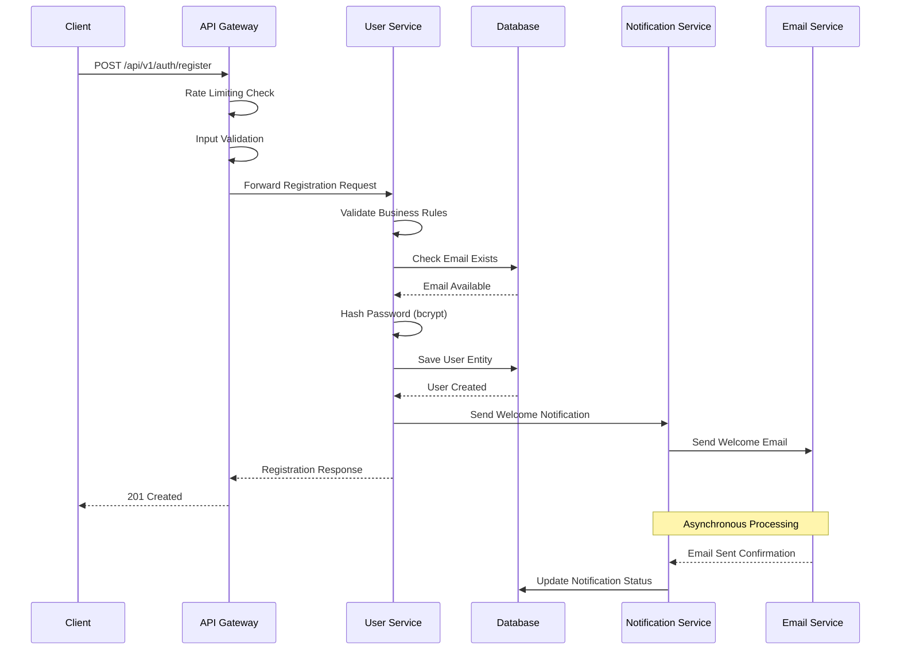
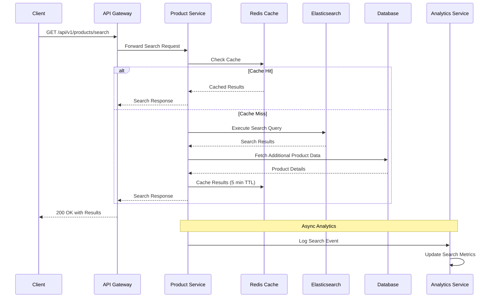
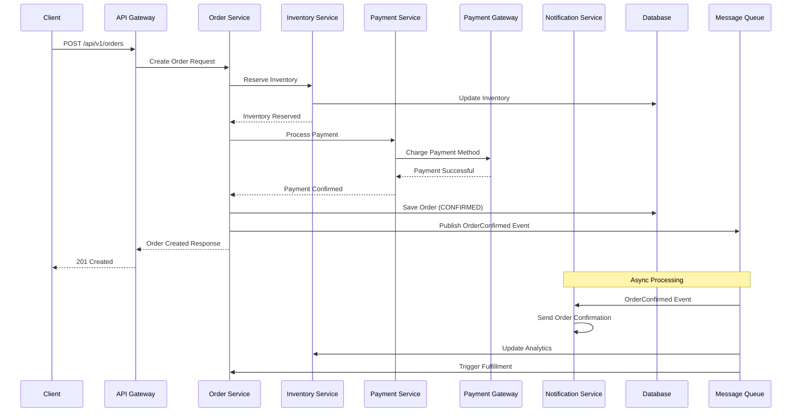
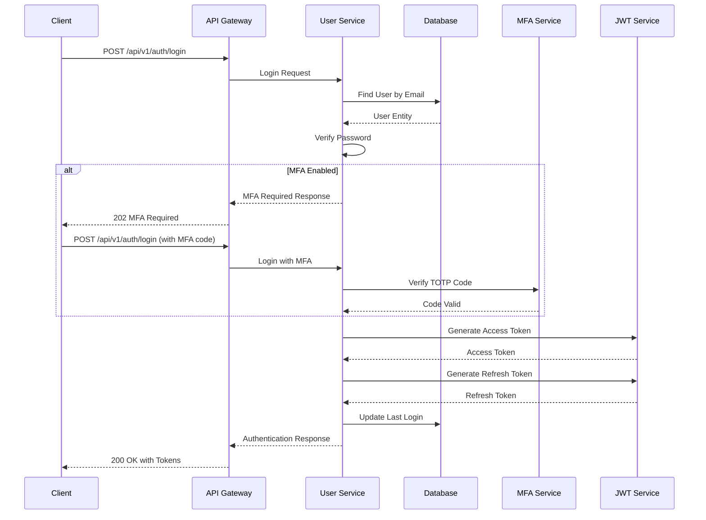
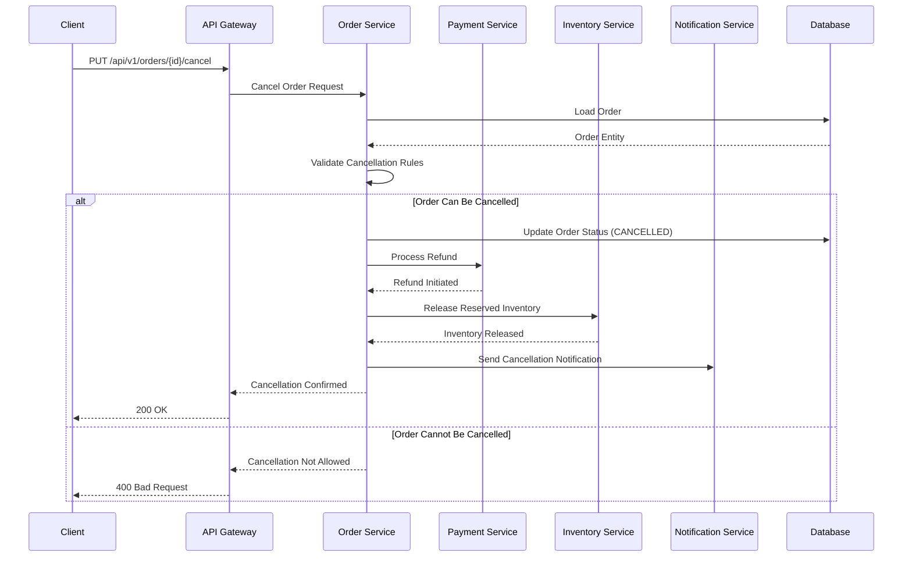

# Low-Level Design Document
## Online Shopping Platform - Detailed Implementation Specification

### 1. Component Specifications

#### 1.1 User Management Service

##### Database Schema
```sql
CREATE TABLE users (
    user_id UUID PRIMARY KEY DEFAULT gen_random_uuid(),
    email VARCHAR(255) UNIQUE NOT NULL,
    password_hash VARCHAR(255) NOT NULL,
    first_name VARCHAR(100) NOT NULL,
    last_name VARCHAR(100) NOT NULL,
    role user_role_enum NOT NULL DEFAULT 'CONSUMER',
    is_active BOOLEAN DEFAULT TRUE,
    created_at TIMESTAMP WITH TIME ZONE DEFAULT NOW(),
    last_login TIMESTAMP WITH TIME ZONE,
    mfa_enabled BOOLEAN DEFAULT FALSE,
    mfa_secret VARCHAR(32),
    failed_login_attempts INTEGER DEFAULT 0,
    locked_until TIMESTAMP WITH TIME ZONE,
    CONSTRAINT valid_email CHECK (email ~* '^[A-Za-z0-9._%+-]+@[A-Za-z0-9.-]+\.[A-Za-z]{2,}$')
);

CREATE TYPE user_role_enum AS ENUM ('CONSUMER', 'SELLER', 'ADMIN');

CREATE INDEX idx_users_email ON users(email);
CREATE INDEX idx_users_role ON users(role);
CREATE INDEX idx_users_active ON users(is_active);
```

##### API Endpoints
```yaml
/api/v1/auth:
  POST /register:
    summary: User registration
    requestBody:
      required: true
      content:
        application/json:
          schema:
            type: object
            required: [email, password, firstName, lastName]
            properties:
              email:
                type: string
                format: email
                maxLength: 255
              password:
                type: string
                minLength: 8
                pattern: '^(?=.*[a-z])(?=.*[A-Z])(?=.*\d)(?=.*[@$!%*?&])[A-Za-z\d@$!%*?&]'
              firstName:
                type: string
                maxLength: 100
              lastName:
                type: string
                maxLength: 100
              role:
                type: string
                enum: [CONSUMER, SELLER]
    responses:
      201:
        description: User registered successfully
        content:
          application/json:
            schema:
              type: object
              properties:
                userId: { type: string, format: uuid }
                message: { type: string }
      400:
        description: Validation error
      409:
        description: Email already exists

  POST /login:
    summary: User authentication
    requestBody:
      required: true
      content:
        application/json:
          schema:
            type: object
            required: [email, password]
            properties:
              email: { type: string, format: email }
              password: { type: string }
              mfaCode: { type: string, pattern: '^[0-9]{6}$' }
    responses:
      200:
        description: Authentication successful
        content:
          application/json:
            schema:
              type: object
              properties:
                accessToken: { type: string }
                refreshToken: { type: string }
                expiresIn: { type: integer }
                user:
                  type: object
                  properties:
                    userId: { type: string, format: uuid }
                    email: { type: string }
                    firstName: { type: string }
                    lastName: { type: string }
                    role: { type: string }
      401:
        description: Invalid credentials
      423:
        description: Account locked
```

##### Implementation Classes
```java
@Service
@Transactional
public class UserService {
    
    @Autowired
    private UserRepository userRepository;
    
    @Autowired
    private PasswordEncoder passwordEncoder;
    
    @Autowired
    private JwtTokenProvider jwtTokenProvider;
    
    @Autowired
    private NotificationService notificationService;
    
    public UserRegistrationResponse registerUser(UserRegistrationRequest request) {
        // Input validation
        validateRegistrationRequest(request);
        
        // Check if email exists
        if (userRepository.existsByEmail(request.getEmail())) {
            throw new EmailAlreadyExistsException("Email already registered");
        }
        
        // Create user entity
        User user = User.builder()
            .email(request.getEmail().toLowerCase())
            .passwordHash(passwordEncoder.encode(request.getPassword()))
            .firstName(request.getFirstName())
            .lastName(request.getLastName())
            .role(UserRole.valueOf(request.getRole()))
            .isActive(true)
            .createdAt(Instant.now())
            .build();
        
        // Save user
        User savedUser = userRepository.save(user);
        
        // Send welcome notification
        notificationService.sendWelcomeEmail(savedUser);
        
        return UserRegistrationResponse.builder()
            .userId(savedUser.getUserId())
            .message("User registered successfully")
            .build();
    }
    
    public AuthenticationResponse authenticateUser(LoginRequest request) {
        // Rate limiting check
        checkRateLimit(request.getEmail());
        
        // Find user
        User user = userRepository.findByEmail(request.getEmail())
            .orElseThrow(() -> new InvalidCredentialsException("Invalid credentials"));
        
        // Check account status
        if (!user.isActive()) {
            throw new AccountDisabledException("Account is disabled");
        }
        
        if (user.isLocked()) {
            throw new AccountLockedException("Account is temporarily locked");
        }
        
        // Verify password
        if (!passwordEncoder.matches(request.getPassword(), user.getPasswordHash())) {
            handleFailedLogin(user);
            throw new InvalidCredentialsException("Invalid credentials");
        }
        
        // MFA verification if enabled
        if (user.isMfaEnabled()) {
            if (request.getMfaCode() == null || !verifyMfaCode(user, request.getMfaCode())) {
                throw new MfaRequiredException("MFA code required");
            }
        }
        
        // Generate tokens
        String accessToken = jwtTokenProvider.generateAccessToken(user);
        String refreshToken = jwtTokenProvider.generateRefreshToken(user);
        
        // Update last login
        user.setLastLogin(Instant.now());
        user.setFailedLoginAttempts(0);
        userRepository.save(user);
        
        return AuthenticationResponse.builder()
            .accessToken(accessToken)
            .refreshToken(refreshToken)
            .expiresIn(900) // 15 minutes
            .user(UserDto.from(user))
            .build();
    }
    
    private void handleFailedLogin(User user) {
        int attempts = user.getFailedLoginAttempts() + 1;
        user.setFailedLoginAttempts(attempts);
        
        if (attempts >= 5) {
            user.setLockedUntil(Instant.now().plus(Duration.ofMinutes(30)));
            notificationService.sendAccountLockedNotification(user);
        }
        
        userRepository.save(user);
    }
}
```

#### 1.2 Product Catalog Service

##### Database Schema
```sql
CREATE TABLE categories (
    category_id UUID PRIMARY KEY DEFAULT gen_random_uuid(),
    name VARCHAR(100) NOT NULL,
    description TEXT,
    parent_id UUID REFERENCES categories(category_id),
    is_active BOOLEAN DEFAULT TRUE,
    created_at TIMESTAMP WITH TIME ZONE DEFAULT NOW()
);

CREATE TABLE products (
    product_id UUID PRIMARY KEY DEFAULT gen_random_uuid(),
    name VARCHAR(255) NOT NULL,
    description TEXT,
    price DECIMAL(10,2) NOT NULL CHECK (price >= 0),
    seller_id UUID NOT NULL REFERENCES users(user_id),
    category_id UUID NOT NULL REFERENCES categories(category_id),
    inventory INTEGER NOT NULL DEFAULT 0 CHECK (inventory >= 0),
    images JSONB DEFAULT '[]',
    rating DECIMAL(3,2) DEFAULT 0.00 CHECK (rating >= 0 AND rating <= 5),
    review_count INTEGER DEFAULT 0,
    is_active BOOLEAN DEFAULT TRUE,
    created_at TIMESTAMP WITH TIME ZONE DEFAULT NOW(),
    updated_at TIMESTAMP WITH TIME ZONE DEFAULT NOW()
);

CREATE INDEX idx_products_category ON products(category_id);
CREATE INDEX idx_products_seller ON products(seller_id);
CREATE INDEX idx_products_price ON products(price);
CREATE INDEX idx_products_rating ON products(rating);
CREATE INDEX idx_products_name_gin ON products USING gin(to_tsvector('english', name));
CREATE INDEX idx_products_description_gin ON products USING gin(to_tsvector('english', description));
```

##### Elasticsearch Mapping
```json
{
  "mappings": {
    "properties": {
      "productId": { "type": "keyword" },
      "name": {
        "type": "text",
        "analyzer": "standard",
        "fields": {
          "keyword": { "type": "keyword" },
          "suggest": { "type": "completion" }
        }
      },
      "description": {
        "type": "text",
        "analyzer": "standard"
      },
      "price": { "type": "double" },
      "categoryId": { "type": "keyword" },
      "categoryName": { "type": "keyword" },
      "sellerId": { "type": "keyword" },
      "inventory": { "type": "integer" },
      "rating": { "type": "double" },
      "reviewCount": { "type": "integer" },
      "isActive": { "type": "boolean" },
      "createdAt": { "type": "date" },
      "updatedAt": { "type": "date" }
    }
  }
}
```

##### Search Implementation
```java
@Service
public class ProductSearchService {
    
    @Autowired
    private ElasticsearchRestTemplate elasticsearchTemplate;
    
    @Autowired
    private RedisTemplate<String, Object> redisTemplate;
    
    public ProductSearchResponse searchProducts(ProductSearchRequest request) {
        // Check cache first
        String cacheKey = generateCacheKey(request);
        ProductSearchResponse cachedResult = (ProductSearchResponse) 
            redisTemplate.opsForValue().get(cacheKey);
        
        if (cachedResult != null) {
            return cachedResult;
        }
        
        // Build Elasticsearch query
        BoolQueryBuilder boolQuery = QueryBuilders.boolQuery();
        
        // Text search
        if (StringUtils.hasText(request.getQuery())) {
            boolQuery.must(QueryBuilders.multiMatchQuery(request.getQuery())
                .field("name", 2.0f)
                .field("description", 1.0f)
                .type(MultiMatchQueryBuilder.Type.BEST_FIELDS)
                .fuzziness(Fuzziness.AUTO));
        }
        
        // Category filter
        if (request.getCategoryId() != null) {
            boolQuery.filter(QueryBuilders.termQuery("categoryId", request.getCategoryId()));
        }
        
        // Price range filter
        if (request.getMinPrice() != null || request.getMaxPrice() != null) {
            RangeQueryBuilder priceRange = QueryBuilders.rangeQuery("price");
            if (request.getMinPrice() != null) {
                priceRange.gte(request.getMinPrice());
            }
            if (request.getMaxPrice() != null) {
                priceRange.lte(request.getMaxPrice());
            }
            boolQuery.filter(priceRange);
        }
        
        // Rating filter
        if (request.getMinRating() != null) {
            boolQuery.filter(QueryBuilders.rangeQuery("rating").gte(request.getMinRating()));
        }
        
        // Active products only
        boolQuery.filter(QueryBuilders.termQuery("isActive", true));
        
        // In stock filter
        if (request.isInStockOnly()) {
            boolQuery.filter(QueryBuilders.rangeQuery("inventory").gt(0));
        }
        
        // Build search request
        SearchSourceBuilder searchSourceBuilder = new SearchSourceBuilder()
            .query(boolQuery)
            .from(request.getOffset())
            .size(request.getLimit())
            .timeout(TimeValue.timeValueSeconds(5));
        
        // Add sorting
        addSorting(searchSourceBuilder, request.getSortBy(), request.getSortOrder());
        
        // Add aggregations for facets
        addAggregations(searchSourceBuilder);
        
        SearchRequest searchRequest = new SearchRequest("products")
            .source(searchSourceBuilder);
        
        try {
            SearchResponse response = elasticsearchTemplate.getClient()
                .search(searchRequest, RequestOptions.DEFAULT);
            
            ProductSearchResponse result = buildSearchResponse(response);
            
            // Cache result for 5 minutes
            redisTemplate.opsForValue().set(cacheKey, result, Duration.ofMinutes(5));
            
            return result;
            
        } catch (IOException e) {
            throw new SearchException("Failed to execute search", e);
        }
    }
    
    private void addSorting(SearchSourceBuilder searchSourceBuilder, String sortBy, String sortOrder) {
        SortOrder order = "desc".equalsIgnoreCase(sortOrder) ? SortOrder.DESC : SortOrder.ASC;
        
        switch (sortBy) {
            case "price":
                searchSourceBuilder.sort("price", order);
                break;
            case "rating":
                searchSourceBuilder.sort("rating", order);
                break;
            case "popularity":
                searchSourceBuilder.sort("reviewCount", order);
                break;
            case "newest":
                searchSourceBuilder.sort("createdAt", SortOrder.DESC);
                break;
            default:
                searchSourceBuilder.sort("_score", SortOrder.DESC);
        }
    }
}
```

#### 1.3 Order Management Service

##### Database Schema
```sql
CREATE TYPE order_status_enum AS ENUM (
    'PENDING', 'CONFIRMED', 'PROCESSING', 'SHIPPED', 'DELIVERED', 
    'CANCELLED', 'REFUNDED', 'RETURNED'
);

CREATE TABLE orders (
    order_id UUID PRIMARY KEY DEFAULT gen_random_uuid(),
    user_id UUID NOT NULL REFERENCES users(user_id),
    total_amount DECIMAL(10,2) NOT NULL CHECK (total_amount >= 0),
    status order_status_enum NOT NULL DEFAULT 'PENDING',
    order_date TIMESTAMP WITH TIME ZONE DEFAULT NOW(),
    shipping_address JSONB NOT NULL,
    payment_method VARCHAR(50) NOT NULL,
    tracking_number VARCHAR(100),
    estimated_delivery DATE,
    created_at TIMESTAMP WITH TIME ZONE DEFAULT NOW(),
    updated_at TIMESTAMP WITH TIME ZONE DEFAULT NOW()
);

CREATE TABLE order_items (
    order_item_id UUID PRIMARY KEY DEFAULT gen_random_uuid(),
    order_id UUID NOT NULL REFERENCES orders(order_id) ON DELETE CASCADE,
    product_id UUID NOT NULL REFERENCES products(product_id),
    quantity INTEGER NOT NULL CHECK (quantity > 0),
    unit_price DECIMAL(10,2) NOT NULL CHECK (unit_price >= 0),
    total_price DECIMAL(10,2) NOT NULL CHECK (total_price >= 0),
    created_at TIMESTAMP WITH TIME ZONE DEFAULT NOW()
);

CREATE INDEX idx_orders_user ON orders(user_id);
CREATE INDEX idx_orders_status ON orders(status);
CREATE INDEX idx_orders_date ON orders(order_date);
CREATE INDEX idx_order_items_order ON order_items(order_id);
CREATE INDEX idx_order_items_product ON order_items(product_id);
```

##### State Machine Implementation
```java
@Component
public class OrderStateMachine {
    
    private static final Map<OrderStatus, Set<OrderStatus>> VALID_TRANSITIONS = Map.of(
        OrderStatus.PENDING, Set.of(OrderStatus.CONFIRMED, OrderStatus.CANCELLED),
        OrderStatus.CONFIRMED, Set.of(OrderStatus.PROCESSING, OrderStatus.CANCELLED),
        OrderStatus.PROCESSING, Set.of(OrderStatus.SHIPPED, OrderStatus.CANCELLED),
        OrderStatus.SHIPPED, Set.of(OrderStatus.DELIVERED, OrderStatus.RETURNED),
        OrderStatus.DELIVERED, Set.of(OrderStatus.RETURNED),
        OrderStatus.CANCELLED, Set.of(),
        OrderStatus.REFUNDED, Set.of(),
        OrderStatus.RETURNED, Set.of(OrderStatus.REFUNDED)
    );
    
    public boolean canTransition(OrderStatus from, OrderStatus to) {
        return VALID_TRANSITIONS.getOrDefault(from, Set.of()).contains(to);
    }
    
    public void validateTransition(OrderStatus from, OrderStatus to) {
        if (!canTransition(from, to)) {
            throw new InvalidOrderStateTransitionException(
                String.format("Cannot transition from %s to %s", from, to));
        }
    }
}

@Service
@Transactional
public class OrderService {
    
    @Autowired
    private OrderRepository orderRepository;
    
    @Autowired
    private ProductService productService;
    
    @Autowired
    private PaymentService paymentService;
    
    @Autowired
    private InventoryService inventoryService;
    
    @Autowired
    private NotificationService notificationService;
    
    @Autowired
    private OrderStateMachine stateMachine;
    
    @Autowired
    private ApplicationEventPublisher eventPublisher;
    
    public CreateOrderResponse createOrder(CreateOrderRequest request) {
        // Validate order items
        validateOrderItems(request.getItems());
        
        // Check inventory availability
        reserveInventory(request.getItems());
        
        try {
            // Calculate total amount
            BigDecimal totalAmount = calculateTotalAmount(request.getItems());
            
            // Create order entity
            Order order = Order.builder()
                .userId(request.getUserId())
                .totalAmount(totalAmount)
                .status(OrderStatus.PENDING)
                .orderDate(Instant.now())
                .shippingAddress(request.getShippingAddress())
                .paymentMethod(request.getPaymentMethod())
                .build();
            
            // Save order
            Order savedOrder = orderRepository.save(order);
            
            // Create order items
            List<OrderItem> orderItems = request.getItems().stream()
                .map(item -> createOrderItem(savedOrder.getOrderId(), item))
                .collect(Collectors.toList());
            
            savedOrder.setOrderItems(orderItems);
            
            // Process payment
            PaymentResult paymentResult = paymentService.processPayment(
                PaymentRequest.builder()
                    .orderId(savedOrder.getOrderId())
                    .amount(totalAmount)
                    .paymentMethod(request.getPaymentMethod())
                    .build());
            
            if (paymentResult.isSuccessful()) {
                // Update order status
                updateOrderStatus(savedOrder, OrderStatus.CONFIRMED);
                
                // Publish order confirmed event
                eventPublisher.publishEvent(new OrderConfirmedEvent(savedOrder));
                
                return CreateOrderResponse.builder()
                    .orderId(savedOrder.getOrderId())
                    .status(savedOrder.getStatus())
                    .totalAmount(savedOrder.getTotalAmount())
                    .estimatedDelivery(calculateEstimatedDelivery())
                    .build();
            } else {
                // Release reserved inventory
                releaseInventory(request.getItems());
                throw new PaymentFailedException("Payment processing failed: " + paymentResult.getErrorMessage());
            }
            
        } catch (Exception e) {
            // Release reserved inventory on any error
            releaseInventory(request.getItems());
            throw e;
        }
    }
    
    public void updateOrderStatus(Order order, OrderStatus newStatus) {
        stateMachine.validateTransition(order.getStatus(), newStatus);
        
        OrderStatus previousStatus = order.getStatus();
        order.setStatus(newStatus);
        order.setUpdatedAt(Instant.now());
        
        orderRepository.save(order);
        
        // Send notification
        notificationService.sendOrderStatusNotification(order, previousStatus, newStatus);
        
        // Publish status change event
        eventPublisher.publishEvent(new OrderStatusChangedEvent(order, previousStatus, newStatus));
    }
}
```

### 2. Data Flow Diagrams

#### 2.1 User Registration Flow


#### 2.2 Product Search Flow


#### 2.3 Order Processing Flow


### 3. Sequence Diagrams

#### 3.1 Authentication with MFA


#### 3.2 Order Cancellation Flow


### 4. Implementation Details

#### 4.1 Security Implementation

##### JWT Token Provider
```java
@Component
public class JwtTokenProvider {
    
    @Value("${jwt.secret}")
    private String jwtSecret;
    
    @Value("${jwt.access-token-expiration}")
    private int accessTokenExpiration;
    
    @Value("${jwt.refresh-token-expiration}")
    private int refreshTokenExpiration;
    
    public String generateAccessToken(User user) {
        Date expiryDate = new Date(System.currentTimeMillis() + accessTokenExpiration * 1000L);
        
        return Jwts.builder()
            .setSubject(user.getUserId().toString())
            .setIssuedAt(new Date())
            .setExpiration(expiryDate)
            .claim("email", user.getEmail())
            .claim("role", user.getRole().name())
            .claim("type", "ACCESS")
            .signWith(SignatureAlgorithm.HS512, jwtSecret)
            .compact();
    }
    
    public String generateRefreshToken(User user) {
        Date expiryDate = new Date(System.currentTimeMillis() + refreshTokenExpiration * 1000L);
        
        return Jwts.builder()
            .setSubject(user.getUserId().toString())
            .setIssuedAt(new Date())
            .setExpiration(expiryDate)
            .claim("type", "REFRESH")
            .signWith(SignatureAlgorithm.HS512, jwtSecret)
            .compact();
    }
    
    public boolean validateToken(String token) {
        try {
            Jwts.parser().setSigningKey(jwtSecret).parseClaimsJws(token);
            return true;
        } catch (JwtException | IllegalArgumentException e) {
            return false;
        }
    }
    
    public Claims getClaimsFromToken(String token) {
        return Jwts.parser()
            .setSigningKey(jwtSecret)
            .parseClaimsJws(token)
            .getBody();
    }
}
```

##### Input Validation
```java
@Component
public class InputValidator {
    
    private static final Pattern EMAIL_PATTERN = 
        Pattern.compile("^[A-Za-z0-9+_.-]+@([A-Za-z0-9.-]+\\.[A-Za-z]{2,})$");
    
    private static final Pattern PASSWORD_PATTERN = 
        Pattern.compile("^(?=.*[a-z])(?=.*[A-Z])(?=.*\\d)(?=.*[@$!%*?&])[A-Za-z\\d@$!%*?&]{8,}$");
    
    public void validateEmail(String email) {
        if (email == null || !EMAIL_PATTERN.matcher(email).matches()) {
            throw new ValidationException("Invalid email format");
        }
        
        if (email.length() > 255) {
            throw new ValidationException("Email too long");
        }
    }
    
    public void validatePassword(String password) {
        if (password == null || !PASSWORD_PATTERN.matcher(password).matches()) {
            throw new ValidationException(
                "Password must be at least 8 characters with uppercase, lowercase, digit, and special character");
        }
    }
    
    public void validateProductName(String name) {
        if (name == null || name.trim().isEmpty()) {
            throw new ValidationException("Product name is required");
        }
        
        if (name.length() > 255) {
            throw new ValidationException("Product name too long");
        }
        
        // Prevent XSS
        String sanitized = Jsoup.clean(name, Whitelist.none());
        if (!name.equals(sanitized)) {
            throw new ValidationException("Product name contains invalid characters");
        }
    }
}
```

#### 4.2 Caching Strategy

##### Redis Configuration
```java
@Configuration
@EnableCaching
public class CacheConfig {
    
    @Bean
    public RedisConnectionFactory redisConnectionFactory() {
        LettuceConnectionFactory factory = new LettuceConnectionFactory(
            new RedisStandaloneConfiguration("redis-host", 6379));
        factory.setValidateConnection(true);
        return factory;
    }
    
    @Bean
    public RedisTemplate<String, Object> redisTemplate() {
        RedisTemplate<String, Object> template = new RedisTemplate<>();
        template.setConnectionFactory(redisConnectionFactory());
        template.setKeySerializer(new StringRedisSerializer());
        template.setValueSerializer(new GenericJackson2JsonRedisSerializer());
        template.setHashKeySerializer(new StringRedisSerializer());
        template.setHashValueSerializer(new GenericJackson2JsonRedisSerializer());
        return template;
    }
    
    @Bean
    public CacheManager cacheManager() {
        RedisCacheManager.Builder builder = RedisCacheManager
            .RedisCacheManagerBuilder
            .fromConnectionFactory(redisConnectionFactory())
            .cacheDefaults(cacheConfiguration(Duration.ofMinutes(5)));
        
        // Custom cache configurations
        Map<String, RedisCacheConfiguration> cacheConfigurations = Map.of(
            "products", cacheConfiguration(Duration.ofMinutes(10)),
            "categories", cacheConfiguration(Duration.ofHours(1)),
            "users", cacheConfiguration(Duration.ofMinutes(15))
        );
        
        builder.withInitialCacheConfigurations(cacheConfigurations);
        
        return builder.build();
    }
    
    private RedisCacheConfiguration cacheConfiguration(Duration ttl) {
        return RedisCacheConfiguration.defaultCacheConfig()
            .entryTtl(ttl)
            .serializeKeysWith(RedisSerializationContext.SerializationPair
                .fromSerializer(new StringRedisSerializer()))
            .serializeValuesWith(RedisSerializationContext.SerializationPair
                .fromSerializer(new GenericJackson2JsonRedisSerializer()));
    }
}
```

#### 4.3 Event-Driven Architecture

##### Event Publisher
```java
@Component
public class OrderEventPublisher {
    
    @Autowired
    private KafkaTemplate<String, Object> kafkaTemplate;
    
    @EventListener
    public void handleOrderConfirmed(OrderConfirmedEvent event) {
        OrderEventDto eventDto = OrderEventDto.builder()
            .orderId(event.getOrder().getOrderId())
            .userId(event.getOrder().getUserId())
            .totalAmount(event.getOrder().getTotalAmount())
            .status(event.getOrder().getStatus())
            .timestamp(Instant.now())
            .build();
        
        kafkaTemplate.send("order-confirmed", event.getOrder().getOrderId().toString(), eventDto);
    }
    
    @EventListener
    public void handleOrderStatusChanged(OrderStatusChangedEvent event) {
        OrderStatusChangeEventDto eventDto = OrderStatusChangeEventDto.builder()
            .orderId(event.getOrder().getOrderId())
            .previousStatus(event.getPreviousStatus())
            .newStatus(event.getNewStatus())
            .timestamp(Instant.now())
            .build();
        
        kafkaTemplate.send("order-status-changed", event.getOrder().getOrderId().toString(), eventDto);
    }
}
```

##### Event Consumer
```java
@Component
public class NotificationEventConsumer {
    
    @Autowired
    private NotificationService notificationService;
    
    @KafkaListener(topics = "order-confirmed", groupId = "notification-service")
    public void handleOrderConfirmed(OrderEventDto event) {
        try {
            notificationService.sendOrderConfirmationEmail(event);
            notificationService.sendOrderConfirmationSMS(event);
        } catch (Exception e) {
            // Log error and potentially send to dead letter queue
            log.error("Failed to process order confirmed event: {}", event.getOrderId(), e);
        }
    }
    
    @KafkaListener(topics = "order-status-changed", groupId = "notification-service")
    public void handleOrderStatusChanged(OrderStatusChangeEventDto event) {
        try {
            notificationService.sendOrderStatusUpdateNotification(event);
        } catch (Exception e) {
            log.error("Failed to process order status change event: {}", event.getOrderId(), e);
        }
    }
}
```

#### 4.4 Error Handling and Resilience

##### Global Exception Handler
```java
@RestControllerAdvice
public class GlobalExceptionHandler {
    
    @ExceptionHandler(ValidationException.class)
    public ResponseEntity<ErrorResponse> handleValidationException(ValidationException e) {
        ErrorResponse error = ErrorResponse.builder()
            .code("VALIDATION_ERROR")
            .message(e.getMessage())
            .timestamp(Instant.now())
            .build();
        
        return ResponseEntity.badRequest().body(error);
    }
    
    @ExceptionHandler(EntityNotFoundException.class)
    public ResponseEntity<ErrorResponse> handleEntityNotFoundException(EntityNotFoundException e) {
        ErrorResponse error = ErrorResponse.builder()
            .code("ENTITY_NOT_FOUND")
            .message(e.getMessage())
            .timestamp(Instant.now())
            .build();
        
        return ResponseEntity.notFound().build();
    }
    
    @ExceptionHandler(PaymentFailedException.class)
    public ResponseEntity<ErrorResponse> handlePaymentFailedException(PaymentFailedException e) {
        ErrorResponse error = ErrorResponse.builder()
            .code("PAYMENT_FAILED")
            .message("Payment processing failed. Please try again.")
            .timestamp(Instant.now())
            .build();
        
        return ResponseEntity.status(HttpStatus.PAYMENT_REQUIRED).body(error);
    }
    
    @ExceptionHandler(Exception.class)
    public ResponseEntity<ErrorResponse> handleGenericException(Exception e) {
        log.error("Unexpected error occurred", e);
        
        ErrorResponse error = ErrorResponse.builder()
            .code("INTERNAL_ERROR")
            .message("An unexpected error occurred. Please try again later.")
            .timestamp(Instant.now())
            .build();
        
        return ResponseEntity.status(HttpStatus.INTERNAL_SERVER_ERROR).body(error);
    }
}
```

##### Circuit Breaker Implementation
```java
@Component
public class PaymentServiceClient {
    
    private final CircuitBreaker circuitBreaker;
    private final RestTemplate restTemplate;
    
    public PaymentServiceClient() {
        this.circuitBreaker = CircuitBreaker.ofDefaults("paymentService");
        this.restTemplate = new RestTemplate();
        
        // Configure circuit breaker
        circuitBreaker.getEventPublisher()
            .onStateTransition(event -> 
                log.info("Circuit breaker state transition: {}", event));
    }
    
    public PaymentResult processPayment(PaymentRequest request) {
        Supplier<PaymentResult> decoratedSupplier = CircuitBreaker
            .decorateSupplier(circuitBreaker, () -> {
                try {
                    ResponseEntity<PaymentResult> response = restTemplate.postForEntity(
                        "/api/payments", request, PaymentResult.class);
                    return response.getBody();
                } catch (Exception e) {
                    throw new PaymentServiceException("Payment service unavailable", e);
                }
            });
        
        try {
            return decoratedSupplier.get();
        } catch (CallNotPermittedException e) {
            // Circuit breaker is open, return fallback response
            return PaymentResult.builder()
                .successful(false)
                .errorMessage("Payment service temporarily unavailable")
                .build();
        }
    }
}
```

### 5. Database Design

#### 5.1 Indexing Strategy
```sql
-- Performance indexes
CREATE INDEX CONCURRENTLY idx_products_category_active ON products(category_id, is_active) WHERE is_active = true;
CREATE INDEX CONCURRENTLY idx_products_seller_active ON products(seller_id, is_active) WHERE is_active = true;
CREATE INDEX CONCURRENTLY idx_orders_user_date ON orders(user_id, order_date DESC);
CREATE INDEX CONCURRENTLY idx_orders_status_date ON orders(status, order_date DESC);

-- Full-text search indexes
CREATE INDEX CONCURRENTLY idx_products_search ON products USING gin(
    to_tsvector('english', coalesce(name, '') || ' ' || coalesce(description, ''))
);

-- Partial indexes for active entities
CREATE INDEX CONCURRENTLY idx_users_active_email ON users(email) WHERE is_active = true;
CREATE INDEX CONCURRENTLY idx_categories_active_parent ON categories(parent_id) WHERE is_active = true;
```

#### 5.2 Data Partitioning
```sql
-- Partition orders by date for better performance
CREATE TABLE orders_partitioned (
    LIKE orders INCLUDING ALL
) PARTITION BY RANGE (order_date);

-- Create monthly partitions
CREATE TABLE orders_2024_01 PARTITION OF orders_partitioned
    FOR VALUES FROM ('2024-01-01') TO ('2024-02-01');

CREATE TABLE orders_2024_02 PARTITION OF orders_partitioned
    FOR VALUES FROM ('2024-02-01') TO ('2024-03-01');

-- Automatic partition creation function
CREATE OR REPLACE FUNCTION create_monthly_partition(table_date DATE)
RETURNS VOID AS $$
DECLARE
    partition_name TEXT;
    start_date DATE;
    end_date DATE;
BEGIN
    start_date := DATE_TRUNC('month', table_date);
    end_date := start_date + INTERVAL '1 month';
    partition_name := 'orders_' || TO_CHAR(start_date, 'YYYY_MM');
    
    EXECUTE format('CREATE TABLE IF NOT EXISTS %I PARTITION OF orders_partitioned FOR VALUES FROM (%L) TO (%L)',
                   partition_name, start_date, end_date);
END;
$$ LANGUAGE plpgsql;
```

### 6. Performance Optimization

#### 6.1 Database Connection Pooling
```yaml
# application.yml
spring:
  datasource:
    hikari:
      maximum-pool-size: 20
      minimum-idle: 5
      idle-timeout: 300000
      max-lifetime: 1800000
      connection-timeout: 20000
      leak-detection-threshold: 60000
      pool-name: HikariCP-Primary
  
  jpa:
    hibernate:
      ddl-auto: validate
    properties:
      hibernate:
        jdbc:
          batch_size: 25
        order_inserts: true
        order_updates: true
        batch_versioned_data: true
```

#### 6.2 Query Optimization
```java
@Repository
public class ProductRepository extends JpaRepository<Product, UUID> {
    
    @Query(value = """
        SELECT p.*, c.name as category_name 
        FROM products p 
        JOIN categories c ON p.category_id = c.category_id 
        WHERE p.is_active = true 
        AND (:categoryId IS NULL OR p.category_id = :categoryId)
        AND (:minPrice IS NULL OR p.price >= :minPrice)
        AND (:maxPrice IS NULL OR p.price <= :maxPrice)
        ORDER BY 
            CASE WHEN :sortBy = 'price' THEN p.price END ASC,
            CASE WHEN :sortBy = 'rating' THEN p.rating END DESC,
            CASE WHEN :sortBy = 'newest' THEN p.created_at END DESC
        LIMIT :limit OFFSET :offset
        """, nativeQuery = true)
    List<ProductProjection> findProductsWithFilters(
        @Param("categoryId") UUID categoryId,
        @Param("minPrice") BigDecimal minPrice,
        @Param("maxPrice") BigDecimal maxPrice,
        @Param("sortBy") String sortBy,
        @Param("limit") int limit,
        @Param("offset") int offset
    );
    
    @Query("SELECT p FROM Product p WHERE p.sellerId = :sellerId AND p.isActive = true")
    @EntityGraph(attributePaths = {"category"})
    List<Product> findActiveProductsBySeller(@Param("sellerId") UUID sellerId);
}
```

### 7. Monitoring and Observability

#### 7.1 Metrics Collection
```java
@Component
public class MetricsCollector {
    
    private final MeterRegistry meterRegistry;
    private final Counter orderCreatedCounter;
    private final Timer orderProcessingTimer;
    private final Gauge activeUsersGauge;
    
    public MetricsCollector(MeterRegistry meterRegistry) {
        this.meterRegistry = meterRegistry;
        this.orderCreatedCounter = Counter.builder("orders.created")
            .description("Number of orders created")
            .register(meterRegistry);
        this.orderProcessingTimer = Timer.builder("orders.processing.time")
            .description("Order processing time")
            .register(meterRegistry);
        this.activeUsersGauge = Gauge.builder("users.active")
            .description("Number of active users")
            .register(meterRegistry, this, MetricsCollector::getActiveUserCount);
    }
    
    public void recordOrderCreated(String paymentMethod) {
        orderCreatedCounter.increment(Tags.of("payment_method", paymentMethod));
    }
    
    public Timer.Sample startOrderProcessingTimer() {
        return Timer.start(meterRegistry);
    }
    
    public void recordOrderProcessingTime(Timer.Sample sample, String status) {
        sample.stop(Timer.builder("orders.processing.time")
            .tag("status", status)
            .register(meterRegistry));
    }
    
    private double getActiveUserCount() {
        // Implementation to get active user count
        return 0.0;
    }
}
```

#### 7.2 Health Checks
```java
@Component
public class CustomHealthIndicators {
    
    @Autowired
    private DataSource dataSource;
    
    @Autowired
    private RedisTemplate<String, Object> redisTemplate;
    
    @Bean
    public HealthIndicator databaseHealthIndicator() {
        return new AbstractHealthIndicator() {
            @Override
            protected void doHealthCheck(Health.Builder builder) throws Exception {
                try (Connection connection = dataSource.getConnection()) {
                    if (connection.isValid(5)) {
                        builder.up().withDetail("database", "Available");
                    } else {
                        builder.down().withDetail("database", "Connection invalid");
                    }
                }
            }
        };
    }
    
    @Bean
    public HealthIndicator redisHealthIndicator() {
        return new AbstractHealthIndicator() {
            @Override
            protected void doHealthCheck(Health.Builder builder) throws Exception {
                try {
                    redisTemplate.opsForValue().set("health:check", "ok", Duration.ofSeconds(10));
                    String result = (String) redisTemplate.opsForValue().get("health:check");
                    if ("ok".equals(result)) {
                        builder.up().withDetail("redis", "Available");
                    } else {
                        builder.down().withDetail("redis", "Unexpected response");
                    }
                } catch (Exception e) {
                    builder.down().withDetail("redis", e.getMessage());
                }
            }
        };
    }
}
```

This comprehensive Low-Level Design document provides detailed implementation specifications for the Online Shopping Platform, covering all major components, data flows, security implementations, and performance optimizations required for a production-ready e-commerce system.