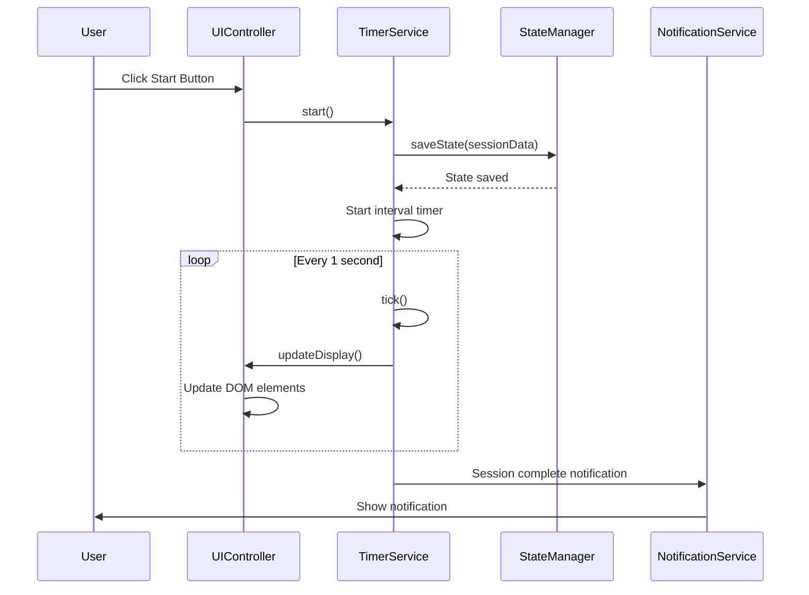
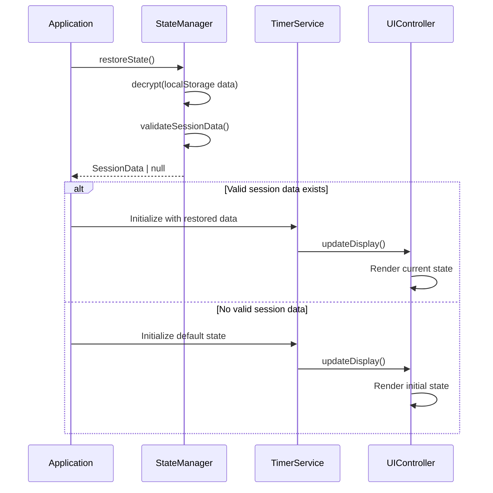

# QETest15 Timer Application - Low-Level Design Document

## 1. COMPONENT SPECIFICATIONS

### 1.1 Timer Service Component

**Class: TimerService**
```typescript
interface ITimerService {
  sessionId: string;
  duration: number;
  remainingTime: number;
  state: SessionState;
  startTime: Date;
  pausedTime: Date;
  sessionType: SessionType;
  
  start(): Promise<void>;
  pause(): Promise<void>;
  resume(): Promise<void>;
  reset(): Promise<void>;
  complete(): Promise<void>;
  getCurrentTime(): number;
  calculateDrift(): number;
}

class TimerService implements ITimerService {
  private intervalId: NodeJS.Timeout | null = null;
  private driftCompensation: number = 0;
  private stateManager: StateManager;
  private notificationService: NotificationService;
  
  constructor(stateManager: StateManager, notificationService: NotificationService) {
    this.stateManager = stateManager;
    this.notificationService = notificationService;
  }
  
  async start(): Promise<void> {
    this.state = SessionState.FOCUS;
    this.startTime = new Date();
    this.intervalId = setInterval(() => this.tick(), 1000);
    await this.stateManager.saveState(this.getSessionData());
  }
  
  private tick(): void {
    const elapsed = Date.now() - this.startTime.getTime() - this.driftCompensation;
    this.remainingTime = Math.max(0, this.duration - Math.floor(elapsed / 1000));
    
    if (this.remainingTime === 0) {
      this.complete();
    }
    
    this.updateDisplay();
  }
  
  calculateDrift(): number {
    const expected = this.duration - this.remainingTime;
    const actual = (Date.now() - this.startTime.getTime()) / 1000;
    return actual - expected;
  }
}
```

### 1.2 State Manager Component

**Class: StateManager**
```typescript
interface IStateManager {
  saveState(sessionData: SessionData): Promise<void>;
  restoreState(): Promise<SessionData | null>;
  clearState(): Promise<void>;
  getStorageKey(): string;
}

class StateManager implements IStateManager {
  private readonly STORAGE_KEY = 'qetest15_timer_state';
  private readonly ENCRYPTION_KEY = 'timer_encrypt_key_v1';
  
  async saveState(sessionData: SessionData): Promise<void> {
    try {
      const serializedData = JSON.stringify({
        ...sessionData,
        timestamp: Date.now(),
        version: '1.0'
      });
      
      const encryptedData = this.encrypt(serializedData);
      localStorage.setItem(this.STORAGE_KEY, encryptedData);
      
      // Audit logging
      this.logStateChange('SAVE', sessionData.sessionId);
    } catch (error) {
      throw new StateManagerError('Failed to save state', error);
    }
  }
  
  async restoreState(): Promise<SessionData | null> {
    try {
      const encryptedData = localStorage.getItem(this.STORAGE_KEY);
      if (!encryptedData) return null;
      
      const decryptedData = this.decrypt(encryptedData);
      const sessionData = JSON.parse(decryptedData);
      
      // Validate restored data
      if (!this.validateSessionData(sessionData)) {
        throw new ValidationError('Invalid session data structure');
      }
      
      this.logStateChange('RESTORE', sessionData.sessionId);
      return sessionData;
    } catch (error) {
      console.error('State restoration failed:', error);
      return null;
    }
  }
  
  private encrypt(data: string): string {
    // AES-256 encryption implementation
    return CryptoJS.AES.encrypt(data, this.ENCRYPTION_KEY).toString();
  }
  
  private decrypt(encryptedData: string): string {
    const bytes = CryptoJS.AES.decrypt(encryptedData, this.ENCRYPTION_KEY);
    return bytes.toString(CryptoJS.enc.Utf8);
  }
  
  private validateSessionData(data: any): boolean {
    return data &&
           typeof data.sessionId === 'string' &&
           typeof data.duration === 'number' &&
           typeof data.remainingTime === 'number' &&
           Object.values(SessionState).includes(data.state);
  }
}
```

### 1.3 Notification Service Component

**Class: NotificationService**
```typescript
interface INotificationService {
  isEnabled: boolean;
  type: NotificationType;
  message: string;
  
  requestPermission(): Promise<boolean>;
  showNotification(message: string, type: NotificationType): Promise<void>;
  playSound(soundType: SoundType): Promise<void>;
  vibrate(pattern: number[]): Promise<void>;
}

class NotificationService implements INotificationService {
  private audioContext: AudioContext | null = null;
  private soundBuffers: Map<SoundType, AudioBuffer> = new Map();
  
  constructor() {
    this.initializeAudio();
  }
  
  async requestPermission(): Promise<boolean> {
    if (!('Notification' in window)) {
      console.warn('Browser does not support notifications');
      return false;
    }
    
    const permission = await Notification.requestPermission();
    return permission === 'granted';
  }
  
  async showNotification(message: string, type: NotificationType): Promise<void> {
    try {
      // Primary notification method
      if (Notification.permission === 'granted') {
        const notification = new Notification('Timer Alert', {
          body: message,
          icon: '/icons/timer-icon.png',
          badge: '/icons/timer-badge.png',
          tag: 'timer-notification',
          requireInteraction: true
        });
        
        notification.onclick = () => {
          window.focus();
          notification.close();
        };
      }
      
      // Fallback visual notification
      this.showVisualAlert(message, type);
      
      // Audio notification
      await this.playSound(this.getSoundForType(type));
      
      // Haptic feedback (mobile)
      if ('vibrate' in navigator) {
        navigator.vibrate([200, 100, 200]);
      }
      
    } catch (error) {
      console.error('Notification failed:', error);
      // Fallback to visual-only alert
      this.showVisualAlert(message, type);
    }
  }
  
  private showVisualAlert(message: string, type: NotificationType): void {
    const alertElement = document.createElement('div');
    alertElement.className = `alert alert-${type}`;
    alertElement.textContent = message;
    alertElement.setAttribute('role', 'alert');
    alertElement.setAttribute('aria-live', 'assertive');
    
    document.body.appendChild(alertElement);
    
    setTimeout(() => {
      alertElement.remove();
    }, 5000);
  }
}
```

### 1.4 UI Controller Component

**Class: UIController**
```typescript
interface IUIController {
  initialize(): void;
  updateDisplay(timeRemaining: number, state: SessionState): void;
  bindEvents(): void;
  handleAccessibility(): void;
}

class UIController implements IUIController {
  private timerService: TimerService;
  private elements: UIElements;
  private keyboardHandler: KeyboardHandler;
  
  constructor(timerService: TimerService) {
    this.timerService = timerService;
    this.elements = this.getUIElements();
    this.keyboardHandler = new KeyboardHandler();
  }
  
  initialize(): void {
    this.bindEvents();
    this.handleAccessibility();
    this.setupResponsiveDesign();
    this.initializeTheme();
  }
  
  updateDisplay(timeRemaining: number, state: SessionState): void {
    const minutes = Math.floor(timeRemaining / 60);
    const seconds = timeRemaining % 60;
    const displayTime = `${minutes.toString().padStart(2, '0')}:${seconds.toString().padStart(2, '0')}`;
    
    // Update main display
    this.elements.timeDisplay.textContent = displayTime;
    this.elements.timeDisplay.setAttribute('aria-label', `${minutes} minutes ${seconds} seconds remaining`);
    
    // Update state indicator
    this.elements.stateIndicator.textContent = this.getStateLabel(state);
    this.elements.stateIndicator.className = `state-indicator state-${state.toLowerCase()}`;
    
    // Update progress bar
    const progress = ((this.timerService.duration - timeRemaining) / this.timerService.duration) * 100;
    this.elements.progressBar.style.width = `${progress}%`;
    this.elements.progressBar.setAttribute('aria-valuenow', progress.toString());
    
    // Update document title for background visibility
    document.title = `${displayTime} - Timer App`;
  }
  
  bindEvents(): void {
    this.elements.startButton.addEventListener('click', () => this.handleStart());
    this.elements.pauseButton.addEventListener('click', () => this.handlePause());
    this.elements.resetButton.addEventListener('click', () => this.handleReset());
    
    // Keyboard shortcuts
    document.addEventListener('keydown', (event) => {
      this.keyboardHandler.handleKeyPress(event, {
        start: () => this.handleStart(),
        pause: () => this.handlePause(),
        reset: () => this.handleReset()
      });
    });
    
    // Visibility change handling
    document.addEventListener('visibilitychange', () => {
      if (document.hidden) {
        this.timerService.handleBackground();
      } else {
        this.timerService.handleForeground();
      }
    });
  }
  
  handleAccessibility(): void {
    // Screen reader announcements
    this.setupAriaLive();
    
    // High contrast mode detection
    this.detectHighContrast();
    
    // Focus management
    this.setupFocusManagement();
    
    // Reduced motion preferences
    this.respectMotionPreferences();
  }
}
```

## 2. DATA FLOWS

### 2.1 Timer Start Flow
```
User clicks Start Button
    ↓
UIController.handleStart()
    ↓
TimerService.start()
    ↓
StateManager.saveState()
    ↓
Timer interval starts (1-second ticks)
    ↓
UIController.updateDisplay()
    ↓
DOM updates with new time
```

### 2.2 Notification Flow
```
Timer reaches zero
    ↓
TimerService.complete()
    ↓
NotificationService.showNotification()
    ↓
├─ Browser Notification API
├─ Visual Alert Display
├─ Audio Notification
└─ Haptic Feedback (mobile)
```

### 2.3 State Persistence Flow
```
Timer state change
    ↓
TimerService triggers save
    ↓
StateManager.saveState()
    ↓
Data encryption (AES-256)
    ↓
localStorage.setItem()
    ↓
Audit log entry
```

## 3. SEQUENCE DIAGRAMS

### 3.1 Session Start Sequence


### 3.2 State Recovery Sequence


## 4. IMPLEMENTATION DETAILS

### 4.1 Error Handling Strategy

**Custom Error Classes:**
```typescript
class TimerError extends Error {
  constructor(message: string, public code: string, public cause?: Error) {
    super(message);
    this.name = 'TimerError';
  }
}

class StateManagerError extends TimerError {
  constructor(message: string, cause?: Error) {
    super(message, 'STATE_ERROR', cause);
  }
}

class NotificationError extends TimerError {
  constructor(message: string, cause?: Error) {
    super(message, 'NOTIFICATION_ERROR', cause);
  }
}
```

**Error Handling Patterns:**
```typescript
class ErrorHandler {
  static handle(error: Error, context: string): void {
    // Log error with context
    console.error(`[${context}] ${error.message}`, error);
    
    // Send to monitoring service (future)
    this.reportError(error, context);
    
    // Show user-friendly message
    this.showUserMessage(this.getUserMessage(error));
    
    // Attempt recovery
    this.attemptRecovery(error, context);
  }
  
  private static attemptRecovery(error: Error, context: string): void {
    switch (context) {
      case 'TIMER_SERVICE':
        // Reset timer state
        break;
      case 'STATE_MANAGER':
        // Clear corrupted state
        break;
      case 'NOTIFICATION_SERVICE':
        // Fall back to visual notifications
        break;
    }
  }
}
```

### 4.2 Performance Optimizations

**Timer Drift Compensation:**
```typescript
class DriftCompensator {
  private expectedInterval: number = 1000;
  private lastTickTime: number = 0;
  private driftAccumulator: number = 0;
  
  compensate(): number {
    const now = performance.now();
    const actualInterval = now - this.lastTickTime;
    const drift = actualInterval - this.expectedInterval;
    
    this.driftAccumulator += drift;
    this.lastTickTime = now;
    
    // Compensate if drift exceeds threshold
    if (Math.abs(this.driftAccumulator) > 100) {
      const compensation = Math.round(this.driftAccumulator);
      this.driftAccumulator = 0;
      return compensation;
    }
    
    return 0;
  }
}
```

**DOM Update Optimization:**
```typescript
class DisplayOptimizer {
  private lastDisplayValue: string = '';
  private animationFrameId: number | null = null;
  
  updateDisplay(timeValue: string): void {
    if (timeValue === this.lastDisplayValue) return;
    
    if (this.animationFrameId) {
      cancelAnimationFrame(this.animationFrameId);
    }
    
    this.animationFrameId = requestAnimationFrame(() => {
      this.performDOMUpdate(timeValue);
      this.lastDisplayValue = timeValue;
    });
  }
  
  private performDOMUpdate(timeValue: string): void {
    // Batch DOM updates
    const elements = document.querySelectorAll('.timer-display');
    elements.forEach(element => {
      element.textContent = timeValue;
    });
  }
}
```

### 4.3 Security Implementation

**Input Validation:**
```typescript
class InputValidator {
  static validateTimerDuration(duration: number): boolean {
    return Number.isInteger(duration) && 
           duration >= 60 && 
           duration <= 3600; // 1-60 minutes
  }
  
  static sanitizeUserInput(input: string): string {
    return input
      .replace(/[<>\"'&]/g, '') // Remove potential XSS characters
      .trim()
      .substring(0, 100); // Limit length
  }
  
  static validateSessionData(data: any): boolean {
    const requiredFields = ['sessionId', 'duration', 'remainingTime', 'state'];
    return requiredFields.every(field => field in data);
  }
}
```

**Content Security Policy:**
```typescript
const CSP_POLICY = {
  'default-src': "'self'",
  'script-src': "'self' 'unsafe-inline'",
  'style-src': "'self' 'unsafe-inline'",
  'img-src': "'self' data:",
  'connect-src': "'self'",
  'font-src': "'self'",
  'media-src': "'self'",
  'object-src': "'none'",
  'base-uri': "'self'",
  'form-action': "'self'"
};
```

### 4.4 Accessibility Implementation

**ARIA Support:**
```typescript
class AccessibilityManager {
  setupAriaLabels(): void {
    const timerDisplay = document.getElementById('timer-display');
    timerDisplay?.setAttribute('role', 'timer');
    timerDisplay?.setAttribute('aria-live', 'polite');
    timerDisplay?.setAttribute('aria-atomic', 'true');
  }
  
  announceStateChange(newState: SessionState): void {
    const announcement = this.getStateAnnouncement(newState);
    const liveRegion = document.getElementById('aria-live-region');
    if (liveRegion) {
      liveRegion.textContent = announcement;
    }
  }
  
  setupKeyboardNavigation(): void {
    const focusableElements = document.querySelectorAll(
      'button, [href], input, select, textarea, [tabindex]:not([tabindex="-1"])'
    );
    
    focusableElements.forEach((element, index) => {
      element.addEventListener('keydown', (event) => {
        this.handleKeyboardNavigation(event, index, focusableElements);
      });
    });
  }
}
```

### 4.5 Testing Strategy

**Unit Test Example:**
```typescript
describe('TimerService', () => {
  let timerService: TimerService;
  let mockStateManager: jest.Mocked<StateManager>;
  let mockNotificationService: jest.Mocked<NotificationService>;
  
  beforeEach(() => {
    mockStateManager = createMockStateManager();
    mockNotificationService = createMockNotificationService();
    timerService = new TimerService(mockStateManager, mockNotificationService);
  });
  
  test('should start timer correctly', async () => {
    await timerService.start();
    
    expect(timerService.state).toBe(SessionState.FOCUS);
    expect(mockStateManager.saveState).toHaveBeenCalled();
    expect(timerService.startTime).toBeInstanceOf(Date);
  });
  
  test('should handle timer completion', async () => {
    timerService.remainingTime = 0;
    await timerService.complete();
    
    expect(timerService.state).toBe(SessionState.COMPLETED);
    expect(mockNotificationService.showNotification).toHaveBeenCalled();
  });
});
```

## 5. DATABASE SCHEMA (Future State)

### 5.1 User Sessions Table
```sql
CREATE TABLE user_sessions (
    session_id UUID PRIMARY KEY,
    user_id UUID NOT NULL,
    duration INTEGER NOT NULL,
    completed_at TIMESTAMP,
    session_type VARCHAR(20) NOT NULL,
    created_at TIMESTAMP DEFAULT NOW(),
    updated_at TIMESTAMP DEFAULT NOW()
);
```

### 5.2 User Preferences Table
```sql
CREATE TABLE user_preferences (
    user_id UUID PRIMARY KEY,
    default_duration INTEGER DEFAULT 1500,
    notification_enabled BOOLEAN DEFAULT TRUE,
    sound_enabled BOOLEAN DEFAULT TRUE,
    theme VARCHAR(20) DEFAULT 'light',
    created_at TIMESTAMP DEFAULT NOW(),
    updated_at TIMESTAMP DEFAULT NOW()
);
```

## 6. API SPECIFICATIONS (Future State)

### 6.1 Session Management API
```typescript
interface SessionAPI {
  // POST /api/sessions
  createSession(request: CreateSessionRequest): Promise<SessionResponse>;
  
  // PUT /api/sessions/:id
  updateSession(id: string, request: UpdateSessionRequest): Promise<SessionResponse>;
  
  // GET /api/sessions/:id
  getSession(id: string): Promise<SessionResponse>;
  
  // DELETE /api/sessions/:id
  deleteSession(id: string): Promise<void>;
}

interface CreateSessionRequest {
  duration: number;
  sessionType: SessionType;
}

interface SessionResponse {
  sessionId: string;
  duration: number;
  remainingTime: number;
  state: SessionState;
  createdAt: string;
  updatedAt: string;
}
```

### 6.2 User Preferences API
```typescript
interface PreferencesAPI {
  // GET /api/preferences
  getPreferences(): Promise<UserPreferences>;
  
  // PUT /api/preferences
  updatePreferences(preferences: UserPreferences): Promise<UserPreferences>;
}

interface UserPreferences {
  defaultDuration: number;
  notificationEnabled: boolean;
  soundEnabled: boolean;
  theme: 'light' | 'dark' | 'auto';
  language: string;
}
```

## 7. DEPLOYMENT CONFIGURATION

### 7.1 Docker Configuration
```dockerfile
FROM node:18-alpine AS builder
WORKDIR /app
COPY package*.json ./
RUN npm ci --only=production

FROM nginx:alpine
COPY --from=builder /app/dist /usr/share/nginx/html
COPY nginx.conf /etc/nginx/nginx.conf
EXPOSE 80
CMD ["nginx", "-g", "daemon off;"]
```

### 7.2 Kubernetes Deployment
```yaml
apiVersion: apps/v1
kind: Deployment
metadata:
  name: qetest15-timer-app
spec:
  replicas: 3
  selector:
    matchLabels:
      app: qetest15-timer
  template:
    metadata:
      labels:
        app: qetest15-timer
    spec:
      containers:
      - name: timer-app
        image: qetest15-timer:latest
        ports:
        - containerPort: 80
        resources:
          requests:
            memory: "64Mi"
            cpu: "50m"
          limits:
            memory: "128Mi"
            cpu: "100m"
```

### 7.3 CI/CD Pipeline
```yaml
name: QETest15 Timer App CI/CD

on:
  push:
    branches: [ main, develop ]
  pull_request:
    branches: [ main ]

jobs:
  test:
    runs-on: ubuntu-latest
    steps:
    - uses: actions/checkout@v3
    - name: Setup Node.js
      uses: actions/setup-node@v3
      with:
        node-version: '18'
    - name: Install dependencies
      run: npm ci
    - name: Run tests
      run: npm test
    - name: Run accessibility tests
      run: npm run test:a11y
    - name: Security audit
      run: npm audit

  build:
    needs: test
    runs-on: ubuntu-latest
    steps:
    - uses: actions/checkout@v3
    - name: Build application
      run: npm run build
    - name: Build Docker image
      run: docker build -t qetest15-timer:${{ github.sha }} .
```

## 8. MONITORING AND OBSERVABILITY

### 8.1 Performance Monitoring
```typescript
class PerformanceMonitor {
  private metrics: Map<string, number> = new Map();
  
  startTimer(operation: string): void {
    this.metrics.set(`${operation}_start`, performance.now());
  }
  
  endTimer(operation: string): number {
    const start = this.metrics.get(`${operation}_start`);
    if (!start) return 0;
    
    const duration = performance.now() - start;
    this.metrics.set(`${operation}_duration`, duration);
    
    // Send to monitoring service
    this.reportMetric(operation, duration);
    
    return duration;
  }
  
  private reportMetric(operation: string, duration: number): void {
    // Integration with monitoring service (e.g., DataDog, New Relic)
    if (window.analytics) {
      window.analytics.track('Performance Metric', {
        operation,
        duration,
        timestamp: Date.now()
      });
    }
  }
}
```

### 8.2 Error Tracking
```typescript
class ErrorTracker {
  static track(error: Error, context: ErrorContext): void {
    const errorData = {
      message: error.message,
      stack: error.stack,
      context: context,
      timestamp: new Date().toISOString(),
      userAgent: navigator.userAgent,
      url: window.location.href
    };
    
    // Send to error tracking service
    this.sendToSentry(errorData);
    
    // Log locally for debugging
    console.error('Tracked Error:', errorData);
  }
  
  private static sendToSentry(errorData: any): void {
    if (window.Sentry) {
      window.Sentry.captureException(new Error(errorData.message), {
        extra: errorData
      });
    }
  }
}
```

## 9. SECURITY HARDENING

### 9.1 Content Security Policy Implementation
```typescript
class SecurityManager {
  static initializeCSP(): void {
    const meta = document.createElement('meta');
    meta.httpEquiv = 'Content-Security-Policy';
    meta.content = [
      "default-src 'self'",
      "script-src 'self' 'unsafe-inline'",
      "style-src 'self' 'unsafe-inline'",
      "img-src 'self' data:",
      "connect-src 'self'",
      "font-src 'self'",
      "object-src 'none'",
      "base-uri 'self'",
      "form-action 'self'"
    ].join('; ');
    
    document.head.appendChild(meta);
  }
  
  static sanitizeInput(input: string): string {
    const div = document.createElement('div');
    div.textContent = input;
    return div.innerHTML;
  }
}
```

### 9.2 Secure Local Storage
```typescript
class SecureStorage {
  private static readonly ENCRYPTION_KEY = 'qetest15_secure_key';
  
  static setItem(key: string, value: any): void {
    try {
      const serialized = JSON.stringify(value);
      const encrypted = CryptoJS.AES.encrypt(serialized, this.ENCRYPTION_KEY).toString();
      localStorage.setItem(key, encrypted);
    } catch (error) {
      console.error('Secure storage write failed:', error);
    }
  }
  
  static getItem(key: string): any {
    try {
      const encrypted = localStorage.getItem(key);
      if (!encrypted) return null;
      
      const bytes = CryptoJS.AES.decrypt(encrypted, this.ENCRYPTION_KEY);
      const decrypted = bytes.toString(CryptoJS.enc.Utf8);
      return JSON.parse(decrypted);
    } catch (error) {
      console.error('Secure storage read failed:', error);
      return null;
    }
  }
}
```

This Low-Level Design document provides comprehensive technical specifications for implementing the QETest15 Timer Application, including detailed component architectures, data flows, security implementations, and deployment configurations.