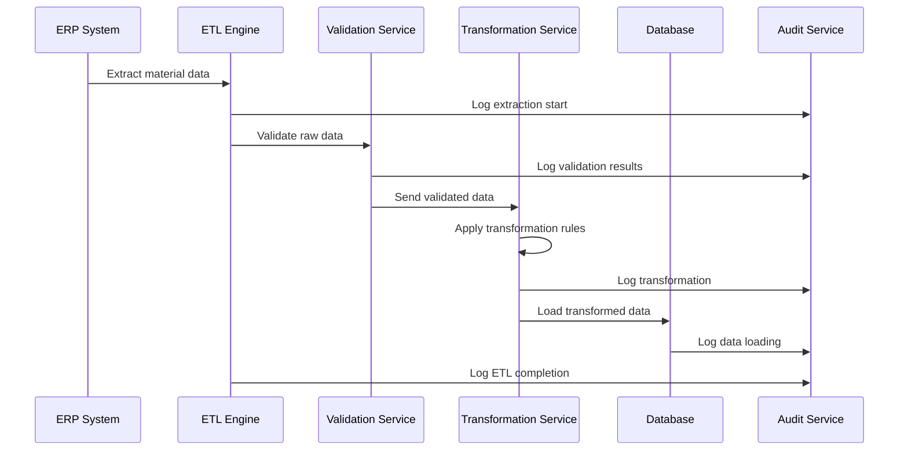
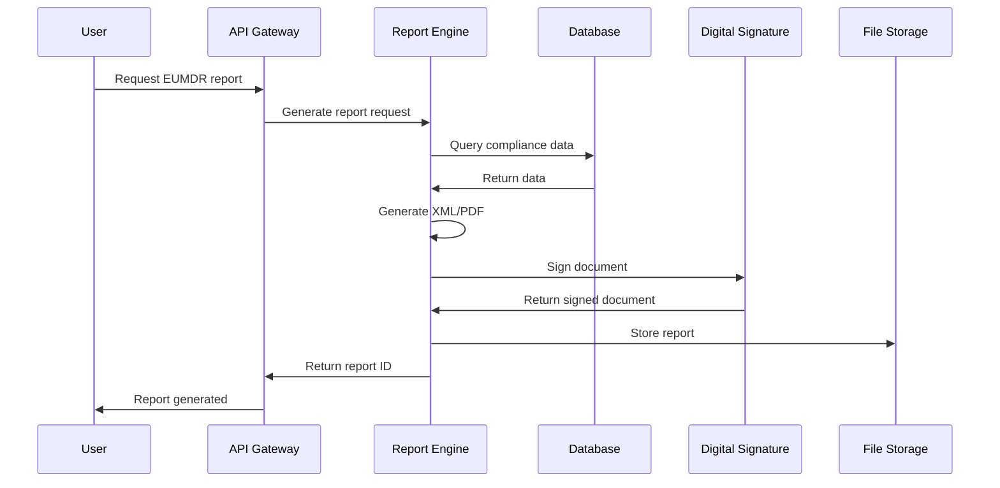

# Low-Level Design Document
## ETL Data Management Platform for EUMDR Compliance

### 1. Component Specifications

#### 1.1 ETL Engine (Apache Airflow + Spark)

**Class: ETLJobExecutor**
```java
public class ETLJobExecutor {
    private String jobId;
    private String jobName;
    private ScheduleType scheduleType;
    private String cronExpression;
    private boolean isActive;
    private DateTime lastRun;
    private DateTime nextRun;
    private int retryCount;
    private int maxRetries;
    
    public ExecutionResult execute() {
        try {
            validateJobConfiguration();
            initializeSparkSession();
            return processETLPipeline();
        } catch (Exception e) {
            handleExecutionError(e);
            return ExecutionResult.failure(e.getMessage());
        }
    }
    
    private void validateJobConfiguration() throws ValidationException {
        if (jobName == null || jobName.isEmpty()) {
            throw new ValidationException("Job name cannot be empty");
        }
        if (cronExpression != null && !CronExpression.isValidExpression(cronExpression)) {
            throw new ValidationException("Invalid cron expression");
        }
    }
    
    private SparkSession initializeSparkSession() {
        return SparkSession.builder()
            .appName(jobName)
            .config("spark.sql.adaptive.enabled", "true")
            .config("spark.sql.adaptive.coalescePartitions.enabled", "true")
            .config("spark.serializer", "org.apache.spark.serializer.KryoSerializer")
            .getOrCreate();
    }
}
```

**Configuration:**
- Memory: 8GB per executor
- CPU Cores: 4 cores per executor
- Parallelism: Dynamic based on data volume
- Checkpoint Interval: 10 seconds
- Retry Policy: Exponential backoff (1s, 2s, 4s, 8s, 16s)

#### 1.2 Data Validation Service

**Class: ValidationEngine**
```java
@Service
public class ValidationEngine {
    
    @Autowired
    private ValidationRuleRepository ruleRepository;
    
    @Autowired
    private AuditTrailService auditService;
    
    public ValidationResult validateRecord(DataRecord record) {
        ValidationResult result = new ValidationResult();
        
        List<ValidationRule> rules = ruleRepository.findActiveRules();
        
        for (ValidationRule rule : rules) {
            try {
                RuleResult ruleResult = executeRule(rule, record);
                result.addRuleResult(ruleResult);
                
                if (!ruleResult.isValid() && rule.isCritical()) {
                    result.setOverallStatus(ValidationStatus.FAILED);
                    auditService.logValidationFailure(record.getId(), rule.getRuleId(), ruleResult.getErrorMessage());
                }
            } catch (Exception e) {
                result.addError("Rule execution failed: " + rule.getRuleId(), e.getMessage());
            }
        }
        
        return result;
    }
    
    private RuleResult executeRule(ValidationRule rule, DataRecord record) {
        switch (rule.getRuleType()) {
            case CAS_VALIDATION:
                return validateCASNumber(record.getCasNumber());
            case THRESHOLD_CHECK:
                return validateThreshold(record.getConcentration(), rule.getThreshold());
            case MANDATORY_FIELD:
                return validateMandatoryField(record, rule.getFieldName());
            case BUSINESS_RULE:
                return executeBusinessRule(rule.getRuleLogic(), record);
            default:
                return RuleResult.error("Unknown rule type: " + rule.getRuleType());
        }
    }
    
    private RuleResult validateCASNumber(String casNumber) {
        if (casNumber == null || casNumber.isEmpty()) {
            return RuleResult.invalid("CAS number is required");
        }
        
        // CAS number format validation: XXXXXX-XX-X
        Pattern casPattern = Pattern.compile("^\\d{2,7}-\\d{2}-\\d$");
        if (!casPattern.matcher(casNumber).matches()) {
            return RuleResult.invalid("Invalid CAS number format");
        }
        
        // Check digit validation
        if (!validateCASCheckDigit(casNumber)) {
            return RuleResult.invalid("Invalid CAS number check digit");
        }
        
        return RuleResult.valid();
    }
}
```

#### 1.3 Report Engine

**Class: ComplianceReportGenerator**
```java
@Component
public class ComplianceReportGenerator {
    
    @Autowired
    private JasperReportsService jasperService;
    
    @Autowired
    private DigitalSignatureService signatureService;
    
    public ReportResult generateEUMDRReport(ReportRequest request) {
        try {
            // Validate request parameters
            validateReportRequest(request);
            
            // Fetch data for report
            ReportData data = fetchReportData(request);
            
            // Generate report using Jasper
            byte[] reportBytes = jasperService.generateReport(
                "EUMDR_Compliance_Template.jrxml", 
                data.getParameters(), 
                data.getDataSource()
            );
            
            // Apply digital signature
            byte[] signedReport = signatureService.signDocument(
                reportBytes, 
                request.getSignerId()
            );
            
            // Store report
            String reportId = storeReport(signedReport, request);
            
            return ReportResult.success(reportId, signedReport);
            
        } catch (Exception e) {
            auditService.logReportGenerationError(request.getRequestId(), e.getMessage());
            return ReportResult.failure(e.getMessage());
        }
    }
    
    private ReportData fetchReportData(ReportRequest request) {
        String sql = """
            SELECT rs.substance_name, rs.cas_number, rs.concentration, 
                   rs.svhc_status, rs.threshold, rs.regulatory_class,
                   cr.report_type, cr.generated_date
            FROM restricted_substances rs
            JOIN compliance_reports cr ON rs.substance_id = cr.substance_id
            WHERE cr.report_id = ?
            AND rs.is_active = true
            ORDER BY rs.substance_name
        """;
        
        return jdbcTemplate.query(sql, new ReportDataRowMapper(), request.getReportId());
    }
}
```

### 2. Data Flow Specifications

#### 2.1 ETL Data Flow



#### 2.2 Report Generation Flow



### 3. Database Schema

#### 3.1 Core Tables

```sql
-- Data Sources Table
CREATE TABLE data_sources (
    source_id VARCHAR(50) PRIMARY KEY,
    source_name VARCHAR(255) NOT NULL,
    source_type VARCHAR(50) NOT NULL CHECK (source_type IN ('ERP', 'PLM', 'MDM', 'EXTERNAL')),
    connection_string TEXT NOT NULL,
    credentials_encrypted TEXT NOT NULL,
    is_active BOOLEAN DEFAULT true,
    created_by VARCHAR(100) NOT NULL,
    created_date TIMESTAMP DEFAULT CURRENT_TIMESTAMP,
    last_modified TIMESTAMP DEFAULT CURRENT_TIMESTAMP
);

-- ETL Jobs Table
CREATE TABLE etl_jobs (
    job_id VARCHAR(50) PRIMARY KEY,
    job_name VARCHAR(255) NOT NULL,
    source_id VARCHAR(50) REFERENCES data_sources(source_id),
    schedule_type VARCHAR(20) CHECK (schedule_type IN ('MANUAL', 'SCHEDULED', 'EVENT_DRIVEN')),
    cron_expression VARCHAR(100),
    is_active BOOLEAN DEFAULT true,
    last_run TIMESTAMP,
    next_run TIMESTAMP,
    retry_count INTEGER DEFAULT 0,
    max_retries INTEGER DEFAULT 3,
    created_date TIMESTAMP DEFAULT CURRENT_TIMESTAMP
);

-- Restricted Substances Table
CREATE TABLE restricted_substances (
    substance_id VARCHAR(50) PRIMARY KEY,
    cas_number VARCHAR(20) NOT NULL UNIQUE,
    substance_name VARCHAR(500) NOT NULL,
    svhc_status BOOLEAN DEFAULT false,
    concentration DECIMAL(10,6),
    threshold_value DECIMAL(10,6),
    regulatory_class VARCHAR(100),
    is_active BOOLEAN DEFAULT true,
    created_date TIMESTAMP DEFAULT CURRENT_TIMESTAMP,
    last_modified TIMESTAMP DEFAULT CURRENT_TIMESTAMP
);

-- Validation Rules Table
CREATE TABLE validation_rules (
    rule_id VARCHAR(50) PRIMARY KEY,
    rule_name VARCHAR(255) NOT NULL,
    rule_type VARCHAR(50) NOT NULL CHECK (rule_type IN ('CAS_VALIDATION', 'THRESHOLD_CHECK', 'MANDATORY_FIELD', 'BUSINESS_RULE')),
    validation_logic TEXT NOT NULL,
    error_message TEXT,
    is_critical BOOLEAN DEFAULT false,
    is_active BOOLEAN DEFAULT true,
    created_date TIMESTAMP DEFAULT CURRENT_TIMESTAMP
);

-- Audit Trail Table
CREATE TABLE audit_trail (
    audit_id VARCHAR(50) PRIMARY KEY,
    entity_type VARCHAR(100) NOT NULL,
    entity_id VARCHAR(50) NOT NULL,
    action VARCHAR(50) NOT NULL CHECK (action IN ('CREATE', 'UPDATE', 'DELETE', 'READ')),
    user_id VARCHAR(100) NOT NULL,
    timestamp TIMESTAMP NOT NULL DEFAULT CURRENT_TIMESTAMP,
    old_value JSONB,
    new_value JSONB,
    ip_address INET,
    session_id VARCHAR(100),
    CONSTRAINT audit_immutable CHECK (false) -- Makes table append-only
);
```

#### 3.2 Indexes for Performance

```sql
-- Performance indexes
CREATE INDEX idx_audit_trail_timestamp ON audit_trail(timestamp);
CREATE INDEX idx_audit_trail_entity ON audit_trail(entity_type, entity_id);
CREATE INDEX idx_audit_trail_user ON audit_trail(user_id);
CREATE INDEX idx_restricted_substances_cas ON restricted_substances(cas_number);
CREATE INDEX idx_etl_jobs_schedule ON etl_jobs(schedule_type, next_run) WHERE is_active = true;
CREATE INDEX idx_validation_rules_type ON validation_rules(rule_type) WHERE is_active = true;
```

### 4. API Specifications

#### 4.1 ETL Management API

```yaml
openapi: 3.0.3
info:
  title: ETL Management API
  version: 1.0.0
paths:
  /api/v1/etl/jobs:
    post:
      summary: Create ETL Job
      requestBody:
        required: true
        content:
          application/json:
            schema:
              type: object
              properties:
                jobName:
                  type: string
                  minLength: 1
                  maxLength: 255
                sourceId:
                  type: string
                  pattern: '^[A-Za-z0-9_-]+$'
                scheduleType:
                  type: string
                  enum: [MANUAL, SCHEDULED, EVENT_DRIVEN]
                cronExpression:
                  type: string
                  pattern: '^[0-9*/,-]+\s+[0-9*/,-]+\s+[0-9*/,-]+\s+[0-9*/,-]+\s+[0-9*/,-]+$'
              required: [jobName, sourceId, scheduleType]
      responses:
        '201':
          description: Job created successfully
          content:
            application/json:
              schema:
                type: object
                properties:
                  jobId:
                    type: string
                  status:
                    type: string
                    enum: [CREATED]
        '400':
          description: Invalid request
        '401':
          description: Unauthorized
        '403':
          description: Forbidden
```

#### 4.2 Validation API

```yaml
  /api/v1/validation/validate:
    post:
      summary: Validate Data Record
      requestBody:
        required: true
        content:
          application/json:
            schema:
              type: object
              properties:
                recordId:
                  type: string
                casNumber:
                  type: string
                  pattern: '^\\d{2,7}-\\d{2}-\\d$'
                concentration:
                  type: number
                  minimum: 0
                  maximum: 100
                substanceName:
                  type: string
                  minLength: 1
                  maxLength: 500
              required: [recordId, casNumber]
      responses:
        '200':
          description: Validation completed
          content:
            application/json:
              schema:
                type: object
                properties:
                  recordId:
                    type: string
                  overallStatus:
                    type: string
                    enum: [VALID, INVALID, WARNING]
                  validationResults:
                    type: array
                    items:
                      type: object
                      properties:
                        ruleId:
                          type: string
                        ruleName:
                          type: string
                        status:
                          type: string
                          enum: [PASSED, FAILED, WARNING]
                        errorMessage:
                          type: string
```

### 5. Security Implementation

#### 5.1 Authentication Service

```java
@Service
public class AuthenticationService {
    
    @Autowired
    private JwtTokenProvider tokenProvider;
    
    @Autowired
    private PasswordEncoder passwordEncoder;
    
    @Autowired
    private MFAService mfaService;
    
    public AuthenticationResult authenticate(LoginRequest request) {
        try {
            // Validate input
            validateLoginRequest(request);
            
            // Check user credentials
            User user = userRepository.findByUsername(request.getUsername())
                .orElseThrow(() -> new AuthenticationException("Invalid credentials"));
            
            if (!passwordEncoder.matches(request.getPassword(), user.getPasswordHash())) {
                auditService.logFailedLogin(request.getUsername(), request.getIpAddress());
                throw new AuthenticationException("Invalid credentials");
            }
            
            // Check MFA if enabled
            if (user.isMfaEnabled()) {
                if (request.getMfaToken() == null) {
                    return AuthenticationResult.mfaRequired(user.getUserId());
                }
                
                if (!mfaService.validateToken(user.getUserId(), request.getMfaToken())) {
                    throw new AuthenticationException("Invalid MFA token");
                }
            }
            
            // Generate JWT token
            String token = tokenProvider.generateToken(user);
            
            // Update last login
            user.setLastLogin(LocalDateTime.now());
            userRepository.save(user);
            
            auditService.logSuccessfulLogin(user.getUserId(), request.getIpAddress());
            
            return AuthenticationResult.success(token, user);
            
        } catch (Exception e) {
            auditService.logAuthenticationError(request.getUsername(), e.getMessage());
            throw e;
        }
    }
}
```

#### 5.2 Encryption Service

```java
@Service
public class EncryptionService {
    
    private static final String ALGORITHM = "AES/GCM/NoPadding";
    private static final int GCM_IV_LENGTH = 12;
    private static final int GCM_TAG_LENGTH = 16;
    
    @Value("${encryption.key.alias}")
    private String keyAlias;
    
    public String encrypt(String plaintext) throws EncryptionException {
        try {
            SecretKey key = getEncryptionKey();
            
            Cipher cipher = Cipher.getInstance(ALGORITHM);
            byte[] iv = new byte[GCM_IV_LENGTH];
            SecureRandom.getInstanceStrong().nextBytes(iv);
            
            GCMParameterSpec gcmSpec = new GCMParameterSpec(GCM_TAG_LENGTH * 8, iv);
            cipher.init(Cipher.ENCRYPT_MODE, key, gcmSpec);
            
            byte[] ciphertext = cipher.doFinal(plaintext.getBytes(StandardCharsets.UTF_8));
            
            // Combine IV and ciphertext
            byte[] encryptedData = new byte[GCM_IV_LENGTH + ciphertext.length];
            System.arraycopy(iv, 0, encryptedData, 0, GCM_IV_LENGTH);
            System.arraycopy(ciphertext, 0, encryptedData, GCM_IV_LENGTH, ciphertext.length);
            
            return Base64.getEncoder().encodeToString(encryptedData);
            
        } catch (Exception e) {
            throw new EncryptionException("Encryption failed", e);
        }
    }
    
    public String decrypt(String encryptedData) throws EncryptionException {
        try {
            SecretKey key = getEncryptionKey();
            
            byte[] decodedData = Base64.getDecoder().decode(encryptedData);
            
            // Extract IV and ciphertext
            byte[] iv = new byte[GCM_IV_LENGTH];
            byte[] ciphertext = new byte[decodedData.length - GCM_IV_LENGTH];
            
            System.arraycopy(decodedData, 0, iv, 0, GCM_IV_LENGTH);
            System.arraycopy(decodedData, GCM_IV_LENGTH, ciphertext, 0, ciphertext.length);
            
            Cipher cipher = Cipher.getInstance(ALGORITHM);
            GCMParameterSpec gcmSpec = new GCMParameterSpec(GCM_TAG_LENGTH * 8, iv);
            cipher.init(Cipher.DECRYPT_MODE, key, gcmSpec);
            
            byte[] plaintext = cipher.doFinal(ciphertext);
            
            return new String(plaintext, StandardCharsets.UTF_8);
            
        } catch (Exception e) {
            throw new EncryptionException("Decryption failed", e);
        }
    }
}
```

### 6. Configuration Management

#### 6.1 Application Configuration

```yaml
# application.yml
spring:
  application:
    name: etl-platform
  
  datasource:
    url: jdbc:postgresql://${DB_HOST:localhost}:${DB_PORT:5432}/${DB_NAME:etl_platform}
    username: ${DB_USERNAME}
    password: ${DB_PASSWORD}
    hikari:
      maximum-pool-size: 20
      minimum-idle: 5
      connection-timeout: 30000
      idle-timeout: 600000
      max-lifetime: 1800000
  
  jpa:
    hibernate:
      ddl-auto: validate
    properties:
      hibernate:
        dialect: org.hibernate.dialect.PostgreSQLDialect
        format_sql: true
        show_sql: false
  
  security:
    oauth2:
      resourceserver:
        jwt:
          issuer-uri: ${JWT_ISSUER_URI}
          jwk-set-uri: ${JWT_JWK_SET_URI}

etl:
  engine:
    spark:
      master: ${SPARK_MASTER_URL:spark://localhost:7077}
      executor:
        memory: 8g
        cores: 4
      driver:
        memory: 4g
        cores: 2
    airflow:
      dag-folder: ${AIRFLOW_DAG_FOLDER:/opt/airflow/dags}
      webserver-url: ${AIRFLOW_WEBSERVER_URL:http://localhost:8080}

validation:
  rules:
    cache-ttl: 300
    batch-size: 1000
  
reporting:
  jasper:
    template-path: ${JASPER_TEMPLATE_PATH:/opt/reports/templates}
    output-path: ${JASPER_OUTPUT_PATH:/opt/reports/output}
  signature:
    keystore-path: ${KEYSTORE_PATH}
    keystore-password: ${KEYSTORE_PASSWORD}
    key-alias: ${SIGNATURE_KEY_ALIAS}

logging:
  level:
    com.etlplatform: INFO
    org.springframework.security: DEBUG
  pattern:
    console: "%d{yyyy-MM-dd HH:mm:ss} [%thread] %-5level %logger{36} - %msg%n"
    file: "%d{yyyy-MM-dd HH:mm:ss} [%thread] %-5level %logger{36} - %msg%n"
```

### 7. Deployment Specifications

#### 7.1 Kubernetes Deployment

```yaml
apiVersion: apps/v1
kind: Deployment
metadata:
  name: etl-platform
  namespace: production
spec:
  replicas: 3
  selector:
    matchLabels:
      app: etl-platform
  template:
    metadata:
      labels:
        app: etl-platform
    spec:
      containers:
      - name: etl-platform
        image: etl-platform:1.0.0
        ports:
        - containerPort: 8080
        env:
        - name: DB_HOST
          valueFrom:
            secretKeyRef:
              name: database-secret
              key: host
        - name: DB_USERNAME
          valueFrom:
            secretKeyRef:
              name: database-secret
              key: username
        - name: DB_PASSWORD
          valueFrom:
            secretKeyRef:
              name: database-secret
              key: password
        resources:
          requests:
            memory: "2Gi"
            cpu: "1000m"
          limits:
            memory: "4Gi"
            cpu: "2000m"
        livenessProbe:
          httpGet:
            path: /actuator/health
            port: 8080
          initialDelaySeconds: 30
          periodSeconds: 10
        readinessProbe:
          httpGet:
            path: /actuator/health/readiness
            port: 8080
          initialDelaySeconds: 5
          periodSeconds: 5
---
apiVersion: v1
kind: Service
metadata:
  name: etl-platform-service
  namespace: production
spec:
  selector:
    app: etl-platform
  ports:
  - protocol: TCP
    port: 80
    targetPort: 8080
  type: ClusterIP
```

#### 7.2 Monitoring Configuration

```yaml
# prometheus-config.yml
global:
  scrape_interval: 15s
  evaluation_interval: 15s

rule_files:
  - "etl_platform_rules.yml"

scrape_configs:
  - job_name: 'etl-platform'
    static_configs:
      - targets: ['etl-platform-service:80']
    metrics_path: '/actuator/prometheus'
    scrape_interval: 30s
    
  - job_name: 'postgresql'
    static_configs:
      - targets: ['postgres-exporter:9187']
    scrape_interval: 30s
    
  - job_name: 'spark'
    static_configs:
      - targets: ['spark-master:8080', 'spark-worker-1:8081', 'spark-worker-2:8081']
    scrape_interval: 30s

alerting:
  alertmanagers:
    - static_configs:
        - targets:
          - alertmanager:9093
```

### 8. Testing Specifications

#### 8.1 Unit Test Example

```java
@ExtendWith(MockitoExtension.class)
class ValidationEngineTest {
    
    @Mock
    private ValidationRuleRepository ruleRepository;
    
    @Mock
    private AuditTrailService auditService;
    
    @InjectMocks
    private ValidationEngine validationEngine;
    
    @Test
    void testValidateCASNumber_ValidFormat_ReturnsValid() {
        // Arrange
        String validCasNumber = "7732-18-5"; // Water
        DataRecord record = new DataRecord();
        record.setCasNumber(validCasNumber);
        
        ValidationRule casRule = new ValidationRule();
        casRule.setRuleType(RuleType.CAS_VALIDATION);
        casRule.setRuleId("CAS_001");
        
        when(ruleRepository.findActiveRules()).thenReturn(List.of(casRule));
        
        // Act
        ValidationResult result = validationEngine.validateRecord(record);
        
        // Assert
        assertThat(result.getOverallStatus()).isEqualTo(ValidationStatus.VALID);
        assertThat(result.getRuleResults()).hasSize(1);
        assertThat(result.getRuleResults().get(0).isValid()).isTrue();
    }
    
    @Test
    void testValidateCASNumber_InvalidFormat_ReturnsInvalid() {
        // Arrange
        String invalidCasNumber = "invalid-cas";
        DataRecord record = new DataRecord();
        record.setCasNumber(invalidCasNumber);
        
        ValidationRule casRule = new ValidationRule();
        casRule.setRuleType(RuleType.CAS_VALIDATION);
        casRule.setRuleId("CAS_001");
        casRule.setCritical(true);
        
        when(ruleRepository.findActiveRules()).thenReturn(List.of(casRule));
        
        // Act
        ValidationResult result = validationEngine.validateRecord(record);
        
        // Assert
        assertThat(result.getOverallStatus()).isEqualTo(ValidationStatus.FAILED);
        verify(auditService).logValidationFailure(eq(record.getId()), eq("CAS_001"), anyString());
    }
}
```

#### 8.2 Integration Test Example

```java
@SpringBootTest(webEnvironment = SpringBootTest.WebEnvironment.RANDOM_PORT)
@TestPropertySource(locations = "classpath:application-test.properties")
@Testcontainers
class ETLIntegrationTest {
    
    @Container
    static PostgreSQLContainer<?> postgres = new PostgreSQLContainer<>("postgres:13")
            .withDatabaseName("etl_test")
            .withUsername("test")
            .withPassword("test");
    
    @Autowired
    private TestRestTemplate restTemplate;
    
    @Autowired
    private ETLJobRepository jobRepository;
    
    @Test
    void testCreateETLJob_ValidRequest_ReturnsCreated() {
        // Arrange
        CreateETLJobRequest request = CreateETLJobRequest.builder()
                .jobName("Test ETL Job")
                .sourceId("ERP_001")
                .scheduleType(ScheduleType.MANUAL)
                .build();
        
        HttpHeaders headers = new HttpHeaders();
        headers.setBearerAuth(getValidJwtToken());
        HttpEntity<CreateETLJobRequest> entity = new HttpEntity<>(request, headers);
        
        // Act
        ResponseEntity<CreateETLJobResponse> response = restTemplate.exchange(
                "/api/v1/etl/jobs",
                HttpMethod.POST,
                entity,
                CreateETLJobResponse.class
        );
        
        // Assert
        assertThat(response.getStatusCode()).isEqualTo(HttpStatus.CREATED);
        assertThat(response.getBody().getJobId()).isNotNull();
        
        // Verify database
        Optional<ETLJob> savedJob = jobRepository.findById(response.getBody().getJobId());
        assertThat(savedJob).isPresent();
        assertThat(savedJob.get().getJobName()).isEqualTo("Test ETL Job");
    }
}
```

### 9. Performance Optimization

#### 9.1 Database Optimization

```sql
-- Partitioning for audit trail table
CREATE TABLE audit_trail_2024_01 PARTITION OF audit_trail
FOR VALUES FROM ('2024-01-01') TO ('2024-02-01');

CREATE TABLE audit_trail_2024_02 PARTITION OF audit_trail
FOR VALUES FROM ('2024-02-01') TO ('2024-03-01');

-- Materialized view for reporting
CREATE MATERIALIZED VIEW compliance_summary AS
SELECT 
    rs.regulatory_class,
    COUNT(*) as substance_count,
    COUNT(CASE WHEN rs.svhc_status = true THEN 1 END) as svhc_count,
    AVG(rs.concentration) as avg_concentration
FROM restricted_substances rs
WHERE rs.is_active = true
GROUP BY rs.regulatory_class;

-- Refresh schedule
CREATE OR REPLACE FUNCTION refresh_compliance_summary()
RETURNS void AS $$
BEGIN
    REFRESH MATERIALIZED VIEW CONCURRENTLY compliance_summary;
END;
$$ LANGUAGE plpgsql;

-- Schedule refresh every hour
SELECT cron.schedule('refresh-compliance-summary', '0 * * * *', 'SELECT refresh_compliance_summary();');
```

#### 9.2 Caching Strategy

```java
@Configuration
@EnableCaching
public class CacheConfig {
    
    @Bean
    public CacheManager cacheManager() {
        RedisCacheManager.Builder builder = RedisCacheManager
                .RedisCacheManagerBuilder
                .fromConnectionFactory(redisConnectionFactory())
                .cacheDefaults(cacheConfiguration());
        
        return builder.build();
    }
    
    private RedisCacheConfiguration cacheConfiguration() {
        return RedisCacheConfiguration.defaultCacheConfig()
                .entryTtl(Duration.ofMinutes(10))
                .serializeKeysWith(RedisSerializationContext.SerializationPair.fromSerializer(new StringRedisSerializer()))
                .serializeValuesWith(RedisSerializationContext.SerializationPair.fromSerializer(new GenericJackson2JsonRedisSerializer()));
    }
}

@Service
public class ValidationRuleService {
    
    @Cacheable(value = "validation-rules", key = "#ruleType")
    public List<ValidationRule> getActiveRulesByType(RuleType ruleType) {
        return validationRuleRepository.findByRuleTypeAndIsActiveTrue(ruleType);
    }
    
    @CacheEvict(value = "validation-rules", allEntries = true)
    public void clearRuleCache() {
        // Cache will be cleared automatically
    }
}
```

### 10. Error Handling and Recovery

#### 10.1 Circuit Breaker Implementation

```java
@Component
public class ExternalServiceClient {
    
    private final CircuitBreaker circuitBreaker;
    
    public ExternalServiceClient() {
        this.circuitBreaker = CircuitBreaker.ofDefaults("external-service");
        
        circuitBreaker.getEventPublisher()
                .onStateTransition(event -> 
                    log.info("Circuit breaker state transition: {} -> {}", 
                            event.getStateTransition().getFromState(),
                            event.getStateTransition().getToState()));
    }
    
    public ApiResponse callExternalService(ApiRequest request) {
        Supplier<ApiResponse> decoratedSupplier = CircuitBreaker
                .decorateSupplier(circuitBreaker, () -> {
                    try {
                        return restTemplate.postForObject("/api/external", request, ApiResponse.class);
                    } catch (Exception e) {
                        throw new ExternalServiceException("External service call failed", e);
                    }
                });
        
        try {
            return decoratedSupplier.get();
        } catch (CallNotPermittedException e) {
            log.warn("Circuit breaker is open, using fallback");
            return getFallbackResponse(request);
        }
    }
    
    private ApiResponse getFallbackResponse(ApiRequest request) {
        return ApiResponse.builder()
                .status("FALLBACK")
                .message("Service temporarily unavailable")
                .build();
    }
}
```

### 11. Compliance and Audit Features

#### 11.1 Immutable Audit Trail

```java
@Entity
@Table(name = "audit_trail")
@Immutable
public class AuditTrail {
    
    @Id
    @Column(name = "audit_id")
    private String auditId;
    
    @Column(name = "entity_type", nullable = false)
    private String entityType;
    
    @Column(name = "entity_id", nullable = false)
    private String entityId;
    
    @Enumerated(EnumType.STRING)
    @Column(name = "action", nullable = false)
    private AuditAction action;
    
    @Column(name = "user_id", nullable = false)
    private String userId;
    
    @Column(name = "timestamp", nullable = false)
    private LocalDateTime timestamp;
    
    @Type(type = "jsonb")
    @Column(name = "old_value", columnDefinition = "jsonb")
    private JsonNode oldValue;
    
    @Type(type = "jsonb")
    @Column(name = "new_value", columnDefinition = "jsonb")
    private JsonNode newValue;
    
    @Column(name = "ip_address")
    private String ipAddress;
    
    @Column(name = "session_id")
    private String sessionId;
    
    // Constructors, getters - no setters for immutability
}

@Service
public class AuditTrailService {
    
    @Autowired
    private AuditTrailRepository auditRepository;
    
    @Async
    public void logDataChange(String entityType, String entityId, AuditAction action, 
                             Object oldValue, Object newValue, String userId) {
        try {
            AuditTrail audit = AuditTrail.builder()
                    .auditId(UUID.randomUUID().toString())
                    .entityType(entityType)
                    .entityId(entityId)
                    .action(action)
                    .userId(userId)
                    .timestamp(LocalDateTime.now())
                    .oldValue(objectMapper.valueToTree(oldValue))
                    .newValue(objectMapper.valueToTree(newValue))
                    .ipAddress(getCurrentUserIP())
                    .sessionId(getCurrentSessionId())
                    .build();
            
            auditRepository.save(audit);
            
        } catch (Exception e) {
            log.error("Failed to log audit trail", e);
            // Don't throw exception to avoid breaking business logic
        }
    }
}
```

This comprehensive Low-Level Design document provides detailed implementation specifications for the ETL Data Management Platform, covering all architectural components, security measures, compliance features, and operational aspects required for EUMDR compliance.