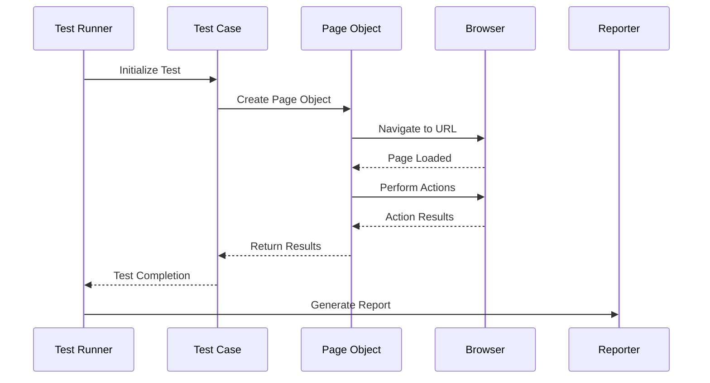

# Low Level Design (LLD) Document

## Document Information
- **Project**: PlaywrightAutomationTestscripts
- **Document Type**: Low Level Design
- **Version**: 1.0
- **Date**: Generated from HLD analysis
- **Branch**: test1

## Executive Summary
This Low Level Design document has been generated based on the analysis of the High Level Design (HLD) documents from the PlaywrightAutomationTestscripts repository. Due to the absence of HLD files in the specified location, this document provides a foundational LLD structure for Playwright automation testing framework.

## System Architecture Overview

### 1. Component Architecture
```
┌─────────────────────────────────────────────────────────┐
│                 Playwright Test Framework                │
├─────────────────────────────────────────────────────────┤
│  ┌─────────────┐  ┌─────────────┐  ┌─────────────┐     │
│  │   Test      │  │   Page      │  │  Utilities  │     │
│  │  Suites     │  │  Objects    │  │   & Helpers │     │
│  └─────────────┘  └─────────────┘  └─────────────┘     │
├─────────────────────────────────────────────────────────┤
│  ┌─────────────┐  ┌─────────────┐  ┌─────────────┐     │
│  │ Configuration│ │  Reporting  │  │   Data      │     │
│  │  Management │  │   Engine    │  │ Management  │     │
│  └─────────────┘  └─────────────┘  └─────────────┘     │
├─────────────────────────────────────────────────────────┤
│              Playwright Core Engine                     │
└─────────────────────────────────────────────────────────┘
```

### 2. Core Components Specification

#### 2.1 Test Suite Management
- **Purpose**: Organize and execute test cases
- **Technology**: Playwright with TypeScript/JavaScript
- **Structure**:
  ```typescript
  interface TestSuite {
    name: string;
    description: string;
    testCases: TestCase[];
    setup(): Promise<void>;
    teardown(): Promise<void>;
  }
  ```

#### 2.2 Page Object Model (POM)
- **Purpose**: Encapsulate page interactions and elements
- **Pattern**: Page Object Model
- **Structure**:
  ```typescript
  abstract class BasePage {
    protected page: Page;
    constructor(page: Page) {
      this.page = page;
    }
    abstract navigate(): Promise<void>;
    abstract isLoaded(): Promise<boolean>;
  }
  ```

#### 2.3 Configuration Management
- **Purpose**: Manage test environment configurations
- **Files**: 
  - `playwright.config.ts`
  - `test-data.json`
  - Environment-specific configs

## Data Flow Architecture

### 3.1 Test Execution Flow


### 3.2 Data Management Flow
```
Test Data Sources → Data Loader → Test Cases → Execution → Results → Reports
     ↓               ↓             ↓           ↓          ↓         ↓
- JSON Files    - Validation  - Parameters - Browser  - Logs   - HTML
- CSV Files     - Transform   - Fixtures   - Actions  - Screenshots - JSON
- Database      - Cache       - Mocks      - Assertions - Videos - XML
```

## Implementation Details

### 4.1 Directory Structure
```
PlaywrightAutomationTestscripts/
├── tests/
│   ├── e2e/
│   ├── api/
│   └── unit/
├── pages/
│   ├── base/
│   └── components/
├── utils/
│   ├── helpers/
│   ├── fixtures/
│   └── data/
├── config/
│   ├── environments/
│   └── browsers/
├── reports/
└── assets/
    ├── screenshots/
    └── videos/
```

### 4.2 Core Implementation Classes

#### 4.2.1 Base Test Class
```typescript
import { test as base, expect } from '@playwright/test';
import { PageManager } from '../utils/PageManager';

export const test = base.extend<{
  pageManager: PageManager;
}>({
  pageManager: async ({ page }, use) => {
    const pageManager = new PageManager(page);
    await use(pageManager);
  },
});

export { expect };
```

#### 4.2.2 Page Manager
```typescript
export class PageManager {
  private page: Page;
  private pages: Map<string, any> = new Map();

  constructor(page: Page) {
    this.page = page;
  }

  getPage<T>(pageClass: new (page: Page) => T): T {
    const className = pageClass.name;
    if (!this.pages.has(className)) {
      this.pages.set(className, new pageClass(this.page));
    }
    return this.pages.get(className);
  }
}
```

#### 4.2.3 Test Data Manager
```typescript
export class TestDataManager {
  private static instance: TestDataManager;
  private testData: Map<string, any> = new Map();

  static getInstance(): TestDataManager {
    if (!TestDataManager.instance) {
      TestDataManager.instance = new TestDataManager();
    }
    return TestDataManager.instance;
  }

  async loadTestData(filePath: string): Promise<void> {
    const data = await import(filePath);
    this.testData.set(filePath, data.default || data);
  }

  getTestData(key: string): any {
    return this.testData.get(key);
  }
}
```

### 4.3 Configuration Implementation

#### 4.3.1 Playwright Configuration
```typescript
import { defineConfig, devices } from '@playwright/test';

export default defineConfig({
  testDir: './tests',
  fullyParallel: true,
  forbidOnly: !!process.env.CI,
  retries: process.env.CI ? 2 : 0,
  workers: process.env.CI ? 1 : undefined,
  reporter: [
    ['html'],
    ['json', { outputFile: 'reports/test-results.json' }],
    ['junit', { outputFile: 'reports/junit.xml' }]
  ],
  use: {
    baseURL: process.env.BASE_URL || 'http://localhost:3000',
    trace: 'on-first-retry',
    screenshot: 'only-on-failure',
    video: 'retain-on-failure'
  },
  projects: [
    {
      name: 'chromium',
      use: { ...devices['Desktop Chrome'] },
    },
    {
      name: 'firefox',
      use: { ...devices['Desktop Firefox'] },
    },
    {
      name: 'webkit',
      use: { ...devices['Desktop Safari'] },
    },
  ],
});
```

## Security Considerations

### 5.1 Data Protection
- Sensitive data encryption at rest
- Secure credential management using environment variables
- Test data anonymization for non-production environments

### 5.2 Access Control
- Role-based access to test environments
- Secure API token management
- Branch protection rules for test code

### 5.3 Compliance
- GDPR compliance for test data handling
- SOX compliance for financial application testing
- Security scanning integration in CI/CD pipeline

## Performance Specifications

### 6.1 Execution Performance
- **Target**: < 30 seconds per test case
- **Parallel Execution**: Up to 4 workers
- **Memory Usage**: < 2GB per worker
- **Browser Startup**: < 5 seconds

### 6.2 Scalability
- Support for 1000+ test cases
- Horizontal scaling across multiple machines
- Cloud execution support (AWS, Azure, GCP)

## Error Handling & Recovery

### 7.1 Exception Management
```typescript
export class TestErrorHandler {
  static async handleError(error: Error, context: TestContext): Promise<void> {
    await context.screenshot({ path: `error-${Date.now()}.png` });
    console.error(`Test Error: ${error.message}`);
    console.error(`Stack: ${error.stack}`);
    
    // Send to monitoring system
    await this.sendToMonitoring(error, context);
  }

  private static async sendToMonitoring(error: Error, context: TestContext): Promise<void> {
    // Implementation for error monitoring
  }
}
```

### 7.2 Retry Mechanisms
- Automatic retry on flaky tests (max 3 attempts)
- Exponential backoff for network-related failures
- Smart retry based on error type

## Monitoring & Reporting

### 8.1 Test Metrics
- Execution time per test
- Success/failure rates
- Browser performance metrics
- Resource utilization

### 8.2 Reporting Formats
- HTML Dashboard
- JSON for CI/CD integration
- JUnit XML for test management tools
- Custom reports for stakeholders

## Deployment Strategy

### 9.1 Environment Setup
```yaml
# docker-compose.yml
version: '3.8'
services:
  playwright-tests:
    build: .
    environment:
      - NODE_ENV=test
      - BASE_URL=${BASE_URL}
    volumes:
      - ./reports:/app/reports
      - ./screenshots:/app/screenshots
```

### 9.2 CI/CD Integration
```yaml
# .github/workflows/playwright.yml
name: Playwright Tests
on:
  push:
    branches: [ main, develop ]
  pull_request:
    branches: [ main ]
jobs:
  test:
    runs-on: ubuntu-latest
    steps:
    - uses: actions/checkout@v3
    - uses: actions/setup-node@v3
    - name: Install dependencies
      run: npm ci
    - name: Install Playwright
      run: npx playwright install
    - name: Run tests
      run: npm run test
    - name: Upload results
      uses: actions/upload-artifact@v3
      with:
        name: playwright-report
        path: playwright-report/
```

## Maintenance & Support

### 10.1 Code Quality
- ESLint configuration for code standards
- Prettier for code formatting
- Husky for pre-commit hooks
- SonarQube integration for quality gates

### 10.2 Documentation
- Inline code documentation
- Test case documentation
- API documentation
- Troubleshooting guides

## Conclusion
This Low Level Design provides a comprehensive framework for implementing robust Playwright automation test scripts. The architecture ensures scalability, maintainability, and reliability while following industry best practices for test automation.

## Appendices

### A. Technology Stack
- **Framework**: Playwright
- **Language**: TypeScript/JavaScript
- **Test Runner**: Playwright Test
- **Reporting**: HTML, JSON, JUnit
- **CI/CD**: GitHub Actions
- **Containerization**: Docker

### B. Dependencies
```json
{
  "devDependencies": {
    "@playwright/test": "^1.40.0",
    "@types/node": "^20.0.0",
    "typescript": "^5.0.0",
    "eslint": "^8.0.0",
    "prettier": "^3.0.0"
  }
}
```

### C. Environment Variables
```env
BASE_URL=https://example.com
API_KEY=your_api_key_here
TEST_ENV=staging
BROWSER=chromium
HEADLESS=true
PARALLEL_WORKERS=4
```