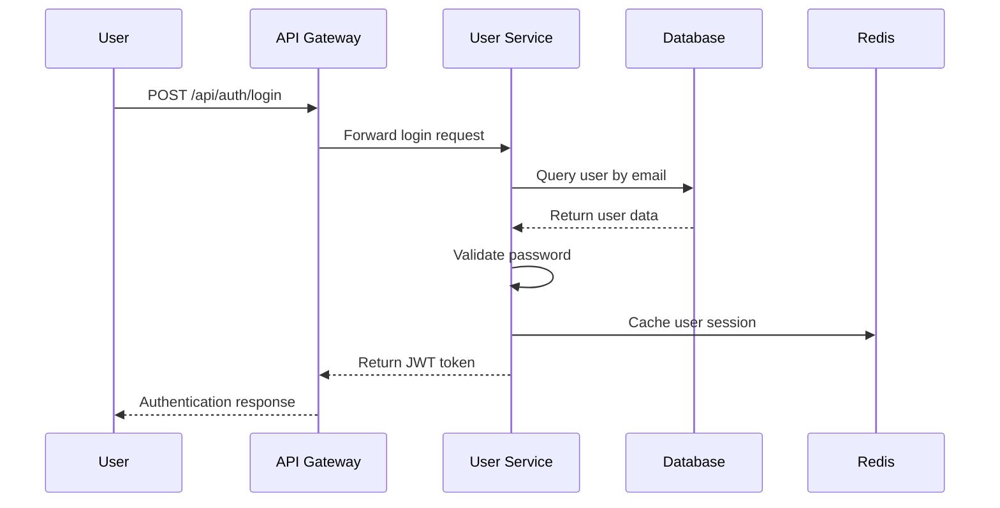
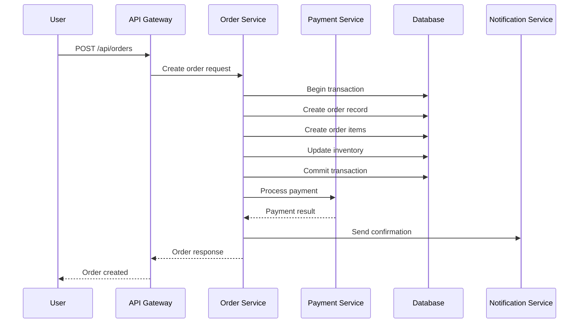

# Online Shopping Platform - Low-Level Design Document

## 1. System Architecture

### 1.1 Microservices Architecture Implementation

```
┌─────────────────┐    ┌─────────────────┐    ┌─────────────────┐
│   Load Balancer │────│   API Gateway   │────│  Authentication │
└─────────────────┘    └─────────────────┘    └─────────────────┘
                              │
        ┌─────────────────────┼─────────────────────┐
        │                     │                     │
┌───────▼──────┐    ┌─────────▼──────┐    ┌─────────▼──────┐
│ User Service │    │Product Service │    │ Order Service  │
└──────────────┘    └────────────────┘    └────────────────┘
        │                     │                     │
┌───────▼──────┐    ┌─────────▼──────┐    ┌─────────▼──────┐
│Payment Service│   │Notification    │    │Analytics       │
└──────────────┘    │Service         │    │Service         │
                    └────────────────┘    └────────────────┘
```

### 1.2 Component Specifications

#### 1.2.1 API Gateway Component
```typescript
interface APIGateway {
  port: 8080
  rateLimiting: {
    requests: 1000,
    window: '1m'
  }
  authentication: JWT
  routing: {
    '/api/users/*': 'user-service:3001',
    '/api/products/*': 'product-service:3002',
    '/api/orders/*': 'order-service:3003',
    '/api/payments/*': 'payment-service:3004'
  }
}
```

#### 1.2.2 User Service Component
```typescript
class UserService {
  private database: PostgreSQL
  private cache: Redis
  private jwtSecret: string
  
  async registerUser(userData: UserRegistrationDTO): Promise<UserResponse> {
    // Input validation
    const validatedData = this.validateUserInput(userData)
    
    // Password hashing
    const hashedPassword = await bcrypt.hash(userData.password, 12)
    
    // Database insertion
    const user = await this.database.users.create({
      ...validatedData,
      passwordHash: hashedPassword,
      createdAt: new Date(),
      status: 'active',
      emailVerified: false
    })
    
    // Send verification email
    await this.notificationService.sendEmailVerification(user.email)
    
    return this.mapToUserResponse(user)
  }
  
  async authenticateUser(credentials: LoginDTO): Promise<AuthResponse> {
    const user = await this.database.users.findByEmail(credentials.email)
    
    if (!user || !await bcrypt.compare(credentials.password, user.passwordHash)) {
      throw new UnauthorizedException('Invalid credentials')
    }
    
    const token = jwt.sign(
      { userId: user.userId, roles: user.roles },
      this.jwtSecret,
      { expiresIn: '15m' }
    )
    
    const refreshToken = jwt.sign(
      { userId: user.userId },
      this.jwtSecret,
      { expiresIn: '7d' }
    )
    
    // Cache user session
    await this.cache.setex(`session:${user.userId}`, 900, JSON.stringify(user))
    
    return { token, refreshToken, user: this.mapToUserResponse(user) }
  }
}
```

#### 1.2.3 Product Service Component
```typescript
class ProductService {
  private database: MongoDB
  private searchEngine: Elasticsearch
  private cache: Redis
  
  async createProduct(productData: ProductCreateDTO, sellerId: string): Promise<ProductResponse> {
    const product = {
      ...productData,
      sellerId,
      productId: generateUUID(),
      createdAt: new Date(),
      status: 'draft'
    }
    
    // Save to database
    await this.database.products.insertOne(product)
    
    // Index in Elasticsearch
    await this.searchEngine.index({
      index: 'products',
      id: product.productId,
      body: {
        name: product.name,
        description: product.description,
        categoryId: product.categoryId,
        price: product.price,
        sellerId: product.sellerId
      }
    })
    
    return this.mapToProductResponse(product)
  }
  
  async searchProducts(query: ProductSearchDTO): Promise<ProductSearchResponse> {
    const searchQuery = {
      index: 'products',
      body: {
        query: {
          bool: {
            must: [
              {
                multi_match: {
                  query: query.searchTerm,
                  fields: ['name^2', 'description']
                }
              }
            ],
            filter: [
              { term: { status: 'active' } },
              ...(query.categoryId ? [{ term: { categoryId: query.categoryId } }] : []),
              ...(query.priceRange ? [{
                range: {
                  price: {
                    gte: query.priceRange.min,
                    lte: query.priceRange.max
                  }
                }
              }] : [])
            ]
          }
        },
        sort: [
          { [query.sortBy || 'relevance']: { order: query.sortOrder || 'desc' } }
        ],
        from: (query.page - 1) * query.limit,
        size: query.limit
      }
    }
    
    const results = await this.searchEngine.search(searchQuery)
    return this.mapToSearchResponse(results)
  }
}
```

#### 1.2.4 Order Service Component
```typescript
class OrderService {
  private database: PostgreSQL
  private paymentService: PaymentService
  private notificationService: NotificationService
  
  async createOrder(orderData: OrderCreateDTO, userId: string): Promise<OrderResponse> {
    const transaction = await this.database.beginTransaction()
    
    try {
      // Validate cart items and calculate total
      const cartItems = await this.validateCartItems(orderData.cartItems)
      const totalAmount = this.calculateTotal(cartItems)
      
      // Create order
      const order = await this.database.orders.create({
        orderId: generateUUID(),
        userId,
        totalAmount,
        status: 'pending',
        shippingAddress: orderData.shippingAddress,
        billingAddress: orderData.billingAddress,
        createdAt: new Date()
      }, { transaction })
      
      // Create order items
      for (const item of cartItems) {
        await this.database.orderItems.create({
          orderItemId: generateUUID(),
          orderId: order.orderId,
          productId: item.productId,
          quantity: item.quantity,
          unitPrice: item.price,
          totalPrice: item.price * item.quantity
        }, { transaction })
        
        // Update product inventory
        await this.database.products.decrement('stockQuantity', {
          by: item.quantity,
          where: { productId: item.productId }
        }, { transaction })
      }
      
      await transaction.commit()
      
      // Clear cart
      await this.clearUserCart(userId)
      
      // Send order confirmation
      await this.notificationService.sendOrderConfirmation(userId, order)
      
      return this.mapToOrderResponse(order)
      
    } catch (error) {
      await transaction.rollback()
      throw error
    }
  }
  
  async processPayment(orderId: string, paymentData: PaymentDTO): Promise<PaymentResponse> {
    const order = await this.database.orders.findByPk(orderId)
    
    if (!order) {
      throw new NotFoundException('Order not found')
    }
    
    // Process payment through payment service
    const paymentResult = await this.paymentService.processPayment({
      amount: order.totalAmount,
      currency: 'USD',
      paymentMethod: paymentData.paymentMethod,
      orderId: order.orderId
    })
    
    // Update order status based on payment result
    if (paymentResult.status === 'completed') {
      await this.database.orders.update(
        { status: 'processing', paymentStatus: 'completed' },
        { where: { orderId } }
      )
      
      // Trigger fulfillment process
      await this.triggerFulfillment(orderId)
    }
    
    return paymentResult
  }
}
```

#### 1.2.5 Payment Service Component
```typescript
class PaymentService {
  private stripeClient: Stripe
  private paypalClient: PayPal
  private database: PostgreSQL
  
  async processPayment(paymentData: PaymentProcessDTO): Promise<PaymentResponse> {
    const payment = await this.database.payments.create({
      paymentId: generateUUID(),
      orderId: paymentData.orderId,
      amount: paymentData.amount,
      paymentMethod: paymentData.paymentMethod,
      status: 'pending',
      createdAt: new Date()
    })
    
    try {
      let result: PaymentGatewayResponse
      
      switch (paymentData.paymentMethod) {
        case 'stripe':
          result = await this.processStripePayment(paymentData)
          break
        case 'paypal':
          result = await this.processPayPalPayment(paymentData)
          break
        default:
          throw new BadRequestException('Unsupported payment method')
      }
      
      // Update payment record
      await this.database.payments.update({
        status: result.status,
        transactionId: result.transactionId,
        processedAt: new Date()
      }, {
        where: { paymentId: payment.paymentId }
      })
      
      // Fraud detection
      await this.runFraudDetection(payment, result)
      
      return {
        paymentId: payment.paymentId,
        status: result.status,
        transactionId: result.transactionId
      }
      
    } catch (error) {
      await this.database.payments.update({
        status: 'failed',
        processedAt: new Date()
      }, {
        where: { paymentId: payment.paymentId }
      })
      
      throw error
    }
  }
  
  private async processStripePayment(data: PaymentProcessDTO): Promise<PaymentGatewayResponse> {
    const paymentIntent = await this.stripeClient.paymentIntents.create({
      amount: Math.round(data.amount * 100), // Convert to cents
      currency: 'usd',
      payment_method: data.paymentMethodId,
      confirm: true,
      metadata: {
        orderId: data.orderId
      }
    })
    
    return {
      status: paymentIntent.status === 'succeeded' ? 'completed' : 'failed',
      transactionId: paymentIntent.id
    }
  }
}
```

## 2. Data Flow Diagrams

### 2.1 User Registration Flow
```
User → API Gateway → User Service → Database → Email Service
  ↓                                    ↓
Email Verification ← Email Service ← Database
```

### 2.2 Product Search Flow
```
User → API Gateway → Product Service → Elasticsearch → Response
                          ↓
                     Cache Check → Redis
```

### 2.3 Order Processing Flow
```
User → API Gateway → Order Service → Database (Transaction)
                          ↓
                    Payment Service → External Gateway
                          ↓
                  Notification Service → User
```

## 3. Sequence Diagrams

### 3.1 User Authentication Sequence


### 3.2 Order Creation Sequence


## 4. Database Schema Implementation

### 4.1 PostgreSQL Schema
```sql
-- Users table
CREATE TABLE users (
    user_id UUID PRIMARY KEY DEFAULT gen_random_uuid(),
    email VARCHAR(255) UNIQUE NOT NULL,
    password_hash VARCHAR(255) NOT NULL,
    first_name VARCHAR(100) NOT NULL,
    last_name VARCHAR(100) NOT NULL,
    phone_number VARCHAR(20),
    created_at TIMESTAMP DEFAULT CURRENT_TIMESTAMP,
    updated_at TIMESTAMP DEFAULT CURRENT_TIMESTAMP,
    status VARCHAR(20) DEFAULT 'active',
    email_verified BOOLEAN DEFAULT FALSE
);

-- Roles table
CREATE TABLE roles (
    role_id UUID PRIMARY KEY DEFAULT gen_random_uuid(),
    role_name VARCHAR(50) UNIQUE NOT NULL,
    permissions JSONB,
    description TEXT
);

-- User roles junction table
CREATE TABLE user_roles (
    user_role_id UUID PRIMARY KEY DEFAULT gen_random_uuid(),
    user_id UUID REFERENCES users(user_id) ON DELETE CASCADE,
    role_id UUID REFERENCES roles(role_id) ON DELETE CASCADE,
    assigned_at TIMESTAMP DEFAULT CURRENT_TIMESTAMP
);

-- Orders table
CREATE TABLE orders (
    order_id UUID PRIMARY KEY DEFAULT gen_random_uuid(),
    user_id UUID REFERENCES users(user_id) ON DELETE CASCADE,
    total_amount DECIMAL(10,2) NOT NULL,
    status VARCHAR(20) DEFAULT 'pending',
    payment_status VARCHAR(20) DEFAULT 'pending',
    shipping_address JSONB NOT NULL,
    billing_address JSONB NOT NULL,
    created_at TIMESTAMP DEFAULT CURRENT_TIMESTAMP,
    updated_at TIMESTAMP DEFAULT CURRENT_TIMESTAMP
);

-- Order items table
CREATE TABLE order_items (
    order_item_id UUID PRIMARY KEY DEFAULT gen_random_uuid(),
    order_id UUID REFERENCES orders(order_id) ON DELETE CASCADE,
    product_id UUID NOT NULL,
    quantity INTEGER NOT NULL,
    unit_price DECIMAL(10,2) NOT NULL,
    total_price DECIMAL(10,2) NOT NULL
);

-- Payments table
CREATE TABLE payments (
    payment_id UUID PRIMARY KEY DEFAULT gen_random_uuid(),
    order_id UUID REFERENCES orders(order_id) ON DELETE CASCADE,
    amount DECIMAL(10,2) NOT NULL,
    payment_method VARCHAR(50) NOT NULL,
    transaction_id VARCHAR(255),
    status VARCHAR(20) DEFAULT 'pending',
    processed_at TIMESTAMP
);
```

### 4.2 MongoDB Schema (Product Catalog)
```javascript
// Products collection
{
  _id: ObjectId,
  productId: String, // UUID
  sellerId: String, // UUID
  name: String,
  description: String,
  price: Number,
  stockQuantity: Number,
  categoryId: String,
  images: [String],
  status: String, // active/inactive/draft
  createdAt: Date,
  updatedAt: Date,
  specifications: {
    brand: String,
    model: String,
    dimensions: {
      length: Number,
      width: Number,
      height: Number,
      weight: Number
    }
  },
  seo: {
    metaTitle: String,
    metaDescription: String,
    keywords: [String]
  }
}

// Categories collection
{
  _id: ObjectId,
  categoryId: String, // UUID
  name: String,
  description: String,
  parentCategoryId: String, // UUID, null for root categories
  level: Number,
  path: String, // hierarchical path
  isActive: Boolean
}
```

## 5. API Specifications

### 5.1 User Service APIs
```yaml
openapi: 3.0.0
info:
  title: User Service API
  version: 1.0.0

paths:
  /api/users/register:
    post:
      summary: Register new user
      requestBody:
        required: true
        content:
          application/json:
            schema:
              type: object
              properties:
                email:
                  type: string
                  format: email
                password:
                  type: string
                  minLength: 8
                firstName:
                  type: string
                lastName:
                  type: string
                phoneNumber:
                  type: string
      responses:
        '201':
          description: User created successfully
        '400':
          description: Invalid input data
        '409':
          description: Email already exists

  /api/users/login:
    post:
      summary: User authentication
      requestBody:
        required: true
        content:
          application/json:
            schema:
              type: object
              properties:
                email:
                  type: string
                password:
                  type: string
      responses:
        '200':
          description: Authentication successful
          content:
            application/json:
              schema:
                type: object
                properties:
                  token:
                    type: string
                  refreshToken:
                    type: string
                  user:
                    $ref: '#/components/schemas/User'
```

### 5.2 Product Service APIs
```yaml
  /api/products/search:
    get:
      summary: Search products
      parameters:
        - name: q
          in: query
          schema:
            type: string
        - name: category
          in: query
          schema:
            type: string
        - name: minPrice
          in: query
          schema:
            type: number
        - name: maxPrice
          in: query
          schema:
            type: number
        - name: page
          in: query
          schema:
            type: integer
            default: 1
        - name: limit
          in: query
          schema:
            type: integer
            default: 20
      responses:
        '200':
          description: Search results
          content:
            application/json:
              schema:
                type: object
                properties:
                  products:
                    type: array
                    items:
                      $ref: '#/components/schemas/Product'
                  pagination:
                    $ref: '#/components/schemas/Pagination'
```

## 6. Security Implementation

### 6.1 Authentication & Authorization
```typescript
// JWT Token Structure
interface JWTPayload {
  userId: string
  roles: string[]
  permissions: string[]
  iat: number
  exp: number
}

// Authorization Middleware
class AuthorizationMiddleware {
  static requireRole(requiredRole: string) {
    return (req: Request, res: Response, next: NextFunction) => {
      const token = req.headers.authorization?.replace('Bearer ', '')
      
      if (!token) {
        return res.status(401).json({ error: 'No token provided' })
      }
      
      try {
        const decoded = jwt.verify(token, process.env.JWT_SECRET) as JWTPayload
        
        if (!decoded.roles.includes(requiredRole)) {
          return res.status(403).json({ error: 'Insufficient permissions' })
        }
        
        req.user = decoded
        next()
      } catch (error) {
        return res.status(401).json({ error: 'Invalid token' })
      }
    }
  }
}
```

### 6.2 Input Validation
```typescript
// Validation schemas using Joi
const userRegistrationSchema = Joi.object({
  email: Joi.string().email().required(),
  password: Joi.string().min(8).pattern(/^(?=.*[a-z])(?=.*[A-Z])(?=.*\d)(?=.*[@$!%*?&])[A-Za-z\d@$!%*?&]/).required(),
  firstName: Joi.string().min(2).max(50).required(),
  lastName: Joi.string().min(2).max(50).required(),
  phoneNumber: Joi.string().pattern(/^\+?[\d\s\-\(\)]+$/).optional()
})

// Validation middleware
const validateInput = (schema: Joi.ObjectSchema) => {
  return (req: Request, res: Response, next: NextFunction) => {
    const { error } = schema.validate(req.body)
    
    if (error) {
      return res.status(400).json({
        error: 'Validation failed',
        details: error.details.map(d => d.message)
      })
    }
    
    next()
  }
}
```

### 6.3 Encryption Implementation
```typescript
// Data encryption utilities
class EncryptionService {
  private static readonly algorithm = 'aes-256-gcm'
  private static readonly keyLength = 32
  
  static encrypt(text: string, key: Buffer): EncryptedData {
    const iv = crypto.randomBytes(16)
    const cipher = crypto.createCipher(this.algorithm, key)
    cipher.setAAD(Buffer.from('additional-data'))
    
    let encrypted = cipher.update(text, 'utf8', 'hex')
    encrypted += cipher.final('hex')
    
    const authTag = cipher.getAuthTag()
    
    return {
      encrypted,
      iv: iv.toString('hex'),
      authTag: authTag.toString('hex')
    }
  }
  
  static decrypt(encryptedData: EncryptedData, key: Buffer): string {
    const decipher = crypto.createDecipher(this.algorithm, key)
    decipher.setAAD(Buffer.from('additional-data'))
    decipher.setAuthTag(Buffer.from(encryptedData.authTag, 'hex'))
    
    let decrypted = decipher.update(encryptedData.encrypted, 'hex', 'utf8')
    decrypted += decipher.final('utf8')
    
    return decrypted
  }
}
```

## 7. Error Handling & Resilience

### 7.1 Circuit Breaker Implementation
```typescript
class CircuitBreaker {
  private failureCount = 0
  private lastFailureTime: number | null = null
  private state: 'CLOSED' | 'OPEN' | 'HALF_OPEN' = 'CLOSED'
  
  constructor(
    private failureThreshold: number = 5,
    private recoveryTimeout: number = 60000,
    private monitoringPeriod: number = 120000
  ) {}
  
  async execute<T>(operation: () => Promise<T>): Promise<T> {
    if (this.state === 'OPEN') {
      if (this.shouldAttemptReset()) {
        this.state = 'HALF_OPEN'
      } else {
        throw new Error('Circuit breaker is OPEN')
      }
    }
    
    try {
      const result = await operation()
      this.onSuccess()
      return result
    } catch (error) {
      this.onFailure()
      throw error
    }
  }
  
  private onSuccess(): void {
    this.failureCount = 0
    this.state = 'CLOSED'
  }
  
  private onFailure(): void {
    this.failureCount++
    this.lastFailureTime = Date.now()
    
    if (this.failureCount >= this.failureThreshold) {
      this.state = 'OPEN'
    }
  }
  
  private shouldAttemptReset(): boolean {
    return this.lastFailureTime !== null &&
           Date.now() - this.lastFailureTime >= this.recoveryTimeout
  }
}
```

### 7.2 Retry Mechanism
```typescript
class RetryService {
  static async withRetry<T>(
    operation: () => Promise<T>,
    maxRetries: number = 3,
    baseDelay: number = 1000
  ): Promise<T> {
    let lastError: Error
    
    for (let attempt = 0; attempt <= maxRetries; attempt++) {
      try {
        return await operation()
      } catch (error) {
        lastError = error as Error
        
        if (attempt === maxRetries) {
          break
        }
        
        // Exponential backoff with jitter
        const delay = baseDelay * Math.pow(2, attempt) + Math.random() * 1000
        await new Promise(resolve => setTimeout(resolve, delay))
      }
    }
    
    throw lastError!
  }
}
```

## 8. Performance Optimization

### 8.1 Caching Strategy
```typescript
class CacheService {
  private redis: Redis
  
  constructor() {
    this.redis = new Redis({
      host: process.env.REDIS_HOST,
      port: parseInt(process.env.REDIS_PORT || '6379'),
      retryDelayOnFailover: 100,
      maxRetriesPerRequest: 3
    })
  }
  
  async get<T>(key: string): Promise<T | null> {
    try {
      const cached = await this.redis.get(key)
      return cached ? JSON.parse(cached) : null
    } catch (error) {
      console.error('Cache get error:', error)
      return null
    }
  }
  
  async set(key: string, value: any, ttl: number = 3600): Promise<void> {
    try {
      await this.redis.setex(key, ttl, JSON.stringify(value))
    } catch (error) {
      console.error('Cache set error:', error)
    }
  }
  
  async invalidate(pattern: string): Promise<void> {
    try {
      const keys = await this.redis.keys(pattern)
      if (keys.length > 0) {
        await this.redis.del(...keys)
      }
    } catch (error) {
      console.error('Cache invalidation error:', error)
    }
  }
}
```

### 8.2 Database Optimization
```typescript
// Connection pooling configuration
const sequelize = new Sequelize(process.env.DATABASE_URL, {
  pool: {
    max: 20,
    min: 5,
    acquire: 30000,
    idle: 10000
  },
  logging: process.env.NODE_ENV === 'development' ? console.log : false,
  benchmark: true
})

// Query optimization with indexes
class ProductRepository {
  async findProductsByCategory(categoryId: string, limit: number, offset: number) {
    return await Product.findAndCountAll({
      where: {
        categoryId,
        status: 'active'
      },
      include: [
        {
          model: Category,
          attributes: ['name']
        }
      ],
      limit,
      offset,
      order: [['createdAt', 'DESC']],
      // Use database indexes for optimization
      attributes: {
        include: [
          [sequelize.fn('AVG', sequelize.col('reviews.rating')), 'averageRating']
        ]
      },
      group: ['Product.productId']
    })
  }
}
```

## 9. Monitoring & Logging

### 9.1 Structured Logging
```typescript
import winston from 'winston'

const logger = winston.createLogger({
  level: process.env.LOG_LEVEL || 'info',
  format: winston.format.combine(
    winston.format.timestamp(),
    winston.format.errors({ stack: true }),
    winston.format.json()
  ),
  defaultMeta: {
    service: process.env.SERVICE_NAME || 'unknown-service',
    version: process.env.SERVICE_VERSION || '1.0.0'
  },
  transports: [
    new winston.transports.File({ filename: 'logs/error.log', level: 'error' }),
    new winston.transports.File({ filename: 'logs/combined.log' }),
    new winston.transports.Console({
      format: winston.format.simple()
    })
  ]
})

// Request logging middleware
const requestLogger = (req: Request, res: Response, next: NextFunction) => {
  const startTime = Date.now()
  
  res.on('finish', () => {
    const duration = Date.now() - startTime
    
    logger.info('HTTP Request', {
      method: req.method,
      url: req.url,
      statusCode: res.statusCode,
      duration,
      userAgent: req.get('User-Agent'),
      ip: req.ip,
      userId: req.user?.userId
    })
  })
  
  next()
}
```

### 9.2 Health Checks
```typescript
class HealthCheckService {
  async checkHealth(): Promise<HealthStatus> {
    const checks = await Promise.allSettled([
      this.checkDatabase(),
      this.checkRedis(),
      this.checkElasticsearch(),
      this.checkExternalServices()
    ])
    
    const results = checks.map((check, index) => ({
      name: ['database', 'redis', 'elasticsearch', 'external'][index],
      status: check.status === 'fulfilled' ? 'healthy' : 'unhealthy',
      details: check.status === 'rejected' ? check.reason.message : 'OK'
    }))
    
    const overallStatus = results.every(r => r.status === 'healthy') ? 'healthy' : 'unhealthy'
    
    return {
      status: overallStatus,
      timestamp: new Date().toISOString(),
      checks: results
    }
  }
  
  private async checkDatabase(): Promise<void> {
    await sequelize.authenticate()
  }
  
  private async checkRedis(): Promise<void> {
    await redis.ping()
  }
  
  private async checkElasticsearch(): Promise<void> {
    await elasticClient.ping()
  }
}
```

## 10. Deployment Configuration

### 10.1 Docker Configuration
```dockerfile
# Multi-stage build for Node.js services
FROM node:18-alpine AS builder

WORKDIR /app
COPY package*.json ./
RUN npm ci --only=production

FROM node:18-alpine AS runtime

RUN addgroup -g 1001 -S nodejs
RUN adduser -S nodejs -u 1001

WORKDIR /app

COPY --from=builder /app/node_modules ./node_modules
COPY --chown=nodejs:nodejs . .

USER nodejs

EXPOSE 3000

HEALTHCHECK --interval=30s --timeout=3s --start-period=5s --retries=3 \
  CMD curl -f http://localhost:3000/health || exit 1

CMD ["node", "dist/index.js"]
```

### 10.1 Kubernetes Deployment
```yaml
apiVersion: apps/v1
kind: Deployment
metadata:
  name: user-service
  labels:
    app: user-service
spec:
  replicas: 3
  selector:
    matchLabels:
      app: user-service
  template:
    metadata:
      labels:
        app: user-service
    spec:
      containers:
      - name: user-service
        image: user-service:latest
        ports:
        - containerPort: 3001
        env:
        - name: DATABASE_URL
          valueFrom:
            secretKeyRef:
              name: db-credentials
              key: url
        - name: JWT_SECRET
          valueFrom:
            secretKeyRef:
              name: jwt-secret
              key: secret
        resources:
          requests:
            memory: "256Mi"
            cpu: "250m"
          limits:
            memory: "512Mi"
            cpu: "500m"
        livenessProbe:
          httpGet:
            path: /health
            port: 3001
          initialDelaySeconds: 30
          periodSeconds: 10
        readinessProbe:
          httpGet:
            path: /ready
            port: 3001
          initialDelaySeconds: 5
          periodSeconds: 5
```